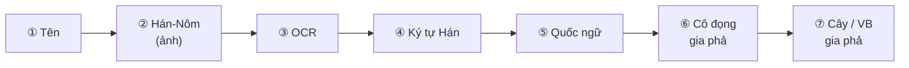
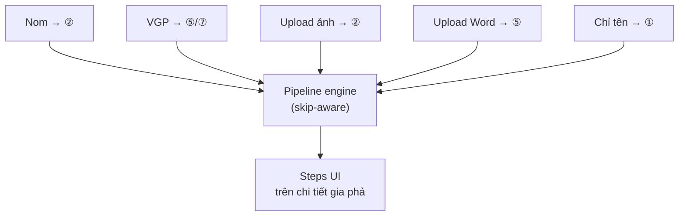
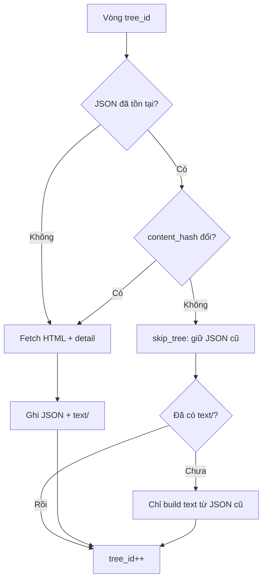
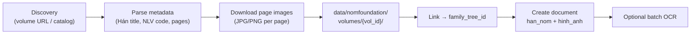

# Kế hoạch nâng cấp Crawl — VGP + Nom Foundation

> **Mục tiêu:** (1) Crawl VGP: trùng thì skip cây, nhưng vẫn bổ sung **văn bản text**; (2) Crawl tự động **ảnh Hán-Nôm** từ Nom Foundation; (3) **Pipeline 7 bước** có hiển thị step trên UI chi tiết gia phả — mỗi bước **có thể skip**.  
> **Trạng thái:** Plan — chưa triển khai  
> **Cập nhật:** 07/2026

---

## Mục lục

1. [Hiện trạng (gap)](#hiện-trạng-gap)
2. [**Phần F — Pipeline 7 bước & hiển thị step (SSOT)**](#phần-f--pipeline-7-bước--hiển-thị-step-ssot)
3. [Phần A — VietnamGiaPha: skip trùng + text](#phần-a--vietnamgiapha-skip-trùng--tải-văn-bản-text)
4. [Phần B — Nom Foundation crawl](#phần-b--nom-foundation-crawl-ảnh-hán-nôm-tự-động)
5. [Phần C — End state](#phần-c--hai-nguồn-phối-hợp-end-state)
6. [Phần D–E — Checklist & ưu tiên](#phần-d--checklist-trước-khi-code)

---

## Hiện trạng (gap)

| Hạng mục | Hiện tại | Thiếu |
|----------|----------|-------|
| **VGP crawl** | Luôn fetch lại mọi `tree_id`, ghi đè JSON | Không skip khi đã có; không xuất corpus text tập trung |
| **VGP sync** | `ON DUPLICATE KEY UPDATE` mọi cây | Không phân biệt `skipped` / `unchanged`; không tạo `documents` |
| **VGP text** | `detail` nằm rải trong từng `node` JSON | Không có `full_text.txt`, không upload MinIO |
| **Nom Foundation** | User tải ảnh thủ công → `/user/document-reader` | Không crawler; không liên kết volume ↔ cây |

**File liên quan hiện có:**

```
nlp_family_extractor/tools/fetch_vietnamgiapha.py   # crawl HTML → JSON
nlp_family_extractor/tools/sync_vietnamgiapha_to_db.py  # JSON → family_tree
nlp_family_extractor/api.py                         # POST /api/vietnamgiapha/crawl-sync
nlp_family_extractor/app/documents/                 # source_documents + MinIO
```

---

## Phần F — Pipeline 7 bước & hiển thị step (SSOT)

> Quy tắc xử lý **một hồ sơ gia phả** (tree detail, document detail, crawl job): từ tên / ảnh gốc → cây hoặc văn bản gia phả chuẩn.  
> **Mọi bước đều có thể `skip`** nếu đầu ra đã tồn tại hoặc nguồn không cần bước đó.

### F.1. Sơ đồ pipeline



| Step | ID | Tên hiển thị (UI) | Đầu vào | Đầu ra | `document.type` / artifact |
|------|-----|-------------------|---------|--------|---------------------------|
| **①** | `name` | Tên | URL nguồn, metadata crawl, admin nhập | `lineage_name`, `title`, mã NLV | Metadata cây / document |
| **②** | `hannom_image` | Hán-Nôm (ảnh) | Nom crawl, user upload | File JPG/PNG từng trang | `hinh_anh` hoặc `han_nom` |
| **③** | `ocr` | OCR | Ảnh bước ② | Raw OCR payload | `ket_qua_hinh_anh` (tạm) |
| **④** | `han_chars` | Ký tự Hán | Kết quả OCR | Chuỗi Hán-Nôm thuần | field `ocr_text` / file `.hannom.txt` |
| **⑤** | `quoc_ngu` | Văn bản quốc ngữ | Ký tự Hán hoặc Word/TXT có sẵn | Phiên âm / transcription | `van_ban`, `ket_qua_van_ban` |
| **⑥** | `distilled` | Cô đọng gia phả | Quốc ngữ hoặc text VGP | **Chỉ** nội dung phả hệ (tên, đời, quan hệ) | `van_ban` subtype `gia_pha_distilled` * |
| **⑦** | `output` | Cây / VB gia phả | Cô đọng hoặc text có cấu trúc | `nodes_json` **hoặc** file gia phả chuẩn | `family_tree` / `van_ban` `gia_pha_structured` * |

\* Bước ⑥⑦: thêm `document_subtype` hoặc naming convention trong `title` cho đến khi mở rộng enum.

### F.2. Quy tắc skip (bắt buộc)

| Quy tắc | Mô tả |
|---------|--------|
| **SKIP-1** | Mỗi step độc lập: skip **không** chặn step sau nếu đầu vào của step sau đã có từ nguồn khác |
| **SKIP-2** | Skip tự động khi artifact đầu ra **đã tồn tại** + `content_hash` không đổi |
| **SKIP-3** | Skip thủ công: checkbox / nút **「Bỏ qua」** trên UI từng step (admin) |
| **SKIP-4** | Skip hợp lệ phải ghi `skipped_reason`: `already_exists` \| `not_applicable` \| `user_skip` \| `source_has_later_step` |
| **SKIP-5** | Không skip ngầm im lặng — UI luôn hiển thị trạng thái `skipped` + lý do |

**Điều kiện skip tự động theo step:**

| Step | Skip khi |
|------|----------|
| ① Tên | `lineage_name` / `title` đã có (từ VGP JSON, Nom metadata, hoặc form) |
| ② Ảnh | Đã có file trong `documents` type `hinh_anh`/`han_nom` đủ `page_count` |
| ③ OCR | Đã có `ocr_text` hoặc document `ket_qua_hinh_anh` |
| ④ Ký tự Hán | Đã có file/field `ocr_text` non-empty |
| ⑤ Quốc ngữ | Đã có `ket_qua_van_ban` hoặc `van_ban` (Word/TXT/VGP full_text) |
| ⑥ Cô đọng | Đã có `gia_pha_distilled.txt` hoặc hash trùng |
| ⑦ Cây/VB | Đã có `family_tree.nodes_json` (node_count > 0) **hoặc** `gia_pha_structured` document |

### F.3. Điểm vào pipeline theo nguồn (entry point)

Không phải lúc nào cũng chạy từ ① → ⑦:

| Nguồn | Bắt đầu từ | Skip mặc định |
|-------|------------|---------------|
| **Nom Foundation** (vol.429…) | ② Ảnh (① từ metadata volume) | — |
| **VietnamGiaPha crawl** | ⑤ Quốc ngữ (`full_text.txt`) hoặc ⑦ Cây (`nodes_json`) | ②③④⑥ nếu không có ảnh Hán |
| **User upload ảnh scan** | ② → ③ → ④ → ⑤… | ① nếu đặt tên sau |
| **User upload Word/TXT** | ⑤ hoặc ⑥ | ②③④ |
| **Chỉ có tên (admin nhập)** | ① | ②–⑦ cho đến khi bổ sung tư liệu |



### F.4. Hiển thị step trên UI (rule UX)

Áp dụng tại:

- `/admin/gia-pha/:treeId` — tab **Tài liệu** / panel pipeline
- `/user/documents/:scanId` — tiến trình xử lý scan
- Developer crawl (VGP / Nom) — preview step sau job

**Component:** Ant Design `<Steps>` (vertical trên desktop, compact ngang trên mobile).

| Trạng thái | Icon / màu | Ý nghĩa |
|------------|------------|---------|
| `pending` | Chờ | Chưa chạy, chưa có artifact |
| `running` | `loading` | Đang xử lý (OCR, analyze…) |
| `done` | ✓ success | Có artifact + hash |
| `skipped` | — neutral | Bỏ qua (kèm tooltip lý do) |
| `error` | ✗ error | Lỗi + nút **Thử lại** |
| `optional` | ○ dashed | Không bắt buộc với nguồn hiện tại |

**Label step (ngắn, §6.5 DESIGN_SYSTEM):**

```
① Tên  →  ② Ảnh Hán-Nôm  →  ③ OCR  →  ④ Chữ Hán  →  ⑤ Quốc ngữ  →  ⑥ Cô đọng  →  ⑦ Cây
```

**Mỗi step mở rộng (Collapse / Drawer) hiển thị:**

- Artifact: link xem file / preview ảnh / đoạn text rút gọn (≤ 200 ký tự)
- Thời gian: `started_at`, `finished_at`
- Nút hành động: **Chạy**, **Bỏ qua**, **Thử lại** (chỉ step đó)
- Không hiển thị nút chạy step ⑦ nếu ⑥ chưa `done`/`skipped` **trừ khi** entry = VGP (đã có cây)

### F.5. Model dữ liệu pipeline (backend)

Bảng mới đề xuất — theo dõi step **per family_tree** (và optional per document):

```sql
CREATE TABLE genealogy_pipeline_steps (
  id              BIGINT AUTO_INCREMENT PRIMARY KEY,
  family_tree_id  VARCHAR(64) NOT NULL,
  document_id     INT NULL,                    -- step gắn 1 tài liệu cụ thể (nullable)
  step_id         ENUM('name','hannom_image','ocr','han_chars',
                       'quoc_ngu','distilled','output') NOT NULL,
  status          ENUM('pending','running','done','skipped','error') NOT NULL,
  skipped_reason  VARCHAR(64) NULL,
  input_ref       VARCHAR(512) NULL,           -- file_key / document_id / url
  output_ref      VARCHAR(512) NULL,
  content_hash    CHAR(64) NULL,
  error_message   TEXT NULL,
  started_at      DATETIME NULL,
  finished_at     DATETIME NULL,
  updated_at      DATETIME NOT NULL,
  UNIQUE KEY (family_tree_id, step_id, COALESCE(document_id, 0))
);
```

**API đề xuất:**

| Method | Path | Mô tả |
|--------|------|-------|
| `GET` | `/api/family-trees/{id}/pipeline` | Trạng thái 7 step |
| `POST` | `/api/family-trees/{id}/pipeline/{step_id}/run` | Chạy một step |
| `POST` | `/api/family-trees/{id}/pipeline/{step_id}/skip` | `{ reason: "user_skip" }` |
| `POST` | `/api/family-trees/{id}/pipeline/run-all` | Chạy tuần tự, auto-skip step đã xong |

### F.6. Logic từng step (triển khai)

| Step | Hành động `run` | Phụ thuộc |
|------|-----------------|-----------|
| ① `name` | Lấy từ Nom metadata / VGP `lineage_name` / form admin | — |
| ② `hannom_image` | `fetch_nomfoundation` hoặc đã upload | — |
| ③ `ocr` | `POST .../ocr-transliterate` (Kim Hán Nôm) | ② |
| ④ `han_chars` | Tách `ocr_text` từ response bước ③, lưu file | ③ hoặc skip nếu ⑤ có từ Word |
| ⑤ `quoc_ngu` | Phiên âm từ ④ **hoặc** import VGP `full_text.txt` / Word | ④ hoặc entry VGP/Word |
| ⑥ `distilled` | Prompt/NLP **lọc chỉ** tên, đời, cha/mẹ, con, vợ/chồng — bỏ thơ, từ đường dài | ⑤ |
| ⑦ `output` | `POST /api/family-tree/analyze` → `nodes_json` **hoặc** xuất `gia_pha_structured.txt` cùng schema | ⑥ hoặc VGP nodes có sẵn |

**Bước ⑥ — Cô đọng gia phả (spec nội dung):**

- **Giữ:** tên người, đời/hệ, quan hệ (cha, mẹ, vợ, chồng, con), năm sinh/mất nếu có
- **Loại:** thơ, đề từ, sự nghiệp không liên quan phả hệ, lời giới thiệu dòng họ dài
- **Định dạng:** plain text có cấu trúc (một người một block) hoặc JSON lines — input cho bước ⑦

**Bước ⑦ — Hai đầu ra hợp lệ:**

| Đầu ra | Khi nào |
|--------|---------|
| **Cây gia phả** (`nodes_json`) | Cần sơ đồ tương tác, đủ quan hệ để render Balkan |
| **Văn bản gia phả** (`gia_pha_structured`) | Chưa đủ tin cậy để dựng cây; lưu bản chuẩn hóa để hiệu đính sau |

Cả hai có thể cùng tồn tại; step ⑦ `done` khi có **ít nhất một** trong hai.

### F.7. Liên kết với Phần A & B

| Phần crawl | Step pipeline tương ứng |
|------------|---------------------------|
| VGP `json/` + sync | ① `name`, ⑤ `quoc_ngu` (`full_text`), ⑦ `output` (nodes) — skip ②③④⑥ |
| VGP chỉ export text | ⑤ — skip ⑦ nếu chưa analyze |
| Nom download pages | ② — trigger ③④⑤ nếu `run_ocr=true` |
| Attach MinIO | Mỗi artifact → `output_ref` + cập nhật step `done` |

### F.8. Thứ tự triển khai pipeline UI

| Phase | Việc | Effort |
|-------|------|--------|
| **F1** | Schema `genealogy_pipeline_steps` + GET pipeline API | 1 ngày |
| **F2** | Component `GenealogyPipelineSteps.tsx` (admin tree detail) | 1 ngày |
| **F3** | Wire step ③⑤⑦ với API hiện có (OCR, analyze) | 1 ngày |
| **F4** | Step ⑥ distilled (prompt/Gemini) + ② Nom crawl hook | 1.5 ngày |
| **F5** | User document detail + crawl job preview steps | 0.5 ngày |

**Tổng F:** ~5 ngày (song song một phần với A/B)

---

## Phần A — VietnamGiaPha: skip trùng + tải văn bản text

### A.1. Chiến lược skip (2 tầng)



| Tầng | Điều kiện skip | Hành vi |
|------|----------------|---------|
| **Crawl** | File `json/{id}.json` tồn tại + `content_hash` không đổi | Bỏ qua HTTP; vẫn chạy bước build text nếu thiếu |
| **Sync DB** | `vgp-{id}` trong DB + `nodes_hash` trùng JSON local | `skipped` — không UPDATE |
| **Sync DB** | Cây mới hoặc hash đổi | `upserted` |

**`content_hash` đề xuất:** SHA256 của `(node_count, relationships, sorted node ids + names + detail texts)`.

### A.2. Xuất văn bản text (mới)

Thư mục output:

```
data/vietnamgiapha/
├── json/{tree_id}.json          # như hiện tại + field content_hash
├── text/{tree_id}/
│   ├── full_text.txt            # toàn bộ text ghép từ detail nodes
│   ├── members_index.txt        # danh sách "đời.thứ tên | sinh | mất | ghi chú"
│   └── meta.json                # tree_id, lineage_name, exported_at, char_count
└── summary.json                 # thêm: skipped, text_built, text_skipped
```

**Hàm mới:** `tools/vietnamgiapha_text_export.py`

```python
def build_tree_text(tree_json: dict) -> str:
    """Ghép lineage_name + từng node.detail → plain text UTF-8."""
```

Nguồn text từ `detail` (đã parse trong `fetch_vietnamgiapha.py`):

- `note`, `bio`, `parent_text`, `siblings_text`, `birth_text`, `death_text`, `burial_place`
- Tên Hán/tự nếu có trong bảng chi tiết

**Lưu ý:** VGP chủ yếu là **quốc ngữ có cấu trúc**, không phải ảnh Hán-Nôm — text này phục vụ NLP/đối chiếu, không thay scan gốc.

### A.3. Gắn text vào Kho tài liệu (documents + MinIO)

Sau sync cây, bước mới **`attach_crawl_documents`**:

| Bước | Hành động |
|------|-----------|
| 1 | `POST` nội bộ tạo `documents` row: `family_tree_id=vgp-{id}`, `type=van_ban`, `title="VGP text — {lineage_name}"` |
| 2 | Upload `full_text.txt` → MinIO key `family-trees/{id}/documents/...` |
| 3 | Cập nhật `family_tree.has_source_document = 1` |
| 4 | Nếu skip sync cây nhưng chưa có document text → **vẫn attach text** |

Tái sử dụng: `DocumentService.upload_files()` trong `app/documents/repository.py`.

### A.4. Thay đổi code cụ thể

| File | Thay đổi |
|------|----------|
| `fetch_vietnamgiapha.py` | `--skip-unchanged`; field `content_hash`; summary `skipped_unchanged` |
| `vietnamgiapha_text_export.py` | **Mới** — build `text/{id}/` |
| `sync_vietnamgiapha_to_db.py` | `skipped` khi hash trùng; set `external_url`; gọi attach documents |
| `sync_vietnamgiapha_documents.py` | **Mới** — MinIO + `source_documents` |
| `api.py` | Response mở rộng: `crawl_skipped`, `sync_skipped`, `text_attached` |
| `VietnamGiaPhaCrawlPage.tsx` | Hiển thị 3 số liệu: crawl skip / sync skip / text mới |

### A.5. API request mở rộng

```json
{
  "start_id": 100,
  "end_id": 200,
  "delay_seconds": 0.2,
  "sync_db": true,
  "skip_unchanged": true,
  "export_text": true,
  "attach_documents": true
}
```

### A.6. Thứ tự triển khai (ước lượng)

| Phase | Việc | Effort |
|-------|------|--------|
| **A1** | `content_hash` + skip crawl unchanged | 0.5 ngày |
| **A2** | `text_export` module + CLI | 0.5 ngày |
| **A3** | Sync skip + báo cáo `skipped` | 0.5 ngày |
| **A4** | Attach `van_ban` document + MinIO | 1 ngày |
| **A5** | UI + test e2e 100–105 | 0.5 ngày |

**Tổng A:** ~3 ngày dev

---

## Phần B — Nom Foundation: crawl ảnh Hán-Nôm tự động

### B.1. Phạm vi nguồn

| Nguồn | URL mẫu | Dữ liệu lấy được |
|-------|---------|------------------|
| [lib.nomfoundation.org](https://lib.nomfoundation.org/) | [volume/429](https://lib.nomfoundation.org/collection/1/volume/429/) | Metadata + **ảnh scan từng trang** (Hán viết tay) |
| Thư viện NLV | Qua Nom | Mã NLVNPF-*, số trang, niên đại |

**Khác VGP:** Nom = **hình ảnh gốc** → OCR Kim Hán Nôm; VGP = **cây + text quốc ngữ** đã số hóa.

### B.2. Luồng crawl đề xuất



### B.3. Cấu trúc lưu trữ

```
data/nomfoundation/
├── catalog.json                 # index volume đã biết
├── volumes/
│   └── 429/
│       ├── metadata.json        # từ trang volume (title Hán/VN, NLV, pages, date)
│       ├── pages/
│       │   ├── 001.jpg
│       │   └── ...
│       └── manifest.json        # sha256, size, downloaded_at
└── summary.json
```

### B.4. Module mới

**`tools/fetch_nomfoundation.py`**

| Bước | Kỹ thuật |
|------|----------|
| Parse volume page | `httpx` + BeautifulSoup — lấy title, creator, page count, viewer links |
| Lấy URL ảnh từng trang | Inspect viewer (thường pattern `/page/{n}/` hoặc IIIF) — **cần spike 0.5 ngày** trên vol.429 |
| Download | `delay_seconds`, retry, skip nếu file + hash đã có |
| CLI | `python -m tools.fetch_nomfoundation --volume 429 --collection 1` |

**Rủi ro cần spike trước:** Nom có thể dùng JS viewer — nếu không có URL ảnh tĩnh → cần headless hoặc API ẩn (kiểm tra Network tab).

### B.5. Liên kết volume ↔ cây gia phả

Ba cách (triển khai theo thứ tự):

| Cách | Mô tả | Độ tin cậy |
|------|-------|------------|
| **B5.1 Thủ công (MVP)** | Admin nhập `nom_volume_url` vào form cây (`external_url` hoặc field mới `nom_volume_id`) | Cao |
| **B5.2 Tìm theo tên** | So khớp `lineage_name` (VGP) ↔ title Quốc ngữ Nom (fuzzy) | Trung bình |
| **B5.3 Bảng mapping** | `research_source_links` (tree_id, source, external_id, url) | Cao, bền |

**Schema đề xuất:**

```sql
CREATE TABLE research_source_links (
  id            INT AUTO_INCREMENT PRIMARY KEY,
  family_tree_id VARCHAR(64) NOT NULL,
  source_type   ENUM('vietnamgiapha','nomfoundation') NOT NULL,
  external_id   VARCHAR(64) NOT NULL,   -- '100' hoặc '429'
  external_url  VARCHAR(512) NOT NULL,
  metadata_json JSON NULL,
  created_at    DATETIME NOT NULL,
  UNIQUE KEY (family_tree_id, source_type, external_id)
);
```

### B.6. Tích hợp Kho tài liệu

Sau crawl volume:

| Document | type | files |
|----------|------|-------|
| `Thuỵ Ứng gia phả — scan` | `han_nom` + `hinh_anh` | `001.jpg … 009.jpg` |
| (tuỳ chọn) | `ket_qua_van_ban` | sau OCR batch |

Cập nhật flags:

- `has_source_document = true`
- `has_hannom_text = true` (khi có ảnh Hán hoặc đã OCR)

### B.7. API & UI mới

| Endpoint | Mô tả |
|----------|-------|
| `POST /api/nomfoundation/crawl-volume` | `{ collection_id, volume_id, link_tree_id?, attach_documents }` |
| `GET /api/nomfoundation/volumes` | Danh sách đã crawl (từ `catalog.json`) |
| `POST /api/research-sources/link` | Gắn Nom volume ↔ `vgp-{id}` |

**UI Developer:**

- Trang mới `/admin/developer/nomfoundation-crawl` (cạnh Đồng bộ VGP)
- Form: URL volume hoặc `collection/volume` ID
- Checkbox: Gắn vào cây `vgp-___`, Chạy OCR sau crawl

### B.8. OCR batch (tuỳ chọn, phase sau)

```
nomfoundation crawl → attach images
  → queue job POST /api/documents/{id}/ocr-transliterate (từng trang)
  → tạo ket_qua_van_ban gộp
```

Chạy background (không block crawl UI) — dùng bảng job đơn giản hoặc Celery sau.

### B.9. Thứ tự triển khai (ước lượng)

| Phase | Việc | Effort |
|-------|------|--------|
| **B0** | **Spike** vol.429: tìm URL pattern ảnh, robots.txt | 0.5 ngày |
| **B1** | `fetch_nomfoundation.py` + storage local | 1.5 ngày |
| **B2** | `research_source_links` + API link | 1 ngày |
| **B3** | Attach documents MinIO | 1 ngày (dùng chung A4) |
| **B4** | UI Developer + crawl volume 429 test | 0.5 ngày |
| **B5** | Fuzzy match tên ↔ VGP (tuỳ chọn) | 1 ngày |
| **B6** | OCR batch (tuỳ chọn) | 1–2 ngày |

**Tổng B (MVP B0–B4):** ~4.5 ngày dev

---

## Phần C — Hai nguồn phối hợp (end state)

Một cây `vgp-100` sau khi hoàn thiện:

```
family_tree vgp-100
├── pipeline_steps[7]   ← Phần F: trạng thái từng bước
├── nodes_json          ← ⑦ Cây (VGP crawl, skip nếu trùng)
├── external_url        ← https://vietnamgiapha.com/...
├── research_source_links
│   ├── vietnamgiapha / 100
│   └── nomfoundation / 429   (nếu admin link)
└── documents
    ├── [hinh_anh]   ② Nom 001-009.jpg
    ├── [ket_qua_*]  ③④ OCR / Hán
    ├── [van_ban]    ⑤ VGP full_text / Quốc ngữ
    ├── [van_ban]    ⑥ gia_pha_distilled.txt
    └── [van_ban]    ⑦ gia_pha_structured.txt (tuỳ chọn)
```

**Guest/User xem:** tab **Tài liệu** trên `/gia-pha/:id` và admin **Kho tư liệu**.

---

## Phần D — Checklist trước khi code

- [ ] Spike Nom Foundation vol.429 — xác nhận lấy được URL ảnh không cần browser
- [ ] Thống nhất ID: `vgp-{id}` (code hiện tại) — sửa doc PROJECT nếu ghi `vpg-`
- [ ] Quy tắc bản quyền: delay crawl, attribution trong `metadata.json`
- [ ] Giới hạn kích thước upload MinIO (ảnh Nom ~MB/trang)
- [ ] Test: crawl 100–102 với `skip_unchanged=true` lần 2 → 0 HTTP, vẫn có text

---

## Phần E — Ưu tiên đề xuất

| Ưu tiên | Phần | Lý do |
|---------|------|-------|
| **P0** | **F1 + F2** | Pipeline steps UI — khung hiển thị 7 bước + skip |
| **P0** | A1 + A2 | Skip + text VGP |
| **P0** | B0 spike | Nom crawl khả thi |
| **P1** | F3 + A3 + A4 | Wire OCR/analyze + MinIO |
| **P1** | B1–B4 | Nom MVP |
| **P2** | F4 step ⑥ distilled | Cô đọng gia phả |
| **P2** | B5 fuzzy link | Gợi ý volume Nom |
| **P2** | B6 OCR batch | Tự động ③④⑤ |

---

## Tài liệu liên quan

- [RESEARCH_SOURCES.md](./RESEARCH_SOURCES.md) — mô tả nguồn nghiên cứu
- [FEATURES.md](./FEATURES.md) — spec Kho tư liệu, crawl
- Nom ví dụ: [Thuỵ Ứng gia phả — volume 429](https://lib.nomfoundation.org/collection/1/volume/429/)
