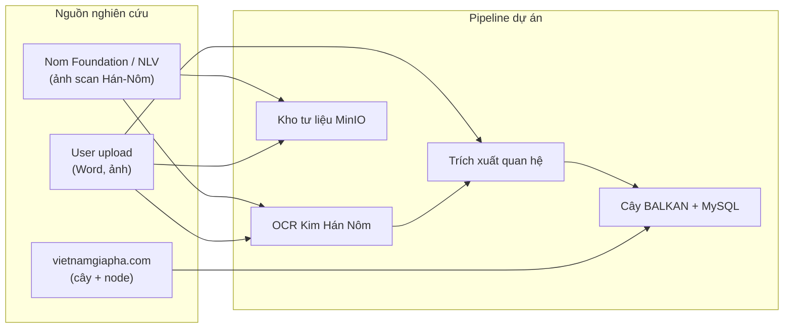

# Tài liệu nghiên cứu & nguồn dữ liệu

> **Phạm vi:** Corpus gia phả Hán-Nôm mà dự án tham chiếu, thu thập và xử lý — **không** phải danh sách trang web app.  
> **Cập nhật:** 07/2026

---

## Mục lục

1. [Tổng quan](#1-tổng-quan)
2. [Nguồn bản gốc số hóa (Nom Foundation / NLV)](#2-nguồn-bản-gốc-số-hóa-nom-foundation--nlv)
3. [Nguồn cây phả hệ có cấu trúc (VietnamGiaPha)](#3-nguồn-cây-phả-hệ-có-cấu-trúc-vietnamgiapha)
4. [Dữ liệu mẫu trong repo](#4-dữ-liệu-mẫu-trong-repo)
5. [Luồng dữ liệu trong dự án](#5-luồng-dữ-liệu-trong-dự-án)
6. [Bản quyền & trích dẫn](#6-bản-quyền--trích-dẫn)

---

## 1. Tổng quan

Dự án làm việc với **ba lớp tư liệu** bổ sung cho nhau:

| Lớp | Loại | Vai trò trong nghiên cứu | Tích hợp code |
|-----|------|-------------------------|---------------|
| **A — Bản gốc** | Ảnh scan / PDF Hán-Nôm từ thư viện số | Nguồn chân lý (ground truth) để OCR, phiên âm, đối chiếu | User upload → Phòng đọc tài liệu |
| **B — Cây có cấu trúc** | Cây phả hệ + hồ sơ thành viên từ web | Benchmark cấu trúc quan hệ, tên dòng họ | **Crawl** vietnamgiapha.com → MySQL |
| **C — Văn bản phiên âm** | Word / TXT quốc ngữ | Đầu vào NLP / Gemini trích xuất quan hệ | Upload + `/api/analyze` |



---

## 2. Nguồn bản gốc số hóa (Nom Foundation / NLV)

### 2.1. Thư viện số Hán-Nôm

| Hạng mục | Giá trị |
|----------|---------|
| **Tổ chức** | [Viện Nôm Foundation](https://nomfoundation.org/) |
| **Thư viện trực tuyến** | [lib.nomfoundation.org](https://lib.nomfoundation.org/) |
| **Bộ sưu tập tiêu biểu** | NLV — tư liệu Thư viện Quốc gia Việt Nam |
| **Định dạng** | Ảnh scan trang viết tay / in, metadata Hán + Quốc ngữ |

Đây là **nguồn tư liệu gốc** phục vụ nghiên cứu: đọc chữ Hán-Nôm, phiên âm, đối chiếu bố cục gia phả trên giấy.

### 2.2. Ví dụ: Thuỵ Ứng gia phả (volume 429)

| Trường | Nội dung |
|--------|----------|
| **URL** | [https://lib.nomfoundation.org/collection/1/volume/429/](https://lib.nomfoundation.org/collection/1/volume/429/) |
| **Tên Hán** | 瑞應家譜 |
| **Tên Quốc ngữ** | Thuỵ Ứng gia phả |
| **Mã NLV** | NLVNPF-0281 · R.5860 |
| **Nguồn lưu trữ** | Thư viện Quốc gia Việt Nam |
| **Người chép** | Nguyễn Kim Chi phụng tả (阮金芝奉寫) |
| **Niên đại** | Hoàng triều Duy Tân nguyên niên (1912) |
| **Ngôn ngữ** | Hán (chữ Hán) |
| **Loại** | Văn bản / viết tay |
| **Kích thước** | 27 × 16 cm |
| **Số trang** | 9 |

**Cách dùng trong dự án:** tải ảnh scan từng trang → upload tại `/user/document-reader` → OCR (Kim Hán Nôm) → phiên âm → trích xuất thành viên/quan hệ. **Chưa có crawler tự động** cho lib.nomfoundation.org.

### 2.3. Các nguồn bản gốc khác (tham khảo)

| Nguồn | Ghi chú |
|-------|---------|
| Thư viện Quốc gia VN | Bản scan gia phả, thế phả, bi ký |
| Gia phả lưu gia đình | Ảnh chụp / scan do user cung cấp |
| Kim Hán Nôm (HCMUS) | Công cụ OCR/phiên âm, không phải kho tư liệu |

---

## 3. Nguồn cây phả hệ có cấu trúc (VietnamGiaPha)

### 3.1. Website nguồn

| Hạng mục | Giá trị |
|----------|---------|
| **URL** | [https://vietnamgiapha.com](https://vietnamgiapha.com) |
| **Nội dung** | Cây phả hệ tương tác, trang chi tiết từng người, tên dòng họ |
| **Vai trò nghiên cứu** | Corpus có **cấu trúc quan hệ** (cha/mẹ/con, đời, thứ tự) để so sánh với kết quả NLP |

### 3.2. URL pattern

| Loại trang | Mẫu URL |
|------------|---------|
| Cây phả hệ | `https://vietnamgiapha.com/XemPhaHe/{tree_id}/cay_pha_he.html` |
| Chi tiết người | `https://vietnamgiapha.com/XemChiTietTungNguoi/{tree_id}/{node_id}/giapha.html` |
| Chi tiết (dự phòng) | `https://vietnamgiapha.com/XemChiTietTungNguoi/{tree_id}/{node_id}/chitiet.html` |

Ví dụ: cây ID **100** → [XemPhaHe/100](https://vietnamgiapha.com/XemPhaHe/100/cay_pha_he.html) (dòng họ Vũ Văn, 33 thành viên trong bản crawl mẫu).

### 3.3. Crawl & đồng bộ (đã triển khai)

| Hạng mục | Chi tiết |
|----------|----------|
| **Script crawl** | `nlp_family_extractor/tools/fetch_vietnamgiapha.py` |
| **Script sync DB** | `nlp_family_extractor/tools/sync_vietnamgiapha_to_db.py` |
| **API** | `POST /api/vietnamgiapha/crawl-sync` (admin) |
| **UI** | Admin → Developer → **Đồng bộ VGP** (`/admin/developer/vietnamgiapha-crawl`) |

**Tham số crawl:**

```json
{
  "start_id": 100,
  "end_id": 200,
  "delay_seconds": 0.2,
  "sync_db": true
}
```

**CLI thủ công:**

```bash
cd nlp_family_extractor

# Bước 1: Crawl → JSON
python -m tools.fetch_vietnamgiapha --start 100 --end 200

# Bước 2: Sync JSON → MySQL
python -m tools.sync_vietnamgiapha_to_db --input-dir data/vietnamgiapha/json
```

### 3.4. Dữ liệu crawl lưu ở đâu

```
nlp_family_extractor/data/vietnamgiapha/
├── json/              # Một file / cây: {tree_id}.json
├── raw_html/          # HTML gốc (tuỳ chọn)
├── summary.json       # Báo cáo lần crawl gần nhất
├── sync-report.json   # Báo cáo sync DB
└── empty_tree_ids.txt # ID không có dữ liệu
```

### 3.5. Schema JSON sau crawl (rút gọn)

```json
{
  "tree_id": 100,
  "url": "https://vietnamgiapha.com/XemPhaHe/100/cay_pha_he.html",
  "lineage_name": "Vu Van",
  "node_count": 33,
  "nodes": [ { "node_id": 1, "name": "...", "generation": 1, "gender": "male" } ],
  "relationships": [ { "type": "parent_of", "from_id": 1, "to_id": 2, "side": "fid" } ]
}
```

### 3.6. ID trong hệ thống sau sync

| Trường | Quy ước |
|--------|---------|
| **ID cây trong DB** | `vgp-{tree_id}` (vd. `vgp-100`) |
| **external_url** | URL cây trên vietnamgiapha.com |
| **is_public** | Admin bật thủ công → hiện tại `/gia-pha` (gallery) |

### 3.7. Bản crawl mẫu hiện có trong repo

| tree_id | Dòng họ (lineage_name) | node_count | File |
|---------|------------------------|------------|------|
| 100 | Vu Van | 33 | `json/100.json` |
| 101 | — | 95 | `json/101.json` |
| 115, 117, 120–122, 125, 136, 141, 145, 148, 166, 181, 184, 188 | … | … | `json/*.json` |

Xem đầy đủ: `data/vietnamgiapha/summary.json`.

---

## 4. Dữ liệu mẫu trong repo

| File | Mô tả |
|------|--------|
| `nlp_family_extractor/data/sample_relationship_document.txt` | Văn bản quốc ngữ mẫu (quan hệ gia đình) cho NLP |
| `nlp_family_extractor/data/samples.txt` | Câu mẫu ngắn |
| `nlp_family_extractor/data/family_trees/tree-sample.json` | Cây BALKAN mẫu |
| `nlp_family_extractor/data/family_trees/ngoc-pha.json` | Cây mẫu Ngọc phả |
| `family-saga-io/src/assets/hero-bg.jpg` | Ảnh landing (không phải tư liệu nghiên cứu) |

---

## 5. Luồng dữ liệu trong dự án

### 5.1. Từ tư liệu gốc (Nom / scan) → cây gia phả

Pipeline **7 bước** (mỗi bước có thể skip): Tên → Ảnh Hán-Nôm → OCR → Ký tự Hán → Quốc ngữ → **Cô đọng gia phả** → **Cây hoặc VB gia phả**. Chi tiết: [CRAWL_PLAN.md § Phần F](./CRAWL_PLAN.md#phần-f--pipeline-7-bước--hiển-thị-step-ssot).

```
Ảnh scan (Nom Foundation, NLV, hoặc user)
  → POST /api/documents/{id}/ocr-transliterate  (Kim Hán Nôm)
  → Văn bản quốc ngữ
  → POST /api/analyze  (Gemini / NLP)
  → nodes + relationships (BALKAN)
  → Lưu family_tree + MinIO
```

### 5.2. Từ VietnamGiaPha → cây có sẵn

```
vietnamgiapha.com (tree_id)
  → fetch_vietnamgiapha.py
  → JSON (nodes + relationships)
  → sync_vietnamgiapha_to_db.py
  → MySQL family_tree (id: vgp-{tree_id})
  → Frontend admin / guest (nếu is_public)
```

### 5.3. Đối chiếu nghiên cứu

| Câu hỏi nghiên cứu | Nguồn A (Nom/scan) | Nguồn B (VGP crawl) |
|--------------------|--------------------|---------------------|
| Tên thế hệ đúng chữ Hán? | ✅ Bản gốc | ⚠️ Đã qua web, có thể thiếu Hán |
| Cấu trúc cha–con–vợ? | Cần trích xuất NLP | ✅ Có sẵn trong JSON |
| Số lượng thành viên? | Đếm sau OCR | ✅ `node_count` |
| Tài liệu hình ảnh gốc? | ✅ Scan từng trang | ❌ Chủ yếu text/HTML |

---

## 6. Bản quyền & trích dẫn

| Nguồn | Lưu ý |
|-------|--------|
| **Nom Foundation / NLV** | Tuân thủ điều khoản sử dụng thư viện số; trích dẫn mã NLV (vd. NLVNPF-0281) khi công bố |
| **vietnamgiapha.com** | HTML ghi bản quyền thiết kế/hình ảnh thuộc Việt Nam Gia Phả; crawl có `delay_seconds`, chỉ phục vụ nghiên cứu nội bộ |
| **Dữ liệu user** | Thuộc người upload; admin quản lý qua `/admin/gia-pha` |

**Trích dẫn gợi ý (Thuỵ Ứng gia phả):**

> Nguyễn Kim Chi (chép). *Thuỵ Ứng gia phả* (瑞應家譜). Thư viện Quốc gia Việt Nam, NLVNPF-0281. Số hóa: Viện Nôm Foundation. https://lib.nomfoundation.org/collection/1/volume/429/

---

## Tài liệu liên quan

| File | Nội dung |
|------|----------|
| [PROJECT.md](./PROJECT.md) | Kiến trúc, API, tích hợp Kim Hán Nôm |
| [FEATURES.md](./FEATURES.md) | Spec tính năng crawl, kho tư liệu |
| `nlp_family_extractor/tools/fetch_vietnamgiapha.py` | Implementation crawler |
| `nlp_family_extractor/tools/sync_vietnamgiapha_to_db.py` | Implementation sync |
