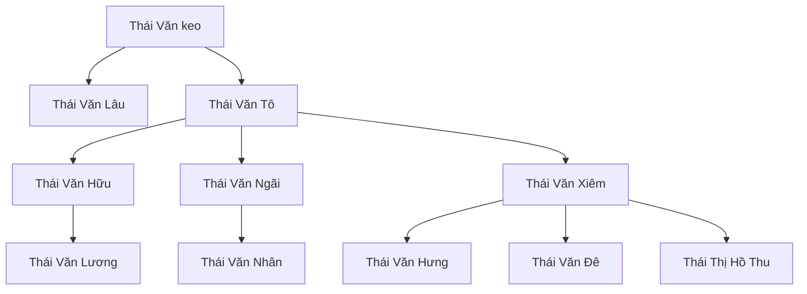

# Phân tích & gắn nhãn — ví dụ gold (stratified)

> **Schema:** [ENTITY_RELATIONSHIP_LIST.md](../label_studio_pipeline/ENTITY_RELATIONSHIP_LIST.md)  
> **Cập nhật:** 2026-08-10  
> **Nguồn:** phân tích tay Phả ký + curated (`curated_gold.py`) / prose review

Tài liệu này ghi **phân tích ngữ nghĩa → gắn nhãn** theo đúng bộ Entity / Relationship của dự án.

---

## 1. Tree 321 — Thái · Đồng Tháp (S1, train)

### 1.1 Văn bản (rút gọn có cấu trúc)

```text
… lập nghiệp ở Đồng Tháp … đã 7 đời …
Ông tổ là Ông Thái Văn keo
Ông Thái Văn keo có 2 người con :
  Ông Thái Văn Lâu (Cả Lâu)
  Ông Thái Văn Tô
Ông Thái Văn Tô có 8 con … tên 3 người con trai
  Thái Văn Hữu; Thái Văn Ngãi, Thái Văn Xiêm
Ông Thái văn Hữu có con cả là Ông Thái Văn Lương
Ông Thái Văn Ngãi có con cả là Ông Thái Văn Nhân
Ông Thái Văn Xiêm có 3 con là : Thái Văn Hưng ; Thái Văn Đê; Thái Thị Hồ Thu
Đến nay là đời thứ 7 …
```

### 1.2 Phân tích

| Cue trong câu | Suy luận |
|---------------|----------|
| `Đồng Tháp` | Địa danh hành chính → **LOC** |
| `đời thứ 7` | Thế hệ → **GENERATION** |
| `có 2 người con` / `có 8 con` / `có 3 con` / `có con cả là` | Cha → con → **FATHER_OF** |
| `con cả` | Thứ tự → **ORDER** |
| `Thái Thị Hồ Thu` | Họ + Thị + tên kép → **một** `PER_NAME` (không tách `Thái Thị` / `Hồ Thu`) |

### 1.3 Entity (NER)

| Text | Nhãn |
|------|------|
| Đồng Tháp | LOC |
| đời thứ 7 | GENERATION |
| con cả *(2 lần)* | ORDER |
| Thái Văn keo | PER_NAME |
| Thái Văn Lâu | PER_NAME |
| Thái Văn Tô | PER_NAME |
| Thái Văn Hữu | PER_NAME |
| Thái Văn Ngãi | PER_NAME |
| Thái Văn Xiêm | PER_NAME |
| Thái Văn Lương | PER_NAME |
| Thái Văn Nhân | PER_NAME |
| Thái Văn Hưng | PER_NAME |
| Thái Văn Đê | PER_NAME |
| Thái Thị Hồ Thu | PER_NAME |

### 1.4 Relationship (RE)

| head | type | tail |
|------|------|------|
| Thái Văn keo | FATHER_OF | Thái Văn Lâu |
| Thái Văn keo | FATHER_OF | Thái Văn Tô |
| Thái Văn Tô | FATHER_OF | Thái Văn Hữu |
| Thái Văn Tô | FATHER_OF | Thái Văn Ngãi |
| Thái Văn Tô | FATHER_OF | Thái Văn Xiêm |
| Thái Văn Hữu | FATHER_OF | Thái Văn Lương |
| Thái Văn Ngãi | FATHER_OF | Thái Văn Nhân |
| Thái Văn Xiêm | FATHER_OF | Thái Văn Hưng |
| Thái Văn Xiêm | FATHER_OF | Thái Văn Đê |
| Thái Văn Xiêm | FATHER_OF | Thái Thị Hồ Thu |



**Lỗi đã sửa so với bản auto trước:** không tách sai `Thái Thị Hồ Thu`; bổ sung quan hệ `keo→Lâu/Tô`, `Tô→Hữu/Ngãi/Xiêm`; thêm `LOC` / `ORDER`.

---

## 2. Tree 1622 — HOÀNG · Hải Dương (S4, test)

### 2.1 Cue chính

| Câu | Gán |
|-----|-----|
| Quê quán: Cao An - Cẩm Giàng - Hải Dương | LOC ×3 |
| đời thứ 7, Đời 4, Đời 5, đời I/II/III | GENERATION |
| 1886, 1969, 1885, 1962, 1913, 2001 | DATE |
| Phạm Thị Còi : vợ ông Hoàng Húy Tức | PER + **SPOUSE** |
| Hoàng Văn Ánh : con ông Hoàng Húy Tức và bà Phạm Thị Còi | **FATHER_OF** + **MOTHER_OF** |
| Phạm Thị Sáo : vợ thứ 2 ông Hoàng Văn Ánh | **SPOUSE** |

### 2.2 Relationship

| head | type | tail |
|------|------|------|
| Hoàng Húy Tức | SPOUSE | Phạm Thị Còi |
| Hoàng Húy Tức | FATHER_OF | Hoàng Văn Ánh |
| Phạm Thị Còi | MOTHER_OF | Hoàng Văn Ánh |
| Hoàng Văn Ánh | SPOUSE | Phạm Thị Sáo |

---

## 3. Tree 122 — Họ Võ · Nghệ An (S1) — đoạn quan hệ rõ

### 3.1 Đoạn trọng tâm

> Vợ của cố Võ Đào là bà Quế Thị Thưởng …  
> Ông Võ Đào và Bà Quế Thị Thưởng sinh được 03 người con :  
> - Ông con thứ nhất : Võ Khuê  
> - Bà con thứ hai : Võ Thị Diễn  
> - Ông con thứ ba : Võ Thãnh

### 3.2 Gắn nhãn (đoạn này)

| Text | Nhãn |
|------|------|
| Võ Đào | PER_NAME |
| Quế Thị Thưởng | PER_NAME |
| Võ Khuê | PER_NAME |
| Võ Thị Diễn | PER_NAME |
| Võ Thãnh | PER_NAME |
| con thứ nhất / hai / ba | ORDER |
| Thái Bình, Nghệ An, … | LOC |
| 1905, 1945, 1954, 1992 | DATE |
| Đời thứ nhất | GENERATION |

| head | type | tail |
|------|------|------|
| Võ Đào | SPOUSE | Quế Thị Thưởng |
| Võ Đào | FATHER_OF | Võ Khuê |
| Võ Đào | FATHER_OF | Võ Thị Diễn |
| Võ Đào | FATHER_OF | Võ Thãnh |
| Quế Thị Thưởng | MOTHER_OF | Võ Khuê |
| Quế Thị Thưởng | MOTHER_OF | Võ Thị Diễn |
| Quế Thị Thưởng | MOTHER_OF | Võ Thãnh |

*(Đoạn 122 dài — phần đầu còn nhiều LOC/DATE; quan hệ anh em của Quế Thị Thưởng **chưa** có nhãn schema → không gán SIBLING.)*

---

## 4. Quy tắc áp dụng khi phân tích

1. **Đọc cue trước** (`sinh`, `vợ`, `con của`, `đời thứ`) → chọn Entity rồi Relation.  
2. **PER_NAME trước**, Relation sau (head/tail phải tồn tại).  
3. Không map `husband_of`/`child_of` — dùng `SPOUSE` / `FATHER_OF` / `MOTHER_OF`.  
4. Tên nữ dạng `Họ + Thị + …` giữ **một span**.  
5. S4 (1622, 1454, 544, 1813, 2346): gắn cẩn thận; sau khi **chốt** không sửa lại nếu đã khóa test.

---

## 5. Pipeline gắn nhãn hiện tại

| Bước | Lệnh / module |
|------|----------------|
| Curated tay (321, 1622) | `curated_gold.py` |
| Auto prose+diagram (các tree còn lại) | `prose_annotator.py` |
| Submit LS + ghi `v1_human` | `python -m label_studio_pipeline.submit_human_review --submit-ls` |
| Export | `python -m label_studio_pipeline.export_ls_gold` |

---

*File này là nhật ký phân tích mẫu. Gold đầy đủ 25 cây nằm ở `data/gold_labels/v1_human/`.*
