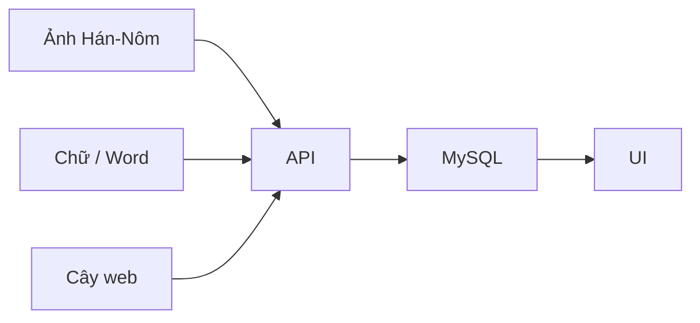

# Cấu trúc repo

Root: `readme.md` (chạy hệ thống). File này là bản đồ.  
Chi tiết API: [`product/PROJECT.md`](product/PROJECT.md).

**Một câu:** ảnh hoặc chữ gia phả → cây người → web.

```text
family-tree/
  family-saga-io/            UI
  nlp_family_extractor/      API (app/ chạy thật, tools/ OCR lab)
  research/                  gán nhãn + tìm nguồn
  data/                      corpus  00_raw … 05_ops
  docs/                      mọi thứ đọc được
    thesis/  product/  methods/  lab/  planning/  schemas/
  infra/                     nginx + compose + script build
```



| Muốn | Mở |
|------|-----|
| UI | `family-saga-io/` |
| API | `nlp_family_extractor/app/` |
| Gán nhãn / discovery | `research/` |
| Gold / corpus | `data/02_gold/`, [`data/README.md`](../data/README.md), **tổng quan sống** [`data/DATA_INVENTORY.md`](../data/DATA_INVENTORY.md) |
| Đề tài | `docs/thesis/business.md` |
| Họp tuần | `docs/lab/note_meeting_weekly/` |
| Task | `docs/planning/` |
| Mục lục tài liệu | `docs/README.md` |
