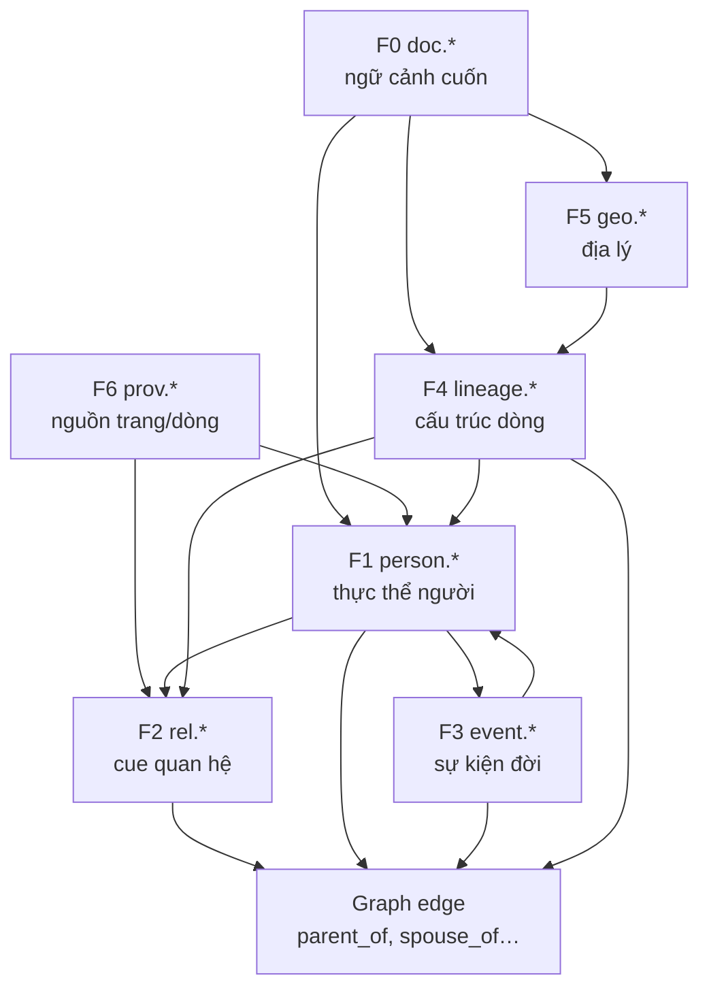
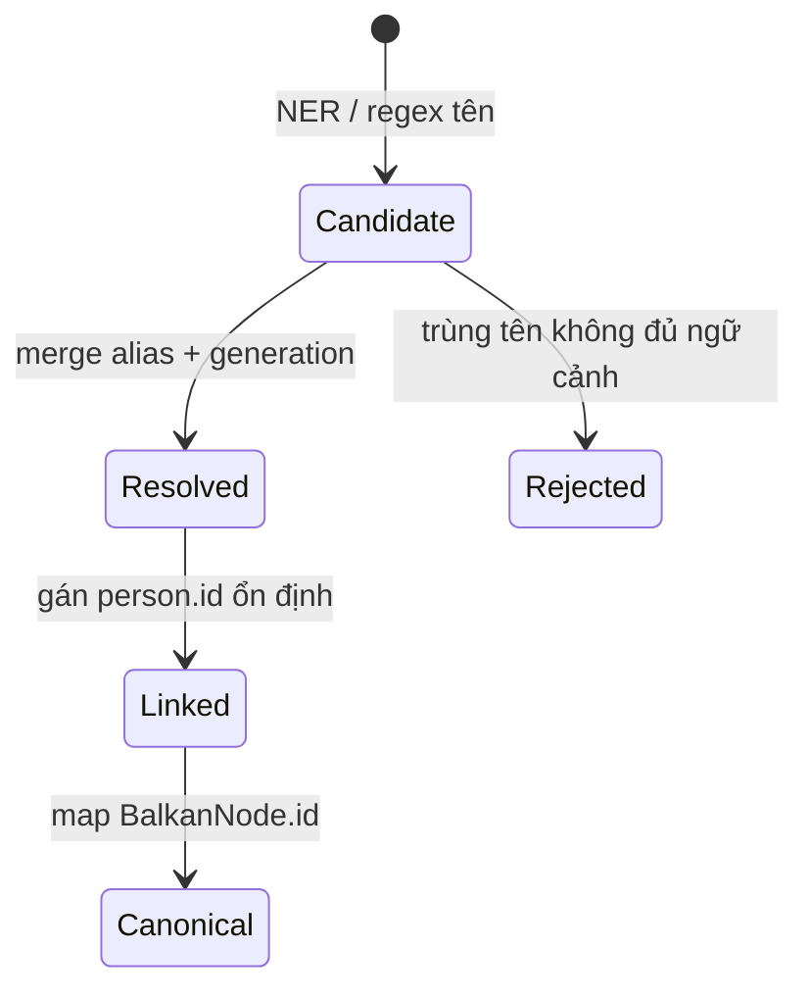

# Đào sâu khung 6 lớp đặc trưng (F0–F6) — trích xuất quan hệ gia phả Hán-Nôm

> **Ngày:** 2026-07-20  
> **Phạm vi:** Chỉ khung đặc trưng — **chưa** triển khai code, rule pack, hay benchmark  
> **Tài liệu cha:** [genealogy_extraction_feature_set_plan.md](./genealogy_extraction_feature_set_plan.md)  
> **Phân tích ngôn ngữ (đọc trước khi chốt field):** [genealogy_language_features_analysis.md](./genealogy_language_features_analysis.md)  
> **Luận văn:** Mô hình tự động xây dựng gia phả từ ngôn ngữ Hán-Nôm

---

## Mục lục

0. *(Ngoại vi)* Phân tích tính chất ngôn ngữ → [genealogy_language_features_analysis.md](./genealogy_language_features_analysis.md)
1. [Tổng quan khung và vai trò trong luận văn](#1-tổng-quan-khung-và-vai-trò-trong-luận-văn)
2. [Quan hệ phụ thuộc giữa 6 lớp](#2-quan-hệ-phụ-thuộc-giữa-6-lớp)
3. [F0 — Document context (`doc.*`)](#3-f0--document-context-doc)
4. [F1 — Person entity (`person.*`)](#4-f1--person-entity-person)
5. [F2 — Relation cue (`rel.*`)](#5-f2--relation-cue-rel)
6. [F3 — Event / life (`event.*`)](#6-f3--event--life-event)
7. [F4 — Lineage structure (`lineage.*`)](#7-f4--lineage-structure-lineage)
8. [F5 — Spatial (`geo.*`)](#8-f5--spatial-geo)
9. [F6 — Provenance (`prov.*`)](#9-f6--provenance-prov)
10. [Suy luận quan hệ: cách các lớp kết hợp](#10-suy-luận-quan-hệ-cách-các-lớp-kết-hợp)
11. [Ma trận đặc trưng → edge canonical](#11-ma-trận-đặc-trưng--edge-canonical)
12. [Hướng dẫn gán nhãn theo lớp](#12-hướng-dẫn-gán-nhãn-theo-lớp)
13. [MVP đào sâu: thứ tự nghiên cứu đề xuất](#13-mvp-đào-sâu-thứ-tự-nghiên-cứu-đề-xuất)
14. [Câu hỏi mở cho luận văn](#14-câu-hỏi-mở-cho-luận-văn)

---

## 1. Tổng quan khung và vai trò trong luận văn

### 1.0. Thứ tự đọc đề xuất

1. **Tính chất ngôn ngữ** (script, danh xưng, cue, đời thứ, niên hiệu) — [genealogy_language_features_analysis.md](./genealogy_language_features_analysis.md)
2. **Khung IR F0–F6** — file này
3. **Metrics / checklist** — [genealogy_feature_metrics_table.md](./genealogy_feature_metrics_table.md)

### 1.1. Định nghĩa

**Đặc trưng (feature)** ở đây là **đơn vị thông tin có cấu trúc**, trích từ tư liệu gia phả, dùng để:

- Nhận diện **thự thể người** (F1)
- Phát hiện **gợi ý quan hệ** (F2)
- **Ràng buộc** và **xác minh** quan hệ (F3, F4, F5)
- **Đặt ngữ cảnh** toàn cuốn (F0) và **truy vết nguồn** (F6)

Khung F0–F6 **không thay thế** output graph (`parent_of`, `BalkanNode`) — mà là **lớp trung gian** giữa văn bản thô và cây gia phả.

### 1.2. Vì sao chia 6 lớp (không gom một object `Person`)

| Vấn đề nếu gom chung | Cách 6 lớp giải quyết |
|----------------------|------------------------|
| Metadata cuốn ≠ thuộc tính một người | Tách **F0** |
| Cùng tên, khác đời → nhầm cha-con | **F1.generation** + **F4** |
| `"con Nguyễn Trù"` là cue, chưa phải edge | Tách **F2** khỏi **F1** |
| `"Hoàng giáp năm Đinh Sửu"` không phải quan hệ | **F3** riêng |
| `"Thuỷ tổ"` không map 1-1 một node hiện tại | **F4** riêng |
| Địa danh di cư giải thích nhánh | **F5** |
| OCR sai cần biết trang nguồn | **F6** |

### 1.3. Phạm vi luận văn gắn với khung

Trong luận văn, khung F0–F6 có thể trình bày như **mô hình dữ liệu trung gian (Intermediate Representation — IR)** cho bài toán:

> *Từ ảnh/văn bản gia phả Hán-Nôm → IR đa lớp → đồ thị quan hệ canonical.*

Đóng góp khoa học có thể nhấn:

1. **Taxonomy** đặc trưng theo domain Hán-Nôm (chưa có chuẩn công bố rộng rãi)
2. **Ma trận** lớp × ngôn ngữ × thời kỳ × vùng (mục 8–9 file plan cha)
3. **Quy tắc suy luận** kết hợp lớp (mục 10 file này)

---

## 2. Quan hệ phụ thuộc giữa 6 lớp



### 2.1. Thứ tự enrich đề xuất (pipeline đặc trưng)

| Bước | Lớp | Input | Output |
|------|-----|-------|--------|
| 1 | **F0** | `metadata.json`, title trang bìa | `doc.profile` |
| 2 | **F6** | OCR lines, file ảnh | `prov.span` gắn mỗi token/câu |
| 3 | **F1** | phiên âm + OCR Hán | danh sách `person.candidate` |
| 4 | **F4** | cấu trúc "Đời thứ", thủy tổ | `lineage.generation`, `lineage.branch` |
| 5 | **F3** | cùng câu với F1 | `event.exam`, `event.birth`… |
| 6 | **F5** | địa danh trong câu + F0 | `geo.locality` gắn person/doc |
| 7 | **F2** | cue trong câu | `rel.cue` + `evidence` |
| 8 | **Suy luận** | F1+F2+F3+F4 | `edge` canonical |

**Nguyên tắc:** F2 **không** tạo edge nếu thiếu F1 (biết tên hai đầu mút); F4 **có thể** tạo ràng buộc mềm (đời con = đời cha + 1).

### 2.2. Cardinality (số lượng điển hình / cuốn)

| Lớp | Cardinality / document | Ghi chú |
|-----|------------------------|---------|
| F0 | 1 record | Một profile / volume |
| F6 | N × (pages × lines) | Rất nhiều — chỉ lưu pointer, không nhét hết DB |
| F1 | 10 – 10 000 persons | Tùy quy mô gia phả |
| F2 | 0.5 – 3 × \|F1\| cues | Nhiều cue / một câu |
| F3 | 0 – 5 / person | Không phải ai cũng có khoa bảng |
| F4 | 1 thủy tổ + vài chi + N đời | Cấu trúc cây meta |
| F5 | 1 – 20 localities | Gắn doc hoặc nhánh |

---

## 3. F0 — Document context (`doc.*`)

### 3.1. Mục đích

F0 mô tả **toàn bộ cuốn gia phả** — không gắn một người cụ thể. Dùng để:

- Chọn **rule pack** (Bắc / Nam, Hán / phiên âm)
- Điền **mô tả cây** (`family_tree.description`)
- Ưu tiên **niên đại** và **script** khi parse F3/F4

### 3.2. Catalog field đầy đủ

| Field | Kiểu | Bắt buộc | Nguồn | Ví dụ (vol. 855) |
|-------|------|----------|-------|------------------|
| `doc.id` | string | ✅ | hệ thống | `nom-855` |
| `doc.source_type` | enum | ✅ | crawl | `nomfoundation`, `vgp`, `upload` |
| `doc.external_url` | url | ✅ | Nom | `…/volume/855/` |
| `doc.title_han` | string | ○ | metadata | `阮族家譜` |
| `doc.title_vn` | string | ✅ | metadata | `Nguyễn tộc gia phả` |
| `doc.catalog_code` | string | ○ | metadata | `NLVNPF-0686` |
| `doc.local_code` | string | ○ | metadata | `R.217` |
| `doc.creator` | string | ○ | fields.Creator | `阮文理 Nguyễn Văn Lý` |
| `doc.source_library` | string | ○ | fields.Source | Thư viện QG VN |
| `doc.place_raw` | string | ○ | fields.Place | `河内 • Hà Nội` |
| `doc.date_raw` | string | ○ | fields.Date | `保大七年 • 1932` |
| `doc.date_gregorian` | int? | ○ | parse F0 | `1932` |
| `doc.language_primary` | enum | ○ | fields.Language | `han` |
| `doc.script_notes` | string[] | ○ | OCR sample | `han`, `nom` |
| `doc.page_count` | int | ○ | metadata | `101` |
| `doc.print_type` | enum | ○ | fields | `handwritten`, `printed` |
| `doc.summary` | text | ○ | fields.Description | đoạn mô tả dài |
| `doc.imaging_date` | date? | ○ | fields | `2009-03-24` |

**Chú thích:** ○ = optional nhưng **nên có** cho corpus nghiên cứu.

### 3.3. Sub-struct: `doc.era_document` (niên đại biên soạn cuốn)

| Field | Mô tả | 855 |
|-------|--------|-----|
| `era_document.raw` | Niên hiệu ghi trên bìa/metadata | Bảo Đại 7 |
| `era_document.can_chi` | Can chi nếu có | Nhâm Thân (sao chép 1932) |
| `era_document.gregorian_year` | Năm dương lịch | 1932 |
| `era_document.dynasty` | Triều | `nguyen`, `colonial` |

**Phân biệt quan trọng (luận văn):**

- `doc.era_document` = khi **cuốn sách** được chép / in
- `person.era` / `event.year` = sự kiện **đời một người**

Nhầm hai lớp thời gian này → sai `birthYear` hàng loạt.

### 3.4. Sub-struct: `doc.genre`

| Giá trị | Đặc trưng cấu trúc thường gặp | Ảnh hưởng F4 |
|---------|-------------------------------|--------------|
| `pha_ky` | Đời thứ, thủy tổ, chi | Cao — F4 rõ |
| `bi_ky` | Văn tế, ít quan hệ | Thấp |
| `mixed` | Phả + bi lẫn | Cần phân đoạn |
| `unknown` | — | Fallback rule QN |

### 3.5. Cách trích F0 (phương pháp)

| Phương pháp | Độ tin cậy | Ghi chú |
|-------------|------------|---------|
| Parse `metadata.json` Nom | Cao | Đã có parser crawl |
| Regex trong `Description` | Trung bình | Dài, nhiều câu — tách F0 vs F1/F4 |
| OCR trang bìa | Thấp–TB | Cần F6 |
| LLM summarize | TB | Chỉ cho `summary` ngắn, cần human check |

### 3.6. Edge cases F0

| Tình huống | Xử lý |
|------------|--------|
| `Place` song ngữ Hán • QN | Giữ `place_raw`; tách `place_han`, `place_vn` |
| `Date` nhiều niên hiệu trong Description | `doc.date_raw` = metadata; sự kiện = F3 |
| Volume crawl chunk (page 11–20) | F0 không đổi; F6 ghi `page_range` |
| Không có metadata Nom | F0 tối thiểu: `title` từ OCR trang 1 |

### 3.7. Map sang hệ thống hiện tại

| F0 field | Lưu vào |
|----------|---------|
| `title_vn` | `family_tree.name` |
| `summary` + place + date | `family_tree.description` |
| catalog, url | `research_source_links.metadata_json` |
| full F0 | file `metadata.json` trên MinIO (document `han_nom`) |

---

## 4. F1 — Person entity (`person.*`)

### 4.1. Mục đích

F1 là **trung tâm** của trích xuất quan hệ: mọi edge cần **resolve** về `person.id` (tạm hoặc canonical).

### 4.2. Catalog field đầy đủ

#### 4.2.1. Nhận dạng & tên

| Field | Kiểu | Mô tả | Ví dụ |
|-------|------|--------|-------|
| `person.id` | string | ID nội bộ extract | `P007` |
| `person.full_name` | string | Tên hiển thị chính | `Nguyễn Trù` |
| `person.full_name_han` | string? | Tên Hán | `阮惆` |
| `person.surname` | string? | Họ | `Nguyễn` |
| `person.given_name` | string? | Tên riêng | `Trù` |
| `person.middle_name` | string? | Tên đệm | `Văn` |
| `person.taboo_name` | string? | Huý (khi mất) | `Thạch` |
| `person.courtesy_name` | string? | Tự | `Trung Lượng`, `Hữu Tự` |
| `person.pseudonym` | string? | Hiệu | `Loại Am` |
| `person.posthumous_name` | string? | Thụy hiệu | `… công` |
| `person.alias[]` | string[] | Biệt danh khác | |

**Quy ước đặt tên (luận văn):**

- `full_name` = dạng **phiên âm Quốc ngữ** chuẩn hóa nếu có; không thì Hán-Việt
- Một người có thể có **nhiều mention** → merge qua `person.id` (xem §4.5)

#### 4.2.2. Giới & vai trò xã hội

| Field | Kiểu | Nguồn cue |
|-------|------|-----------|
| `person.gender` | `male` \| `female` \| `unknown` | 子/女, `ông/bà`, quan hệ suy diễn |
| `person.social_title` | string? | `công`, `Thái thượng tự thừa` |
| `person.office` | string? | `tri huyện`, `án sát` |

#### 4.2.3. Thời gian cá nhân (chồng lên F3)

| Field | Kiểu | Ghi chú |
|-------|------|---------|
| `person.birth_year` | int? | Từ F3 hoặc `(1697)` trong câu |
| `person.death_year` | int? | |
| `person.age_at_death` | int? | `Thọ 87 tuổi` → F3 |
| `person.generation` | int? | **Sync với F4** — đời thứ |
| `person.order_among_siblings` | int? | Trưởng/vị — từ F2/F3 |

#### 4.2.4. Gắn cấu trúc & không gian

| Field | Kiểu | Nguồn |
|-------|------|-------|
| `person.branch_id` | ref F4 | Chi / ngành |
| `person.residence` | ref F5 | Nơi ở |
| `person.burial_place` | ref F5 | Hàm |

#### 4.2.5. Tham chiếu quan hệ inline (pre-edge)

| Field | Kiểu | Mô tả |
|-------|------|--------|
| `person.parent_ref_text` | string? | `"con Nguyễn Trù"` → text cha |
| `person.spouse_ref_text` | string? | `"phối …"` |
| `person.mentions[]` | span[] | Mọi vị trí xuất hiện (F6) |

### 4.3. Person states (vòng đời entity trong extract)



| State | Điều kiện |
|-------|-----------|
| **Candidate** | Khớp `NAME_CAPS` hoặc cụm Hán |
| **Resolved** | Có ≥2 trong: generation, parent_ref, birth_year, hiệu/tự |
| **Linked** | Không còn ambiguous với person khác cùng tên |
| **Canonical** | Có node trong graph + `fid`/`mid`/`pids` |

### 4.4. Ambiguity — trường hợp khó (bắt buộc đào sâu luận văn)

| Case | Ví dụ 855 | Feature giải quyết |
|------|-----------|-------------------|
| Trùng tên khác đời | Hai `Nguyễn Văn` | `generation`, `parent_ref` |
| Một người nhiều tên | Nguyễn Trù = Loại Am | `pseudonym`, `courtesy_name` |
| Thuỷ tổ vs người cụ thể | Thanh Quốc công | F4 — có thể không có đời số |
| Chỉ có quan hệ, thiếu tên | `"con thứ hai"` | F2 + F4.order — cần antecedent trong câu trước |
| Nữ giới không ghi tên | `"cụ bà họ Đặng"` | F1.gender + họ ngoại — edge hôn nhân mềm |

### 4.5. Merge rules (cùng person.id)

Hai mention **cùng person** nếu:

1. `full_name` giống sau normalize **và** `generation` khớp, hoặc
2. Một mention có `pseudonym` X, mention kia có `full_name` X, hoặc
3. Cùng câu: `"Nguyễn Trù, hiệu Loại Am, tự Trung Lượng"` → một entity

**Không merge** nếu cùng tên nhưng `generation` khác (trừ khi có bằng chứng đồng nhất).

### 4.6. Map BalkanNode

| F1 | BalkanNode / meta |
|----|-------------------|
| `full_name` | `name` |
| `gender` | `gender` |
| `birth_year` | `birthYear` |
| `death_year` | `deathYear` |
| `pseudonym`, `courtesy_name`, huý… | `node_meta.meta_json` |
| edges resolved | `fid`, `mid`, `pids` |

---

## 5. F2 — Relation cue (`rel.*`)

### 5.1. Mục đích

F2 **không phải** quan hệ đã suy luận — là **dấu hiệu ngôn ngữ** (cue) + **evidence span** để tạo edge.

Tách F2 khỏi edge giúp:

- Đánh giá recall **theo cue** (luận văn)
- Debug rule nào bắt sai
- Huấn luyện model relation extraction sau này

### 5.2. Catalog field

| Field | Kiểu | Mô tả |
|-------|------|--------|
| `rel.id` | string | `R-0123` |
| `rel.cue_type` | enum | Xem bảng 5.3 |
| `rel.cue_text` | string | Chuỗi gốc: `con`, `phối`, `長子` |
| `rel.evidence` | string | Cả câu hoặc cụm |
| `rel.lang_layer` | enum | `han`, `quoc_ngu_trans`, … |
| `rel.direction` | enum? | `forward`, `reverse`, `undirected` |
| `rel.source_mention` | ref F1? | Người A |
| `rel.target_mention` | ref F1? | Người B |
| `rel.confidence` | float | 0–1 |
| `rel.rule_id` | string? | `child_of_inline_vn` |
| `rel.prov` | ref F6 | Vị trí trong văn bản |

### 5.3. Taxonomy `cue_type` (MVP → mở rộng)

| Nhóm | `cue_type` | Ví dụ QN | Ví dụ Hán | Edge gợi ý |
|------|------------|----------|-----------|------------|
| **Huyết thống thẳng** | `child_of_phrase` | con của, là con | 之子, 生 | parent_of (đảo) |
| | `parent_label` | cha là, mẹ là | 考, 妣 | parent_of |
| | `have_child` | có con là | 生男, 生女 | parent_of |
| **Hôn nhân** | `spouse_marry` | kết hôn, lấy vợ | 娶, 配 | spouse_of |
| | `spouse_of` | vợ của, phối | 室, 妻 | spouse_of |
| **Anh em** | `sibling` | anh em, huynh đệ | 兄, 弟 | sibling_of |
| **Thứ tự** | `birth_order` | con trưởng, thứ | 長子, 次子 | sibling order (F3) |
| **Dòng họ** | `generation_marker` | Đời thứ N | 世 | F4 — không phải edge trực tiếp |
| **Mở rộng** | `adoptive` | con nuôi | 嗣子 | parent_of (typed) |
| | `clan_wife` | chính thất, thứ thất | 嫡, 庶 | spouse + meta |

### 5.4. Cue vs edge — ví dụ từng bước

**Câu:** `Đời thứ 8: Nguyễn Ngoạn, tự Hữu Tự, con Nguyễn Trù.`

| Lớp | Trích được |
|-----|------------|
| F4 | `generation = 8` (cho Ngoạn) |
| F1 | `Nguyễn Ngoạn`, `Hữu Tự`; `Nguyễn Trù` |
| F2 | `cue_type=child_of_phrase`, `cue_text=con`, target ref → Nguyễn Trù, source → Ngoạn |
| **Edge** | `Nguyễn Trù` —parent_of→ `Nguyễn Ngoạn` |

**Lưu ý chiều:** `"con Nguyễn Trù"` — **con** (Ngoạn) là subject ngầm, **Nguyễn Trù** là object của quan hệ cha.

### 5.5. Parser pattern classes (đào sâu theo ngôn ngữ)

#### Quốc ngữ phiên âm (ưu tiên MVP)

| Pattern class | Regex / logic sketch | Confidence |
|---------------|----------------------|------------|
| `VN_CHILD_INLINE` | `, con {NAME}` | 0.88 |
| `VN_CHILD_OF` | `{A} là con của {B}` | 0.90 |
| `VN_GENERATION_LINE` | `Đời thứ {N}: {NAME}` | F4 + F1 |
| `VN_SPOUSE` | `{A} lấy {B}`, `phối` | 0.85 |
| `VN_PARENT_LABEL` | `{NAME}, cha là {PARENT}` | 0.87 |

#### Chữ Hán (Phase 2)

| Pattern | Ghi chú |
|---------|---------|
| `{A}子{B}` | Cần segment tên Hán |
| `{A}配{B}` | Vợ — chiều hôn nhân |
| `生{NAME}` | Sinh — context cha ở câu trước |

### 5.6. Validation F2 trước khi tạo edge

| Rule | Mô tả |
|------|--------|
| V-01 | `source_mention` và `target_mention` ≠ cùng person.id |
| V-02 | Có `evidence` không rỗng |
| V-03 | `child_of` + generation: gen(child) = gen(parent)+1 (soft) |
| V-04 | `spouse_of`: gender khác nhau (soft, có exception lịch sử) |
| V-05 | Không tạo edge chỉ từ `generation_marker` |

---

## 6. F3 — Event / life (`event.*`)

### 6.1. Mục đích

F3 ghi **sự kiện đời** — không phải quan hệ hai người, nhưng:

- Điền `birthYear` / `deathYear` (F1)
- **Xác minh** edge (cha sinh trước con ≥15 năm)
- Làm **feature phụ** cho disambiguation trùng tên

### 6.2. Catalog field

| Field | Kiểu | Ví dụ 855 |
|-------|------|-----------|
| `event.id` | string | `E-0042` |
| `event.person_ref` | ref F1 | Nguyễn Trù |
| `event.type` | enum | Xem 6.3 |
| `event.year_raw` | string | `Đinh sửu` |
| `event.year_gregorian` | int? | `1697` |
| `event.era_name` | string? | Thiệu Trị |
| `event.description` | string | `Hoàng giáp khoa` |
| `event.prov` | ref F6 | |

### 6.3. Taxonomy `event.type`

| Type | Trigger từ | Map F1 |
|------|------------|--------|
| `birth` | sinh, 生, sn | birth_year |
| `death` | mất, 殁, từ trần | death_year |
| `exam` | đỗ, khoa, Hoàng giáp, Tiến sĩ | bio / meta |
| `office_appointed` | phong, bổ, tri huyện | office |
| `honor` | phong công, thượng | social_title |
| `copy_genealogy` | sao chép ngày… | F0 / prov |
| `life_span` | Thọ N tuổi | age_at_death |

### 6.4. Sub-struct: `event.exam` (đặc thù gia phả Bắc Bộ)

| Field | Ví dụ |
|-------|-------|
| `exam.type` | `hoang_giap`, `tien_si`, `giám_sinh`, `tam_truong` |
| `exam.can_chi` | Đinh Sửu |
| `exam.year` | 1697 |
| `exam.rank` | Hoàng giáp khoa |

**855:** Nguyễn Văn Lý — Tiến sĩ án sát, Thiệu Trị 3 (1843); Nguyễn Trù — Hoàng giáp 1697.

### 6.5. Quan hệ F3 ↔ F2

- F3 **không** thay F2: `"sinh Nguyễn A"` có thể là event birth **hoặc** cue parent — cần phân loại:
  - Có object là **tên người** + động từ sinh/生 → ưu tiên **F2 parent cue**
  - `"sinh năm 1697"` → **F3 birth** only

---

## 7. F4 — Lineage structure (`lineage.*`)

### 7.1. Mục đích

F4 mô tả **cấu trúc dòng họ** — meta-graph phủ lên F1/F2:

- Thứ tự đời (`generation`)
- Phân nhánh (`branch`, `chi`, `ngành`)
- Thủy tổ / tổ tiên (`ancestor_anchor`)

Đây là đặc trưng **đặc thù gia phả Hán-Nôm**, ít khi có trong NLP general.

### 7.2. Catalog field

| Field | Kiểu | Mô tả |
|-------|------|--------|
| `lineage.thuy_to` | string / ref F1? | Thuỷ tổ họ |
| `lineage.thuy_to_note` | text | Truyền thuyết nguồn gốc |
| `lineage.branches[]` | branch[] | Các chi |
| `lineage.max_generation` | int? | Đời cao nhất ghi nhận |
| `lineage.generation_base` | int? | Đời 1 = thủy tổ hay đời đếm từ ai |

#### Sub: `lineage.branch`

| Field | Ví dụ 855 |
|-------|-----------|
| `branch.id` | `BR-NTR` |
| `branch.name` | Chi Nguyễn Trù (Hoàng giáp) |
| `branch.chi_truong` | Chi trưởng |
| `branch.generation_range` | 7–8 |
| `branch.note` | Nguyễn Văn Lý thuộc ngành dưới, phả riêng |

#### Sub: `lineage.generation_record`

| Field | Ví dụ |
|-------|-------|
| `generation.index` | 7 |
| `generation.label_raw` | `Đời thứ 7` |
| `generation.person_refs[]` | [Nguyễn Trù, …] |

### 7.3. F4 từ cấu trúc văn bản

| Layout | Đặc trưng | Corpus |
|--------|-----------|--------|
| **Prose theo đời** | `Đời thứ N:` … | 855 Description, nhiều phả Bắc |
| **Bảng hàng cột** | Ô = person, hàng = đời | Scan OCR khó — cần layout F6 |
| **Cây đồ họa** | Nhánh trái/phải | 1255, 1256 — visual extract (tương lai) |
| **Chỉ tên rải rác** | Không F4 rõ | Rule QN only — yếu |

### 7.4. Ràng buộc suy luận từ F4

| Constraint | Công thức |
|------------|-----------|
| G-01 | `person.generation(child) = person.generation(parent) + 1` |
| G-02 | Cùng `generation` + cùng cha → sibling candidate |
| G-03 | `branch` khác nhau → không merge person |
| G-04 | Thủy tổ có thể **không có** birth_year — node ảo OK |

### 7.5. Ví dụ parse F4 từ 855 (rút gọn)

```text
Thuỷ tổ: Thanh Quốc công
Đời 2: Thanh Nhàn công, Mẫn Đạt công
…
Đời 7: Nguyễn Trù (chi trưởng Loại Am)
Đời 8: Nguyễn Ngoạn (ngành chính Loại Am Nguyễn Trù)
```

→ `lineage.branches`: ít nhất **ngành chính** vs **ngành dưới (Nguyễn Văn Lý)**.

---

## 8. F5 — Spatial (`geo.*`)

### 8.1. Mục đích

F5 gắn **không gian** với document, nhánh, hoặc person:

- Bối cảnh vùng miền → chọn từ điển quan hệ (F2)
- Giải thích **di cư** → tách nhánh (F4)
- Hiển thị trên UI / meta luận văn

### 8.2. Catalog field

| Field | Kiểu | Gắn với |
|-------|------|---------|
| `geo.id` | string | |
| `geo.place_raw` | string | F0 hoặc câu |
| `geo.place_han` | string? | 河内 |
| `geo.place_vn` | string? | Hà Nội |
| `geo.locality` | string? | làng Trung Tự, phường Trung Tự |
| `geo.district` | string? | |
| `geo.province` | string? | |
| `geo.region` | enum | `north`, `central`, `south`, `unknown` |
| `geo.geo_type` | enum | `origin`, `residence`, `burial`, `migration_from`, `migration_to` |
| `geo.entity_ref` | ref | F0 / F1 / F4.branch |

### 8.3. Ví dụ đa tầng (855)

| place_raw / text | geo_type | region |
|------------------|----------|--------|
| `河内 • Hà Nội` (metadata) | document residence | north |
| `làng Trung Tự` | clan residence | north |
| `Gia Miêu Ngoại trang di cư ra` | migration_from | north (?) |

### 8.4. F5 ↔ F2 (vùng miền)

| region | Synonym pack F2 (ví dụ) |
|--------|-------------------------|
| north | huynh, đệ, tỷ, muội, cụ, từ |
| south | anh, chị, em |
| central | (bổ sung Huế) |

**Không** tự động suy `region` từ tên — cần gazetteer hoặc F0 `Place`.

---

## 9. F6 — Provenance (`prov.*`)

### 9.1. Mục đích

F6 truy vết **nguồn gốc mỗi đặc trưng** — phục vụ:

- Debug OCR sai → sửa nhãn
- Luận văn: **minh bạch** trích xuất (reproducibility)
- Trọng số confidence theo chất lượng trang

### 9.2. Catalog field

| Field | Kiểu | Mô tả |
|-------|------|--------|
| `prov.document_id` | int | Document ảnh / kết quả |
| `prov.volume_id` | int? | Nom volume |
| `prov.page_no` | int | Trang scan |
| `prov.line_no` | int? | Dòng OCR |
| `prov.char_start` | int? | Offset trong combined text |
| `prov.char_end` | int? | |
| `prov.source_file` | string | `011.jpg` |
| `prov.ocr_engine` | string | `kim_hannom` |
| `prov.ocr_confidence` | float? | Nếu API trả |
| `prov.extraction_method` | enum | `rule`, `llm`, `manual` |
| `prov.extracted_at` | datetime | |

### 9.3. Gắn prov vào feature khác

Mọi object F1/F2/F3/F4/F5 **nên có**:

```json
"prov": {
  "page_no": 3,
  "line_no": 12,
  "evidence_span": "con Nguyễn Trù",
  "source_file": "003.jpg"
}
```

### 9.4. Mức lưu trữ (tránh phình DB)

| Mức | Lưu gì |
|-----|--------|
| **Lite** | page_no + file_name (MVP) |
| **Standard** | + line + evidence |
| **Full** | char offset trong combined_transcription.txt |

Luận văn có thể dùng **Standard** cho gold corpus.

---

## 10. Suy luận quan hệ: cách các lớp kết hợp

### 10.1. Pipeline suy luận (logic)

```text
INPUT: câu đã tách (F6.prov gắn sẵn)

1. Parse F4 markers (Đời thứ N) → gán generation cho F1 candidates trong câu
2. Extract F1 mentions (tên, hiệu, tự)
3. Extract F2 cues trong câu → gắn source/target mention nếu resolve được
4. Extract F3 events trong câu → enrich F1
5. Extract F5 nếu có địa danh
6. Với mỗi F2 cue hợp lệ:
     - Resolve mentions → person.id
     - Check F4 constraints (generation)
     - Check F3 constraints (năm sinh)
     - Emit edge + confidence
7. Post-process: sibling từ cùng generation + cùng parent cue
```

### 10.2. Bảng quyết định: cue → edge (core)

| F2 cue_type | Chiều | Edge |
|-------------|-------|------|
| `child_of_phrase` ("con B" trên A) | A là con B | B —parent_of→ A |
| `parent_label` ("cha là B" trên A) | | B —parent_of→ A |
| `have_child` ("A có con B") | | A —parent_of→ B |
| `spouse_marry` | | A —spouse_of→ B |
| `sibling` | | A —sibling_of→ B |

### 10.3. Confidence scoring (đề xuất công thức luận văn)

```
confidence(edge) =
  w1 * rule_strength(F2)
+ w2 * person_resolved(F1)
+ w3 * generation_match(F4)
+ w4 * year_plausible(F3)
+ w5 * ocr_quality(F6)
```

Ví dụ trọng số ban đầu: w1=0.35, w2=0.25, w3=0.20, w4=0.10, w5=0.10.

### 10.4. Failure modes khi thiếu lớp

| Thiếu | Hậu quả | Ví dụ |
|-------|---------|-------|
| F0 | Rule pack sai vùng | Dùng "anh em" thay "huynh đệ" — miss cue |
| F1 | Không tạo edge | Có "con X" nhưng không biết con là ai |
| F2 | Không có edge | Chỉ liệt kê tên theo đời |
| F3 | Trùng tên không tách | Hai Nguyễn Văn cùng đời |
| F4 | Sai chiều đời | Gán cha-con ngược |
| F5 | Không ảnh hưởng trực tiếp | Chỉ meta luận văn |
| F6 | Không debug được | Không biết OCR sai ở trang nào |

---

## 11. Ma trận đặc trưng → edge canonical

| Edge output | F1 bắt buộc | F2 bắt buộc | F3/F4 hỗ trợ |
|-------------|-------------|-------------|--------------|
| `parent_of` | 2 persons | child/parent cue | generation, birth order |
| `mother_of` | gender female parent | mẹ, 妣 | |
| `spouse_of` | 2 persons | spouse cue | |
| `sibling_of` | 2 persons | sibling cue **hoặc** cùng gen+parent | F4 |
| `ancestor_of` | 2 persons | (mở rộng) | F4 thủy tổ |

**Canonical storage:** `BalkanNode.fid`, `mid`, `pids` — không lưu trực tiếp F2.

---

## 12. Hướng dẫn gán nhãn theo lớp

### 12.1. Nguyên tắc chung

1. **Gán đủ lớp** — không chỉ edge; luận văn cần ablation (bỏ F4 xem metric tụ bao nhiêu).
2. **Giữ nguyên evidence** — copy verbatim từ văn bản.
3. **Tách mention vs entity** — cùng tên 2 lần có thể 1 `person.id`.

### 12.2. Checklist annotator / câu

| ✓ | Lớp | Câu hỏi |
|---|-----|---------|
| ☐ | F0 | (Một lần / document) Metadata đã đủ? |
| ☐ | F6 | Trang / dòng / file? |
| ☐ | F4 | Có "Đời thứ", thủy tổ, chi? |
| ☐ | F1 | Liệt kê tên + hiệu/tự/huý? |
| ☐ | F3 | Sinh/mất/khoa/phong? |
| ☐ | F5 | Địa danh? |
| ☐ | F2 | Cue quan hệ + evidence? |
| ☐ | Edge | Chỉ sau khi F1+F2 đủ |

### 12.3. Gold corpus đề xuất (đào sâu F0–F6)

| Giai đoạn | Corpus | Lớp ưu tiên |
|-----------|--------|-------------|
| **G1** | 855 `Description` (1 đoạn ~500 chữ) | F0, F1, F2, F4 |
| **G2** | + thêm 3 đoạn 855 | + F3, F5 |
| **G3** | 10 trang OCR ghép 855 | + F6, Hán |
| **G4** | 1255 (6 tr) | layout scan |
| **G5** | 208 (sample 5 tr) | scale |

---

## 13. MVP đào sâu: thứ tự nghiên cứu đề xuất

Chỉ tập trung **khung 6 lớp** — chưa code rule đầy đủ:

| Tuần | Việc | Output |
|------|------|--------|
| **W1** | Chốt catalog field §3–§9 (file này) + JSON Schema draft | `schemas/feature_layers.schema.json` |
| **W2** | Annotate G1 (855 Description) — toàn bộ F0,F1,F2,F4 | 1 file gold JSON |
| **W3** | Mở rộng G2 (+F3,F5) + viết ma trận cue §5.3 đầy đủ QN | Bảng cue + 20 câu mẫu |
| **W4** | Thiết kế F6 lite + gắn prov vào gold | Gold có page/line |
| **W5** | Viết §10 confidence + failure modes → mục luận văn | Draft chương mô hình |
| **W6** | Ablation plan: bỏ từng lớp trên gold | Bảng thí nghiệm |

---

## 14. Câu hỏi mở cho luận văn

1. **F4 generation_base:** Đời 1 là thủy tổ hay đời đầu tiên ghi tên cụ thể?
2. **Thuỷ tổ** có bắt buộc tạo `BalkanNode` hay chỉ `lineage.thuy_to` text?
3. **Hôn nhân đa vợ** (chính thất / thứ thất): mô hình `pids[]` đủ chưa?
4. **Nữ giới không tên** (`cụ bà họ Đặng`): có tạo F1 anonymous không?
5. **Cùng câu nhiều cue:** thứ tự ưu tiên parse?
6. **OCR Hán vs phiên âm lệch:** merge F1 thế nào (阮惆 vs Nguyễn Trù)?
7. **Đánh giá:** metric theo lớp (F1 precision) hay chỉ edge F1?

---

## Phụ lục A — JSON envelope (tất cả lớp trong một document)

```json
{
  "schema_version": "1.0",
  "doc": { "...": "F0 — một object" },
  "lineage": { "...": "F4" },
  "geo": [ { "...": "F5" } ],
  "persons": [ { "...": "F1", "events": [ "F3" ] } ],
  "relation_cues": [ { "...": "F2", "prov": { "...": "F6" } } ],
  "edges": [ { "type": "parent_of", "source_id": "P007", "target_id": "P008", "confidence": 0.91 } ],
  "prov_default": { "volume_id": 855, "extraction_method": "manual" }
}
```

---

## Phụ lục B — Liên kết tài liệu

| Tài liệu | Nội dung |
|----------|----------|
| [genealogy_extraction_feature_set_plan.md](./genealogy_extraction_feature_set_plan.md) | Plan tổng: ngôn ngữ, thời kỳ, vùng, lộ trình code |
| [rule_based_genealogy_extraction_steps.md](./rule_based_genealogy_extraction_steps.md) | Rule MVP hiện tại |
| [nomfoundation_storage_ocr_metadata_gaps.md](./nomfoundation_storage_ocr_metadata_gaps.md) | F0 từ Nom metadata |
| `app/balkan_node.py` | Canonical node fields |

---

*Document đào sâu F0–F6 — cập nhật khi hoàn thành gold annotation G1–G5.*
