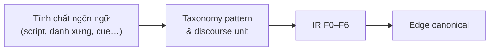

# Phân tích tính chất đặc trưng ngôn ngữ gia phả Hán-Nôm

> **Ngày:** 2026-07-20 (cập nhật)  
> **Mục đích:** Đào sâu **tính chất ngôn ngữ** trước khi chốt schema IR (F0–F6) và metrics  
> **Luận văn:** Mô hình tự động xây dựng gia phả từ ngôn ngữ Hán-Nôm  
> **Tài liệu liên quan:**  
> - Khung IR: [genealogy_feature_layers_deep_dive.md](./genealogy_feature_layers_deep_dive.md)  
> - Plan tổng: [genealogy_extraction_feature_set_plan.md](./genealogy_extraction_feature_set_plan.md)  
> - Metrics: [genealogy_feature_metrics_table.md](./genealogy_feature_metrics_table.md)

---

## Mục lục

1. [Vì sao phân tích ngôn ngữ trước schema](#1-vì-sao-phân-tích-ngôn-ngữ-trước-schema)
2. [Tính chất tổng quát của diễn ngôn gia phả](#2-tính-chất-tổng-quát-của-diễn-ngôn-gia-phả)
3. [Đa lớp script & ngôn ngữ (core)](#3-đa-lớp-script--ngôn-ngữ-core)
4. [Hệ danh xưng người (anthroponyms)](#4-hệ-danh-xưng-người-anthroponyms)
5. [Từ vựng quan hệ huyết thống & hôn nhân](#5-từ-vựng-quan-hệ-huyết-thống--hôn-nhân)
6. [Cấu trúc đời / chi / thủy tổ (discourse lineage)](#6-cấu-trúc-đời--chi--thủy-tổ-discourse-lineage)
7. [Biểu thức thời gian (niên hiệu, can chi, dương lịch)](#7-biểu-thức-thời-gian-niên-hiệu-can-chi-dương-lịch)
8. [Sự kiện đời & khoa bảng (non-relation predicates)](#8-sự-kiện-đời--khoa-bảng-non-relation-predicates)
9. [Địa danh & di cư](#9-địa-danh--di-cư)
10. [Biến thể vùng miền & thời kỳ](#10-biến-thể-vùng-miền--thời-kỳ)
11. [Cú pháp cue → chiều quan hệ (directionality)](#11-cú-pháp-cue--chiều-quan-hệ-directionality)
12. [Khó khăn OCR / chuẩn hóa chữ](#12-khó-khăn-ocr--chuẩn-hóa-chữ)
13. [Ánh xạ: tính chất ngôn ngữ → đặc trưng IR → cách dùng](#13-ánh-xạ-tính-chất-ngôn-ngữ--đặc-trưng-ir--cách-dùng)
14. [Corpus minh họa (vol. 855 Description)](#14-corpus-minh-họa-vol-855-description)
15. [Khoảng trống so với extractor hiện tại](#15-khoảng-trống-so-với-extractor-hiện-tại)
16. [Câu hỏi mở / chỗ chỉnh sửa](#16-câu-hỏi-mở--chỗ-chỉnh-sửa)

---

## 1. Vì sao phân tích ngôn ngữ trước schema

Schema F0–F6 là **mô hình dữ liệu trung gian**. Nếu chốt field trước khi hiểu **tính chất ngôn ngữ**, dễ:

| Rủi ro | Ví dụ |
|--------|--------|
| Nhầm **cue** với **edge** | `"con Nguyễn Trù"` ≠ đã có `parent_of` |
| Nhầm **niên đại cuốn** với **năm đời người** | Bảo Đại 7 (1932) ≠ năm sinh Nguyễn Trù |
| Bỏ qua **đời thứ** → trùng tên sai cha-con | Hai “Nguyễn Văn A” khác đời |
| Rule QN hiện đại miss **phản ánh Hán-Việt** | `phối`, `huý`, `tự`, `hiệu` |
| Coi `Đời thứ N` là quan hệ | Chỉ là **marker cấu trúc**, không phải edge |

**Nguyên tắc luận văn:**  
*Tính chất ngôn ngữ → taxonomy cue/marker → field IR → rule/LLM → edge graph.*



---

## 2. Tính chất tổng quát của diễn ngôn gia phả

Gia phả Hán-Nôm (và bản phiên âm / mô tả catalog) **không** giống văn kể chuyện đời thường. Các tính chất nền:

| # | Tính chất | Mô tả ngắn | Hệ quả cho NLP |
|---|-----------|------------|----------------|
| L1 | **Đa lớp script** | Cùng trang/cuốn: Hán + Nôm + phiên âm + chú QN | Phải gắn `lang_layer` mọi span |
| L2 | **Đậm đặc danh xưng** | Nhiều tên / câu; ít động từ tường thuật | NER tên + alias quan trọng hơn POS tagging đầy đủ |
| L3 | **Cue quan hệ ngắn, elliptic** | `"…, con Nguyễn Trù"` — thiếu chủ ngữ tường minh | Cần **antecedent** từ “Đời thứ N: NAME” |
| L4 | **Cấu trúc đời tuần tự** | Khối “Đời thứ k” liệt kê người cùng gen | Segment theo generation block trước khi extract |
| L5 | **Thời gian phi dương lịch** | Niên hiệu, can chi, đôi khi kèm `(1697)` | Lookup table bắt buộc |
| L6 | **Danh hiệu khoa bảng = sự kiện** | “Hoàng giáp khoa Đinh sửu” ≠ quan hệ người–người | Tách F3 khỏi F2 |
| L7 | **Song ngữ metadata** | `河内 • Hà Nội`, `保大七年 • 1932` | Parser tách Hán / QN bằng `•` hoặc khoảng |
| L8 | **Mơ hồ giới / thứ bậc hôn nhân** | chính thất / thứ thất; 嫡 / 庶 | Soft constraint, không hard-fail |

### 2.1. Đơn vị diễn ngôn (discourse units)

| Đơn vị | Dấu hiệu bề mặt | Dùng để |
|--------|-----------------|---------|
| **Document** | Title, Place, Date, Description | F0 profile, chọn rule pack |
| **Generation block** | `Đời thứ N:`, `第N世` | F4 + gắn gen cho mọi person trong block |
| **Person entry** | Tên + chuỗi apposition (hiệu, tự, khoa…) | F1 + F3 |
| **Relation clause** | `con X`, `phối Y`, `娶…` | F2 cue |
| **Migration / origin clause** | `di cư`, `Gia Miêu…` | F5 + F4 thủy tổ note |

**Thứ tự phân tích ngôn ngữ đề xuất:** Document → Generation block → Person entry → Relation clause / Event clause.

---

## 3. Đa lớp script & ngôn ngữ (core)

### 3.1. Các lớp và tính chất

| Lớp | Mã | Đặc điểm hình thức | Vai trò trong gia phả | Độ ưu tiên extract (MVP) |
|-----|-----|---------------------|------------------------|---------------------------|
| Chữ Hán | `han` | Hán tự cổ điển; quan hệ 子/女/配/考/妣 | Nguồn gốc tư liệu | P2 (sau OCR ổn) |
| Chữ Nôm | `nom` | Hán + Nôm riêng; nhiều lỗi OCR | Tên địa phương, từ Việt cổ | P3 |
| Âm Hán-Việt | `han_viet` | Đọc Hán bằng QN: *công, khoa, tự…* | Từ trong phiên âm | P1 (trong chuỗi QN) |
| Phiên âm Quốc ngữ (bản chép/phiên) | `quoc_ngu_trans` | Câu kiểu “Đời thứ 7: Nguyễn Trù…” | **Cầu nối** Hán → graph | **P0** |
| Quốc ngữ hiện đại | `quoc_ngu_modern` | “A là cha của B”, VGP | Baseline rule đã có | P0 (corpus VGP) |
| Niên hiệu / can chi | `era` | Bảo Đại 7, Đinh Sửu | Chuẩn hóa năm | P0 |
| Song ngữ catalog | `bilingual_meta` | `Hán • QN` trong Nom metadata | F0 nhanh, ít noise | P0 |

### 3.2. Hiện tượng chồng lớp (code-mixing) trên cùng câu

**Ví dụ điển hình (kiểu Description 855):**

> Đời thứ 7: Nguyễn Trù, hiệu Loại Am, tự Trung Lượng, Hoàng giáp khoa Đinh sửu (1697).

| Span | Lớp | Tính chất | Dùng |
|------|-----|-----------|------|
| `Đời thứ 7` | QN + Hán-Việt calque | Generation marker | F4 → `person.generation=7` |
| `Nguyễn Trù` | QN (họ–tên) | Primary name | F1 `full_name` |
| `hiệu Loại Am` | QN + thuật ngữ Hán-Việt | Pseudonym cue | F1 `pseudonym` |
| `tự Trung Lượng` | QN + thuật ngữ Hán-Việt | Courtesy name | F1 `courtesy_name` |
| `Hoàng giáp khoa` | Hán-Việt danh hiệu | Exam event | F3 `exam` |
| `Đinh sửu` | Can chi | Temporal | F3 `year_raw` |
| `(1697)` | Dương lịch ngoặc | Temporal gloss | F3 `year_gregorian` |

**Cách dùng tổng hợp:** một person entry = **chuỗi apposition** (danh sách bổ ngữ sau tên), phân tách bằng dấu phẩy; mỗi bổ ngữ có **trigger từ** riêng (`hiệu`, `tự`, `khoa`…).

### 3.3. Tính chất “script asymmetry”

| Hiện tượng | Ý nghĩa |
|------------|---------|
| OCR Hán tốt hơn Nôm | Rule Hán ưu tiên chữ phổ thông (子配考妣), không phụ thuộc Nôm |
| Phiên âm có thể **không** 1–1 với dòng Hán | Evidence span nên gắn trang/dòng (F6), không giả định alignment ký tự |
| Metadata Nom (Description) đã là **bản tóm tắt QN** | Gold G1 có thể annotate Description trước khi OCR full volume |

---

## 4. Hệ danh xưng người (anthroponyms)

Hệ thống tên trong gia phả Việt–Hán **đa danh** cho một thực thể. Đây là tính chất ngôn ngữ trung tâm của F1.

### 4.1. Các loại danh xưng

| Loại | Thuật ngữ | Trigger QN | Trigger Hán (gợi ý) | Ví dụ | Cách dùng trong extract |
|------|-----------|------------|---------------------|-------|-------------------------|
| Tên chính (thường = tên húy hoặc tên dùng) | `full_name` | Viết hoa / đầu entry | — | Nguyễn Trù | Khóa merge chính |
| Họ | `surname` | Token đầu họ VN | 姓 | Nguyễn | Disambiguation họ |
| Tên | `given_name` | Token sau họ | 名 | Trù | |
| **Huý** | `taboo_name` | `huý`, `húy` | 諱 | Thạch | Alias; tránh trùng với tên thường |
| **Tự** | `courtesy_name` | `tự X` | 字 | Trung Lượng, Hữu Tự | **Merge cùng person** |
| **Hiệu** | `pseudonym` | `hiệu X` | 號 | Loại Am | Merge; đôi khi → `title` UI |
| **Thụy** | `posthumous_name` | `thụy`, `… công` | 諡 | Thanh Nhàn công | Alias / danh hiệu |
| Quan hàm / tước | `office` / `social_title` | `tri huyện`, `công` | 官 | Thái thượng tự thừa | Bio, không phải quan hệ |
| Danh khoa | (qua F3) | `Hoàng giáp`, `Tiến sĩ` | 進士… | — | Event, có thể gắn person |

### 4.2. Tính chất ngôn ngữ của apposition tên

**Pattern bề mặt (QN phiên âm):**

```text
{NAME} (, {ALIAS_CUE} {ALIAS})* (, {EVENT_CUE} …)* (, {REL_CUE} {PARENT})?
```

Ví dụ:

```text
Nguyễn Ngoạn, tự Hữu Tự, con Nguyễn Trù.
```

| Vị trí | Span | Vai trò ngôn ngữ |
|--------|------|------------------|
| Head | Nguyễn Ngoạn | Entity đang được mô tả (topic) |
| Apposition 1 | tự Hữu Tự | Bổ ngữ danh xưng |
| Apposition 2 | con Nguyễn Trù | Bổ ngữ quan hệ (F2) — **không** phải tên của Ngoạn |

**Quy tắc dùng:**

1. Mọi `tự/hiệu/huý X` trong cùng entry → **cùng** `person.id` với head name.
2. `con {NAME}` → NAME là **target** quan hệ (cha), không phải alias.
3. Không gộp `con Nguyễn Trù` vào `aliases[]`.

### 4.3. Ambiguity tên

| Hiện tượng | Ví dụ | Cách xử lý ngôn ngữ |
|------------|-------|---------------------|
| Trùng tên khác đời | Hai Nguyễn Văn Lý | Bắt buộc gắn `generation` |
| Tên chỉ có tự/hiệu | “Loại Am” xuất hiện lại | Coref về full_name qua alias index |
| Tên không viết hoa (OCR) | nguyễn trù | Soft match; không chỉ dựa `NAME_CAPS` |
| Tên Hán chưa phiên | 阮惆 | Giữ `full_name_han`; link khi có bảng phiên |

---

## 5. Từ vựng quan hệ huyết thống & hôn nhân

### 5.1. Tính chất từ vựng quan hệ

| Tính chất | Mô tả | Hệ quả |
|-----------|--------|--------|
| **Đa hình thức cùng nghĩa** | cha/bố/ba; mẹ/má; phối/vợ/lấy | Cần synonym set theo `region` + `lang_layer` |
| **Chiếu ngược (inverse)** | “A là con của B” vs “B có con A” | Cùng edge `parent_of`, khác chiều surface |
| **Ellipsis chủ ngữ** | “, con X” sau tên ở đầu câu | Antecedent = head của person entry |
| **Lexical Hán-Việt trong QN** | `phối`, `huynh đệ`, `thất` | Rule QN hiện đại (`vợ của`) **thiếu** nếu không thêm |
| **Thứ tự sinh = quan hệ + meta** | trưởng/thứ/tam; 長子/次子 | Vừa cue sibling order, vừa F1 `order_among_siblings` |

### 5.2. Bảng từ vựng quan hệ (chi tiết + cách dùng)

#### Huyết thống thẳng

| Nghĩa | QN hiện đại | QN phiên âm / Hán-Việt | Hán | Cue type | Chiều surface → edge |
|-------|-------------|------------------------|-----|----------|----------------------|
| Cha | cha, bố, ba | khảo?, phụ | 父, 考 | `parent_label` | label gắn cha |
| Mẹ | mẹ, má | mẫu | 母, 妣 | `mother_label` | |
| Con (chung) | con | tử (trong Hán-Việt) | 子 | `child_of_phrase` | **đảo** → parent_of |
| Con trai / gái | con trai/gái | nam/nữ | 男/女, 子/女 | + gender | |
| Sinh ra (có con) | có con, sinh được | sinh | 生, 生男 | `have_child` | parent → child |
| Ông/bà nội | ông, bà | tổ, tổ mẫu | 祖, 祖母 | (P2) | ancestor |
| Cháu | cháu | tôn | 孫 | (P2) | |

#### Hôn nhân

| Nghĩa | QN | Hán-Việt / Hán | Cue type | Ghi chú dùng |
|-------|-----|----------------|----------|--------------|
| Kết hôn (hành động) | lấy, cưới, kết hôn | thú | 娶 | `spouse_marry` | A lấy B → spouse |
| Là vợ/chồng của | vợ của, chồng của | phối, thất | 配, 室, 妻 | `spouse_of` | |
| Chính / thứ thất | chính thất, thứ thất | đích / thứ | 嫡, 庶 | meta hôn nhân | Không đổi type edge |

#### Anh chị em

| Nghĩa | Bắc (hay gặp gia phả) | Nam / hiện đại | Hán | Cue type |
|-------|----------------------|----------------|-----|----------|
| Anh em chung | huynh đệ | anh em | 兄弟 | `sibling` |
| Chị em | tỷ muội | chị em | 姊妹 | `sibling` |
| Anh của / em của | là anh của… | tương tự | 兄/弟 | `sibling` + chiều |

### 5.3. Pattern bề mặt quan trọng (QN phiên âm) — chưa đủ trong code

| Pattern | Ví dụ | Có trong `patterns.py`? | Cách dùng |
|---------|-------|-------------------------|-----------|
| `, con {NAME}` | con Nguyễn Trù | ❌ (chỉ `là con của`) | **P0** — `VN_CHILD_INLINE` |
| `{A} là con của {B}` | … | ✅ `RE_CHILD_OF` | Giữ |
| `{A} có con là {B}` | … | ✅ `RE_HAVE_CHILD` | Giữ |
| `phối {NAME}` / `phối thất` | … | ❌ (có `phối ngẫu của`) | Bổ sung |
| `Đời thứ {N}:` | Đời thứ 8 | ❌ | F4 marker |
| `tự {ALIAS}` / `hiệu {ALIAS}` | tự Hữu Tự | ❌ | F1 alias |
| `huynh đệ` | … | ❌ (`anh em` có) | Region north |

### 5.4. Tính chất “cue ≠ quan hệ đã xác nhận”

Một cue ngôn ngữ chỉ cho **giả thuyết edge**. Cần ràng buộc thêm:

| Cue đủ mạnh? | Điều kiện bổ sung |
|--------------|-------------------|
| Cao | Có 2 mention resolve + cue rõ + cùng generation block hợp lệ |
| Trung bình | Chỉ cue, thiếu generation |
| Thấp | Cue mơ hồ (“các con”), nhiều tên trong danh sách |

---

## 6. Cấu trúc đời / chi / thủy tổ (discourse lineage)

Đây là **tính chất diễn ngôn** đặc thù gia phả, không phải quan hệ từ vựng thông thường.

### 6.1. Marker đời

| Dạng | Ví dụ | Tính chất | Cách dùng |
|------|-------|-----------|-----------|
| QN | `Đời thứ 7:` | Mở **generation block** | Gán `generation=7` cho mọi person entry cho đến marker kế |
| Hán | `第七世`, `七世` | Tương đương | Phase 2 |
| VGP HTML | `Đời thứ : 3` | Field form | Parser VGP đã bắt |

**Không** map `Đời thứ N` → edge.  
**Có** map → F4 `generation.index` + F1 `person.generation`.

### 6.2. Thủy tổ / chi / ngành

| Marker | Ví dụ (855) | Tính chất ngôn ngữ | Cách dùng |
|--------|-------------|--------------------|-----------|
| Thủy tổ | “Thuỷ tổ họ này là Thanh Quốc công” | Định danh **gốc dòng**; có thể không có năm | F4 `thuy_to`; neo cây |
| Chi | “chi Nguyễn Trù”, “chi trưởng” | Phân nhánh dưới thủy tổ | F4 `branch`; hạn chế merge xuyên chi |
| Di cư gốc | “Gia Miêu … di cư ra” | Clause nguồn gốc không phải quan hệ cha-con | F5 + note F4 |

### 6.3. Quan hệ thế hệ như ràng buộc mềm

Tính chất: trong diễn ngôn chuẩn, **đời con = đời cha + 1**.

| Dùng để | Không dùng để |
|---------|----------------|
| Validate cue `con X` | Tự suy cha khi thiếu cue |
| Gợi ý sibling cùng đời + cùng cha | Ép mọi người liên tiếp trong list thành cha-con |

---

## 7. Biểu thức thời gian (niên hiệu, can chi, dương lịch)

### 7.1. Ba hệ thời gian trong cùng corpus

| Hệ | Ví dụ | Tính chất | Map |
|----|-------|-----------|-----|
| **Niên hiệu triều** | Thiệu Trị 3, Bảo Đại 7 | Gắn triều đại; có năm trong triều | `era_name` + `era_year_in_reign` → Gregorian lookup |
| **Can chi** | Đinh Sửu, Nhâm Thân | Chu kỳ 60 năm — **đa nghĩa** nếu thiếu ngữ cảnh triều/đời | Cần neo bằng generation / niên hiệu gần |
| **Dương lịch** | 1697, 1932 | Thường trong ngoặc hoặc metadata Nom | Ưu tiên nếu có |

### 7.2. Phân tầng thời gian (rất quan trọng)

| Tầng ngôn ngữ | Ví dụ 855 | Ý nghĩa | Field |
|---------------|-----------|---------|-------|
| Thời điểm **biên soạn/sao chép cuốn** | Bảo Đại 7 • 1932; Nhâm Thân | Document time | **F0** `doc.era_document` |
| Thời điểm **sự kiện đời người** | Hoàng giáp … (1697); Thiệu Trị 3 (1843) | Person/event time | **F3** / F1 year |
| Thời điểm **imaging** catalog | 2009-03-24 | Meta thư viện | F0 phụ, không dùng suy luận quan hệ |

**Lỗi điển hình nếu không tách:** gán 1932 làm năm sinh hàng loạt người trong phả.

### 7.3. Cách dùng trong suy luận quan hệ

| Tính chất thời gian | Dùng |
|---------------------|------|
| `birth(parent) + 15 ≤ birth(child)` (soft) | Validate `parent_of` |
| Exam year ≈ tuổi trưởng thành | Neo năm sống xấp xỉ nếu thiếu birth |
| Can chi đơn độc | **Không** convert cứng nếu thiếu dynasty context |

---

## 8. Sự kiện đời & khoa bảng (non-relation predicates)

### 8.1. Vì sao tách khỏi quan hệ

Về mặt ngôn ngữ, các vị ngữ sau **không** có hai đối ngữ người–người:

| Predicate | Ví dụ | Đối ngữ |
|-----------|-------|---------|
| Khoa bảng | Hoàng giáp khoa Đinh sửu | (person) — exam — (time) |
| Quan chức | tri huyện, án sát | (person) — office |
| Thọ | Thọ 87 tuổi | (person) — lifespan |
| Phong tước | Thanh Nhàn công | (person) — honor |

→ Đây là **F3**, dùng để làm giàu F1 và validate, không tạo `parent_of`.

### 8.2. Từ vựng khoa bảng hay gặp (Bắc / phong kiến)

| Danh hiệu | Trigger | Cách dùng |
|-----------|---------|-----------|
| Hoàng giáp | `Hoàng giáp` | `exam.type=hoang_giap` |
| Tiến sĩ | `Tiến sĩ` | `exam.type=tien_si` |
| Giám sinh | `Giám sinh` | exam / học vị |
| Tam trường | `Tam trường` | exam |
| Khoa + can chi | `khoa Đinh sửu` | gắn year |

---

## 9. Địa danh & di cư

### 9.1. Tính chất

| Hiện tượng | Ví dụ | Cách dùng |
|------------|-------|-----------|
| Song ngữ Place | `河内 • Hà Nội` | Tách han/vn; `region=north` |
| Làng / thôn trong Description | làng Trung Tự | `geo.locality` → residence dòng họ |
| Di cư gốc | Gia Miêu Ngoại trang di cư | Không phải edge; note thủy tổ |
| Địa danh trong quan hàm | tri huyện X | Có thể F5 phụ, không bắt buộc |

### 9.2. Ảnh hưởng ngôn ngữ quan hệ (gián tiếp)

`geo.region` → chọn synonym pack:

- `north`: ưu tiên *huynh đệ, phối, tự, hiệu*
- `south` / hiện đại: *anh chị em, vợ/chồng, lấy*

---

## 10. Biến thể vùng miền & thời kỳ

### 10.1. Vùng × từ quan hệ

| Vùng | Ưu tiên lexical | Rủi ro nếu dùng pack sai |
|------|-----------------|---------------------------|
| Bắc Bộ (855, 1255) | huynh đệ, phối, huý/tự/hiệu, đời thứ | Miss nếu chỉ rule “anh em” |
| Nam Bộ / hiện đại | anh chị em, ba/má | False negative với văn phong Hán-Việt |
| Trung (Huế) | danh xưng triều Nguyễn đậm | Cần bổ sung corpus |

### 10.2. Thời kỳ × hình thức thời gian & danh hiệu

| Thời kỳ | Tính chất ngôn ngữ nổi bật | Ảnh hưởng extract |
|---------|----------------------------|-------------------|
| Lê – Nguyễn sớm | Quan hàm cổ, công/hầu | F1 title / F3 honor |
| Nguyễn muộn / khoa bảng | Hoàng giáp, Tiến sĩ + can chi | F3 exam |
| Pháp thuộc | Song ngữ Hán•QN; Bảo Đại… | F0 date parse |
| Hiện đại (VGP) | QN thuần, năm số | Rule MVP hiện tại đủ hơn |

---

## 11. Cú pháp cue → chiều quan hệ (directionality)

Phân tích **vai ngữ pháp** quan trọng hơn từ khóa đơn.

### 11.1. Ba khung cú pháp lõi (cha–con)

| Khung | Surface | Subject ngầm/hiện | Object | Edge |
|-------|---------|-------------------|--------|------|
| **Inline child** | `{ChildEntry}, con {Parent}` | Child = head entry | Parent | Parent —parent_of→ Child |
| **Explicit child-of** | `{Child} là con của {Parent}` | Child | Parent | như trên |
| **Have-child** | `{Parent} có con là {Child}` | Parent | Child | Parent —parent_of→ Child |

### 11.2. Ví dụ 855 (phân tích vai)

**Câu:** `Đời thứ 8: Nguyễn Ngoạn, tự Hữu Tự, con Nguyễn Trù.`

| Thành tố | Vai ngôn ngữ | IR |
|----------|--------------|-----|
| Đời thứ 8 | Discourse marker | F4 gen=8 |
| Nguyễn Ngoạn | Head NP (topic) | F1 person A |
| tự Hữu Tự | Appositive alias | F1 alias(A) |
| con | Relation predicate (elliptic) | F2 cue |
| Nguyễn Trù | Object of “con” | F1 person B |
| *(suy luận)* | | B parent_of A |

### 11.3. Lỗi chiều thường gặp

| Lỗi | Nguyên nhân ngôn ngữ | Phòng tránh |
|-----|----------------------|-------------|
| Đảo cha↔con | Coi “con X” là X là con | Object của “con” = cha |
| Alias thành người khác | Coi “tự Hữu Tự” là person mới | Trigger `tự/hiệu` → alias |
| Đời thành quan hệ | Match “Đời thứ” như kinship | Blacklist cue_type generation |

---

## 12. Khó khăn OCR / chuẩn hóa chữ

| Tính chất nguồn | Hệ quả ngôn ngữ | Cách dùng / giảm thiểu |
|-----------------|-----------------|------------------------|
| Nhầm Hán gần nghĩa | Sai 子/字, 配/… | Human review F6 page; confidence thấp |
| Mất dấu QN phiên âm | Sai `NAME_CAPS` | Normalize Unicode; fuzzy name |
| Xuống dòng giữa tên | Cắt entity | Merge line trong generation block |
| Nôm hiếm | OOV | Không block pipeline; giữ raw span |
| Không có `ocr_confidence` từ API | Khó weight evidence | Dùng F6 `extraction_method` + human gold |

---

## 13. Ánh xạ: tính chất ngôn ngữ → đặc trưng IR → cách dùng

Bảng tổng hợp **để chỉnh sửa** (cột “Cách dùng” = vai trò trong pipeline):

| ID | Tính chất ngôn ngữ | Dấu hiệu bề mặt | → Field IR | Cách dùng chính |
|----|--------------------|-----------------|------------|-----------------|
| LG-01 | Đa lớp script | Hán / QN / song ngữ | `lang_layer`, F0.language | Chọn rule pack |
| LG-02 | Song ngữ metadata | `A • B` | F0 place/date raw + split | F0 nhanh |
| LG-03 | Generation discourse | `Đời thứ N:` | F4.generation | Gán gen, validate cha-con |
| LG-04 | Thủy tổ / chi | thủy tổ, chi trưởng | F4.thuy_to, branch | Neo cây, chặn merge sai |
| LG-05 | Primary name | Head NP viết hoa | F1.full_name | Node id / merge |
| LG-06 | Alias tự/hiệu/huý | `tự|hiệu|huý X` | F1.courtesy/pseudo/taboo | Merge entity |
| LG-07 | Child inline elliptic | `, con NAME` | F2.child_of_phrase | Edge parent_of (đảo) |
| LG-08 | Child-of explicit | `là con của` | F2 | Edge parent_of |
| LG-09 | Have-child | `có con là` | F2 | Edge parent_of |
| LG-10 | Spouse lexical | lấy / phối / 配 | F2.spouse_* | Edge spouse_of |
| LG-11 | Sibling lexical | huynh đệ / anh em | F2.sibling | Edge sibling_of |
| LG-12 | Birth order | trưởng, 長子 | F1.order + F2 | Sibling order meta |
| LG-13 | Exam predicate | Hoàng giáp khoa… | F3.exam | Bio + neo năm |
| LG-14 | Era / can chi | Thiệu Trị 3, Đinh Sửu | F3/F0 year_* | birthYear, validate |
| LG-15 | Document vs person time | Bảo Đại vs khoa năm | F0 vs F3 | Tránh gán năm sai |
| LG-16 | Locality / migration | làng X, di cư | F5 | Region pack + note |
| LG-17 | Evidence span | chuỗi gốc | F2.evidence + F6 | Audit, đánh giá P/R |
| LG-18 | Gender cue | ông/bà, 子/女 | F1.gender | Soft validate spouse |

### 13.1. Ưu tiên nghiên cứu ngôn ngữ (trước implement dày)

| Ưu tiên | Nhóm LG | Lý do |
|---------|---------|-------|
| **P0** | LG-03, LG-05, LG-06, LG-07, LG-14, LG-15 | Đủ dựng gold 855 Description → edge cha-con |
| **P1** | LG-01, LG-02, LG-04, LG-10, LG-13, LG-17 | Context + spouse + exam |
| **P2** | LG-08–12, LG-16, Hán thuần | Mở rộng recall |
| **P3** | Nôm, ông/cháu, adoptive | Phủ biên |

---

## 14. Corpus minh họa (vol. 855 Description)

**Đoạn mẫu (rút gọn):**

> Gia phả cho biết Thuỷ tổ họ này là Thanh Quốc công… Đời thứ 7: Nguyễn Trù, hiệu Loại Am, tự Trung Lượng, Hoàng giáp khoa Đinh sửu (1697). Đời thứ 8: Nguyễn Ngoạn, tự Hữu Tự, **con Nguyễn Trù**.

### 14.1. Phân tích từng tính chất trên đoạn

| Span | LG | IR | Ghi chú phân tích |
|------|-----|-----|-------------------|
| Thuỷ tổ … Thanh Quốc công | LG-04 | F4.thuy_to | Danh hiệu + vai trò gốc dòng |
| Đời thứ 7 | LG-03 | F4 gen=7 | Mở block |
| Nguyễn Trù | LG-05 | F1 | Head |
| hiệu Loại Am | LG-06 | F1.pseudonym | Alias |
| tự Trung Lượng | LG-06 | F1.courtesy_name | Alias |
| Hoàng giáp khoa Đinh sửu (1697) | LG-13+14 | F3.exam | Không phải quan hệ |
| Đời thứ 8 | LG-03 | F4 gen=8 | Block mới |
| Nguyễn Ngoạn | LG-05 | F1 | Head |
| tự Hữu Tự | LG-06 | alias | |
| con Nguyễn Trù | LG-07 | F2 → edge | Chiều: Trù parent_of Ngoạn |
| *(suy ra)* gen 8 = gen 7 + 1 | LG-03 | validate | Soft OK |

### 14.2. Output ngôn ngữ → IR tối thiểu (minh họa)

```json
{
  "lang_analysis": {
    "primary_layer": "quoc_ngu_modern",
    "embedded_layers": ["han_viet", "era"]
  },
  "discourse": [
    { "type": "thuy_to", "text": "Thanh Quốc công" },
    { "type": "generation_block", "index": 7, "head": "Nguyễn Trù" },
    { "type": "generation_block", "index": 8, "head": "Nguyễn Ngoạn" }
  ],
  "persons": [
    {
      "full_name": "Nguyễn Trù",
      "generation": 7,
      "pseudonym": "Loại Am",
      "courtesy_name": "Trung Lượng",
      "events": [{ "type": "exam", "label": "Hoàng giáp", "can_chi": "Đinh sửu", "year": 1697 }]
    },
    {
      "full_name": "Nguyễn Ngoạn",
      "generation": 8,
      "courtesy_name": "Hữu Tự",
      "relation_cues": [{ "type": "child_of_phrase", "cue": "con", "target_text": "Nguyễn Trù" }]
    }
  ]
}
```

---

## 15. Khoảng trống so với extractor hiện tại

File: `nlp_family_extractor/app/domains/extraction/rules/patterns.py`

| Tính chất ngôn ngữ cần | Code hiện tại | Gap |
|------------------------|---------------|-----|
| `, con {NAME}` elliptic | Chỉ `là con của` / `con của` | Thiếu pattern gia phả phổ biến nhất |
| `Đời thứ N` | Không | Chưa segment generation |
| `tự` / `hiệu` / `huý` | Không | Alias chưa tách |
| `phối` (không chỉ “phối ngẫu của”) | Một phần | |
| `huynh đệ` | Không (có anh em) | Region north |
| Can chi / niên hiệu | Không | |
| Hán 子配考妣 | Không | Phase 2 |
| NAME chỉ dựa viết hoa | `NAME_CAPS` | Yếu với OCR thường |

→ Gap này **xác nhận** cần phân tích ngôn ngữ + gold 855 trước khi chỉ “thêm regex”.

---

## 16. Câu hỏi mở / chỗ chỉnh sửa

Dùng bảng dưới để bạn bổ sung ý kiến:

| # | Câu hỏi | Gợi ý | Ghi chú của bạn |
|---|---------|-------|-----------------|
| Q1 | `con X` không có dấu phẩy trước — có chấp nhận không? | Nên: cho phép `\bcon {NAME}` trong cùng sentence với head | |
| Q2 | “Thanh Quốc công” có tạo person node không? | Có node ảo thủy tổ vs chỉ F4 string | |
| Q3 | Can chi không có năm ngoặc — có convert không? | Soft + đánh dấu ambiguous | |
| Q4 | Có tách `quoc_ngu_trans` vs Description catalog không? | Description = `quoc_ngu_modern` tóm tắt | |
| Q5 | Gender từ “công/ông” có đủ tin không? | Soft feature thôi | |
| Q6 | Có cần lớp riêng cho **văn bi ký** (ít đời thứ)? | `doc.genre=bi_ky` → tắt F4 mạnh | |

---

## Liên kết cập nhật

| File | Vai trò |
|------|---------|
| **File này** | Phân tích **tính chất ngôn ngữ** & cách dùng |
| [genealogy_feature_layers_deep_dive.md](./genealogy_feature_layers_deep_dive.md) | Catalog field IR F0–F6 |
| [genealogy_feature_metrics_table.md](./genealogy_feature_metrics_table.md) | Bảng chấm / P-R |
| [genealogy_extraction_feature_set_plan.md](./genealogy_extraction_feature_set_plan.md) | Plan tổng & lộ trình |

---

*Tài liệu sống — ưu tiên chỉnh §5–§7 và §16 trước khi mở rộng rule Hán.*
