# Proposal — Nâng cấp NER/OCR Hán cổ cho pipeline gia phả (T4)

> Nguồn: [`chinese_genealogy_model_hunt_plan.md`](./chinese_genealogy_model_hunt_plan.md) T4.
> Bằng chứng: [`../../research/model_survey/EVALUATION.md`](../../research/model_survey/EVALUATION.md) (cập nhật 2026-09-26).
> **Chờ thầy duyệt trước khi implement.**

## 1. Điều kiện T4 đã đạt

| Ứng viên | Effort | License | Bằng chứng chạy thật |
|---|---|---|---|
| guwen-ner | Thấp–Trung bình | Apache-2.0 | 75% tên+chức trên câu mẫu giản thể (`trial/guwen_ner_log.txt`) |
| Jiayan | Thấp | MIT | CharHMM + POS (`trial/jiayan_log.txt`) |
| CHAT_models + `kraken==4.3.13` | Trung bình | CC BY-NC 4.0 | OCR demo đọc được (`trial/legacy_kraken_test_log.txt`); **không** đề xuất production thương mại |

Ưu tiên tích hợp thử nghiệm: **guwen-ner** (đúng gap NER/RE ở mục 2 của plan). CHAT_models chỉ baseline OCR nghiên cứu nếu được phép non-commercial.

## 2. Pipeline trước / sau

```mermaid
flowchart TD
  subgraph before [Hiện tại]
    A1[Ảnh / text quốc ngữ] --> B1[OCR Paddle / lab / Gemini dịch]
    B1 --> C1[FamilyExtractor rule-based]
    C1 --> D1[regex NAME_* + spouse/parent/sibling]
    D1 --> E1[people + relationships JSON]
  end

  subgraph after [Đề xuất — bổ sung, không thay toàn bộ]
    A2[Text Hán cổ / Hán-Nôm đã OCR] --> B2[OpenCC phồn→giản nếu cần]
    B2 --> C2[guwen-ner token-classification]
    C2 --> D2[Map NOUN_OTHER → ứng viên tên]
    D2 --> E2[Giữ rule-based quan hệ hiện tại]
    E2 --> F2[people + relationships JSON]
    A2 -.->|tuỳ chọn nghiên cứu| G2[CHAT_models + kraken pin 4.x]
    G2 -.-> B2
  end
```

## 3. Điểm chèn cụ thể (không sửa code ở bước này)

Plan ghi `nlp_family_extractor/app/extractor.py` — đường dẫn đã chuyển sau refactor:

| Bước | File thật | Việc đề xuất (sau khi duyệt) |
|---|---|---|
| Ứng viên tên | `app/domains/extraction/entity_extractor.py` (`extract_person_candidates`) | Thêm nhánh optional: gọi guwen-ner, gộp span `NOUN_OTHER` với regex hiện có |
| Pipeline chính | `app/domains/extraction/extractor.py` (`FamilyExtractor`) | Sau `normalize_text`, trước/ song song bước tìm tên regex — **không** xoá `spouse_of` / `parent_of` / `sibling_of` rule-based ở phase 1 |
| Tiền xử lý cổ văn (tuỳ chọn) | module mới dưới `tools/` hoặc `app/domains/extraction/` | Jiayan tokenize/POS; OpenCC |
| OCR A/B (nghiên cứu) | cạnh `tools/ocr_paddleocr.py` | Script `ocr_kraken_chat.py` chỉ khi license non-commercial được xác nhận |

Phase 1: NER bổ sung ứng viên tên → rule quan hệ giữ nguyên.
Phase 2 (sau đánh giá): cân nhắc RE chuyên biệt / fine-tune — ngoài phạm vi proposal này.

## 4. Rủi ro

1. **License CHAT_models = CC BY-NC 4.0** — cấm dùng thương mại; không đóng gói weight vào sản phẩm thu phí. Chỉ nghiên cứu/luận văn nếu Attribution đủ.
2. **guwen-ner nhãn thô** (`NOUN_OTHER` / `NOUN_BOOKNAME`) — không phân biệt tên người vs chức quan vs địa danh; cần heuristic hoặc fine-tune trên corpus gia phả.
3. **Phồn thể:** bản phồn câu mẫu cho 0 entity (`諱` → `[UNK]`); bắt buộc OpenCC (hoặc model có vocab phồn) trước inference.
4. **Domain gap Hán-Nôm:** chữ Nôm và phong cách khắc Việt ngoài phân phối guwen/CHAT — cần đo lại trên trang vote L1 thật trước khi tin số 75%.
5. **Dependency:** pin `transformers~=4.46`, `torch` tương thích; CHAT cần **`kraken<5`** (đã chứng minh 7.x phá chất lượng).
6. **ToS / egress:** HF Hub phải reachable trên máy chạy inference (sandbox Claude không đủ).

## 5. Ước lượng effort (giờ)

| Hạng mục | Giờ (ước lượng) |
|---|---|
| Wrapper guwen-ner + OpenCC + unit test câu mẫu | 4–8 |
| Gắn optional vào `entity_extractor` / feature flag API | 4–6 |
| Đo trên 10–20 câu gia phả tự viết + vài trang L1 thật | 6–10 |
| Jiayan helper tokenize (không bắt buộc) | 2–4 |
| CHAT OCR adapter nghiên cứu (nếu thầy duyệt non-commercial) | 8–12 |
| **Tổng phase 1 (không CHAT)** | **~14–28 giờ** |

## 6. Khuyến nghị quyết định

1. Duyệt **guwen-ner** làm ứng viên NER thử nghiệm (Apache-2.0).
2. Giữ rule-based quan hệ; không thay `FamilyExtractor` quan hệ ở phase 1.
3. **Không** đưa CHAT_models vào production path cho đến khi có xác nhận license / hoặc train lại weight MIT/Apache riêng.
4. Báo thầy: khoảng trống end-to-end “家谱 → cây” vẫn mở — hướng đóng góp luận văn.

**Chờ thầy duyệt trước khi implement.**
