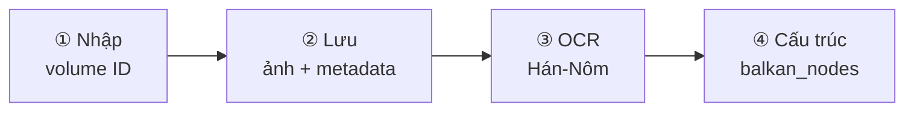

# Plan Nom Foundation — nhập · lưu · OCR · cấu trúc

> **Ngày:** 2026-07-12 (rút gọn)  
> **Pilot:** collection `2` — volume `1255` (6 trang), `1256` (30 trang), **`208` (79 trang)**  
> **URL mẫu:** [Chu tộc gia phả](https://lib.nomfoundation.org/collection/2/volume/1255/) · [Lê tộc đại tông](https://lib.nomfoundation.org/collection/2/volume/1256/) · [**Đông Trù Đoàn tộc phả**](https://lib.nomfoundation.org/collection/2/volume/208/)

---

## 1. Mục tiêu (phạm vi duy nhất)

Chỉ cần **một luồng thẳng** — không link VGP, không catalog tự động, không pipeline 7 bước phức tạp:

| # | Bước | Kết quả |
|---|------|---------|
| ① | **Nhập** | Admin nhập `collection_id` + `volume_id` (vd. `2` + `1255`) |
| ② | **Lưu** | Metadata + ảnh scan → MinIO + 1 cây gia phả mới |
| ③ | **OCR** | Kim Hán Nôm trên từng trang → text gộp |
| ④ | **Tạo cấu trúc** | `POST /api/family-tree/analyze` → `balkan_nodes[]` lưu vào cây |



---

## 2. Input

**Form đơn giản** (trang Developer hoặc 1 API):

```
collection_id: 2
volume_id:     1255   (hoặc 1256, 208)
```

**Danh sách pilot:**

| volume_id | Gia phả | Mã catalog | Series | Trang |
|-----------|---------|------------|--------|-------|
| 1255 | Chu tộc gia phả | TNVNPF-001 | Thắng Nghiêm | 6 |
| 1256 | Lê tộc đại tông gia phả | TNVNPF-002 | Thắng Nghiêm | 30 |
| **208** | **Đông Trù Đoàn tộc phả** | **NLVNPF-0155** | **NLV** | **79** |

Tùy chọn: tên cây (mặc định lấy từ metadata `title_vn`, vd. "Chu tộc gia phả").

Không cần: crawl danh sách collection, fuzzy match VGP, `research_source_links`.

---

## 3. Lưu dữ liệu

### 3.1. Crawl từ Nom (đã spike URL ảnh)

Collection `2` có **hai series** ảnh — parser **không hard-code** slug, lấy từ `img src` hoặc mã `<h2>`:

**Series TNVNPF** (Chùa Thắng Nghiêm — vol. 1255, 1256):

```
/site_media/nom/tnvnpf/tnvnpf-{NNN}/large/tnvnpf-{NNN}-{PPP}.jpg
```

- `1255` → `tnvnpf-001`, 6 trang  
- `1256` → `tnvnpf-002`, 30 trang  

**Series NLVNPF** (Thư viện Quốc gia — vol. 208):

```
/site_media/nom/nlvnpf-{NNNN}/large/nlvnpf-{NNNN}-{PPP}.jpg
```

- `208` → `nlvnpf-0155`, **79 trang** ([Đông Trù Đoàn tộc phả](https://lib.nomfoundation.org/collection/2/volume/208/))  
- Mã NLV: `NLVNPF-0155` · `R.951` · niên đại 1858 (Tự Đức 11)  
- Nội dung: gia phả họ Đoàn, thôn Hữu Châu, Tả Thanh Oai (Hà Nội)

> **Lưu ý:** `volume_id` (208) **không** trùng số catalog (0155) — luôn parse slug từ HTML.

Parse metadata từ `/collection/{c}/volume/{v}/` (`<dt>Pages</dt>`, title Hán/VN).

### 3.2. Lưu ở đâu

| Artifact | Lưu trữ |
|----------|---------|
| Metadata volume | `family_tree` record + JSON mô tả |
| Ảnh từng trang | MinIO, type `hinh_anh` (1 document hoặc N file) |
| Manifest | `documents` metadata hoặc `data/nomfoundation/volumes/{id}/manifest.json` |

### 3.3. Tạo cây gia phả

Sau crawl xong, tự tạo:

```json
{
  "name": "Chu tộc gia phả",
  "description": "Nguồn: lib.nomfoundation.org collection/2/volume/1255",
  "external_url": "https://lib.nomfoundation.org/collection/2/volume/1255/",
  "nodes": []
}
```

→ trả về `tree_id` (vd. `nom-1255` hoặc UUID) để các bước sau gắn tài liệu.

---

## 4. OCR

Dùng API **đã có**: `POST /api/documents/{document_id}/ocr-transliterate`

Luồng:

1. Với mỗi ảnh trang (hoặc document gộp): gọi OCR.
2. Gộp `ocr_text` / `transcription_text` tất cả trang → 1 file `ket_qua_van_ban`.
3. Lưu MinIO, gắn vào cùng `tree_id`.

**Lưu ý thời gian:**

| Volume | Trang | Ước lượng |
|--------|-------|-----------|
| 1255 | 6 | ~2–5 phút OCR |
| 1256 | 30 | ~15–30 phút |
| **208** | **79** | **~40–90 phút** |

Chạy tuần tự, `delay` giữa request OCR; volume 208 nên chạy background job.

---

## 5. Tạo cấu trúc

Dùng API **đã có**: `POST /api/family-tree/analyze`

```json
{
  "text": "<ocr_text gộp từ các trang>",
  "source": "nomfoundation",
  "volume_id": 1255
}
```

Response: `balkan_nodes[]` → cập nhật `family_tree.nodes_json`.

User xem sơ đồ tại `/user/family-trees/{id}` hoặc admin `/admin/gia-pha/{id}`.

---

## 6. Một API gộp (đề xuất triển khai)

Thay vì 4 thao tác rời, **một endpoint**:

`POST /api/nomfoundation/import-volume`

```json
{
  "collection_id": 2,
  "volume_id": 1255,
  "run_ocr": true,
  "run_analyze": true
}
```

Response:

```json
{
  "tree_id": "…",
  "pages_downloaded": 6,
  "ocr_document_id": "…",
  "node_count": 42,
  "errors": []
}
```

Nội bộ gọi lần lượt: crawl → attach MinIO → create tree → OCR từng trang → analyze → save nodes.

UI Developer: 1 nút **「Nhập gia phả Nom」** — 3 field + 2 checkbox OCR / Tạo cấu trúc.

---

## 7. Trạng thái code hiện tại

| Bước | Có sẵn? | Gap |
|------|---------|-----|
| ① Nhập | UI form cơ bản | OK |
| ② Lưu ảnh | `fetch_nomfoundation.py` | ❌ Parser chưa tải được ảnh col.2 (cả `tnvnpf-*` và `nlvnpf-*`) |
| ② Lưu MinIO + tree | — | ❌ Chưa wire sau crawl |
| ③ OCR | `ocr-transliterate` | ✅ Có, chưa gọi batch |
| ④ Cấu trúc | `family-tree/analyze` | ✅ Có, chưa gọi sau OCR |

**Chỉ cần implement:** sửa crawler + 1 service `import_volume` nối 4 bước.

---

## 8. Lộ trình (tối giản)

| Phase | Việc | Effort |
|-------|------|--------|
| **1** | Sửa `fetch_nomfoundation.py` — parse slug từ HTML, tải `large/` (TNVNPF + NLVNPF) | 1 ngày |
| **2** | `import_volume` service: lưu MinIO + tạo tree | 1 ngày |
| **3** | Gọi OCR batch + analyze → lưu nodes | 1 ngày |
| **4** | UI 1 nút import | 0.5 ngày |

**Tổng: ~3.5 ngày** cho luồng end-to-end.

---

## 9. Acceptance criteria

- [ ] Nhập `2` + `1255` → hệ thống có cây gia phả + 6 ảnh trong Kho tư liệu
- [ ] OCR chạy xong → có text Hán/phiên âm lưu được
- [ ] Analyze chạy xong → `balkan_nodes` không rỗng (hoặc báo lỗi rõ nếu ảnh khó đọc)
- [ ] Xem được sơ đồ trên UI user/admin
- [ ] `1256` (30 trang) chạy được cùng luồng
- [ ] **`208` (79 trang, NLVNPF) tải đủ ảnh + OCR + cấu trúc** (slug `nlvnpf-0155`, không nhầm với `tnvnpf`)

---

## 10. Ngoài phạm vi (không làm)

- Crawl catalog / list volume tự động
- Link Nom ↔ VGP
- Pipeline 7 bước UI chi tiết
- Fuzzy match tên dòng họ
- Collection 1 / NLV (vol.429) — spike sau nếu cần

---

## 11. Test nhanh (sau implement)

```bash
# Pilot nhỏ (6 trang)
curl -X POST …/api/nomfoundation/import-volume \
  -d '{"collection_id":2,"volume_id":1255,"run_ocr":true,"run_analyze":true}'

# Pilot lớn — NLV, 79 trang (nên async / background)
curl -X POST …/api/nomfoundation/import-volume \
  -d '{"collection_id":2,"volume_id":208,"run_ocr":true,"run_analyze":true}'

# Kiểm tra
# → GET /api/family-trees/{tree_id}  (có nodes)
# → GET documents của tree          (có hinh_anh + ket_qua_van_ban)
# → volume 208: 79 file nlvnpf-0155-*.jpg
```
