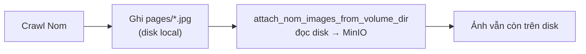
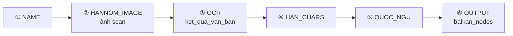
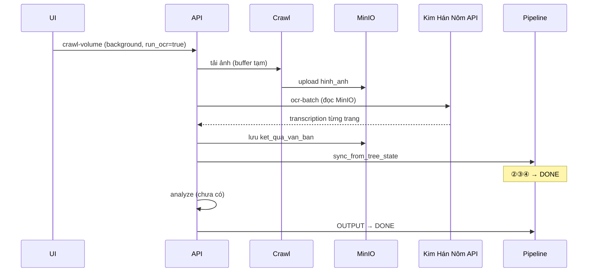

# Nom Foundation — gap: lưu trữ ảnh, OCR pipeline, metadata

> **Ngày:** 2026-07-12  
> **Liên quan:** `planning/nomfoundation_crawl_plan.md`  
> **Pilot thực tế:** volume `855` (Nguyễn tộc gia phả, 101 trang, chunk 11–20 đã crawl)

---

## Tóm tắt

Luồng crawl Nom Foundation **đã có** parser, upload MinIO, job nền, OCR từ MinIO — nhưng còn **3 gap** chặn pipeline end-to-end:

| # | Vấn đề | Trạng thái hiện tại | Hậu quả |
|---|--------|---------------------|---------|
| 1 | Ảnh lưu vĩnh viễn trên disk local | `data/nomfoundation/volumes/{id}/pages/*.jpg` | Tốn disk, trùng với MinIO, khó deploy |
| 2 | OCR / pipeline Hán-Nôm chưa chạy được end-to-end | API có, nhưng không tự kích hoạt đủ | Step ②③ pipeline treo ở `PENDING` |
| 3 | `metadata.json` chưa được “đọc hiểu” | Dump nguyên JSON vào document | Mất mô tả, niên đại, địa phương trên UI |

---

## 1. Không lưu hình ảnh local — chỉ buffer tạm rồi xóa

### 1.1. Hiện trạng

`tools/fetch_nomfoundation.py` ghi ảnh **vĩnh viễn** vào:

```
nlp_family_extractor/data/nomfoundation/
  volumes/{volume_id}/
    metadata.json      ← giữ lại (OK)
    manifest.json      ← giữ lại (OK)
    pages/
      001.jpg          ← KHÔNG nên giữ lâu dài
      002.jpg
      ...
```

Luồng import (`import_service.py`):



`attach_nom_images_from_volume_dir` (`sync_nomfoundation_documents.py`) **đọc file từ `pages_dir`** rồi upload MinIO — không xóa sau khi xong.

**Ví dụ thực tế:** volume `855` chunk 11–20 → 10 file `.jpg` trong `data/nomfoundation/volumes/855/pages/` dù đã có thể upload MinIO.

### 1.2. Yêu cầu mới

- Ảnh scan: **chỉ buffer tạm** (memory hoặc `tempfile`) trong lúc crawl → upload MinIO.
- Sau attach thành công: **xóa** file ảnh tạm; không tích lũy `pages/`.
- Giữ lại trên disk (nhẹ):
  - `metadata.json` — metadata volume (merge theo chunk)
  - `manifest.json` — log crawl (trang, URL, sha256, skipped)
  - `jobs/{job_id}.json` — trạng thái job nền
- `attach_only` vẫn hoạt động nếu còn ảnh tạm chưa upload (edge case).

### 1.3. Đề xuất triển khai

**Phương án A (ưu tiên): stream in-memory**

```python
# fetch: không ghi pages_dir, trả về List[Tuple[page, bytes, url]]
crawl_result = crawl_pages_in_memory(...)

# attach: nhận bytes trực tiếp
attach_nom_images_from_bytes(service, images=crawl_result)

# không có bước xóa — không ghi disk
```

**Phương án B: tempfile + cleanup**

```python
with tempfile.TemporaryDirectory() as tmp:
    crawl_to_dir(tmp)
    attach_nom_images_from_volume_dir(pages_dir=Path(tmp))
# tmp tự xóa khi thoát context
```

**Phương án C (tối thiểu): giữ crawl hiện tại + cleanup sau attach**

```python
attach_nom_images_from_volume_dir(...)
shutil.rmtree(pages_dir, ignore_errors=True)  # chỉ xóa pages/, giữ metadata
```

| Phương án | Effort | Rủi ro |
|-----------|--------|--------|
| A — in-memory | ~1 ngày (refactor crawl + attach) | Volume 101 trang × ~2–5 MB → cần stream từng trang, không gom hết RAM |
| B — tempfile | ~0.5 ngày | An toàn, ít đổi interface |
| C — cleanup | ~2 giờ | Vẫn ghi disk tạm trong lúc crawl |

**Khuyến nghị:** B cho ngắn hạn; A cho dài hạn nếu volume lớn (208, 855).

### 1.4. Acceptance

- [ ] Sau `import_nom_volume` thành công, `volumes/{id}/pages/` **trống hoặc không tồn tại**
- [ ] Ảnh chỉ còn trên MinIO + bảng `document_files`
- [ ] Chunk crawl (page 11–20) vẫn merge manifest/metadata đúng

---

## 2. OCR tài liệu Hán-Nôm — phân tích & trạng thái triển khai

> **Cập nhật:** 2026-07-12 — đã implement các fix chính (xem mục 2.7).

### 2.1. Pipeline genealogy — các bước liên quan



Logic đồng bộ: `PipelineService.sync_from_tree_state()` (`app/pipeline/service.py`):

| Step | Điều kiện `DONE` | Nom Foundation hiện tại |
|------|------------------|-------------------------|
| `HANNOM_IMAGE` | Có document `han_nom` **hoặc** `hinh_anh` | ✅ Sau attach → document `hinh_anh` subtype `nomfoundation` |
| `OCR` | Có document `ket_qua_van_ban` | ❌ Chỉ khi đã gọi OCR |
| `HAN_CHARS` | Có `ket_qua_van_ban` | ❌ Phụ thuộc OCR |
| `QUOC_NGU` | Có `van_ban` hoặc kết quả OCR | ❌ Phụ thuộc OCR |
| `OUTPUT` | `nodes_json` không rỗng | ❌ Chưa gọi analyze |

### 2.2. Tại sao OCR “không chạy được”?

#### Nguyên nhân A — OCR không tự bật (mặc định tắt)

`POST /api/nomfoundation/crawl-volume`:

```python
run_ocr: bool = Field(default=False)  # api.py
```

UI crawl mặc định **không** tick “OCR batch sau attach”. Sau import chỉ có ảnh → pipeline step ② `DONE`, step ③ `PENDING`.

#### Nguyên nhân B — Token Kim Hán Nôm

OCR gọi `process_hannom_image_to_vietnamese()` → cần `HANNOM_API_TOKEN`:

```
HANNOM_API_TOKEN chưa được cấu hình.
Gọi POST /api/developer/hannom/fetch-token hoặc thiết lập biến môi trường.
```

Không có token → OCR fail từng trang, pipeline không advance.

#### Nguyên nhân C — Luồng OCR cũ (đã sửa một phần)

| Cách | Vấn đề |
|------|--------|
| `POST .../ocr-transliterate` | Bắt **multipart upload** lại ảnh — UI phải fetch presigned URL → re-upload, dễ timeout/CORS |
| **Mới:** `ocr-stored-file`, `ocr-batch` | Đọc trực tiếp từ MinIO — **đúng hướng**, nhưng UI/backend cần rebuild deploy |

#### Nguyên nhân D — `sync_pipeline` chạy **sau** OCR nhưng chỉ khi `run_ocr=true`

Trong `import_nom_volume`:

```
attach → (nếu run_ocr) ocr_batch → sync_pipeline
```

Nếu OCR chạy **thủ công sau** (từ DocumentOcrPanel), pipeline **không tự re-sync** — step ③ vẫn `PENDING` cho đến khi gọi lại `sync_from_tree_state`.

#### Nguyên nhân E — Kết quả OCR lưu theo từng trang, chưa gộp cho analyze

`ocr_transliterate_batch` tạo **một** document `ket_qua_van_ban` với nhiều file `{page}_transcription.txt`. Pipeline step `OCR` chỉ cần **có** document → OK.

Nhưng bước ④ **analyze** (`POST /api/family-tree/analyze`) **chưa được wire** sau OCR — không có text gộp → không có `balkan_nodes`.

#### Nguyên nhân F — Volume lớn + timeout

Volume `855` (101 trang), `208` (79 trang): OCR tuần tự ~1–2 phút/trang → HTTP sync timeout. Cần `background: true` + `run_ocr: true` hoặc OCR batch riêng sau từng chunk.

### 2.3. Sơ đồ luồng đúng (mục tiêu)



### 2.4. Checklist khắc phục OCR + pipeline

| # | Việc | File / API |
|---|------|------------|
| 1 | Cấu hình `HANNOM_API_TOKEN` | Developer → Hán-Nôm Config |
| 2 | Deploy API `ocr-stored-file`, `ocr-batch` | `app/documents/router.py` |
| 3 | Mặc định hoặc nhắc bật `run_ocr` sau crawl | `NomFoundationCrawlPage.tsx`, `api.py` |
| 4 | Sau OCR thủ công → gọi `sync_pipeline` | `DocumentOcrPanel` hoặc hook post-OCR |
| 5 | Gộp `combined_transcription_text` → document `van_ban` hoặc analyze | `repository.py` / `import_service.py` |
| 6 | Wire `POST /api/family-tree/analyze` sau OCR | `import_service.py` flag `run_analyze` |
| 7 | Volume lớn: chunk + job nền | `page_start/end`, `background` (đã có) |

### 2.5. Cách test nhanh (sau fix token + deploy)

```bash
# 1. Chunk nhỏ + OCR
curl -X POST .../api/nomfoundation/crawl-volume -d '{
  "collection_id": 2, "volume_id": 1255,
  "page_start": 1, "page_end": 6,
  "save_to_system": true, "run_ocr": true
}'

# 2. Hoặc OCR riêng sau khi đã có ảnh
curl -X POST .../api/documents/{images_doc_id}/ocr-batch -d '{"skip_existing": true}'

# 3. Kiểm tra pipeline
curl .../api/family-trees/{tree_id}/pipeline
# → hannom_image: DONE, ocr: DONE
```

### 2.7. Đã triển khai (2026-07-12)

| Gap | Fix |
|-----|-----|
| `run_ocr` mặc định tắt | API + UI mặc định `run_ocr: true` |
| OCR thủ công không sync pipeline | `post_ocr_hooks()` sau `ocr-stored-file` và `ocr-batch` |
| Chưa ghép trang | `rebuild_merged_transcription()` → `combined_transcription.txt` (tất cả trang đã OCR, theo thứ tự ảnh) |
| Chunk crawl OCR nhầm toàn volume | `import_nom_volume` chỉ OCR `file_names` vừa upload trong chunk |
| Analyze chưa wire | `run_analyze` trên crawl → `analyze_family_tree_from_merged_ocr()` → `balkan_nodes` |
| Volume lớn | `page_start/end` + `background` + OCR/ghép incremental |

**Luồng chunk volume 855 (101 trang):**

```
chunk 1–10:  crawl + attach + OCR 10 trang → ghép 10
chunk 11–20: crawl + attach + OCR 10 trang → ghép 20 (cumulative)
...
chunk 91–101: ghép đủ 101 trang → run_analyze (một lần)
```

**API OCR từng trang:**

```json
POST /api/documents/{id}/ocr-batch
{ "file_ids": [123], "skip_existing": true, "merge_pages": true, "sync_pipeline": true }
```

**File code:** `app/nomfoundation/ocr_pipeline.py`, `app/documents/repository.py` (`rebuild_merged_transcription`)

### 2.8. Còn lại

- [ ] Cần `HANNOM_API_TOKEN` — không tự fix được bằng code
- [ ] `run_analyze` cần Gemini API — báo lỗi qua `analyze_error`
- [ ] Analyze incremental (sau mỗi chunk) — chưa, chỉ nên chạy khi `merged_page_count` đủ

---

## 3. `metadata.json` — cần xử lý và lưu thông tin có cấu trúc

### 3.1. Dữ liệu Nom đang parse được

Ví dụ volume `855` (`data/nomfoundation/volumes/855/metadata.json`):

```json
{
  "title_han": "阮族家譜",
  "title_vn": "Nguyễn tộc gia phả",
  "catalog_code": "NLVNPF-0686",
  "local_code": "R.217",
  "page_count": 101,
  "fields": {
    "Creator": "阮文理 Nguyễn Văn Lý",
    "Source": "National Library of Vietnam/ Thư viện Quốc gia Việt Nam",
    "Place": "河内 • Hà Nội",
    "Date": "保大七年 • 1932",
    "Description": "Gia phả họ Nguyễn (dòng họ Nguyễn Trù...) ở làng Trung Tự...",
    "Language": "Hán script/ Hán",
    "Type": "Văn bản/ Text",
    "Size": "30 x 16cm",
    "Pages": "101",
    "Condition": "Bình thường/ Fair",
    "Print type": "Handwritten text/ Viết tay",
    "Imaging date": "24/03/2009"
  }
}
```

Parser: `parse_volume_metadata()` + `_parse_definition_list()` trong `fetch_nomfoundation.py` — **đã lấy đủ field**.

### 3.2. Hiện tại lưu ở đâu?

| Nơi lưu | Nội dung thực tế | Vấn đề |
|---------|------------------|--------|
| `family_tree.description` | `"Nguồn Nom Foundation — collection 2, volume 855. NLVNPF-0686"` | **Mất** mô tả dài, địa điểm, niên đại |
| `family_tree.name` | `title_vn` | OK |
| `research_source_links.metadata_json` | Chỉ `{collection_id, volume_id, page_count}` | **Mất** toàn bộ `fields` |
| Document `han_nom` | File `metadata.json` dump nguyên | Có dữ liệu nhưng **không hiển thị** trên UI cây / reader |
| Pipeline step `NAME` | `tree.name` | Không có place/date |

### 3.3. Mapping đề xuất: Nom `fields` → hệ thống

| Nom field | Lưu vào | Ghi chú |
|-----------|--------|---------|
| `title_vn` / `title_han` | `family_tree.name` (+ subtitle han nếu cần) | Đã có |
| `Description` | `family_tree.description` (đoạn đầu) + `research_source_links.metadata_json.summary` | Cắt ~2000 ký tự nếu quá dài |
| `Place` | `metadata_json.place` | VD: "河内 • Hà Nội" |
| `Date` | `metadata_json.date` / `period` | VD: "保大七年 • 1932" |
| `Creator` | `metadata_json.creator` | |
| `Source` | `metadata_json.source` | Thư viện QG |
| `catalog_code`, `local_code` | `metadata_json.catalog_code`, `local_code` | |
| `Language`, `Type`, `Size`, `Condition`, `Print type` | `metadata_json.technical` | Nhóm phụ |
| `Imaging date` | `metadata_json.imaging_date` | |
| `url` | `family_tree.external_url` + `research_source_links.external_url` | Đã có |

**Ví dụ `research_source_links.metadata_json` sau xử lý:**

```json
{
  "collection_id": 2,
  "volume_id": 855,
  "catalog_code": "NLVNPF-0686",
  "local_code": "R.217",
  "page_count": 101,
  "place": "河内 • Hà Nội",
  "date": "保大七年 • 1932",
  "creator": "阮文理 Nguyễn Văn Lý",
  "source": "National Library of Vietnam/ Thư viện Quốc gia Việt Nam",
  "summary": "Gia phả họ Nguyễn (dòng họ Nguyễn Trù...) ở làng Trung Tự...",
  "language": "Hán script/ Hán",
  "imaging_date": "24/03/2009"
}
```

### 3.4. `family_tree.description` — format đề xuất

```
Nguyễn tộc gia phả — Nguồn Nom Foundation (NLVNPF-0686, R.217)
Địa điểm: 河内 • Hà Nội | Niên đại: 保大七年 • 1932
Tác giả: 阮文理 Nguyễn Văn Lý

Gia phả họ Nguyễn (dòng họ Nguyễn Trù...) ở làng Trung Tự nay là phường Trung Tự...
```

### 3.5. Triển khai đề xuất

**Hàm mới:** `app/nomfoundation/metadata_mapper.py`

```python
def map_nom_metadata_to_tree_fields(metadata: dict) -> dict:
    fields = metadata.get("fields") or {}
    return {
        "name": metadata.get("title_vn") or metadata.get("title"),
        "description": build_tree_description(metadata),
        "external_url": metadata.get("url"),
        "source_metadata": {
            "place": fields.get("Place"),
            "date": fields.get("Date"),
            "creator": fields.get("Creator"),
            "summary": fields.get("Description"),
            # ...
        },
    }
```

**Gọi tại:**

- `upsert_nom_family_tree()` — description phong phú hơn
- `_upsert_nom_research_source_link()` — `metadata_json` đầy đủ
- (Tuỳ chọn) document `han_nom` → thêm file `metadata_summary.txt` dễ đọc cho user

**UI (sau):**

- Trang admin cây gia phả: hiển thị Place, Date, Creator từ `research_source_links`
- Document reader: tab “Thông tin nguồn”

### 3.6. Acceptance

- [ ] Import volume `855` → `family_tree.description` có địa điểm + niên đại + tóm tắt
- [ ] `research_source_links.metadata_json` chứa `place`, `date`, `creator`, `summary`
- [ ] Document `metadata.json` vẫn lưu backup đầy đủ trên MinIO
- [ ] UI (hoặc API GET tree) expose được các field trên

---

## 4. Lộ trình ưu tiên

| Phase | Nội dung | Effort |
|-------|----------|--------|
| **P0** | Cleanup ảnh local sau attach (phương án C) | 2–4 giờ |
| **P0** | Token Hán-Nôm + test OCR batch volume 1255 | 2 giờ |
| **P1** | `metadata_mapper` + cập nhật tree + research_source_links | 0.5 ngày |
| **P1** | tempfile crawl (phương án B) | 0.5 ngày |
| **P2** | Re-sync pipeline sau OCR thủ công | 2 giờ |
| **P2** | `run_analyze` sau OCR → `balkan_nodes` | 1 ngày |
| **P3** | UI hiển thị metadata nguồn trên trang cây | 0.5 ngày |

---

## 5. File code liên quan

| File | Vai trò |
|------|---------|
| `tools/fetch_nomfoundation.py` | Crawl + ghi `pages/` local |
| `tools/sync_nomfoundation_documents.py` | Attach ảnh + dump metadata.json |
| `app/nomfoundation/import_service.py` | Orchestrate crawl → attach → OCR → pipeline |
| `app/documents/repository.py` | OCR từ MinIO, batch |
| `app/pipeline/service.py` | `sync_from_tree_state` — đánh dấu step DONE |
| `api.py` | `_upsert_nom_research_source_link` — metadata_json tối thiểu |
| `family-saga-io/.../NomFoundationCrawlPage.tsx` | UI crawl |
| `family-saga-io/.../DocumentOcrPanel.tsx` | OCR thủ công |

---

## 6. Ghi chú ngoài phạm vi file này

- Crawl catalog tự động, link Nom ↔ VGP
- Chuẩn hóa niên đại Hán → ISO date (cần NLP/rule riêng)
- OCR song song (parallel) — hiện tuần tự để tránh rate limit Kim Hán Nôm
