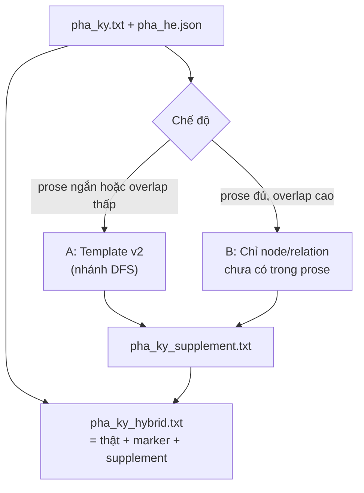

# Plan — Synthetic Phả ký v2 (Template A + Hybrid B)

> **Ngày:** 2026-08-10 · **Trạng thái:** Approved — đang implement  
> **Bối cảnh:** Review corpus 25 cây — synthetic v1 quá máy, không tự nhiên.

---

## 1. Mục tiêu

| Mục tiêu | Không làm |
|----------|-----------|
| Prose **đọc được hơn** (template v2) | Không ghi đè `pha_ky.txt` |
| **Bổ sung** quan hệ/tên thiếu từ sơ đồ | Không thay gold human trên prose thật |
| Viewer: trái = thật, phải = hybrid | Không sinh full wall-of-text khi prose đã đủ |

---

## 2. Kiến trúc A + B



### Output files (mỗi cây)

| File | Nội dung |
|------|----------|
| `pha_ky.txt` | Prose thật — **immutable** |
| `pha_ky_supplement.txt` | Chỉ phần sinh từ sơ đồ (v2) |
| `pha_ky_hybrid.txt` | Thật + `---` + supplement (đọc liền mạch) |
| `pha_ky_synthetic.txt` | Deprecated alias → copy supplement (compat) |

---

## 3. Template v2 (Hướng A)

### 3.1. Chuẩn hóa tên

- Bóc danh xưng có sẵn (`Ông cố`, `Bà`, …) — **không** thêm lại → hết `Ông Ông`.
- Suy giới: `Thị` → nữ; prefix `Bà`/`Ông` từ label sơ đồ.
- Tách vợ/chồng từ `name + spouse`; spouse là `Ông` thì không gọi `bà`.

### 3.2. Cấu trúc văn bản

- Duyệt **theo nhánh** (parent → children), không liệt kê phẳng theo `order_in_generation` sơ đồ.
- Một đoạn / một gia đình: *「X có N con: …」* rồi chi tiết từng con nếu cần.
- **Bỏ** block lặp *「Quan hệ cha/mẹ — con:」* ở cuối.
- Luân phiên mẫu câu (`hạ sinh`, `sinh được`, `là con … của`, `lấy vợ` / `hôn phối với`).

### 3.3. Giới hạn độ dài

- Cap ~80 câu supplement / cây (tránh wall 500 node).
- Ưu tiên: thiếu tên → thiếu quan hệ cha-con → vợ/chồng.

---

## 4. Hybrid B

### 4.1. Phát hiện “đã có trong prose”

Tái dùng `cross_check.normalize_person_name` + fuzzy substring trong `pha_ky.txt`.

### 4.2. Chọn chế độ (auto)

| Điều kiện | Chế độ |
|-----------|--------|
| `len(pha_ky) < 200` | **full** — sinh nhánh cho node chưa trong prose |
| `overlap_ratio ≥ 0.45` | **supplement** — chỉ phần thiếu |
| else | **full** (overlap thấp — prose không khớp sơ đồ) |

### 4.3. Hybrid file

```text
{pha_ky.txt nguyên văn}

---
(Bổ sung từ sơ đồ — chưa có trong phả ký thật)

{pha_ky_supplement.txt}
```

Nếu supplement rỗng → hybrid = chỉ prose thật (không thêm marker).

---

## 5. Viewer & CLI

- `compare.html`: trái `pha_ky.txt`, phải `pha_ky_hybrid.txt`.
- `generate_synthetic.py --pilot-file …` → ghi supplement + hybrid.
- Metadata: `generation_mode`, `supplement_char_count`, `missing_name_count`.

---

## 6. Pilot & đánh giá

1. Regenerate 25 cây stratified.
2. So thủ công 3 cây: **122** (prose dày), **321** (prose mỏng), **544** (test S4).
3. Tiêu chí: không double honorific; giới đúng hơn; supplement ngắn với cây S1.

---

## 7. Gold / luận văn

- Supplement = **silver** (`source: synthetic_supplement_v2`).
- Stratified gold human vẫn annotate **prose thật** only.
- Báo cáo: ghi rõ v2 không thay v1 trong LS project cũ.
