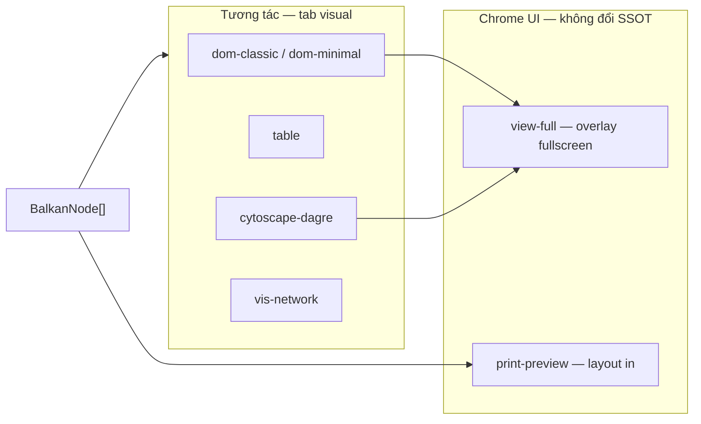
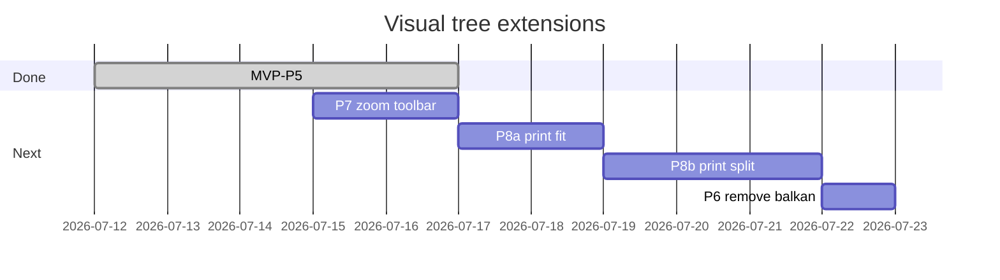

# Task — Thử nhiều kiểu sơ đồ (free-only, đơn giản)

> **URL mẫu:** `http://localhost:5174/admin/gia-pha/vgp-122?tab=visual`  
> **Ngày:** 2026-07-12 (cập nhật: gap zoom + in fit/chia phần)  
> **Ràng buộc:** Chỉ renderer **miễn phí / tự code** — **không** Balkan, không license.

---

## Mục lục

1. [Trả lời nhanh](#1-trả-lời-nhanh)
2. [Hiện trạng & gap](#2-hiện-trạng--gap)
3. [Catalog renderer](#3-catalog-renderer)
4. [View-full](#4-view-full)
5. [Zoom in/out (P7)](#5-zoom-inout-p7)
6. [Style & thư viện render khác](#6-style--thư-viện-render-khác)
7. [Print-preview & Print PDF](#7-print-preview--print-pdf)
8. [In fit & chia phần (P8)](#8-in-fit--chia-phần-p8)
9. [Luồng dữ liệu](#9-luồng-dữ-liệu)
10. [UI toolbar](#10-ui-toolbar)
11. [Lộ trình triển khai](#11-lộ-trình-triển-khai)
12. [Acceptance criteria](#12-acceptance-criteria)
13. [File liên quan](#13-file-liên-quan)

---

## 1. Trả lời nhanh

**Có — chọn kiểu sơ đồ từ dropdown, cùng `nodes_json` (SSOT), chỉ đổi cách vẽ.**

| Bạn chọn | Thấy gì | Zoom? |
|----------|---------|-------|
| Cây thẻ | Thẻ từng người, nối theo đời (DOM) | ❌ chỉ scroll — **chưa** zoom |
| Bảng | Danh sách sort/filter | N/A |
| Graph | Zoom/pan — Cytoscape | ✅ wheel + pinch (lib) |
| Xem toàn màn | Canvas full viewport | DOM: scroll; graph: zoom |
| In ấn | Layout A4 → Print PDF | ❌ **chưa** chọn fit / chia phần |

**SSOT** = `BalkanNode[]` trong DB — **không** là lựa chọn dropdown. Tên schema cũ, không cần thư viện Balkan Graph.

**Balkan Graph** = renderer trial/license → **không** đưa vào catalog.

---

## 2. Hiện trạng & gap

> Phản hồi sau khi dùng thử P1–P5 (2026-07-12).

### 2.1. Gap — zoom

| Renderer | Hiện tại | Thiếu |
|----------|----------|-------|
| `dom-classic` | `overflow-x-auto` scroll ngang/dọc | Không có nút **+/−**, không pinch, không slider % |
| `table` | Pagination Ant Design | Không cần zoom canvas |
| `cytoscape-dagre` | Wheel zoom trong canvas Cytoscape | Chưa có nút toolbar **Fit / 100% / +/−** (chỉ wheel) |
| `view-full` | Phóng viewport modal | DOM vẫn chỉ scroll — **không** scale nội dung |

**Kỳ vọng user:** mọi kiểu sơ đồ “nhìn như ảnh” (cây thẻ, graph) đều zoom được khi cây rộng / nhiều đời.

### 2.2. Gap — in ấn

| Hiện tại | Thiếu |
|----------|-------|
| `print-preview` + `window.print()` một khối | Không chọn **fit to page** vs **kích thước thật** |
| In cả cây một lần | Không **chia theo đời / nhánh / trang** khi cây quá rộng |
| Một layout A4 | Không preview **số trang** trước khi in |

**Kỳ vọng user:** in được sơ đồ lớn — hoặc thu nhỏ vừa 1 trang, hoặc cắt thành nhiều trang có nhãn (Đời 1–3, Đời 4–6…).

### 2.3. Phase xử lý gap

| Phase | Nội dung |
|-------|----------|
| **P7** | Zoom controls — DOM + toolbar chung + Cytoscape fit |
| **P8** | Print fit mode + chia phần / multi-page preview |

---

## 3. Catalog renderer

### 3.1. Đã có (MVP ✅)

| `rendererId` | Nhãn UI | Component | License | Status |
|--------------|---------|-----------|---------|--------|
| `dom-classic` | Cây thẻ | `FamilyTreeDomView` | Free | ✅ admin |
| `table` | Bảng thành viên | `FamilyTreeMembersTable` | MIT | ✅ admin |

**Mặc định:** `dom-classic` · **Lưu:** `localStorage` `ft.visual.v1`

### 3.2. Mở rộng — đã triển khai P1–P5

| `rendererId` | Nhãn UI | Component / lib | License | Phase |
|--------------|---------|-----------------|---------|-------|
| `view-full` | Xem toàn màn | `FamilyTreeFullScreenView` | Free | **P1** |
| `cytoscape-dagre` | Graph Cytoscape | `FamilyTreeCytoscapeView` + `cytoscape` + `dagre` | MIT | **P2** |
| `vis-network` | Graph vis | `FamilyTreeVisView` + `vis-network` | Apache-2.0 | **P2** (alt) |
| `dom-minimal` | Cây thẻ tối giản | `FamilyTreeDomView` + `themeId: minimal` | Free | **P3** |
| `print-preview` | Xem trước in | `FamilyTreePrintPreview` | Free | **P4** |

### 3.3. Không có trong catalog

| Id | Lý do |
|----|-------|
| `balkan-hugo`, `balkan-ana` | Trial / license trả phí |
| Balkan export PNG/PDF | Server bên thứ ba |

### 3.4. Phân loại catalog



- **Renderer** (`rendererId`) = cách vẽ chính trong panel.
- **view-full** = chế độ hiển thị *trên* renderer đang chọn (DOM/graph), không thay dữ liệu.
- **print-preview** = renderer riêng — layout tối ưu `@media print`.

---

## 4. View-full

### 4.1. Mục tiêu

Xem sơ đồ **phóng to toàn màn hình** — bỏ sidebar, tab chrome; tiện cây lớn / trình chiếu.

### 4.2. UX đề xuất

```
Tab visual (bình thường)
  [ Kiểu sơ đồ ▼ ]  [ ⛶ Xem toàn màn ]  [ 🖨 In ]
        ↓ click「Xem toàn màn」
┌──────────────────────────────────────────────┐
│ ✕ Thoát          Cây thẻ · 74 thành viên      │
├──────────────────────────────────────────────┤
│                                              │
│     [ renderer hiện tại — full viewport ]     │
│     scroll ngang / zoom nếu graph             │
│                                              │
└──────────────────────────────────────────────┘
```

### 4.3. Kỹ thuật (free)

| Cách | Mô tả | Ưu tiên |
|------|-------|---------|
| **Ant Design `Modal` fullscreen** | `width="100vw"`, `styles.body` full height | ✅ P1 |
| Browser Fullscreen API | `element.requestFullscreen()` | optional |
| Route riêng `/gia-pha/:id/full` | Share link | P5 backlog |

**Component:** `FamilyTreeFullScreenView.tsx`

```typescript
type Props = {
  open: boolean;
  onClose: () => void;
  rendererId: RendererId;
  nodes: BalkanNode[];
  members: FamilyMember[];
};
// Re-use FamilyTreeDomView / Cytoscape bên trong — không duplicate layout logic
```

### 4.4. Hỗ trợ theo renderer

| Renderer trong full | Hành vi |
|---------------------|---------|
| `dom-classic`, `dom-minimal` | `overflow-x-auto`, padding rộng |
| `cytoscape-dagre`, `vis-network` | fit graph + zoom |
| `table` | Table full width, sticky header |
| `print-preview` | Không cần full — đã là layout in |

> **Lưu ý:** View-full **không thay** zoom — DOM trong full vẫn chỉ scroll (xem §5).

---

## 5. Zoom in/out (P7)

### 5.1. Mục tiêu

Mọi kiểu sơ đồ dạng canvas (cây thẻ, graph) có **zoom in / zoom out / fit / 100%** — không chỉ scroll hoặc wheel ẩn.

### 5.2. UX toolbar (đề xuất)

```
[ − ] [ 75% ▼ ] [ + ] [ Fit ] [ 100% ]
```

| Nút | Hành vi |
|-----|---------|
| **− / +** | Giảm/tăng scale 10% (min 25%, max 200%) |
| **% dropdown** | 50% · 75% · 100% · 125% · 150% |
| **Fit** | Thu cả cây vừa khung nhìn |
| **100%** | Reset scale + scroll về gốc |

Hiện khi `rendererId` ∈ `dom-classic`, `cytoscape-dagre` (và sau này `vis-network`). **Ẩn** với `table`, `print-preview`.

### 5.3. Kỹ thuật theo renderer (free)

| Renderer | Cách zoom | Ghi chú |
|----------|-----------|---------|
| **dom-classic** | Wrapper `transform: scale(zoom)` + `transform-origin: top center`; container `overflow: auto` | `FamilyTreeZoomViewport.tsx` bọc `FamilyTreeDomView` |
| **cytoscape-dagre** | `cy.zoom()`, `cy.fit()`, `cy.reset()` | Nút toolbar gọi API Cytoscape; đồng bộ % hiển thị |
| **view-full** | Dùng chung zoom toolbar trong modal | Không implement zoom riêng |

```typescript
// useFamilyTreeZoom.ts
export type ZoomState = { scale: number }; // 0.25 – 2.0

// FamilyTreeZoomToolbar.tsx — renderer-agnostic UI
// FamilyTreeZoomViewport.tsx — CSS scale cho DOM
```

### 5.4. Lưu preference (optional)

- `localStorage` `ft.visual.v1` thêm `zoomScale?: number` — chỉ nhớ khi user đổi (không bắt buộc P7).

### 5.5. Không dùng

- Thư viện pan-zoom trả phí
- Zoom bằng cách đổi font-size node (khó giữ layout connector)

---

## 6. Style & thư viện render khác

### 6.1. Hai lớp: renderer vs theme

| Lớp | Field | Ví dụ | Đổi gì |
|-----|-------|-------|--------|
| **Renderer** | `rendererId` | `dom-classic`, `cytoscape-dagre` | Component / thư viện |
| **Theme** | `themeId` | `default`, `minimal`, `print-a4` | CSS class, không fork component |

```typescript
export type FamilyTreeVisualSettings = {
  rendererId: RendererId;
  themeId?: "default" | "minimal" | "print-a4";
};
```

### 6.2. DOM — nhiều style (cùng component)

| `themeId` | Mô tả | File |
|-----------|-------|------|
| `default` | Vàng/đỏ, card cổ điển | `index.css` `.tree-node-card` |
| `minimal` | Viền mỏng, nền trắng, ít màu | `family-tree-themes.css` |
| `print-a4` | Font serif, đen trắng, không shadow | dùng trong print-preview |

Dropdown thứ hai **「Kiểu giao diện」** — chỉ hiện khi `rendererId` là `dom-classic` hoặc `dom-minimal`.

### 6.3. Graph OSS — thư viện render khác

| Lib | `rendererId` | Layout | Ghi chú |
|-----|--------------|--------|---------|
| **Cytoscape.js** | `cytoscape-dagre` | `dagre` hierarchical | Ưu tiên P2 |
| **vis-network** | `vis-network` | physics / hierarchical | Alternative nếu Cytoscape không ổn |
| react-d3-tree | backlog | tree vertical | Chỉ khi cần SVG đơn giản |

**Input chung:** `BalkanNode[]` → helper `toGraphElements(nodes)` trả `{ nodes, edges }`.

```typescript
// familyTreeGraphAdapter.ts — shared cho cytoscape & vis
export function balkanNodesToGraph(nodes: BalkanNode[]): {
  nodes: GraphNode[];
  edges: GraphEdge[];
} { /* fid/mid/pids → edges */ }
```

### 6.4. So sánh nhanh (để thử)

| Tiêu chí | DOM | Cytoscape | vis-network |
|----------|-----|-----------|-------------|
| Cây lớn ~100 node | Scroll ngang | Zoom/pan (wheel) | Zoom/pan |
| Zoom toolbar +/−/Fit | ❌ chưa (P7) | ⚠️ wheel only (P7 nút) | ⬜ |
| In ấn | Tốt | Trung bình | Trung bình |
| Bundle size | Nhỏ | ~300KB | ~200KB |
| License | Free | MIT | Apache-2.0 |

---

## 7. Print-preview & Print PDF

### 7.1. Mục tiêu

Xem trước sơ đồ **định dạng in A4** → **Print → Save as PDF** qua browser (free, không server PDF).

### 7.2. UX (hiện tại — thiếu fit/chia phần)

```
[ Kiểu sơ đồ: Xem trước in ▼ ]     [ In PDF ]
        ↓
┌─────────────────────────────────────┐
│  HỌ NGUYỄN — Gia phả (74 thành viên) │  ← header in
│  ───────────────────────────────────  │
│  [ cây DOM compact hoặc bảng đời ]   │
│  ───────────────────────────────────  │
│  In ngày: ... · Nguồn: SSOT          │  ← footer
└─────────────────────────────────────┘
```

Nút **「In PDF」** gọi `window.print()` — user chọn "Save as PDF" trong dialog in.

> **Gap:** Chưa có tùy chọn **fit 1 trang** hay **chia nhiều phần** — xem §8.

### 7.3. Kỹ thuật (free-only)

| Thành phần | Cách làm |
|------------|----------|
| Layout in | `FamilyTreePrintPreview.tsx` + `@media print` CSS |
| Ẩn chrome | `.no-print { display: none }` trên toolbar, sidebar |
| Font / margin A4 | `@page { size: A4; margin: 12mm }` |
| Nội dung | Ưu tiên `dom-classic` + `themeId: print-a4` hoặc bảng theo đời |
| Server PDF | **Không** — không WeasyPrint/headless Chrome ở P4 |

```css
/* family-tree-print.css */
@media print {
  .family-tree-print-root {
    width: 100%;
    color: #000;
    background: #fff;
  }
  .no-print { display: none !important; }
}
```

### 7.4. Component

```
FamilyTreePrintPreview.tsx
  ├── header: tên cây, số thành viên, ngày in
  ├── body: FamilyTreeDomView (compact) hoặc table grouped by generation
  └── footer: disclaimer / nguồn SSOT

usePrintFamilyTree.ts
  └── window.print() + optional beforeprint class on <body>
```

### 7.5. Không dùng

- Balkan `exportPDF` / `balkan.app/export`
- Cloud PDF API trả phí

---

## 8. In fit & chia phần (P8)

### 8.1. Mục tiêu

Khi in sơ đồ lớn, user chọn **cách xếp trên giấy** — không bị cắt mù hoặc chữ quá nhỏ không đọc được.

### 8.2. Chế độ in (dropdown trước khi In)

| `printMode` | Nhãn UI | Mô tả |
|-------------|---------|-------|
| `natural` | Kích thước thật | 100% layout preview; browser tự ngắt trang (hiện tại) |
| `fit-page` | Vừa 1 trang A4 | Scale toàn cây fit width+height 1 trang ngang hoặc dọc |
| `fit-width` | Vừa chiều ngang | Scale fit chiều rộng A4, chiều dọc có thể nhiều trang |
| `split-generation` | Chia theo đời | Mỗi khối = 1–N đời (user chọn bao nhiêu đời/trang) |
| `split-branch` | Chia theo nhánh | Mỗi trang = subtree từ 1 root con (cây rộng nhiều nhánh) |

```
[ Chế độ in: Vừa 1 trang ▼ ]  [ Hướng: Ngang ▼ ]  [ Đời/trang: 3 ▼ ]
[ Xem trước 4 trang ]  [ In PDF ]
```

### 8.3. UX preview đa trang

Trước khi `window.print()`, hiển thị **lưới thumbnail** từng trang (HTML):

```
┌────────┐ ┌────────┐ ┌────────┐ ┌────────┐
│ Trang 1│ │ Trang 2│ │ Trang 3│ │ Trang 4│
│ Đời 1-2│ │ Đời 3-4│ │ Đời 5-6│ │ Đời 7+ │
└────────┘ └────────┘ └────────┘ └────────┘
```

User bật/tắt trang muốn in (checkbox) — optional P8b.

### 8.4. Kỹ thuật (free-only)

| Thành phần | Cách làm |
|------------|----------|
| **fit-page / fit-width** | Đo `scrollWidth`/`scrollHeight` DOM canvas → `transform: scale()` hoặc `zoom` CSS trong `.family-tree-print-root` |
| **split-generation** | `toFamilyMembers()` đã có `generation` → filter members theo range → nhiều `FamilyTreeDomView` block, mỗi block `page-break-after: always` |
| **split-branch** | Lấy `roots` + subtree IDs → một block print mỗi root chính |
| **Multi-page preview** | Render N bản copy scaled trong `FamilyTreePrintPreview`; `@media print` mỗi `.print-page` = 1 trang |
| **Hướng giấy** | `@page { size: A4 landscape }` hoặc `portrait` theo setting |

```typescript
export type PrintSettings = {
  mode: "natural" | "fit-page" | "fit-width" | "split-generation" | "split-branch";
  orientation: "portrait" | "landscape";
  generationsPerPage?: number; // split-generation
};

// familyTreePrintLayout.ts — tính scale + chia members[] thành PrintPage[]
export function buildPrintPages(members: FamilyMember[], settings: PrintSettings): PrintPage[];
```

```css
@media print {
  .print-page {
    page-break-after: always;
    width: 100%;
    min-height: 100vh;
  }
  .print-page:last-child {
    page-break-after: auto;
  }
  .print-fit-page .family-tree-dom {
    transform-origin: top left;
    /* scale set inline from JS measure */
  }
}
```

### 8.5. Component (tạo mới)

```
familyTreePrintLayout.ts       # chia trang + tính scale
FamilyTreePrintSettingsBar.tsx # dropdown chế độ in
FamilyTreePrintPageGrid.tsx    # preview N trang
```

### 8.6. Không dùng

- Server-side PDF pagination (WeasyPrint) — backlog infra
- html2canvas rasterize từng trang — optional P8c nếu CSS print không đủ

---

## 9. Luồng dữ liệu

```
API nodes (BalkanNode[])
        ↓
toFamilyMembers() / balkanNodesToGraph()
        ↓
FamilyTreeVisualPanel
  ├─ rendererId → Dom | Table | Cytoscape | PrintPreview
  ├─ themeId    → CSS (dom only)
  ├─ zoomScale  → P7 DOM scale / Cytoscape API
  ├─ view-full  → Modal overlay (cùng renderer + zoom)
  ├─ printMode  → P8 fit / split
  └─ print      → window.print() sau preview đa trang
```

- **Không** gọi API khi đổi kiểu / theme / full.
- **Không** lưu preference vào `nodes_json`.

---

## 10. UI toolbar

### 10.1. Hiện tại

```
┌──────────────────────────────────────────────────────────────────┐
│ Kiểu sơ đồ: [ Cây thẻ ▼ ]   Giao diện: [ Mặc định ▼ ]             │
│ [ ⛶ Xem toàn màn ]  [ 🖨 In ]                                     │
│ 74 thành viên · SSOT BalkanNode[]                                 │
├──────────────────────────────────────────────────────────────────┤
│                    [ renderer — chưa có zoom bar ]                │
└──────────────────────────────────────────────────────────────────┘
```

### 10.2. Sau P7 + P8 (đề xuất)

```
┌──────────────────────────────────────────────────────────────────────────┐
│ Kiểu sơ đồ [▼]  Giao diện [▼]   [ − ][ 100% ][ + ][ Fit ]               │
│ [ ⛶ Toàn màn ]                                                              │
│ Chế độ in [ Vừa 1 trang ▼ ]  Hướng [ Ngang ▼ ]  [ Xem N trang ] [ In PDF ] │
├──────────────────────────────────────────────────────────────────────────┤
│                         [ canvas có zoom ]                              │
└──────────────────────────────────────────────────────────────────────────┘
```

| Control | Hiện khi | Phase | Hành động |
|---------|----------|-------|-----------|
| Kiểu sơ đồ | `nodes.length > 0` | ✅ | Đổi `rendererId` |
| Giao diện | `dom-classic` | ✅ | Đổi `themeId` |
| Zoom −/+/%/Fit | dom, cytoscape | **P7** | Scale canvas |
| Xem toàn màn | ≠ `print-preview` | ✅ | Modal fullscreen |
| Chế độ in | `print-preview` hoặc nút In | **P8** | `printMode` |
| Xem N trang | split / fit | **P8** | Grid preview |
| In PDF | mọi lúc | ✅ / **P8** | `window.print()` |

---

## 11. Lộ trình triển khai

| Phase | Việc | Ước lượng | Status |
|-------|------|-----------|--------|
| **MVP** | Registry + `FamilyTreeVisualPanel` + dom + table + admin | 1–2 ngày | ✅ |
| **P1** | `view-full` — Modal fullscreen + nút toolbar | 0.5 ngày | ✅ |
| **P2a** | `balkanNodesToGraph` + `FamilyTreeCytoscapeView` POC | 1–2 ngày | ✅ |
| **P2b** | (optional) `vis-network` nếu so sánh | 1 ngày | ⬜ |
| **P3** | `themeId` dropdown + `dom-minimal` CSS | 0.5 ngày | ✅ |
| **P4** | `print-preview` + `@media print` + nút In PDF | 1 ngày | ✅ |
| **P5** | Wire public + user page; `?renderer=` URL | 0.5 ngày | ✅ |
| **P6** | Gỡ `@balkangraph/familytree.js` | 0.5 ngày | ⬜ |
| **P7** | Zoom toolbar — DOM `scale()` + Cytoscape fit/+/− | 1 ngày | ✅ |
| **P8a** | Print `fit-page` / `fit-width` / orientation | 1 ngày | ✅ |
| **P8b** | Print `split-generation` + preview đa trang | 1–2 ngày | ✅ |
| **P8c** | (optional) `split-branch`, chọn trang in | 1 ngày | ⬜ |



---

## 12. Acceptance criteria

### MVP ✅

- [x] Dropdown admin — `dom-classic`, `table`
- [x] Đổi kiểu không reload API
- [x] Không có Balkan trong catalog
- [x] `localStorage` `ft.visual.v1`

### P1 — view-full

- [x] Nút「Xem toàn màn」trên toolbar tab visual
- [x] Modal fullscreen hiển thị **cùng renderer** đang chọn
- [x] Nút thoát / Esc đóng full
- [x] DOM: scroll ngang hoạt động trong full

### P2 — graph lib khác

- [x] `cytoscape-dagre` đọc `BalkanNode[]`, zoom/pan
- [x] Số node khớp SSOT
- [x] License MIT — không Balkan

### P3 — style khác

- [x] Dropdown「Giao diện」cho dom: `default`, `minimal`
- [x] Đổi theme không đổi data

### P4 — print-preview & PDF

- [x] Renderer `print-preview` trong dropdown
- [x] Layout A4, header/footer in
- [x] Nút「In PDF」→ `window.print()` → Save as PDF
- [x] `@media print` ẩn sidebar, toolbar (`.no-print`)
- [x] Không gọi server PDF / Balkan export

### P5 — surfaces

- [x] Public + user page dùng `FamilyTreeVisualPanel`
- [x] URL `?renderer=print-preview` (optional)

### P7 — zoom (gap hiện tại)

- [x] Cây thẻ (`dom-classic`): nút −/+ , % , Fit , 100%
- [x] Cytoscape: toolbar Fit/+/− đồng bộ với wheel zoom
- [x] Zoom hoạt động trong view-full
- [x] Bảng / print-preview: không hiện zoom bar

### P8 — in fit & chia phần (gap hiện tại)

- [x] Dropdown chế độ in: `natural`, `fit-page`, `fit-width`
- [x] Chọn hướng A4: dọc / ngang
- [x] `fit-page`: scale CSS thu cây (đo `scrollWidth/Height`)
- [x] `split-generation`: chia theo đời, `page-break` mỗi khối
- [x] Hiển thị số trang preview trên toolbar in
- [ ] (optional) Chọn/bỏ từng trang; `split-branch`

---

## 13. File liên quan

### Đã có

| File | Vai trò |
|------|---------|
| `familyTreeRenderers.ts` | Registry + localStorage |
| `FamilyTreeVisualPanel.tsx` | Toolbar + switch |
| `FamilyTreeDomView.tsx` | Cây thẻ |
| `FamilyTreeMembersTable.tsx` | Bảng |
| `familyTreeUtils.ts` | `toFamilyMembers()` |

### Tạo mới (P7–P8)

```
family-saga-io/src/components/family-tree/
  FamilyTreeZoomToolbar.tsx         # P7
  FamilyTreeZoomViewport.tsx        # P7 DOM scale
  useFamilyTreeZoom.ts              # P7 state
  familyTreePrintLayout.ts          # P8 chia trang + scale
  FamilyTreePrintSettingsBar.tsx    # P8 dropdown chế độ in
  FamilyTreePrintPageGrid.tsx       # P8 preview đa trang
```

### Không dùng

| File | Ghi chú |
|------|---------|
| `BalkanFamilyTreeView.tsx` | Legacy — deprecate P6 |

---

## 14. Liên kết

- [output_formats_and_ui_plan.md](./output_formats_and_ui_plan.md) — §6.7 Print HTML, Phụ lục C
- [.cursor/rules/family-tree-visual-ui.mdc](../.cursor/rules/family-tree-visual-ui.mdc) — rule Cursor renderer
