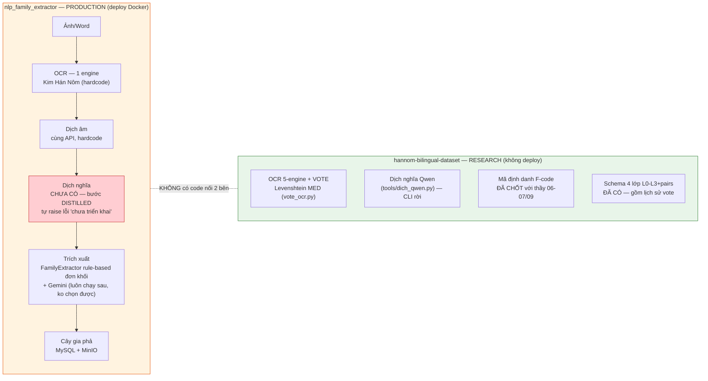
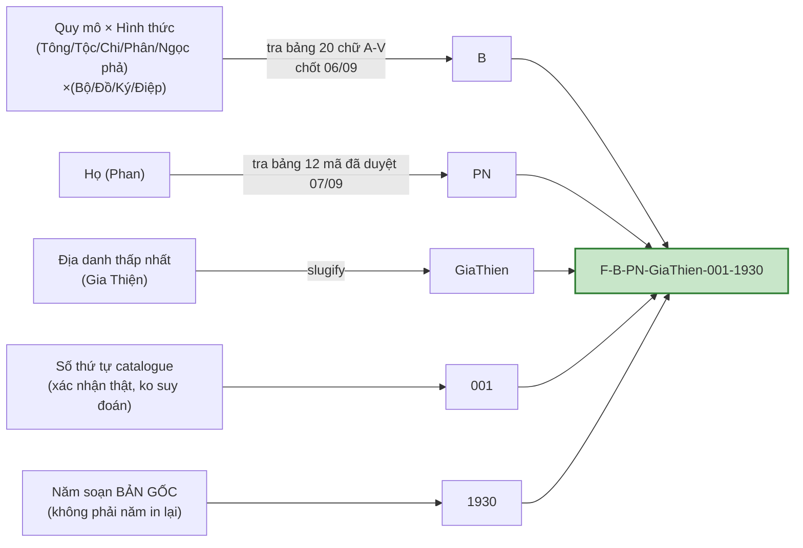
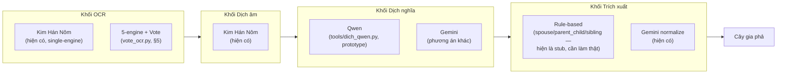
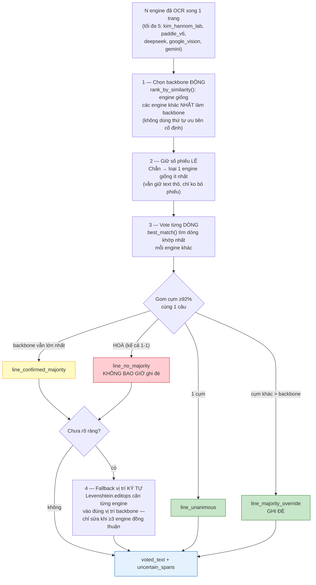

# HCMUS Family Tree — Requirement hệ thống (mô hình xây dựng gia phả tự động)

> **Vai trò file:** yêu cầu chính thức cho việc nâng cấp hệ thống — quản lý dữ liệu Hán-Nôm bài bản (mã định danh khoa học, trạng thái, lịch sử xử lý) và tách các model (OCR/dịch âm/dịch nghĩa/dựng gia phả) thành từng khối **thay được (pluggable)**, cộng 3 role Guest/User/Admin rõ ràng.
>
> **Không thay thế** `PROJECT.md` (kiến trúc hệ thống hiện tại) hay `FEATURES.md` (ma trận tính năng theo role, đã có roadmap 3 phase riêng cho User/Admin) — file này **dẫn chiếu** 2 file đó và bổ sung phần chưa có.
>
> **Chú thích trạng thái** (giữ đúng quy ước `FEATURES.md`): ✅ Đã có, đã chốt/đã implement — chỉ cần mang vào · ⚠️ Đã có 1 phần (schema/thuật toán có, chưa lên DB/UI production) · ❌ Chưa có — requirement mới thật sự.
>
> **Ngày:** 2026-09-29 · **Nguồn khảo sát:** đọc trực tiếp `family-saga-io/`, `nlp_family_extractor/`, `hannom-bilingual-dataset/` (repo song song, xem `docs/thesis/dinh_huong_nghien_cuu_theo_thay_2026-09.md` để biết bối cảnh) — không suy đoán, mọi khẳng định có trích nguồn.

---

## Mục lục

1. [Phạm vi & quan hệ với tài liệu khác](#1-phạm-vi--quan-hệ-với-tài-liệu-khác)
2. [Bức tranh hiện tại — 2 repo tách biệt](#2-bức-tranh-hiện-tại--2-repo-tách-biệt)
3. [Mô hình dữ liệu Hán-Nôm](#3-mô-hình-dữ-liệu-hán-nôm)
4. [Kiến trúc pipeline pluggable](#4-kiến-trúc-pipeline-pluggable)
5. [Rule vote đa-engine — chi tiết thuật toán](#5-rule-vote-đa-engine--chi-tiết-thuật-toán)
6. [Model-registry / config / key-value (mới)](#6-model-registry--config--key-value-mới)
7. [Web theo role](#7-web-theo-role)
8. [Ràng buộc kế thừa](#8-ràng-buộc-kế-thừa)
9. [Ngoài phạm vi (out of scope)](#9-ngoài-phạm-vi-out-of-scope)
10. [Phụ lục — bảng đối chiếu Đã có / Mới](#10-phụ-lục--bảng-đối-chiếu-đã-có--mới)

---

## 1. Phạm vi & quan hệ với tài liệu khác

| Tài liệu | Vai trò | Quan hệ với file này |
|---|---|---|
| `docs/thesis/business.md` | Đề tài gốc, mục tiêu luận văn | Nguồn kiến trúc pipeline 8 module (§7-8) — file này cụ thể hoá thành 4 khối pluggable (§4) |
| `docs/product/PROJECT.md` | Kiến trúc hệ thống hiện tại (route, API, DB) | **Không viết lại** — mọi route/API hiện có vẫn giữ, file này chỉ thêm route/bảng mới |
| `docs/product/FEATURES.md` | Ma trận tính năng Guest/User/Admin + roadmap 3 phase | **Giữ nguyên roadmap** (Guest `is_public` → User workspace thật → Admin dashboard/history theo user) — file này bổ sung phần chưa có trong roadmap đó (model-registry, mã định danh, lịch sử vote/version) |
| `hannom-bilingual-dataset` (repo song song, private) | Nơi thuật toán vote, mã định danh, schema 4 lớp **đã được nghiên cứu và chốt xong** | Nguồn chính của §3, §5 — requirement = mang các quyết định đã chốt ở đây vào production, không phải thiết kế lại |
| `hannom-bilingual-dataset/VOTE_OCR_RULE.md` | Spec kỹ thuật rule vote (đã viết tuần trước) | Dẫn chiếu trực tiếp ở §5, không lặp lại toàn văn |

---

## 2. Bức tranh hiện tại — 2 repo tách biệt



**Đọc biểu đồ:** cột trái là cái đang chạy thật cho user; cột phải là cái đã nghiên cứu xong (thuật toán, schema, mã định danh) nhưng nằm ngoài hệ thống. Requirement của file này = **xây cầu nối** (đường đứt nét) + làm mỗi khối cột trái **thay được**, không phải viết lại từ đầu.

---

## 3. Mô hình dữ liệu Hán-Nôm

### 3.1. Mã định danh khoa học (`ma_dinh_danh`) — ✅ đã chốt, mang vào production



**Nguồn:** `hannom-bilingual-dataset/scripts/ma_dinh_danh_tables.py` (bảng `HINH_THUC_LETTER` 20 mã A–V, bảng `HO_CODE` 12 mã đã duyệt, hàm `build_ma_dinh_danh()`) + field `ma_dinh_danh` trong `schema/bilingual_record.schema.json`.

**Requirement:**

- R3.1.1 — Bảng `documents` (production) có cột `ma_dinh_danh` (string, nullable) + `doc_id` (key kỹ thuật, tách biệt với `ma_dinh_danh` khoa học — 2 khái niệm khác nhau, đừng gộp).
- R3.1.2 — `ma_dinh_danh` chỉ được tính khi đủ 5 thành phần đã xác nhận qua đọc trực tiếp (`quy_mo`, `hinh_thuc`, `ho`, `dia_danh`, `nien_dai`) **và** có `id_seq` xác nhận thứ tự catalogue thật — **không suy đoán tự động**, giữ đúng nguyên tắc đã áp dụng ở research repo (9/28 tài liệu hiện có mã, một số ID còn ghi "SUY LUẬN, chưa xác nhận với thầy").
- R3.1.3 — Mang nguyên 2 bảng tra cứu (`HINH_THUC_LETTER`, `HO_CODE`) vào backend, không định nghĩa lại — họ chưa có trong bảng áp quy tắc 2 chữ đầu không dấu (đúng logic `ho_code_for()`).

### 3.2. Schema 4 lớp (L0–L3 + pairs) — ⚠️ đã có ở research repo, chưa ở production

**Nguồn:** `hannom-bilingual-dataset/schema/bilingual_record.schema.json`.

```
doc_id + ma_dinh_danh + track(1|2|3) + status(draft→l1_done→l2_done→l3_done→reviewed→final) + provenance
  └── pages[]
        l0_image  → l1_ocr (voted_text, vote_method, engines{}, uncertain_spans[])
                  → l2_phien_am
                  → l3_dich_nghia
                  → pairs[] (ghép câu Hán↔Việt)
```

**Requirement:**

- R3.2.1 — Đưa 4 lớp trên vào DB production (bảng `documents`/`document_pages`, mở rộng từ `Document`/`DocumentFile` hiện có trong `nlp_family_extractor/app/documents/models.py`), giữ nguyên tên field để không lệch với dữ liệu research đã có.
- R3.2.2 — `track` (1=chỉ Hán chưa dịch / 2=song ngữ đầy đủ / 3=chỉ Việt) và `status` enum giữ nguyên đúng 6 giá trị đã dùng.

### 3.3. Lịch sử xử lý (version) — ❌ mới, theo xác nhận của người dùng

**Xác nhận với người dùng:** "phiên bản khác của 1 cuốn gia phả" = **nhiều lần xử lý lại cùng 1 tài liệu** (đổi model, sửa rule vote, OCR lại...), **không phải** nhiều bản scan vật lý khác nhau.

**Gap thật (đối chiếu schema hiện có):** 1 record `bilingual_record.schema.json` chỉ có **1** `provenance` — không lưu được N lần chạy cho cùng 1 `doc_id`.

**Requirement:**

- R3.3.1 — Thêm bảng `document_processing_runs` (mới): `id`, `document_id` (FK), `run_number` (tăng dần), `provenance` (created_at, pipeline_version, reviewed_by, **model_config_snapshot** — xem §6), `l1_ocr`, `l2_phien_am`, `l3_dich_nghia` — mỗi lần chạy lại pipeline (đổi model/rule) tạo 1 run mới, **không ghi đè** run cũ.
- R3.3.2 — Admin xem được danh sách run của 1 `document_id`, diff giữa 2 run (tối thiểu: hiển thị `voted_text` của cả 2, không cần diff thuật toán ở bản đầu).
- R3.3.3 — 1 tài liệu luôn có 1 "run hiện hành" (current) để các trang khác (User xem cây, Guest xem public) dùng — không phải chọn thủ công mỗi lần.

---

## 4. Kiến trúc pipeline pluggable

4 khối độc lập, mỗi khối = 1 interface + N implementation chọn được qua config (§6), không hardcode:



**Requirement:**

- R4.1 — Mỗi khối có 1 interface Python rõ ràng (input/output cố định, không phụ thuộc implementation cụ thể) — ví dụ khối OCR: `def run(images: list[Path]) -> OcrResult`, implementation A = gọi Kim Hán Nôm, implementation B = gọi 5-engine + `vote_from_results()` (đã có sẵn trong `vote_ocr.py`, chỉ cần import).
- R4.2 — Khối **Dịch nghĩa** hiện raise lỗi ở `app/pipeline/service.py` (bước `DISTILLED`) — đây là việc **phải làm thật**, dùng `tools/dich_qwen.py` làm tham khảo triển khai (đã gọi Qwen qua DashScope, chỉ cần wire vào API thay vì CLI rời).
- R4.3 — Khối **Trích xuất**: hoàn thiện `app/domains/extraction/rules/{spouse,parent_child,sibling}.py` (hiện `extract()` chỉ `return []`) thành modular thật, giữ Gemini normalize làm 1 phương án song song có thể tắt/mở qua config — không hardwire luôn chạy sau rule-based như hiện tại.
- R4.4 — Chọn implementation nào cho mỗi khối = đọc từ model-registry (§6), không hardcode trong code hay biến môi trường.

---

## 5. Rule vote đa-engine — chi tiết thuật toán

> Đã review trực tiếp `hannom-bilingual-dataset/scripts/vote_ocr.py` và viết spec kỹ thuật đầy đủ tại `hannom-bilingual-dataset/VOTE_OCR_RULE.md` — mục này tóm tắt để requirement tự đứng được, không phải đọc file khác mới hiểu.

**Đơn vị vote = CÂU/DÒNG** (không phải ký tự), dùng Levenshtein MED thật (`rapidfuzz`), không dùng `difflib` (bỏ qua đoạn lệch độ dài).



**Nguyên tắc an toàn xuyên suốt:** không bao giờ ghi đè khi 2 cụm/2 giá trị ngang phiếu (1-1, 2-2...) — chỉ ghi đè khi có đa số thật (nhiều hơn, không chỉ bằng). Mọi bất đồng không đủ đa số → ghi `uncertain_spans` cho người soát, không đoán.

### Ví dụ — vì sao phải căn đúng vị trí, không ghép ngây thơ theo cột

Câu backbone: `始祖諱文成官至知府娶阮氏` — deepseek đọc lộn `知` thành 2 chữ `矢口` (thêm 1 ký tự), google_vision đọc sai chữ cuối `氏`→`民`.

**❌ Ghép theo index cố định** — 1 lỗi chèn của deepseek làm lệch 4 cột phía sau, tạo "lỗ giả" (nhìn như deepseek sai liên tiếp `矢/口/府/娶/阮` trong khi thực ra chỉ sai đúng 1 chữ):

| Vị trí | 8 | 9 | 10 | 11 | 12 |
|---|---|---|---|---|---|
| backbone | 知 | 府 | 娶 | 阮 | 氏 |
| deepseek | **矢** | **口** | **府** | **娶** | **阮** |

**✅ Căn theo `Levenshtein.editops`** (`vote_line_positional()`) — chỉ còn đúng 2 vị trí bất đồng thật:

| Vị trí backbone | 8 | khe chèn sau 8 | 12 |
|---|---|---|---|
| backbone | 知 | — | 氏 |
| paddle_v6/gemini | 知 | — | 氏 |
| deepseek | **矢** | **口** | 氏 |
| google_vision | 知 | — | **民** |
| **Vote (4/5)** | **知** | **— (không chèn)** | **氏** |

Cả 2 vị trí đủ đa số ≥3/5 nên tự "lấp lỗ" (`uncertain_positions` rỗng cho dòng này) — nếu không đủ 3 engine đồng ý, lỗ đó **giữ nguyên treo**, hệ thống không đoán.

### Ngưỡng cần đưa vào model-registry (§6), hiện đang hardcode

| Tham số | Giá trị hiện tại | Ý nghĩa |
|---|---|---|
| `SIM_MATCH` | 0.92 | Ngưỡng coi 2 dòng là "cùng 1 câu" khi gom cụm |
| `SIM_NOTE_MIN` | 0.30 | Ngưỡng tối thiểu để 1 dòng của engine khác được tính là "có khớp" |
| `min_majority` | 3 | Số engine tối thiểu đồng thuận để fallback vị trí ký tự tự sửa |

---

## 6. Model-registry / config / key-value (mới)

**Hiện trạng:** 0 bảng Settings/FeatureFlag trong DB (đã grep toàn bộ `class ...(Base)` trong `nlp_family_extractor/app/`). `HannomConfigPage` phần "Cấu hình API" (`modelPriority`...) hiện chỉ lưu **localStorage** phía frontend, backend không đọc — trang trí, không hoạt động thật.

**Requirement:**

- R6.1 — Bảng `system_config` (key-value, có cấu trúc): `key` (string, unique), `value` (JSON), `category` (`ocr_engine` | `vote_rule` | `translit_provider` | `translation_provider` | `extraction_method`), `updated_by`, `updated_at`.
- R6.2 — Seed mặc định = hành vi hiện tại (Kim Hán Nôm single-engine, `SIM_MATCH=0.92`, `SIM_NOTE_MIN=0.30`, `min_majority=3`, Gemini extraction) — đổi sang pluggable **không phá** hệ thống đang chạy.
- R6.3 — Trang Admin mới (`/admin/developer/model-config` hoặc mở rộng `HannomConfigPage`) đọc/ghi bảng này qua API thật (`GET/PUT /api/admin/system-config`), thay hoàn toàn phần localStorage hiện tại.
- R6.4 — Đổi config **không cần redeploy** — mỗi khối pipeline (§4) đọc config tại thời điểm chạy, không đọc 1 lần lúc khởi động process (để đổi engine/ngưỡng có hiệu lực ngay).

---

## 7. Web theo role

### 7.1. Guest — ❌ upload mới, ⚠️ phần còn lại theo roadmap `FEATURES.md` sẵn có

**Hiện trạng:** chỉ xem (home, hướng dẫn, `/gia-pha` public). **0 upload cho guest** — mọi upload sau `ProtectedRoute`. API `analyze`/`history` dùng `OptionalUser` (không bắt buộc auth) nhưng UI không lộ đường vào — chưa từng là tính năng có chủ đích.

**Xác nhận với người dùng:** guest upload = **ẩn danh hoàn toàn, có giới hạn** chống abuse.

- R7.1.1 — Route mới `/upload` (hoặc mở route `DocumentReaderPage` cho guest) — không yêu cầu đăng nhập, chấp nhận ảnh/PDF/text.
- R7.1.2 — Thêm hỗ trợ **PDF** (hiện chấp nhận `.docx/.doc/.txt/.png/.jpg/.jpeg/.webp`, **không có** `.pdf`) — parse ảnh/text từng trang PDF trước khi vào pipeline OCR.
- R7.1.3 — Giới hạn theo session/IP ẩn danh (số lần/kích thước file) — cơ chế cụ thể (cookie session hay IP rate-limit) để thiết kế ở bước implement, không chốt ở requirement này.
- R7.1.4 — Kết quả guest xử lý **không tự lưu vào tài khoản nào** — muốn giữ lại phải đăng nhập (giữ đúng ranh giới ẩn danh).

### 7.2. User — ⚠️ đóng gap theo roadmap Phase 2 `FEATURES.md` đã có, không viết lại

Giữ đúng roadmap Phase 2 của `FEATURES.md` (bảng tài liệu đã scan, bảng gia phả đã tạo, trang quản lý tài khoản — hiện ❌). Bổ sung **mới** so với `FEATURES.md`:

- R7.2.1 — User xem được **lịch sử các lần xử lý** (§3.3) cho tài liệu của chính mình — không chỉ lịch sử phân tích (`request_id`) như hiện tại.

### 7.3. Admin — ⚠️ đóng gap Phase 3 `FEATURES.md` + bổ sung mới

Giữ đúng roadmap Phase 3 (`user_id` trên history, dashboard). Bổ sung **mới**:

- R7.3.1 — Trang chi tiết tài liệu hiển thị: `ma_dinh_danh` (§3.1), trạng thái (`status`), **lịch sử vote** (`l1_ocr.engines{}` + `uncertain_spans[]`, dạng bảng như ví dụ §5), **lịch sử xử lý/version** (§3.3, danh sách run + diff cơ bản).
- R7.3.2 — Trang **model-registry** (§6) — xem/đổi engine OCR đang active, ngưỡng vote, provider dịch âm/dịch nghĩa, phương pháp trích xuất.
- R7.3.3 — `AdminHistoryPage` hiện là flat log request — **không đổi mục đích của trang này**; lịch sử vote/version là 2 khái niệm khác, đặt ở trang chi tiết tài liệu (R7.3.1), không trộn vào `AdminHistoryPage`.

---

## 8. Ràng buộc kế thừa

- Không phá SSOT `BalkanNode` (`docs/schemas/balkan-node.schema.json`) — mọi mở rộng dữ liệu Hán-Nôm (§3) là **thêm bảng mới**, không đổi cấu trúc node cây hiện có.
- Giữ nguyên chính sách **free-only visualization** (`.cursor/rules/free-only-visualization.mdc`) — không đổi renderer.
- Giữ phạm vi **gia-pha-only** (`.cursor/rules/gia-pha-only-analysis.mdc`) — không mở rộng sang kế ước/tế văn/sắc phong.
- 2 repo (`nlp_family_extractor` sản xuất, `hannom-bilingual-dataset` research) **vẫn tách biệt về mã nguồn** — mang thuật toán/schema qua bằng **copy có ghi rõ nguồn** (file, commit hash) hoặc package riêng dùng chung, **không symlink/import chéo** (đúng rule đã ghi ở `VOTE_OCR_RULE.md` §6).

---

## 9. Ngoài phạm vi (out of scope)

- Không quyết định lại mã định danh — đã chốt với thầy 06–07/09 (§3.1), chỉ mang vào production.
- Không redesign UI toàn bộ hệ thống (việc "web smart hơn, easy hơn" đang treo riêng, chưa chốt scope).
- Không chọn cơ chế rate-limit cụ thể cho guest (R7.1.3) — để thiết kế ở bước implement.
- Không tự động hoá UI bên thứ 3 để né quota API (rủi ro ToS, đã từ chối trước đây).

---

## 10. Phụ lục — bảng đối chiếu Đã có / Mới

| # | Yêu cầu | Trạng thái | Ghi chú |
|---|---|---|---|
| 1 | Mã định danh có cấu trúc | ✅ Đã có, đã chốt | `ma_dinh_danh_tables.py`, chốt với thầy 06–07/09 |
| 2 | Schema quản lý dữ liệu Hán-Nôm (L0–L3) | ✅ Đã có (research), ❌ chưa ở production | `bilingual_record.schema.json` |
| 3 | Thuật toán vote đa-engine | ✅ Đã có, đã review | `vote_ocr.py` + `VOTE_OCR_RULE.md` |
| 4 | Lịch sử vote cho admin xem | ⚠️ Đã có schema, chưa DB/UI production | `l1_ocr.engines{}`/`uncertain_spans` |
| 5 | Lịch sử xử lý / version | ❌ Mới | Xác nhận: nhiều lần xử lý lại, không phải bản scan khác |
| 6 | Dịch nghĩa (service thật) | ❌ Mới | Có prototype Qwen (`tools/dich_qwen.py`) để tham khảo |
| 7 | Trích xuất/dựng gia phả modular | ❌ Mới | `rules/*.py` hiện là stub |
| 8 | Model-registry/config/key-value | ❌ Mới | 0 bảng Settings hiện tại |
| 9 | Guest upload ẩn danh + giới hạn | ❌ Mới | Xác nhận: ẩn danh hoàn toàn, có giới hạn |
| 10 | Hỗ trợ PDF | ❌ Mới | Hiện chỉ docx/doc/txt/ảnh |
| 11 | User quản lý/xem lịch sử | ⚠️ Phần lớn đã có | Roadmap Phase 2 `FEATURES.md`, giữ nguyên |
| 12 | Admin xem trạng thái/ID/version | ⚠️ Một phần (roadmap Phase 3) + ❌ mới (version, model-registry) | Xem R7.3.1–7.3.2 |
