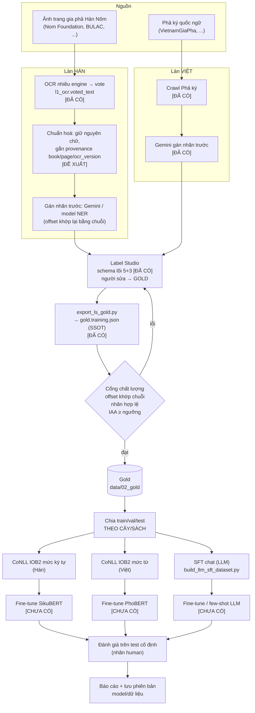
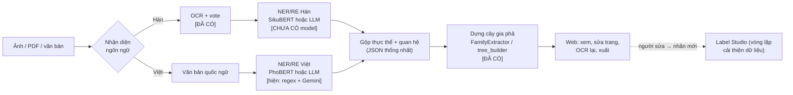

# Schema nhãn NER/RE (Hán + Việt) và sơ đồ pipeline

> **Ngày:** 2026-10-10 · **Trạng thái:** **Bản nháp chờ duyệt**
> **Người soạn:** Claude cho anh Lâm · **Cần xác nhận:** anh Lâm và thầy (xem [§9](#9-quyết-định-cần-duyệt))
>
> Quy ước đọc tài liệu này:
> - **[ĐÃ CÓ]** = đang có trong code/dữ liệu của repo (kiểm chứng được).
> - **[ĐỀ XUẤT]** = em đề xuất, **chưa được duyệt**, chưa nằm trong code.
> - Quy ước khoa học do thầy xác nhận là nguồn sự thật; mọi thứ gắn **[ĐỀ XUẤT]** không được coi là đã chốt cho đến khi có duyệt.
>
> **Liên quan:** [`ENTITY_RELATIONSHIP_LIST.md`](../../research/label_studio_pipeline/ENTITY_RELATIONSHIP_LIST.md) (schema Label Studio hiện hành) ·
> [`HUONG_DAN_GAN_NHAN.md`](../../research/label_studio_pipeline/HUONG_DAN_GAN_NHAN.md) ·
> [`dual_model_genealogy_extraction.md`](../planning/dual_model_genealogy_extraction.md) ·
> [`FINETUNE_DATA_PREPARATION.md`](../training/FINETUNE_DATA_PREPARATION.md)

---

## 0. Tóm tắt

1. **Chốt một bộ nhãn lõi dùng chung cho Hán và Việt**: 5 entity (`PER_NAME`, `GENERATION`, `DATE`, `ORDER`, `LOC`) và 3 quan hệ (`FATHER_OF`, `MOTHER_OF`, `SPOUSE`). Đây chính là bộ **đã chạy thật** trên Label Studio. Không tạo bộ nhãn riêng cho Hán.
2. **Hán gán nhãn theo ký tự**, lưu cùng định dạng `gold.training.json` (có `start/end`) để một bộ công cụ xuất dùng chung cho hai ngôn ngữ.
3. **Bỏ luồng Doccano** (bộ nhãn `PERSON/YEAR/RELATION_*` khác hẳn, quan hệ gán như span từ khoá chứ không phải mũi tên nối người) vì làm dữ liệu hai luồng không gộp được.
4. **Nguồn gốc duy nhất (SSOT)** của dữ liệu đã gắn nhãn là `gold.training.json`; mọi định dạng khác (CoNLL IOB2, SFT chat) là **sinh ra từ nó**, không sửa tay.
5. Có 2 sơ đồ: luồng **dữ liệu → huấn luyện** ([§7](#7-sơ-đồ-pipeline)) và luồng **suy luận trên hệ thống** ([§7.2](#72-luồng-suy-luận-trên-hệ-thống)).

---

## 1. Hiện trạng (fact, đã kiểm chứng trong repo)

| Hạng mục | Trạng thái |
|---|---|
| Label Studio, project "Family Tree NER+RE": 5 entity + 3 relation | **[ĐÃ CÓ]** — `research/label_studio_pipeline/ls_importer.py:LABEL_STUDIO_CONFIG` |
| Quy trình: crawl Phả ký → Gemini gán nhãn trước → người sửa trong Label Studio → `export_ls_gold.py` | **[ĐÃ CÓ]**, chạy trên **quốc ngữ** |
| Nhãn do người duyệt (`v1_human`) | **25 cây** (đã chia sẵn: 5 cây `test`) |
| Nhãn máy chưa người duyệt (silver) | ~139–142 cây (`gemini_review/v2`) |
| Xuất dữ liệu | `export_ls_gold.py` → `gold.training.json`; `build_llm_sft_dataset.py` → SFT chat cho LLM |
| Luồng Doccano (`docs/training/*`, `tools/annotation_app.py`, `convert_doccano_to_conll.py`) | **Chỉ là kế hoạch/công cụ mẫu**; bộ nhãn khác (`PERSON`, `YEAR`, `RELATION_SPOUSE/PARENT/SIBLING`) |
| Dữ liệu gắn nhãn cho **Hán** | **Chưa có.** Văn bản Hán đã có (`l1_ocr.voted_text` trong `hannom-bilingual-dataset`; ví dụ `nom-855`: 100 trang, ~30.200 ký tự, trung vị ~283 ký tự/trang) nhưng chưa có nhãn NER/RE nào |
| Model NER Hán/Việt đã huấn luyện | **Chưa thấy**: không có trọng số (`*.safetensors/*.pt/*.bin`) và không có mã nạp PhoBERT/SikuBERT trong `nlp_family_extractor/app` hay `tools`. Trích xuất hiện tại là quy tắc (regex) + Gemini. UI có bộ chọn phiên bản model nhưng chưa có model thật sau nó |

**Mâu thuẫn tài liệu cần giải quyết (đã ghi nhận):** hai bộ nhãn khác nhau tồn tại song song (bảng ở [§6.1](#61-ánh-xạ-doccano--schema-lõi)).

---

## 2. Nguyên tắc thiết kế

1. **Một schema, hai ngôn ngữ**: cùng tên nhãn, cùng ý nghĩa, để so sánh kết quả Hán–Việt và tái sử dụng công cụ.
2. **Đơn vị cơ sở là ký tự (offset)**; token hoá là việc của bước xuất, không phải của bước gán nhãn.
3. **Mỗi nhãn có mức tin cậy ghi rõ** (`source`): chỉ nhãn người duyệt mới là gold.
4. **Quan hệ chỉ khi văn bản nói rõ** (đã có trong quy tắc hiện hành); đoán từ sơ đồ phả hệ không được tính.
5. **Chia tập theo cây/sách**, không theo câu, để không rò rỉ giữa train và test.
6. **Mọi thay đổi schema** phải đi qua checklist ở [§10](#10-checklist-khi-đổi-schema).

---

## 3. Schema lõi v1 (dùng chung Hán–Việt) — **[ĐÃ CÓ]**

### 3.1 Entity

| Nhãn | Định nghĩa | Ví dụ Việt | Ví dụ Hán |
|---|---|---|---|
| `PER_NAME` | Tên người (họ tên, húy, tự, hiệu) | `Nguyễn Thị Đáo` | `陳氏`, `清閑公`, `敏達` |
| `GENERATION` | Đời / thế hệ | `đời thứ 5` | `一世祖`, `三世` |
| `DATE` | Năm / mốc thời gian | `năm 1872` | `嘉隆十七年戊寅`, `六月初十日` |
| `ORDER` | Thứ tự con trong nhánh | `con thứ nhất` | `長子`, `第三子` |
| `LOC` | Địa danh (quê, thôn, xã, huyện, tỉnh…) | `xã Duy Châu` | `青池縣姜亭社` |

Quy tắc chung (đã hiện hành): một vị trí chỉ một nhãn entity (không chồng); bôi đúng chuỗi trong văn bản; entity phục vụ quan hệ.

> Cột "Ví dụ Hán" là **minh hoạ** do em soạn (chỉ `清閑公`, `陳氏`, `敏達`, `六月初十日`, `青池縣姜亭社` lấy từ trang 9 của `nom-855`); **chưa trích từ nhãn gold** vì Hán chưa có gold.

### 3.2 Quan hệ

| Nhãn | Hướng | Ý nghĩa | Cue Việt | Cue Hán (gợi ý) |
|---|---|---|---|---|
| `FATHER_OF` | cha → con | cha–con | *sinh*, *con của* | `生子`, `之子`, `子` |
| `MOTHER_OF` | mẹ → con | mẹ–con | *hạ sinh*, *mẹ* | `生`, `之子`(ngữ cảnh nữ) |
| `SPOUSE` | vợ ↔ chồng | hôn phối | *lập gia thất*, *kết duyên* | `配`, `娶`, `妻`, `嫁` |

Quy tắc chung (đã hiện hành): head và tail đều là `PER_NAME`; không đảo hướng thành `child_of`; `SPOUSE` không phân chồng/vợ.

> Cue Hán ở bảng trên **chỉ để gợi ý cho người gán và cho bước gán nhãn trước**, không phải luật bắt buộc.

---

## 4. Áp dụng cho văn bản Hán — **[ĐỀ XUẤT]**

Văn bản Hán có đặc điểm khác quốc ngữ khiến một số quy tắc cần nói rõ. Mọi mục dưới đây chờ duyệt (xem D3–D7 ở [§9](#9-quyết-định-cần-duyệt)).

| # | Đặc điểm của văn bản Hán | Quy tắc đề xuất |
|---|---|---|
| H1 | Không có khoảng trắng; **đơn vị là ký tự** | Offset theo ký tự (code point). Không cần tách từ trước khi gán nhãn |
| H2 | Hậu tố tôn xưng đi liền tên: `公`, `氏` | **Bao gồm** hậu tố vào span `PER_NAME` (`清閑公`, `陳氏`), vì tách ra sẽ không còn là đơn vị mà người đọc hiểu là một tên. **Khác** quy tắc quốc ngữ hiện hành (chỉ bôi phần tên, bỏ `ông/bà/cụ`) nên cần thầy duyệt |
| H3 | Chức tước, phẩm hàm đứng trước tên (`前誥授光進韓國上將軍定勳衛長`) | **Không gán ở v1** (không thuộc 5 nhãn). Ứng viên nhãn `TITLE` ở [§5](#5-mở-rộng-v11--đề-xuất-chưa-làm-cho-pilot) |
| H4 | Một người có nhiều tên: húy `諱`, tự `字`, hiệu `號` (`陳氏號慈懿`, `字敏達`) | Mỗi tên là **một span `PER_NAME` riêng**. Quan hệ gán vào span tên **xuất hiện đầu tiên** của mục. Liên kết các tên cùng một người là việc của v1.1 (`ALIAS_OF`) |
| H5 | **Chủ ngữ bị lược** rất phổ biến (`配陳氏`: "phối là Trần thị" — của ai?) | **Quy tắc chủ thể mục:** nếu dòng/mục mở đầu bằng một `PER_NAME` và câu sau có cue rõ (`配`, `生子`, `之子`) mà thiếu chủ ngữ, được nối tới `PER_NAME` đầu mục. Ngoài trường hợp này thì **không** gán |
| H6 | Đại từ/tôn xưng đứng một mình (`公乃正善公之子`: "Công là con của…") | Cho phép gán `PER_NAME` mức **mention** cho `公` đứng một mình **chỉ khi** nó là head/tail của một quan hệ có cue rõ. Giải quyết đồng tham chiếu (cùng một người) là việc **sau** |
| H7 | Ngày âm lịch không năm, ngày giỗ (`六月初十日忌`); niên hiệu–can chi (`嘉隆十七年戊寅`) | `DATE`: bôi **cả cụm** (`六月初十日`, không gồm `忌`); niên hiệu–can chi bôi nguyên cụm. **Không quy đổi dương lịch** ở bước gán nhãn |
| H8 | Địa danh nhiều cấp hành chính liền nhau (`青池縣姜亭社`) | Một span `LOC` cho cả chuỗi liền nhau |
| H9 | Văn bản đầu vào là kết quả OCR **có lỗi** | Gán nhãn trên văn bản **đã vote** (`l1_ocr.voted_text`) nhưng **không sửa chữ OCR** trong bước này; chữ nghi sai ghi chú trong task. Sửa OCR là bước riêng, và nếu sửa thì phải gán lại offset |

### 4.1 Ví dụ minh hoạ (từ `nom-855`, trang 9; **không phải nhãn gold**)

Văn bản (4 dòng, chữ OCR đã vote):

```
始祖清閑公 前誥授光進韓國上將軍定勳衛長
公乃正善公之子 顯有封爵是我
配陳氏號慈懿 六月初十日忌 合葬青池縣姜亭社
賜碑處生子字敏達
```

Bản dịch tham chiếu của repo (máy dịch, độ tin cậy "trung bình"): *Thủy tổ Thanh Nhàn công… Công là con của Chính Thiện công… Chính thất Trần thị hiệu Từ Ý, giỗ ngày 10 tháng 6, hợp táng tại xã Khương Đình, huyện Thanh Trì… sinh con trai tự Mẫn Đạt.*

Nhãn theo quy tắc ở trên (offset đã được kiểm tra `text[start:end] == span`):

```json
{
  "lang": "han",
  "entities": [
    { "start": 2,  "end": 5,  "label": "PER_NAME", "text": "清閑公" },
    { "start": 23, "end": 26, "label": "PER_NAME", "text": "正善公" },
    { "start": 21, "end": 22, "label": "PER_NAME", "text": "公" },
    { "start": 37, "end": 39, "label": "PER_NAME", "text": "陳氏" },
    { "start": 40, "end": 42, "label": "PER_NAME", "text": "慈懿" },
    { "start": 43, "end": 48, "label": "DATE",     "text": "六月初十日" },
    { "start": 52, "end": 58, "label": "LOC",      "text": "青池縣姜亭社" },
    { "start": 65, "end": 67, "label": "PER_NAME", "text": "敏達" }
  ],
  "relations": [
    { "type": "FATHER_OF", "head": 1, "tail": 2 },
    { "type": "SPOUSE",    "head": 0, "tail": 3 },
    { "type": "FATHER_OF", "head": 0, "tail": 7 }
  ]
}
```

Điều ví dụ này minh hoạ:
- `正善公 → 公` (`FATHER_OF`): cue rõ `之子`; `公` đứng một mình (H6).
- `清閑公 ↔ 陳氏` (`SPOUSE`): chủ ngữ của `配` bị lược, nối tới tên đầu mục (H5).
- `清閑公 → 敏達` (`FATHER_OF`): chủ ngữ của `生子` bị lược; **đây là chỗ mơ hồ** (người đọc suy ra từ ngữ cảnh), nên cần thầy xác nhận quy tắc H5 có áp dụng cho `生子` hay chỉ cho `配`.
- `慈懿` (hiệu của `陳氏`) là span riêng, **chưa liên kết** với `陳氏` (H4).
- Chức tước `前誥授光進…定勳衛長` không được gán (H3).

---

## 5. Mở rộng v1.1 — **[ĐỀ XUẤT, chưa làm cho pilot]**

Chỉ thêm khi pilot Hán cho thấy thật sự cần. Mỗi mục kèm lý do và chi phí:

| Ứng viên | Lý do | Chi phí |
|---|---|---|
| `TITLE` (chức tước/phẩm hàm) | Gia phả Hán rất nhiều chức tước; có thể giúp model phân biệt tên với chức | Thêm nhãn, gán lại pilot |
| `ALIAS_OF` (quan hệ giữa các tên cùng người: húy/tự/hiệu) | Nối `慈懿` với `陳氏`; cần để dựng cây đúng khi mỗi nơi gọi một tên | Thêm quan hệ; ảnh hưởng exporter |
| `SIBLING_OF` | Doccano từng có `RELATION_SIBLING`; cây gia phả cần anh/em | Thêm quan hệ |
| Thuộc tính `name_type` (`huy/tu/hieu/thuy`) và `date_type` (`sinh/mat/gio/khac`) | Phân biệt ngày sinh với ngày giỗ | Tăng công gán; dùng `Choices` trong Label Studio |

**Không làm:** chú/bác/cậu/dì, ông/cháu, con nuôi/kế (giữ như hiện hành: ngoài phạm vi; ghi note nếu gặp nhiều).

---

## 6. Định dạng dữ liệu và chuyển đổi

### 6.1 Ánh xạ Doccano → schema lõi

| Doccano (kế hoạch cũ) | Schema lõi | Ghi chú |
|---|---|---|
| `PERSON` | `PER_NAME` | |
| `YEAR` | `DATE` | |
| (không có) | `GENERATION`, `ORDER`, `LOC` | Doccano chưa có |
| `RELATION_SPOUSE` | `SPOUSE` | Doccano gán **từ khoá** ("vợ", "配"), schema lõi gán **mũi tên giữa hai người** → **không chuyển tự động được** |
| `RELATION_PARENT` | `FATHER_OF` / `MOTHER_OF` | Cần giới tính ngữ cảnh |
| `RELATION_SIBLING` | (ngoài phạm vi v1) | Xem `SIBLING_OF` ở [§5](#5-mở-rộng-v11--đề-xuất-chưa-làm-cho-pilot) |

→ Nhãn Doccano **không** dùng làm nguồn gold; chỉ phần `PERSON`/`YEAR` (nếu có) chuyển được.

### 6.2 `gold.training.json` — nguồn gốc duy nhất

**[ĐÃ CÓ]** các khoá: `doc_id`, `tree_id`, `title`, `source_url`, `text`, `entities[{start,end,label,text}]`, `relations[{type,head,tail}]`, `source`.

**[ĐỀ XUẤT]** thêm hai khoá, mặc định giữ tương thích cũ:

| Khoá | Giá trị | Mục đích |
|---|---|---|
| `lang` | `"vi"` \| `"han"` | Chọn bộ xuất và model; mặc định `"vi"` nếu thiếu |
| `provenance` | `{book_id, page_id, ocr_version}` (Hán) | Truy ngược về ảnh trang và phiên bản OCR đã dùng để gán nhãn |

Giá trị `source` thống nhất: `human` (gold) · `silver_gemini` · `silver_rule` · `prelabel`. **Chỉ `human` dùng để đánh giá cuối.**

### 6.3 Quy ước offset — **điểm dễ sai**

- `start/end` là chỉ số ký tự trong `text`, `end` không bao gồm, và **bắt buộc** `text[start:end] == entity.text`.
- Python đếm theo **code point**; trình duyệt (Label Studio) đếm theo **đơn vị UTF-16**. Hai cách khác nhau với ký tự ngoài mặt phẳng cơ bản (ví dụ nhiều chữ Nôm/Hán mở rộng như `𠊚`). Với văn bản Hán–Nôm điều này **có thể làm lệch offset**.
- **Em chưa kiểm chứng** hành vi chính xác của Label Studio bản đang dùng. Cần một test với chuỗi chứa ký tự ngoài BMP trước khi tin offset xuất ra (xem pilot, [§8](#8-kế-hoạch-pilot-hán--đề-xuất)).
- Ghi chú trước đây của dự án: offset do Gemini tự trả **sai gần như toàn bộ**, phải khớp lại bằng chuỗi → luôn xác thực `text[start:end]`.

### 6.4 Sinh định dạng huấn luyện (từ `gold.training.json`)

| Đầu ra | Dùng cho | Quy tắc **[ĐỀ XUẤT]** |
|---|---|---|
| CoNLL IOB2, **mức ký tự** | SikuBERT (Hán) | 1 ký tự = 1 dòng `ký_tự TAG`; `B-/I-` theo span; xuống dòng giữa các câu (tách theo `。`, `\n`) |
| CoNLL IOB2, **mức từ** | PhoBERT (Việt) | Tách theo khoảng trắng; **PhoBERT thường cần văn bản đã tách từ** (VnCoreNLP) — chưa chốt có dùng không (câu hỏi mở Q2) |
| SFT chat (JSON) | LLM trích xuất | Đã có `build_llm_sft_dataset.py` cho Việt; cần bản cho Hán |
| Cặp quan hệ (head, tail, type, câu) | Mô hình RE | Chưa có; sinh từ `relations` |

Mọi bộ xuất phải ghi kèm `stats.json` (số entity/quan hệ theo nhãn, số bị loại và lý do), theo mẫu của `build_llm_sft_dataset.py`.

---

## 7. Sơ đồ pipeline

### 7.1 Luồng dữ liệu → gán nhãn → huấn luyện



### 7.2 Luồng suy luận trên hệ thống



Ghi chú: ở trạng thái hiện tại, các ô **[CHƯA CÓ]** là việc cần làm; phần còn lại dùng lại cái đã chạy.

---

## 8. Kế hoạch pilot Hán — **[ĐỀ XUẤT]**

Mục đích: kiểm chứng schema Hán và quy tắc H1–H9 **trước** khi gán nhãn nhiều.

| Hạng mục | Đề xuất | Căn cứ |
|---|---|---|
| Sách pilot | `nom-855` (100 trang, đủ OCR + phiên âm + dịch, mã định danh và niên đại đã xác nhận trong metadata) + 2 sách khác đã có chữ trên site | `nom-855` là sách em đã đọc kỹ; nhiều sách khác trên site cũng đủ 3 lớp, cần chọn thêm theo niên đại/vùng |
| Số trang | ~30 trang/sách, tổng ~90 trang ≈ **~25.000 ký tự** | Ước từ trung vị ~283 ký tự/trang của `nom-855` (**ước tính**) |
| Người gán | 1 người chính + 1 người gán **chồng 20%** để đo IAA | Cần ít nhất 2 người cho IAA |
| Gán nhãn trước | Gemini hoặc RamCloud (**tốn tiền**, hỏi trước) hoặc không gán trước | Chi phí chưa ước |
| Test offset | Test với ký tự ngoài BMP, so Label Studio với Python | Rủi ro ở [§6.3](#63-quy-ước-offset--điểm-dễ-sai) |
| Kết quả cần có | Bảng lỗi/nhập nhằng theo quy tắc H1–H9; danh sách nhãn cần mở rộng; IAA | Để chốt v1.1 |

### 8.1 Đánh giá (đề xuất)

- **NER:** F1 mức entity, khớp **chính xác** (span + nhãn), tính cả theo từng nhãn; cộng thêm F1 khớp **lỏng** (chồng ≥ 50%) để thấy lỗi ranh giới.
- **RE:** F1 trên bộ ba (head, tail, type), head/tail phải khớp entity đúng.
- **Chia tập:** theo cây/sách; test cố định, **chỉ nhãn `human`**; báo cáo riêng Hán và Việt, không trộn.
- **IAA:** F1 giữa hai người gán trên phần chồng 20%; ngưỡng chấp nhận **chưa chốt** (đề xuất ≥ 0,8 cho `PER_NAME`/`LOC`/`DATE`).

---

## 9. Quyết định cần duyệt

| # | Quyết định | Đề xuất | Cần ai |
|---|---|---|---|
| D1 | Dùng bộ nhãn Label Studio làm lõi chung, **bỏ luồng Doccano** | Có | anh Lâm |
| D2 | Hán gán nhãn **mức ký tự**; offset code point; xuất CoNLL ký tự cho SikuBERT | Có | anh Lâm |
| D3 | Hậu tố `公`/`氏` nằm trong span `PER_NAME` (H2) | Có | **thầy** (quy ước khoa học) |
| D4 | Chức tước đứng trước tên **không gán** ở v1 (H3) | Có | **thầy** |
| D5 | Quy tắc **chủ thể mục** cho chủ ngữ bị lược, áp dụng cho `配` và `生子` (H5) | Có, nhưng nêu rõ cue áp dụng | **thầy** |
| D6 | Gán `PER_NAME` mức mention cho `公` đứng một mình khi là đầu/đuôi quan hệ (H6) | Có | **thầy** |
| D7 | `DATE` gồm ngày âm lịch không năm và ngày giỗ; không quy đổi dương lịch (H7) | Có | **thầy** |
| D8 | Thêm khoá `lang`, `provenance` và thống nhất giá trị `source` ([§6.2](#62-goldtrainingjson--nguồn-gốc-duy-nhất)) | Có | anh Lâm |
| D9 | Pilot Hán theo [§8](#8-kế-hoạch-pilot-hán--đề-xuất); có dùng gán nhãn trước (tốn tiền) hay không | Chờ anh quyết | anh Lâm |

Ghi chú: theo `CLAUDE.md`, quy ước khoa học do thầy xác nhận là nguồn sự thật; D3–D7 chưa được thầy duyệt.

### Câu hỏi mở (chưa biết)

- **Q1.** Label Studio bản đang dùng đếm offset theo UTF-16 hay code point cho ký tự ngoài BMP? (cần test)
- **Q2.** PhoBERT có dùng văn bản tách từ (VnCoreNLP) không? Ảnh hưởng cách sinh CoNLL mức từ.
- **Q3.** Có cần nhãn cho **chữ Nôm** (không chỉ chữ Hán) và kho chữ (font) nào dùng khi hiển thị trong Label Studio?
- **Q4.** Số lượng nhãn tối thiểu để SikuBERT đạt mức dùng được là bao nhiêu? (chưa có thực nghiệm; cần pilot)
- **Q5.** Nhãn máy từ Gemini cho Hán có đủ tốt để làm gán nhãn trước không? (chưa thử; nhãn Gemini cho quốc ngữ từng lệch offset)

---

## 10. Checklist khi đổi schema

Đồng bộ **tất cả** các nơi sau (theo `ENTITY_RELATIONSHIP_LIST.md` §6, bổ sung phần Hán):

- [ ] `LABEL_STUDIO_CONFIG` trong `research/label_studio_pipeline/ls_importer.py`
- [ ] `ENTITY_RELATIONSHIP_LIST.md`, `HUONG_DAN_GAN_NHAN.md`, `QUY_TRINH_GAN_NHAN_TRONG_TASK.md`
- [ ] Tài liệu này
- [ ] Prompt Gemini/RamCloud gán nhãn trước, `gold_builder.py`, `export_ls_gold.py`
- [ ] Bộ xuất (CoNLL ký tự/từ, SFT, cặp quan hệ) và `stats.json`
- [ ] Validate lại project Label Studio (`validate_label_config`)
- [ ] Gán lại hoặc di trú nhãn cũ nếu đổi ý nghĩa nhãn đã có
