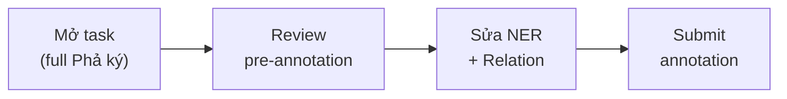

# Hướng dẫn gán nhãn — Gia phả NER + Relation Extraction

> **Dự án:** HCMUS Family Tree / Label Studio pipeline  
> **Cập nhật:** 2026-08-02  
> **Công cụ:** [Label Studio](http://localhost:8080) — project **Family Tree NER+RE**  
> **Thống kê corpus:** [THONG_KE.md](./THONG_KE.md) · **Plan:** [label_studio_pipeline_plan.md](../planning/label_studio_pipeline_plan.md)

---

## 1. Mục tiêu gán nhãn

Trên văn bản **Phả ký** (Quốc ngữ), annotator:

1. **Đánh dấu span** (đoạn text) cho từng loại thực thể (NER).
2. **Nối quan hệ** giữa các thực thể người (`PER_NAME`) bằng mũi tên quan hệ.
3. **Sửa / bổ sung** pre-annotation do Gemini gợi ý → tạo **gold dataset** cho NLP / luận văn.

**Không gán nhãn trên:** sơ đồ `pha_he` (dùng riêng để đối chiếu qua `cross_check.json`).

---

## 2. Bộ nhãn Entity (NER)

| Nhãn | Màu LS | Ý nghĩa | Ví dụ |
|------|--------|---------|-------|
| **PER_NAME** | Cam | Tên người (họ tên, húy, tự, hiệu trong câu) | `Huỳnh Tư`, `Nguyễn Thị Khâm`, `xã Tư` |
| **GENERATION** | Xanh lá | Đời / thế hệ | `đời thứ 5`, `đời 5`, `Đời thứ 7` |
| **DATE** | Xanh dương | Năm sinh, mất, mốc thời gian | `1928`, `thế kỷ XVIII`, `năm 1872` |
| **ORDER** | Tím | Thứ tự con trong nhánh | `con thứ nhất`, `người thứ ba`, `Người con thứ 5` |
| **LOC** | Đỏ | Địa danh, quê, thôn, xã | `Tiên Cảnh`, `Quảng Nam`, `Thôn 7` |

### Quy tắc span

- Bôi **đúng chuỗi xuất hiện** trong văn bản — không thêm/bớt khoảng trắng.
- Một span = **một nhãn** (không overlap cùng vị trí hai nhãn entity).
- Tên kèm danh xưng (`ông`, `bà`, `cụ`) — **chỉ bôi phần tên** trừ khi văn bản không tách được (ghi chú trong task nếu cần).
- `PER_NAME` vs `LOC`: tên làng/xã nếu chỉ là địa danh → **LOC**; nếu là biệt danh người → **PER_NAME**.

---

## 3. Bộ nhãn Relation (Quan hệ)

| Nhãn | Hướng (head → tail) | Nghĩa | Ví dụ câu |
|------|---------------------|-------|-----------|
| **FATHER_OF** | Cha → Con | Quan hệ cha con (nam) | «ông **Huỳnh Tư** … sinh **Huỳnh Phổ**» |
| **MOTHER_OF** | Mẹ → Con | Quan hệ mẹ con | «bà **Nguyễn Thị Yên** … hạ sinh **Huỳnh Nhơn**» |
| **SPOUSE** | Vợ ↔ Chồng | Hôn phối | «**Huỳnh Cừ** lập gia thất với **Nguyễn Thị Đáo**» |

### Quy tắc relation

- **head** và **tail** phải trỏ vào span **PER_NAME** đã đánh dấu.
- Một câu «con của A» → quan hệ **A → con**: dùng `FATHER_OF` hoặc `MOTHER_OF` tùy giới tính ngữ cảnh; nếu không rõ → ưu tiên span có từ `cha`/`mẹ`/`vợ`/`chồng` gần đó.
- Quan hệ anh em, chú/bác **chưa** có nhãn — không gán tùy ý; ghi note nếu cần mở rộng schema sau.

---

## 4. Pre-annotation (Gemini)

Mỗi task import kèm **predictions** (màu nhạt / gợi ý):

| Trạng thái | Việc annotator làm |
|------------|-------------------|
| Span đúng nhãn | Giữ nguyên hoặc Accept |
| Span sai nhãn | Đổi nhãn hoặc xóa span |
| Thiếu entity | Thêm span thủ công |
| Relation sai/h thiếu | Xóa mũi tên sai, kéo relation mới giữa 2 PER_NAME |
| Text Gemini không khớp văn bản | Bỏ qua gợi ý đó, tạo span tay |

**Metadata task** (không cần label): `tree_id`, `source_url`, `title`, `pha_he_url`.

---

## 5. Quy trình trên Label Studio



1. Vào project **Family Tree NER+RE** → chọn task (sort theo `tree_id` nếu cần).
2. Đọc lướt toàn văn; zoom nếu task dài (vd. tree 391 ~48k ký tự).
3. Kiểm tra từng span Gemini → sửa theo §4.
4. Với mỗi câu có quan hệ gia đình rõ: nối **FATHER_OF** / **MOTHER_OF** / **SPOUSE**.
5. **Submit** khi xong task (một gia phả = một task).

### Tiêu chí hoàn thành (1 task)

- [ ] Mọi tên người quan trọng trong đoạn đã xử lý có **PER_NAME** (hoặc cố ý bỏ qua + note).
- [ ] Quan hệ cha/mẹ/vợ chồng được nêu rõ trong text đã có **relation** (nếu đủ thông tin).
- [ ] Không còn span pre-annotation sai mà chưa sửa.

---

## 6. Ví dụ minh họa

**Văn bản:**

> Cụ ông Huỳnh Cừ lập gia thất với cụ bà Nguyễn Thị Đáo đã hạ sinh được 9 người con. Người con thứ hai: cụ ông Huỳnh Phổ kết duyên cùng cụ bà Nguyễn Thị Yên, đến năm 1928 hạ sinh cụ ông Huỳnh Nhơn.

**Entity gợi ý:**

| Text | Nhãn |
|------|------|
| Huỳnh Cừ | PER_NAME |
| Nguyễn Thị Đáo | PER_NAME |
| Người con thứ hai | ORDER |
| Huỳnh Phổ | PER_NAME |
| Nguyễn Thị Yên | PER_NAME |
| 1928 | DATE |
| Huỳnh Nhơn | PER_NAME |

**Relation gợi ý:**

| head | relation | tail |
|------|----------|------|
| Huỳnh Cừ | SPOUSE | Nguyễn Thị Đáo |
| Huỳnh Cừ | FATHER_OF | Huỳnh Phổ *(nếu câu ngụ ý)* |
| Huỳnh Phổ | SPOUSE | Nguyễn Thị Yên |
| Huỳnh Phổ | FATHER_OF | Huỳnh Nhơn |

*(Quan hệ cha-con giữa Huỳnh Cừ và 9 con cần đọc thêm ngữ cảnh — không bịa nếu text không nói rõ con nào.)*

---

## 7. Đối chiếu sơ đồ (`pha_he`)

File `data/gemini_labels/{tree_id}/cross_check.json` báo:

- `matched_count` / `unmatched_count`: tên Gemini có/không có trên sơ đồ.
- Dùng khi **nghi ngờ tên viết tắt** hoặc **tên khác** giữa Phả ký và phả hệ.

Sơ đồ **không thay thế** việc đọc câu văn để gán relation.

---

## 8. Export gold dataset (sau annotate)

Từ Label Studio UI hoặc API: **Export** → JSON.

Định dạng training mục tiêu (phase sau):

```json
{
  "doc_id": "vgp_122",
  "tree_id": 122,
  "text": "...",
  "entities": [
    { "start": 0, "end": 8, "label": "PER_NAME", "text": "Huỳnh Tư" }
  ],
  "relations": [
    { "type": "FATHER_OF", "head": 0, "tail": 20 }
  ]
}
```

---

## 9. Liên hệ schema luận văn

Map sang [genealogy_extraction_feature_set_plan.md](../planning/genealogy_extraction_feature_set_plan.md):

| Nhãn LS | Lớp feature |
|---------|-------------|
| PER_NAME | F1 `person.*` |
| GENERATION | F4 `lineage.generation` |
| DATE | F3 `event.*` / niên đại |
| ORDER | F1 `person.order` |
| LOC | F5 `geo.*` |
| FATHER_OF / MOTHER_OF | F2 `rel.parent_of` |
| SPOUSE | F2 `rel.spouse_of` |

---

## 10. Phụ lục — Phím / thao tác LS (tham khảo)

| Thao tác | Gợi ý |
|----------|--------|
| Chọn nhãn + bôi text | Click label → kéo trên văn bản |
| Relation | Chọn relation label → click entity head → click entity tail |
| Xóa span | Chọn region → Delete |
| Submit | Nút Submit phía trên / dưới |

Phiên bản LS có thể khác nhẹ — xem tooltip trên UI.

---

*Tài liệu này là SSOT cho gán nhãn VGP pilot. Cập nhật khi đổi schema trong `ls_importer.py` / `prompts.py`.*
