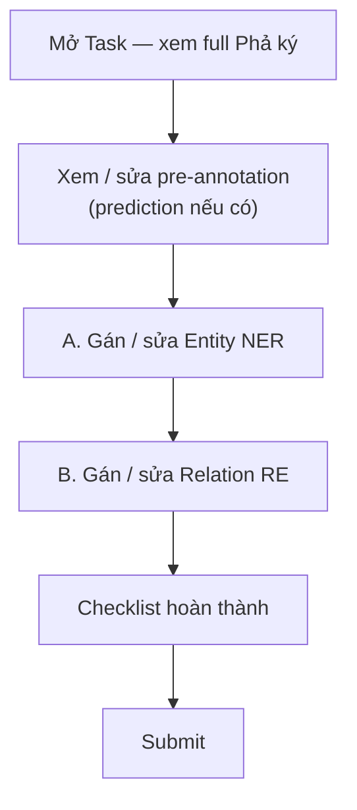

# Quy trình gán nhãn chi tiết (bên trong một Task)

> **Dự án:** Family Tree NER+RE · Label Studio  
> **Schema SSOT:** `ls_importer.py` → `LABEL_STUDIO_CONFIG`  
> **Danh sách nhãn (tra cứu):** [ENTITY_RELATIONSHIP_LIST.md](./ENTITY_RELATIONSHIP_LIST.md)  
> **Hướng dẫn tổng:** [HUONG_DAN_GAN_NHAN.md](./HUONG_DAN_GAN_NHAN.md)  
> **Cập nhật:** 2026-08-10

Khi bạn **nhấp đúp** vào một Task hoặc bấm **Label All Tasks**, giao diện gán nhãn mở ra với **hai bài toán chính** trên cùng một đoạn **Phả ký**:

| Bài toán | Mục tiêu | Đối tượng thao tác |
|----------|----------|-------------------|
| **A. NER** | Đánh dấu span thực thể | Từ / cụm từ trong văn bản |
| **B. RE** | Nối quan hệ giữa 2 người | Chỉ giữa hai span đã gán `PER_NAME` |

**Lưu ý quan trọng (khác tài liệu generic):**

- Không có nhãn entity tên `Person` / `Location` / `Relationship`.
- Entity dùng: `PER_NAME`, `GENERATION`, `DATE`, `ORDER`, `LOC`.
- Quan hệ dùng: `FATHER_OF`, `MOTHER_OF`, `SPOUSE` — **không** có `husband_of`, `wife_of`, `parent_of`, `child_of` trên UI hiện tại.
- `Relationship` **không** phải nhãn bôi đen trên text; quan hệ là **mũi tên** giữa hai `PER_NAME`.

---

## Chuẩn bị trước khi gán

1. Đọc lướt toàn văn Phả ký của task (một cây = một task).
2. Xem metadata (không cần gán): `tree_id`, `title`, `source_url`, `pha_he_url`.
3. Nếu có **prediction** (pre-label / human-review gợi ý): coi là gợi ý — giữ / sửa / xóa, không chấp nhận mù.
4. Có thể đối chiếu sơ đồ `pha_he` (qua `pha_he_url` hoặc `cross_check.json`) để kiểm tra tên, nhưng **chỉ gán theo câu văn Phả ký**.

---

## A. Gán nhãn Thực thể (NER)

### A.1 Bộ nhãn trên thanh công cụ

| Nhãn trên LS | Ý nghĩa | Ví dụ span đúng |
|--------------|---------|-----------------|
| **PER_NAME** | Tên người (họ tên, húy, tự…) | `Võ Đào`, `Quế Thị Thưởng`, `Nguyễn Cảnh Lữ` |
| **LOC** | Địa danh (quê, thôn, xã, tỉnh…) | `Thái Bình`, `Quảng Nam`, `xã Duy Châu` |
| **DATE** | Năm / mốc thời gian | `1928`, `năm 1872`, `1406` |
| **GENERATION** | Đời / thế hệ | `đời thứ 5`, `Đời thứ 7` |
| **ORDER** | Thứ tự con | `con thứ nhất`, `Người con thứ 5` |

### A.2 Thao tác từng bước

1. **Chọn nhãn** trên thanh Labels (ví dụ `PER_NAME`).
2. **Bôi đen** đúng cụm từ trong văn bản (không thêm/bớt khoảng trắng).
3. Label Studio gán span với nhãn đã chọn.
4. Lặp lại cho các thực thể còn lại (có thể đổi nhãn trước mỗi lần bôi).

**Ví dụ:**

| Bôi đen | Chọn nhãn | Kết quả |
|---------|-----------|---------|
| `Võ Đào` | `PER_NAME` | Thực thể người |
| `Thái Bình` | `LOC` | Địa danh |
| `đời thứ 7` | `GENERATION` | Thế hệ |
| `năm 1928` | `DATE` | Thời điểm |
| `con thứ hai` | `ORDER` | Thứ tự |

### A.3 Quy tắc span (bắt buộc)

- Một vị trí text chỉ thuộc **một** nhãn entity (không overlap hai entity cùng chỗ).
- Danh xưng (`ông`, `bà`, `cụ`) — **chỉ bôi phần tên** trừ khi không tách được.
- `PER_NAME` vs `LOC`:
  - Chỉ là địa danh → `LOC` (ví dụ `Thái Bình` là tỉnh).
  - Là tên / biệt danh người → `PER_NAME`.
- Không bôi cả câu dài chứa nhiều tên — mỗi người / mỗi mốc là một span riêng.
- Pre-annotation sai nhãn → đổi nhãn hoặc xóa rồi gán lại.
- Pre-annotation không khớp đúng chuỗi trong text → xóa, tạo span tay.

### A.4 Thứ tự làm NER khuyến nghị trong một task

1. Quét toàn văn → đánh `PER_NAME` (ưu tiên cao nhất cho RE sau này).
2. Đánh `DATE`, `GENERATION`, `ORDER` nơi rõ ràng.
3. Đánh `LOC` (địa danh hành chính / quê quán).
4. Quay lại sửa false positive (ví dụ địa danh bị nhầm thành tên người).

---

## B. Gán nhãn Mối quan hệ (RE)

Chỉ nối quan hệ khi **đã có** hai span `PER_NAME`. Không tạo relation từ `LOC` / `DATE` / v.v.

### B.1 Bộ quan hệ trên LS

| Nhãn relation | Hướng (head → tail) | Nghĩa | Cue trong câu (gợi ý) |
|---------------|---------------------|-------|------------------------|
| **FATHER_OF** | Cha → Con | Cha của | *sinh*, *có con*, *con của* (ngữ cảnh nam) |
| **MOTHER_OF** | Mẹ → Con | Mẹ của | *hạ sinh*, *mẹ*, ngữ cảnh nữ |
| **SPOUSE** | Vợ ↔ Chồng | Hôn phối | *lập gia thất*, *kết duyên*, *lấy vợ/chồng* |

**Không dùng trên UI hiện tại:** `husband_of`, `wife_of`, `parent_of`, `child_of`.  
Map ý tưởng generic → schema dự án:

| Ý tưởng generic | Dùng trong project |
|-----------------|--------------------|
| `husband_of` / `wife_of` | `SPOUSE` (một quan hệ hai chiều về mặt nghĩa) |
| `parent_of` (cha) | `FATHER_OF` |
| `parent_of` (mẹ) | `MOTHER_OF` |
| `child_of` | **Đảo hướng**: gán `FATHER_OF` / `MOTHER_OF` từ cha/mẹ → con |

### B.2 Thao tác từng bước

1. **Nhấp** vào thực thể thứ nhất (head) — phải là `PER_NAME` (ví dụ `Võ Đào`).
2. Bấm **Create Relation** (hoặc biểu tượng mũi tên / nối).
3. **Nhấp** vào thực thể thứ hai (tail) — cũng là `PER_NAME` (ví dụ `Quế Thị Thưởng`).
4. **Chọn loại quan hệ** phù hợp (`FATHER_OF` / `MOTHER_OF` / `SPOUSE`).
5. Kiểm tra hướng mũi tên: head → tail đúng nghĩa bảng §B.1.

**Ví dụ:**

| Câu (rút gọn) | head | relation | tail |
|---------------|------|----------|------|
| Võ Đào lập gia thất với Quế Thị Thưởng | `Võ Đào` | `SPOUSE` | `Quế Thị Thưởng` |
| Huỳnh Phổ … hạ sinh Huỳnh Nhơn | `Huỳnh Phổ` | `FATHER_OF` | `Huỳnh Nhơn` |
| Bà Nguyễn Thị Yên … hạ sinh Huỳnh Nhơn | `Nguyễn Thị Yên` | `MOTHER_OF` | `Huỳnh Nhơn` |

### B.3 Quy tắc relation

- Head và tail **bắt buộc** là `PER_NAME` đã tồn tại trên text.
- Chỉ gán khi **câu văn nói rõ** (hoặc suy ra chắc chắn từ cùng đoạn). Không bịa từ sơ đồ `pha_he` nếu Phả ký không nêu.
- Anh/em, chú/bác, ông/cháu — **chưa có nhãn** → không gán tùy ý; ghi note nếu cần mở rộng schema sau.
- Relation sai từ pre-annotation → xóa mũi tên, tạo lại đúng hướng + đúng loại.
- Một cặp người có thể có nhiều quan hệ khác loại theo ngữ cảnh khác nhau (hiếm); tránh trùng `FATHER_OF` cùng head–tail.

### B.4 Thứ tự làm RE khuyến nghị

1. Xong NER `PER_NAME` cho đoạn đang xử lý.
2. Với mỗi câu có cue hôn phối → `SPOUSE`.
3. Với mỗi câu có cue sinh / con của → `FATHER_OF` hoặc `MOTHER_OF`.
4. Rà lại hướng (không để “con → cha” trừ khi cố ý dùng schema khác — **không** áp dụng ở đây).

---

## C. Hoàn thành một Task

### Checklist trước Submit

- [ ] Các tên người quan trọng trong đoạn đã xử lý có `PER_NAME` (hoặc cố ý bỏ + note).
- [ ] `DATE` / `GENERATION` / `ORDER` / `LOC` đúng chỗ, không nhầm với tên người.
- [ ] Quan hệ cha/mẹ/vợ chồng **được nêu rõ trong text** đã có relation tương ứng.
- [ ] Không còn prediction sai mà chưa sửa / xóa.
- [ ] Đã bấm **Submit** (không chỉ Save draft) — cần annotation hoàn tất để export gold (`export_ls_gold`).

### Phím / thao tác nhanh (tham khảo)

| Thao tác | Cách làm |
|----------|----------|
| Gán entity | Chọn label → bôi text |
| Sửa nhãn entity | Chọn region → đổi label |
| Xóa span | Chọn region → Delete |
| Tạo relation | Entity A → Create Relation → Entity B → chọn loại |
| Xóa relation | Chọn mũi tên quan hệ → Delete |
| Submit | Nút Submit (trên/dưới panel) |

Phiên bản Label Studio có thể khác nhẹ UI — xem tooltip trên màn hình.

---

## D. Ví dụ end-to-end (một đoạn)

**Văn bản:**

> Cụ ông Huỳnh Cừ lập gia thất với cụ bà Nguyễn Thị Đáo đã hạ sinh được 9 người con. Người con thứ hai: cụ ông Huỳnh Phổ kết duyên cùng cụ bà Nguyễn Thị Yên, đến năm 1928 hạ sinh cụ ông Huỳnh Nhơn.

### Bước NER

| Text | Nhãn |
|------|------|
| Huỳnh Cừ | PER_NAME |
| Nguyễn Thị Đáo | PER_NAME |
| Người con thứ hai | ORDER |
| Huỳnh Phổ | PER_NAME |
| Nguyễn Thị Yên | PER_NAME |
| 1928 | DATE |
| Huỳnh Nhơn | PER_NAME |

*(Không bôi `Cụ ông` / `cụ bà` vào span tên.)*

### Bước RE

| head | relation | tail | Vì sao |
|------|----------|------|--------|
| Huỳnh Cừ | SPOUSE | Nguyễn Thị Đáo | *lập gia thất với* |
| Huỳnh Phổ | SPOUSE | Nguyễn Thị Yên | *kết duyên cùng* |
| Huỳnh Phổ | FATHER_OF | Huỳnh Nhơn | *hạ sinh* (ngữ cảnh ông) |
| Nguyễn Thị Yên | MOTHER_OF | Huỳnh Nhơn | *hạ sinh* (có thể gán thêm nếu câu rõ mẹ) |

Không tự suy “Huỳnh Cừ `FATHER_OF` Huỳnh Phổ” chỉ vì “9 người con” nếu câu không chỉ rõ Phổ là một trong 9 — trừ khi đoạn sau nói rõ.

---

## E. Liên hệ pipeline hiện tại

| Nguồn | Vai trò trong Task |
|-------|-------------------|
| Prediction (`generate_prelabel` / `submit_human_review`) | Gợi ý NER+RE sẵn — annotator review |
| Annotation (Submit) | Gold human sau khi sửa |
| Export | `python -m label_studio_pipeline.export_ls_gold` → `data/gold_labels/v1_human/` |
| Review queue | `data/gold_labels/REVIEW_QUEUE.md` (thứ tự S1→S4) |

---

*Tài liệu này mô tả thao tác **bên trong một Task**. Schema nhãn phải khớp `LABEL_STUDIO_CONFIG` trong `ls_importer.py`. Cập nhật file này khi đổi bộ nhãn.*
