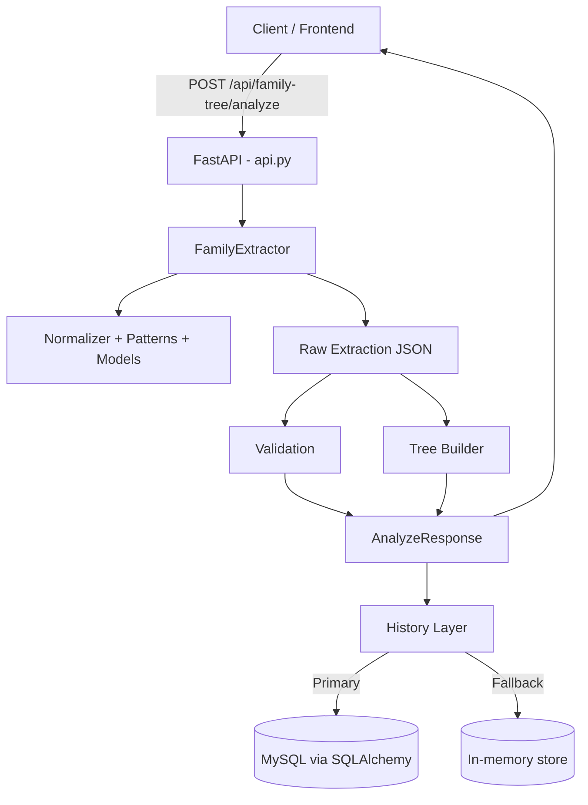

# Kien Truc Hien Tai - NLP Family Extractor

## 1. Tong quan

Du an la mot backend Python theo huong **NLP rule-based** de trich xuat cay gia dinh tu van ban tieng Viet.

He thong co 2 cach su dung chinh:

- Chay qua API FastAPI cho frontend va tich hop he thong khac.
- Chay script local de doc file mau va ghi ket qua JSON.

Muc tieu output:

- `extraction`: danh sach `people` + `relationships`.
- `tree_architecture`: cau truc phang gom `roots`, `children_map`, `nodes`.
- `tree`: cau truc cay long nhau de frontend render truc tiep.

## 2. So do kien truc tong the

## 3. Cau truc thu muc va vai tro

### 3.1 Entry points

- `api.py`
  - Khoi tao FastAPI app.
  - Dinh nghia schema request/response bang Pydantic.
  - Cac endpoint:
    - `GET /health`
    - `POST /api/family-tree/analyze`
    - `GET /api/family-tree/history`
    - `GET /api/family-tree/history/{request_id}`
    - `DELETE /api/family-tree/history`
  - Quan ly history theo 2 tang: MySQL va memory fallback.

- `main.py`
  - Entry point chay local/offline.
  - Doc `data/samples.txt`, goi `FamilyExtractor.parse`, chay validate va ghi `output_family.json`.

### 3.2 Core domain (`app/`)

- `app/extractor.py`
  - Lop trung tam `FamilyExtractor`.
  - Pipeline:
    1. Chuan hoa text (`normalize_text`).
    2. Tim ung vien ten nguoi (`NAME_WITH_TITLE`, `NAME_CAPS`).
    3. Chuan hoa ten + suy luan gioi tinh theo danh xung.
    4. Trich xuat nam sinh/nam mat quanh ten.
    5. Trich xuat quan he rule-based:
       - `spouse_of`
       - `parent_of`
       - `sibling_of`
    6. Loai bo quan he trung lap qua khoá `(from_id, to_id, type)`.
    7. Xuat JSON `people`, `relationships`.

- `app/normalizer.py`
  - Ham chuan hoa text, chuan hoa ten, suy luan gioi tinh, tim nam.

- `app/patterns.py`
  - Toan bo regex rules cho:
    - Nhan dien ten.
    - Nhan dien nam sinh/nam mat.
    - Nhan dien mau cau quan he gia dinh.

- `app/models.py`
  - Dataclass domain:
    - `Person`
    - `Relationship`

- `app/tree_builder.py`
  - Chuyen extraction output thanh:
    - `build_tree_architecture`: do thi phang (`roots`, `children_map`, `nodes`).
    - `build_nested_tree`: cay long nhau, co danh dau `cycle` neu gap vong lap.

- `app/validate.py`
  - Rule validate hau xu ly:
    - Khong tu quan he voi chinh minh.
    - Khong trung canh quan he.
    - Canh bao khoang cach tuoi cha-con bat thuong.

- `app/history_repository.py`
  - Tang persistence MySQL bang SQLAlchemy.
  - Tu tao bang `request_history` neu chua co.
  - API noi bo:
    - `append`
    - `list_recent`
    - `get_detail`
    - `clear`
  - Neu thieu bien moi truong MySQL hoac loi ket noi thi fallback ve memory.

## 4. Luong xu ly request `/api/family-tree/analyze`

1. Nhan request (`text`, `source`, `metadata`).
2. Tao `request_id` + `created_at`.
3. Goi `FamilyExtractor.parse(text)` lay extraction tho.
4. Chay `validate_*` de tao danh sach warnings.
5. Dung `build_tree_architecture` va `build_nested_tree` de tao cau truc cay.
6. Dong goi `AnalyzeResponse`.
7. Luu history:
   - Luon luu vao in-memory store.
   - Co gang ghi MySQL neu repository duoc enable.
8. Tra response cho client.

## 5. Mo hinh du lieu chinh

### 5.1 People

- `id`: ma dinh danh noi bo (vi du `P001`).
- `full_name`: ho ten.
- `birth_year`, `death_year`: optional.
- `gender`: `M`/`F`/`null`.

### 5.2 Relationships

- `from_id`, `to_id`.
- `type`: `parent_of`, `spouse_of`, `sibling_of`.
- `confidence`: do tin cay.
- `source`: mac dinh `nlp`.

### 5.3 History record

- `request_id`, `created_at`, `source`, `metadata`.
- `people_count`, `relationship_count`, `warning_count`.
- `analysis_json` (ban day du response) khi luu MySQL.

## 6. Luu tru lich su

### 6.1 Uu tien MySQL

- Dieu kien bat buoc:
  - `MYSQL_HOST`
  - `MYSQL_USER`
  - `MYSQL_PASSWORD`
- Tuy chon:
  - `MYSQL_PORT` (mac dinh `3306`)
  - `MYSQL_DATABASE` (mac dinh `family_tree`)

### 6.2 Fallback in-memory

- Dung `deque` + dict trong `api.py`.
- Co gioi han kich thuoc (`_HISTORY_MAX_ITEMS = 200`).
- Mat du lieu khi restart process.

## 7. Trien khai va runtime

- Dependency chinh (`requirements.txt`):
  - `fastapi`, `uvicorn`, `pydantic`, `SQLAlchemy`, `PyMySQL`.
- Docker image (`Dockerfile`):
  - Base image `python:3.11-slim`.
  - Chay `uvicorn api:app --host 0.0.0.0 --port 8000`.

## 8. Nhan xet ve kien truc hien tai

### Diem manh

- Don gian, de theo doi, de debug.
- Rule-based cho ket qua on dinh voi van ban dung mau.
- Tach ro layer: extract -> validate -> build tree -> expose API.
- Co persistence linh hoat (MySQL/fallback memory).

### Gioi han

- Do chinh xac phu thuoc manh vao mau cau regex.
- Chua co co che hoc may hoac ranking ngu nghia.
- Chua co test suite tu dong trong cau truc hien tai.
- Chua co queue/async pipeline cho tai cao.

## 9. Huong mo rong de xuat

- Bo sung bo test:
  - Unit test cho `extractor`, `tree_builder`, `validate`.
  - Integration test cho endpoint `analyze` va `history`.
- Version hoa bo rules va thong ke do phu qua tap du lieu mau.
- Them observability: structured log, metrics request latency, ti le warning.
- Can nhac hybrid architecture: rule-based + statistical/LLM-assisted extraction.
