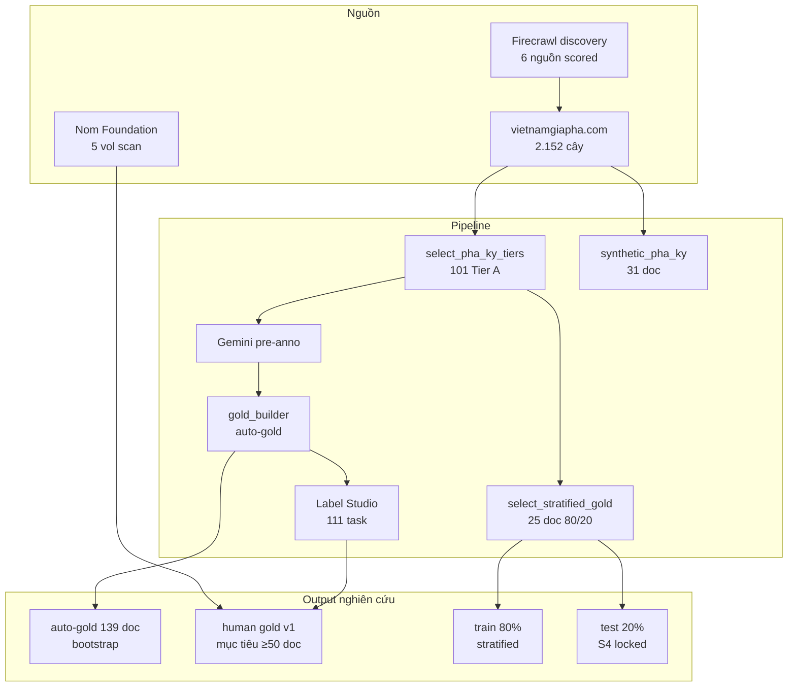

# Báo cáo tổng hợp — Pipeline dữ liệu gia phả (08/2026)

> **Vai trò:** Báo cáo SSOT — gom kết quả từ nhiều file rời (weekly notes, planning, data artifacts, code mới)  
> **Độc giả:** NCS / hội đồng · **Ngày:** 2026-08-10  
> **Thay thế đọc rời:** [02_08_2026.md](../note_meeting_weekly/02_08_2026.md), [09_08_2026.md](../note_meeting_weekly/09_08_2026.md), [DISCOVERY_REPORT.md](../data/sources_discovery/DISCOVERY_REPORT.md)

---

## 1. Tóm tắt điều hành (Executive summary)

Trong giai đoạn 27/07 → 10/08/2026, dự án chuyển từ **pilot 38 task Label Studio** sang **hệ sinh thái dữ liệu có kiểm soát**:

| Thành phần | Trạng thái | Giá trị khoa học |
|------------|------------|------------------|
| Corpus VGP Quốc ngữ | 2.152 cây crawl, 101 Tier A | Nguồn chính Phase 1 |
| Auto-gold + LS | 111 task Tier A, ~110 pre-gold | Bootstrap — **chưa đủ claim gold** |
| Stratified sample | 25 doc (20 train / 5 test) | Thiết kế thí nghiệm |
| Synthetic | 31 doc, ~12k relation | Pre-train RE only |
| Firecrawl discovery | 6 nguồn map + score | Mở rộng corpus |
| **Human gold reviewed** | **0 doc** | **Blocker chính luận văn** |

**Kết luận NCS:** Công việc kỹ thuật đã đủ để **bắt đầu giai đoạn annotation có giá trị công bố**; bottleneck không còn là crawl mà là **human review + protocol 80/20**.

---

## 2. Thống kê file thay đổi (inventory)

### 2.1. Code mới (~1.651 dòng Python)

| Module | File | Chức năng |
|--------|------|-----------|
| **Gold / LS** | `label_studio_pipeline/select_stratified_gold.py` | Chọn 25 doc stratified S1–S4 |
| | `label_studio_pipeline/export_ls_gold.py` | Export annotation human từ LS |
| | `label_studio_pipeline/import_synthetic.py` | Import synthetic → LS project riêng |
| | `label_studio_pipeline/audit_ls_tasks.py` | Đối chiếu LS ↔ tier_a |
| **Firecrawl discovery** | `source_discovery/map_source.py` | Phase 1: map URL |
| | `source_discovery/score_samples.py` | Phase 2: scrape + chấm điểm |
| | `source_discovery/scoring.py` | Rubric 0–100 |
| | `source_discovery/registry.py` | `sources_registry.json` |
| | `source_discovery/seeds.py` | 6 seed URL |
| | `source_discovery/__main__.py` | CLI: `map`, `score`, `registry` |

**Code đã có từ trước (02/08, không liệt kê lại chi tiết):** `gold_builder.py`, `submit_gold.py`, `select_pha_ky_tiers.py`, `synthetic_pha_ky.py`, `generate_synthetic.py`.

### 2.2. Planning & ghi chép

| File | Nội dung |
|------|----------|
| `planning/label_studio_data_expansion_analysis.md` | Mở rộng LS + **§12 góc nhìn luận văn** |
| `planning/firecrawl_genealogy_source_discovery_plan.md` | Plan Firecrawl 2 track |
| `planning/labeled_corpus_collection_plan.md` | **Plan thu thập gán nhãn 80/20** ← SSOT tiếp theo |
| `note_meeting_weekly/09_08_2026.md` | Tuần stratified + CLI |

### 2.3. Data artifacts (committed / local)

| Path | Số lượng | Ghi chú |
|------|----------|---------|
| `data/gold_labels/` | 139 doc auto-gold | ~4.989 entity, ~902 relation |
| `data/gold_labels/stratified_sample.json` | 25 doc | 20 train + 5 test |
| `data/gold_labels/REVIEW_QUEUE.md` | 25 doc | Thứ tự review |
| `data/synthetic_pha_ky/` | 31 doc | ~12.038 relation (không vào test) |
| `data/sources_discovery/` | 36 file | Map + score 6 nguồn |
| `data/vgp_corpus/` | 2.152 tree | gitignored |
| `data/gemini_labels/` | 145 tree | gitignored |

### 2.4. Config

| File | Thay đổi |
|------|----------|
| `.gitignore` | + `source_discovery/.env` |
| `label_studio_pipeline/.env.example` | + `LABEL_STUDIO_SYNTHETIC_*` |
| `source_discovery/.env` | `FIRECRAWL_API_KEY` (local, không commit) |

---

## 3. Thống kê corpus hiện tại

### 3.1. Quốc ngữ — Phả ký thật (VGP)

| Chỉ số | Giá trị |
|--------|---------|
| Crawl tổng | 2.152 |
| Tier A (narrative + score≥70 + cues≥5) | 101 |
| Tier B | 111 |
| Skip (meta / ngắn / lỗi) | ~1.940 |
| Task Label Studio (Tier A) | 111 |
| Auto-gold documents | 139 |
| Doc có ≥5 relation (auto) | 48 |
| **Human-reviewed gold** | **0** |

### 3.2. Synthetic (sơ đồ → template prose)

| Chỉ số | Giá trị |
|--------|---------|
| Documents | 31 |
| Relations (gold 100%) | 12.038 |
| Chủ yếu | FATHER_OF |
| Dùng train? | Pre-train RE ablation only |
| Dùng test? | **Không** |

### 3.3. Hán-Nôm (ảnh scan)

| Chỉ số | Giá trị |
|--------|---------|
| Nom Foundation volumes | 5 (1255, 130, 208, 429, 855) |
| Trang scan | ~163 |
| Firecrawl map `tộc phả` | 4 URL volume |

### 3.4. Khám phá nguồn (Firecrawl)

| Nguồn | Track | Quyết định | Điểm max |
|-------|-------|------------|----------|
| vietnamgiapha.com | QN | ✅ Thu thập | 100 |
| giaphaonline.net | QN | ✅ Thu thập | 100 |
| Nom Foundation c2 | HN | ✅ Thu thập | 85 |
| nlv.gov.vn | HN | ✅ Thu thập | 70 |
| giaphavietnam.vn | QN | ⚠️ Pilot | 55 |
| giaphadaiviet.vn | QN | ❌ Tạm bỏ | 40 |

Chi tiết: `data/sources_discovery/sources_registry.json`

---

## 4. Stratified sample — thiết kế 80/20 hiện tại

Đã chọn **25 document** từ Tier A (`stratified_gold_v1`):

| Stratum | Số | Split | Mục đích |
|---------|-----|-------|----------|
| S1 — relation-rich | 8 | **train** | RQ2 (RE) |
| S2 — medium | 7 | **train** | Generalization |
| S3 — hard | 5 | **train** | Error analysis |
| S4 — held-out | 5 | **test** | Báo cáo số cuối |
| **Tổng** | **25** | **20 / 5 = 80/20** | |

**Test set (S4 — khóa trước train):** 1622, 1454, 544, 1813, 2346

**Double annotation (κ):** 544, 1454, 1622, 1813, 2346

> ⚠️ S4 hiện có doc relation=0 (auto-gold) — cần human review trước khi coi là gold test hợp lệ.

---

## 5. Sơ đồ kiến trúc dữ liệu (gom gọn)



---

## 6. Phát hiện chất lượng (tóm tắt khoa học)

| Phát hiện | Hệ quả |
|-----------|--------|
| ~84% corpus VGP không đủ narrative | Không mở rộng mù quáng |
| Khớp tên Phả ký ↔ sơ đồ rất thấp | Không gold prose chỉ từ diagram |
| Auto-gold ≠ human gold | Metric trên auto-gold = upper bound sai lệch |
| Synthetic template ≠ prose lịch sử | Chỉ ablation pre-train |
| 0 human review | **Chưa publishable** |
| Firecrawl free: 10 scrape/phút | Batch có delay; map rẻ (1 credit) |

---

## 7. Gap so với luận văn

| Hạng mục | Hiện tại | Cần (tối thiểu) |
|----------|----------|-----------------|
| Human gold doc | 0 | **≥50** (40 train + 10 test) |
| Cohen's κ | — | ≥5 doc overlap, κ≥0.70 entity |
| Baseline có số | — | Rule + LLM trên **test locked** |
| Nguồn QN có parser | 1 | ≥2 (VGP + giaphaonline pilot) |
| Volume Hán-Nôm | 5 | ≥15 catalog |
| Export train/test JSON | — | `data/labeled_corpus/v1/` |

**Plan chi tiết:** [labeled_corpus_collection_plan.md](./labeled_corpus_collection_plan.md)

---

## 10. Kế hoạch chuẩn bị dữ liệu (review trước khi làm)

> **Mục đích:** Tải về + bổ sung Phả ký từ sơ đồ để **bạn xem và quyết định** trước khi human review trên Label Studio.  
> **Trạng thái:** ✅ **Đã duyệt & thực hiện** (2026-08-10) · Checklist §10.7 xác nhận bởi NCS.

### 10.1. Mục tiêu

| # | Việc | Kết quả bạn thấy được |
|---|------|------------------------|
| 1 | **Tải về** dữ liệu đã tìm được (ảnh, Phả ký, sơ đồ) | Thư mục thống nhất + manifest |
| 2 | **Bổ sung Phả ký** từ sơ đồ (nơi prose thật thiếu) | Xem song song prose thật vs synthetic |
| 3 | **Viewer HTML** | Mở browser, duyệt từng gia phả không cần LS |

**Phạm vi ưu tiên (không tải 2.152 cây một lúc):**

- **25 doc stratified** (20 train + 5 test) — queue review chính
- **5 volume Hán-Nôm** đã có + catalog Nom mở rộng (map `tộc phả`)
- **Pilot 1 nguồn mới:** giaphaonline.net/demo

---

### 10.2. Cấu trúc thư mục đích (`data/review_corpus/`)

```
data/review_corpus/
├── index.html                 ← Viewer tổng: danh sách + mở từng gia phả
├── manifest.json              ← SSOT: tree_id, nguồn, có gì (real/syn/ảnh)
├── quoc_ngu/
│   └── {tree_id}/
│       ├── meta.json          ← tên dòng họ, URL VGP, stratum, split
│       ├── pha_ky.txt         ← Phả ký THẬT (từ crawl)
│       ├── pha_he.json        ← Sơ đồ (nodes + relations)
│       ├── pha_he.txt         ← Sơ đồ text phẳng (optional)
│       ├── pha_ky_synthetic.txt   ← BỔ SUNG từ sơ đồ (nếu có)
│       ├── compare.html       ← Trang xem: trái=thật, phải=synthetic
│       └── links.json         ← URL gốc: Phả ký, Phả hệ, Hình ảnh
└── hannom/
    └── {volume_id}/
        ├── metadata.json
        ├── manifest.json      ← danh sách trang
        ├── pages/*.jpg        ← ảnh scan
        └── viewer.html        ← lật trang
```

**Nguyên tắc hiển thị:**

- Phả ký **thật** và **synthetic** **luôn tách file** — không ghi đè
- Synthetic gắn tag `source: synthetic_from_pha_he` — **không** thay thế gold
- Viewer chỉ đọc local — không gửi dữ liệu ra ngoài

---

### 10.3. Việc 1 — Tải về dữ liệu đã tìm được

#### A. Quốc ngữ — VietnamGiaPha (ưu tiên cao)

| Hạng mục | Nguồn | Số lượng đề xuất | File tải / export |
|----------|-------|------------------|-------------------|
| Stratified review | `stratified_sample.json` | **25 cây** | `pha_ky.txt`, `pha_he.json`, `meta.json` |
| Tier A bổ sung (tuỳ chọn) | `tier_a_trees.json` | +20 cây | Cùng format |
| Ảnh (nếu có) | `/XemHinhAnh/{id}/hinh_anh.html` | Theo từng cây | `images/` (jpg/png) |

**Lệnh dự kiến (chưa chạy):**

```bash
# Export 25 cây stratified → review_corpus
python -m label_studio_pipeline.export_review_corpus \
  --pilot-file data/gold_labels/stratified_sample.json \
  --output-dir data/review_corpus/quoc_ngu \
  --include-images

# Hoặc từ corpus sẵn có
python -m label_studio_pipeline.export_giapha \
  --pilot-file data/labeled_corpus/v1/splits/train_ids.json
python -m label_studio_pipeline.export_giapha \
  --pilot-file data/labeled_corpus/v1/splits/test_ids.json
```

**Module cần viết:** `export_review_corpus.py` (wrap crawl 3 module: Phả ký + Phả hệ + Hình ảnh).

#### B. Hán-Nôm — Nom Foundation

| Hạng mục | Hiện có | Tải thêm |
|----------|---------|----------|
| Volume scan | 5 vol (1255, 130, 208, 429, 855) | ✅ Đã trong `data/hannom/nomfoundation/` |
| Catalog mới | Firecrawl map `tộc phả` → 4 URL | Map rộng → import volume chưa có |

**Lệnh dự kiến:**

```bash
python -m source_discovery map --source-id nomfoundation_c2
# Import volume mới qua backend Nom hoặc CLI riêng
```

**Output:** copy vào `data/review_corpus/hannom/{volume_id}/`.

#### C. giaphaonline.net (pilot)

| URL | Tải gì |
|-----|--------|
| `https://giaphaonline.net/demo` | Phả ký + cây (spike parser) |

**Phạm vi:** 1 demo + tối đa 5 cây → `data/review_corpus/quoc_ngu/giaphaonline_{id}/`.

#### D. NLV (hạn chế)

- OPAC: metadata + link ảnh (manual)
- HanNom portal: cần đăng nhập — Phase 2

#### E. Tạm bỏ

| Nguồn | Lý do |
|-------|--------|
| giaphadaiviet.vn | Map trúng blog; proxy lỗi |
| giaphavietnam.vn | Landing page only, score 55 |

---

### 10.4. Việc 2 — Bổ sung Phả ký theo sơ đồ

**Vì sao:** ~84% prose quá ngắn; khớp tên Phả ký ↔ sơ đồ thấp; tree **1065** chỉ có lời nói đầu — synthetic giúp **xem quan hệ**, không thay gold.

#### Quy tắc sinh `pha_ky_synthetic.txt`

| Điều kiện | Hành động |
|-----------|-----------|
| `len(pha_ky) < 200` hoặc relation cues ≤ 2 | ✅ Sinh synthetic từ `pha_he.json` |
| Tier A narrative đủ | ⚠️ Vẫn sinh synthetic **để so sánh** |
| Tree **test S4 locked** | Synthetic OK; gold vẫn từ review prose thật |

**Lệnh dự kiến:**

```bash
python -m label_studio_pipeline.generate_synthetic \
  --pilot-file data/gold_labels/stratified_sample.json

python -m label_studio_pipeline.build_review_viewer \
  --corpus-dir data/review_corpus \
  --synthetic-dir data/synthetic_pha_ky
```

**Module cần viết:** `build_review_viewer.py`.

---

### 10.5. Viewer — cách bạn sẽ xem

| Viewer | Mở bằng | Nội dung |
|--------|---------|----------|
| **Tổng** | `open data/review_corpus/index.html` | Bảng 25 cây: stratum, split, link |
| **So sánh** | `.../quoc_ngu/{tree_id}/compare.html` | Trái: thật · Phải: synthetic |
| **Hán-Nôm** | `.../hannom/{vol}/viewer.html` | Lật trang scan |
| **Synthetic cũ** | `data/synthetic_pha_ky/index.html` | 31 cây (đã có) |

---

### 10.6. Lộ trình (sau khi bạn duyệt)

| Bước | Việc | Thời gian |
|------|------|-----------|
| P0 | Viết `export_review_corpus.py` | 0.5 ngày |
| P1 | Export 25 cây VGP | 1–2 giờ |
| P2 | Synthetic 25 cây + merge | 30 phút |
| P3 | `build_review_viewer.py` + index.html | 0.5 ngày |
| P4 | Copy 5 vol Hán-Nôm | 15 phút |
| P5 | Nom +3–5 volume mới | 1 ngày |
| P6 | giaphaonline pilot | 1 ngày |

---

### 10.7. Checklist duyệt (đã xác nhận 2026-08-10)

- [x] Phạm vi **25 cây stratified** OK
- [x] Synthetic **song song**, không ghi đè Phả ký thật
- [x] Tải ảnh VGP (`XemHinhAnh`): **có**
- [x] Nom thêm: **10 volume** (1256, 147, 207, 833, 854, 865, 84, 557, 563, 1158)
- [x] giaphaonline pilot: **skip**
- [x] NLV: chỉ metadata

**Ghi chú duyệt (NCS):**

```text
25 cây stratified - ok
ảnh VGP (XemHinhAnh) - có tải
Nom - thêm 10 volume
giaphaonline skip
Synthetic song song, ok, không ghi đè prose thật
```

---

### 10.8. Module backlog

| Module | Trạng thái |
|--------|------------|
| `export_review_corpus.py` | ✅ Có — export 25 cây + ảnh VGP |
| `build_review_viewer.py` | ✅ Có — `index.html` + `compare.html` |
| `generate_synthetic.py` `--pilot-file` | ✅ Có |
| `synthetic_pha_ky.py` | ✅ Có |
| `data/review_corpus/index.html` | ✅ Viewer tổng |
| `data/synthetic_pha_ky/index.html` | ✅ Mẫu UI (31 cây cũ) |

---

## 11. Lệnh CLI (tham chiếu nhanh)

```bash
# Stratified sample
python -m label_studio_pipeline.select_stratified_gold

# Firecrawl discovery
python -m source_discovery map
python -m source_discovery score --samples 5
python -m source_discovery registry

# Label Studio (cần LS chạy)
python -m label_studio_pipeline.audit_ls_tasks
python -m label_studio_pipeline.export_ls_gold

# Synthetic
python -m label_studio_pipeline.import_synthetic --skip-existing

# --- Chuẩn bị review (§10 — đã chạy 2026-08-10) ---
python -m label_studio_pipeline.export_review_corpus \
  --pilot-file data/gold_labels/stratified_sample.json
python -m label_studio_pipeline.generate_synthetic \
  --pilot-file data/gold_labels/stratified_sample.json
python -m label_studio_pipeline.build_review_viewer
bash scripts/fetch_nom_review_batch.sh
# open data/review_corpus/index.html
```

---

## 12. File tham chiếu (không cần đọc hết)

| Mục đích | File |
|----------|------|
| Plan thu thập 80/20 | `planning/labeled_corpus_collection_plan.md` |
| Firecrawl mở rộng nguồn | `planning/firecrawl_genealogy_source_discovery_plan.md` |
| LS expansion + RQ | `planning/label_studio_data_expansion_analysis.md` §12 |
| Review queue | `data/gold_labels/REVIEW_QUEUE.md` |
| Nguồn scored | `data/sources_discovery/sources_registry.json` |
| Schema feature F0–F6 | `planning/genealogy_extraction_feature_set_plan.md` |
| Hướng dẫn gán nhãn | `label_studio_pipeline/HUONG_DAN_GAN_NHAN.md` |
| Viewer synthetic mẫu | `data/synthetic_pha_ky/index.html` |
| Split train/test locked | `data/labeled_corpus/v1/splits/` |

---

*Cập nhật file này khi: (1) bạn duyệt §10, (2) có human gold export, (3) đạt mốc N doc, (4) chốt test set v1.*
