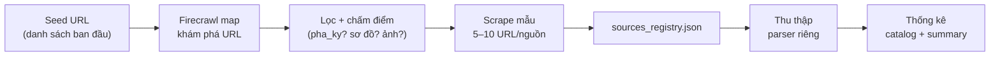

# Plan — Firecrawl: khám phá & thu thập nguồn gia phả

> **Ngày:** 2026-08-09  
> **Bối cảnh:** Dữ liệu hiện tại **chưa đủ** cho luận văn — VGP ~2.152 cây nhưng ~84% không label được; Hán-Nôm mới **5 volume** scan.  
> **Mục tiêu:** Dùng **Firecrawl** để **tìm nguồn mới**, **đánh giá khả thi**, **thu thập có chọn lọc**, **thống kê tập trung**.  
> **Liên quan:** [nomfoundation_crawl_plan.md](./nomfoundation_crawl_plan.md), [vietnamgiapha_crawl_v2_plan.md](./vietnamgiapha_crawl_v2_plan.md), [label_studio_data_expansion_analysis.md](./label_studio_data_expansion_analysis.md) §12

---

## 1. Vì sao cần plan này

| Track | Hiện có | Thiếu gì |
|-------|---------|----------|
| **Quốc ngữ** (VGP) | ~2.152 crawl, 101 Tier A, 111 task LS | Nguồn **ngoài VGP**; nhiều site có phả ký+sơ đồ nhưng chưa catalog |
| **Hán-Nôm** (ảnh scan) | 5 volume Nom Foundation (`1255`, `130`, `208`, `429`, `855`) | Thiếu **catalog rộng** — chưa biết còn bao nhiêu gia phả scan ở đâu |

**Firecrawl không thay parser hiện có** — vai trò chính:

1. **`/map`** — liệt kê URL nhanh (1 credit/lần)
2. **`/scrape`** — lấy mẫu 1 trang (markdown + link ảnh)
3. **`/crawl`** — thu thập sâu sau khi nguồn đã được chấm điểm cao



---

## 2. Hai track thu thập

### Track A — Gia phả Hán-Nôm (có hình ảnh scan)

**Yêu cầu tối thiểu mỗi nguồn:**

| Tiêu chí | Bắt buộc | Ghi chú |
|----------|----------|---------|
| Ảnh scan trang gốc | ✅ | JPG/PNG/PDF từng trang |
| Metadata | ✅ | Tên gia phả, số trang, niên đại (nếu có) |
| Text OCR | ⚠️ Tuỳ chọn | Có sẵn hoặc OCR sau (Kim Hán Nôm) |
| License / truy cập | ✅ | Ghi rõ public / đăng nhập / nghiên cứu |

**Seed URL — ưu tiên map trước:**

| # | Nguồn | URL gốc | Trạng thái repo |
|---|-------|---------|-----------------|
| A1 | **Nom Foundation — collection Gia phả** | https://lib.nomfoundation.org/collection/2/ | ✅ Đã crawl 5 vol |
| A2 | **Thư viện Quốc gia VN — số hoá** | https://nlv.gov.vn/ | Chưa catalog gia phả |
| A3 | **Viện Nghiên cứu Hán Nôm** | https://www.hannom.org.vn/ | Chưa |
| A4 | **Han-Viet.org / tư liệu số** | https://www.han-viet.org/ | Chưa |
| A5 | **Thư viện tỉnh / địa phương** | Tìm qua map + search `"gia phả" site:*.gov.vn` | Chưa |

**Firecrawl map — gợi ý `search` filter:**

```text
lib.nomfoundation.org/collection/2/     → search: "volume" | "gia phả" | "tộc phả"
nlv.gov.vn                              → search: "gia phả" | "tộc phả" | "phả ký"
*.gov.vn                                → search: "số hoá" "gia phả"
```

**Output Track A:**

```
data/hannom/
├── sources_registry.json       ← NEW: catalog nguồn Firecrawl
├── discovery/                  ← NEW: map + scrape thô
│   └── {source_id}/
│       ├── map_urls.json
│       └── samples/
└── nomfoundation/volumes/      ← giữ cấu trúc hiện tại
```

---

### Track B — Gia phả Việt Nam Quốc ngữ (có Phả ký + sơ đồ)

**Yêu cầu tối thiểu mỗi nguồn / mỗi cây:**

| Tiêu chí | Bắt buộc | Ghi chú |
|----------|----------|---------|
| Phả ký (prose) | ✅ | Narrative ≥200 ký tự (giống tier hiện tại) |
| Sơ đồ / phả hệ | ✅ | Cây hoặc danh sách quan hệ parse được |
| Metadata | ✅ | Tên dòng họ, địa phương |
| Ảnh | ⚠️ Tuỳ chọn | Bonus — không bắt buộc track B |

**Seed URL — ưu tiên map trước:**

| # | Nguồn | URL gốc | Ghi chú |
|---|-------|---------|---------|
| B1 | **VietnamGiaPha** | https://vietnamgiapha.com/ | ✅ SSOT hiện tại (~2.152) |
| B2 | **Gia phả Việt Nam** | http://www.giaphavietnam.vn/ | Cây + nghĩa trang online |
| B3 | **Họ Nguyễn VN** | https://giapha.honguyenvietnam.org/ | SaaS, cần đăng nhập |
| B4 | **Gia Phả Đại Việt** | https://giaphadaiviet.vn/ | Subdomain `{tenho}.giaphadaiviet.vn` |
| B5 | **Gia Phả Online** | https://giaphaonline.net/ | Demo công khai |
| B6 | **Tìm thêm** | Firecrawl search `"phả ký" "phả hệ" site:.vn` | Khám phá |

**Pattern URL cần phát hiện khi map (Track B):**

```text
# VGP (đã biết)
/XemPhaKy/{id}/pha_ky_gia_su.html
/XemPhaHe/{id}/pha_he.html
/XemGiaPha/{id}/giapha.html

# Site SaaS — cần spike từng nguồn
/{slug}/pha-ky | /genealogy | /tree | /members
```

**Output Track B:**

```
data/sources_vn/
├── sources_registry.json       ← NEW
├── discovery/
│   └── {source_id}/
│       ├── map_urls.json
│       ├── url_patterns.json   ← regex phát hiện tự động
│       └── samples/
├── vgp_corpus/                 ← giữ — SSOT VGP
└── {source_id}_corpus/         ← NEW: corpus từng nguồn
    └── {tree_id}/
        ├── meta.json
        ├── pha_ky.txt
        └── pha_he.json
```

---

## 3. Quy trình Firecrawl (3 phase)

### Phase 0 — Chuẩn bị

| Việc | Chi tiết |
|------|----------|
| API key | `FIRECRAWL_API_KEY` trong `.env` (không commit) |
| SDK | `pip install firecrawl-py` — module mới `source_discovery/` |
| Budget | Ước lượng §7 — bắt đầu **map only** (rẻ) |

### Phase 1 — Khám phá (`map` + lọc URL)

**Mục tiêu:** Biết mỗi seed có **bao nhiêu URL liên quan**, không tải hết ngay.

```python
# Pseudocode — module: source_discovery/firecrawl_map.py
firecrawl.map(
    url=seed_url,
    search="gia phả",      # hoặc "volume", "pha_ky", "tộc phả"
    limit=5000,
    sitemap="include",
    includeSubdomains=True,
)
```

**Lọc URL sau map** (rule-based, không tốn credit):

| Track | Giữ URL nếu path chứa | Loại |
|-------|----------------------|------|
| A | `volume`, `collection`, `.jpg`, `.pdf`, `gia-pha`, `toc-pha` | Ảnh / volume |
| B | `pha_ky`, `pha-ky`, `pha_he`, `genealogy`, `giapha`, `tree` | Phả ký / sơ đồ |

**Deliverable Phase 1:**

- `data/{track}/discovery/{source_id}/map_urls.json`
- `data/{track}/sources_registry.json` — 1 entry/nguồn

### Phase 2 — Chấm điểm mẫu (`scrape` 5–10 URL/nguồn)

**Mục tiêu:** Xác nhận nguồn **thật sự có dữ liệu**, không chỉ landing page.

```python
firecrawl.scrape(
    url=sample_url,
    formats=["markdown", "links", "html"],
)
```

**Scoring rubric (0–100):**

| Track | Tiêu chí | Điểm |
|-------|---------|------|
| **A** | Có link ảnh scan (`.jpg`, `/large/`, `/pages/`) | +40 |
| **A** | Metadata: title Hán/Nôm + số trang | +30 |
| **A** | Volume thuộc collection gia phả | +20 |
| **A** | OCR text có sẵn | +10 |
| **B** | Markdown có relation cues (`con`, `hạ sinh`, `vợ`, `đời thứ`) | +30 |
| **B** | Phát hiện sơ đồ (link `pha_he`, node list, tree widget) | +30 |
| **B** | Phả ký ≥200 ký tự narrative | +25 |
| **B** | Metadata địa phương / tên họ | +15 |

**Ngưỡng:**

| Điểm | Quyết định |
|------|------------|
| ≥70 | ✅ **Thu thập** — viết parser / mở rộng crawl |
| 45–69 | ⚠️ **Pilot** — thu 5–10 mẫu, đánh giá lại |
| <45 | ❌ **Bỏ** — ghi lý do vào registry |

### Phase 3 — Thu thập & thống kê

Sau khi nguồn pass Phase 2:

| Track | Công cụ thu thập | Không dùng Firecrawl cho |
|-------|------------------|--------------------------|
| A | Parser Nom (đã có) + parser mới cho NLV/… | Tải hàng nghìn ảnh (tốn credit) — dùng `requests` trực tiếp |
| B | Mở rộng `tree_crawler.py` / parser riêng từng site | Bulk 2.000+ cây — Firecrawl chỉ discovery |

**Firecrawl `/crawl`** — chỉ khi:

- Site nhỏ (<500 trang)
- Chưa có sitemap/API
- Pilot 1 nguồn mới (vd. `giaphavietnam.vn`)

```python
firecrawl.crawl(
    url=seed_url,
    limit=100,                    # pilot nhỏ
    includePaths=[".*/(pha_ky|pha_he|volume).*"],
    scrapeOptions={"formats": ["markdown", "links"]},
)
```

---

## 4. Schema `sources_registry.json`

Một file SSOT cho **cả hai track** (hoặc tách `hannom/sources_registry.json` + `sources_vn/sources_registry.json`):

```json
{
  "version": 1,
  "updated_at": "2026-08-09T…",
  "sources": [
    {
      "source_id": "nomfoundation_c2",
      "track": "hannom",
      "name": "Nom Foundation — Collection 2 (Gia phả)",
      "base_url": "https://lib.nomfoundation.org/collection/2/",
      "status": "active_collector",
      "discovery": {
        "firecrawl_map_at": "2026-08-09",
        "urls_discovered": 120,
        "urls_genealogy_filtered": 45
      },
      "feasibility_score": 95,
      "has_images": true,
      "has_ocr": false,
      "has_pha_ky": false,
      "has_pha_he": false,
      "collected": {
        "volumes": 5,
        "pages": 163,
        "path": "data/hannom/nomfoundation/"
      },
      "license": "research — Nom Foundation",
      "parser": "nlp_family_extractor/app/nomfoundation/",
      "notes": "Đã tích hợp — mở rộng catalog volume còn lại"
    },
    {
      "source_id": "vietnamgiapha",
      "track": "quoc_ngu",
      "name": "VietnamGiaPha.com",
      "base_url": "https://vietnamgiapha.com/",
      "status": "active_collector",
      "feasibility_score": 88,
      "has_images": true,
      "has_pha_ky": true,
      "has_pha_he": true,
      "collected": {
        "trees": 2152,
        "tier_a": 101,
        "path": "data/vgp_corpus/"
      },
      "parser": "label_studio_pipeline/tree_crawler.py",
      "notes": "SSOT chính Phase 1 luận văn"
    },
    {
      "source_id": "giaphavietnam",
      "track": "quoc_ngu",
      "name": "Gia phả Việt Nam",
      "base_url": "http://www.giaphavietnam.vn/",
      "status": "discovered",
      "discovery": {
        "firecrawl_map_at": null,
        "urls_discovered": null
      },
      "feasibility_score": null,
      "has_pha_ky": null,
      "has_pha_he": null,
      "parser": null,
      "notes": "Chưa chạy Phase 1"
    }
  ]
}
```

**Trạng thái nguồn (`status`):**

| Status | Ý nghĩa |
|--------|---------|
| `seed` | Chỉ có URL, chưa map |
| `discovered` | Đã map, chưa scrape mẫu |
| `scored` | Đã chấm điểm Phase 2 |
| `pilot` | Đang thu thập thử |
| `active_collector` | Parser chạy production |
| `rejected` | Điểm thấp / không truy cập / không license |

---

## 5. Schema thống kê tổng hợp

**File:** `data/genealogy_corpus_summary.json` (generate tự động)

```json
{
  "generated_at": "2026-08-09T…",
  "by_track": {
    "hannom": {
      "sources_active": 1,
      "sources_discovered": 5,
      "volumes": 5,
      "pages": 163,
      "trees_extracted": 8
    },
    "quoc_ngu": {
      "sources_active": 1,
      "sources_discovered": 5,
      "trees_total": 2152,
      "trees_tier_a": 101,
      "trees_with_pha_ky_and_he": 189,
      "chars_pha_ky_total": 1250000,
      "ls_tasks": 111,
      "human_gold_docs": 0
    }
  },
  "sources": "← copy tóm tắt từ sources_registry.json"
}
```

**CLI thống kê (cần implement):**

```bash
python -m source_discovery.stats --refresh
# → cập nhật genealogy_corpus_summary.json + in bảng markdown
```

**Bảng báo cáo mẫu (stdout / weekly note):**

| Nguồn | Track | Cây/Vol | Phả ký | Sơ đồ | Ảnh | Tier A | Ghi chú |
|-------|-------|---------|--------|-------|-----|--------|---------|
| vietnamgiapha | QN | 2.152 | ✅ | ✅ | ⚠️ | 101 | SSOT |
| nomfoundation c2 | HN | 5 vol | — | — | ✅ | — | Mở rộng catalog |
| giaphavietnam | QN | ? | ? | ? | ? | — | Phase 1 map |

---

## 6. Module code đề xuất

```
source_discovery/                    ← NEW package
├── __init__.py
├── firecrawl_client.py              ← wrapper API key + retry
├── map_source.py                    ← Phase 1: map + filter URLs
├── score_sample.py                  ← Phase 2: scrape + rubric
├── registry.py                      ← đọc/ghi sources_registry.json
├── stats.py                         ← tổng hợp thống kê
└── cli.py                           ← python -m source_discovery map|score|stats

label_studio_pipeline/               ← giữ — parser VGP
nlp_family_extractor/app/nomfoundation/  ← giữ — parser Nom
```

**Env mới (`.env.example`):**

```bash
FIRECRAWL_API_KEY=fc-…
FIRECRAWL_MAX_MAP_LIMIT=5000
FIRECRAWL_SAMPLE_PER_SOURCE=10
```

---

## 7. Ước lượng credit Firecrawl (thận trọng)

| Phase | Thao tác | Số lần ước tính | Credit |
|-------|----------|-----------------|--------|
| 1 | `map` × 10 seed (2 track) | 10 | ~10 |
| 2 | `scrape` mẫu × 10 URL × 8 nguồn mới | 80 | ~80 |
| 3 | `crawl` pilot × 2 site nhỏ (limit 100) | 2 job | ~200+ trang |
| **Tổng discovery** | | | **~100–300 credit** |

> **Nguyên tắc tiết kiệm:** Map trước → score mẫu → chỉ crawl pilot. **Không** Firecrawl bulk 2.000 cây VGP (đã có crawler riêng).

---

## 8. Lộ trình thực hiện (4 tuần)

| Tuần | Việc | Output |
|------|------|--------|
| **1** | Setup `source_discovery/` + `FIRECRAWL_API_KEY` | Package + `.env.example` |
| **1** | Map **Track A** seeds (Nom mở rộng + NLV + hannom.org) | `discovery/*/map_urls.json` |
| **1** | Map **Track B** seeds (giaphavietnam, giaphadaiviet, …) | URL patterns draft |
| **2** | Scrape mẫu + chấm điểm → cập nhật `sources_registry.json` | Bảng nguồn pass/fail |
| **2** | **`stats --refresh`** lần đầu | `genealogy_corpus_summary.json` |
| **3** | Parser pilot **1 nguồn QN mới** (ưu tiên public, không login) | 20–50 cây mới |
| **3** | Mở rộng catalog Nom — import volume mới từ map | +N volume Hán-Nôm |
| **4** | Merge stats + cập nhật `data/README.md` | Báo cáo tăng trưởng corpus |
| **4** | Quyết định nguồn nào vào LS / luận văn chương 3 | Ghi vào expansion analysis |

---

## 9. Tiêu chí “đủ dữ liệu” (cập nhật mục tiêu luận văn)

| Chỉ số | Hiện tại | Mục tiêu sau plan |
|--------|----------|-------------------|
| Nguồn QN có parser | 1 (VGP) | **≥3** nguồn scored ≥70 |
| Cây QN narrative (Tier A) | 101 | **≥150** (đa nguồn) |
| Volume Hán-Nôm scan | 5 | **≥15** volume catalog |
| Trang scan Hán-Nôm | ~163 | **≥500** trang |
| `sources_registry` | Không có | **≥8** entry có score |
| Human gold LS | 0 | ≥15 (song song — không thay bằng crawl) |

---

## 10. Rủi ro & đạo đức nghiên cứu

| Rủi ro | Cách xử lý |
|--------|------------|
| Site cần đăng nhập (B3, B4) | Phase 2 ghi `access: login_required` — không crawl tự động |
| Firecrawl tốn credit | Map-first; crawl limit nhỏ |
| License / bản quyền ảnh scan | Ghi `license` từng nguồn; chỉ nghiên cứu |
| Trùng dữ liệu VGP ↔ site khác | Dedup bằng `lineage_name` + fuzzy tên thủy tổ |
| Parser SaaS thay đổi UI | Mỗi nguồn 1 adapter; không generic một parser |

---

## 11. Checklist bắt đầu (tuần 1)

- [ ] Tạo tài khoản Firecrawl + `FIRECRAWL_API_KEY`
- [ ] `pip install firecrawl-py`
- [ ] Tạo package `source_discovery/` (§6)
- [ ] Chạy map Nom collection 2 — liệt kê **toàn bộ volume** chưa import
- [ ] Chạy map `giaphavietnam.vn` + `giaphadaiviet.vn`
- [ ] Scrape 5 mẫu / nguồn → điền `feasibility_score`
- [ ] `python -m source_discovery.stats --refresh`
- [ ] Cập nhật weekly note + `data/README.md`

---

## 12. Liên quan

| Tài liệu | Vai trò |
|----------|---------|
| [nomfoundation_crawl_plan.md](./nomfoundation_crawl_plan.md) | Parser + lưu ảnh Nom |
| [vietnamgiapha_crawl_v2_plan.md](./vietnamgiapha_crawl_v2_plan.md) | 3 module VGP |
| [label_studio_data_expansion_analysis.md](./label_studio_data_expansion_analysis.md) | Gold / LS sau khi có corpus |
| [data/README.md](../data/README.md) | Cấu trúc dữ liệu hiện tại |
| [Firecrawl docs — map](https://docs.firecrawl.dev/features/map) | API khám phá URL |
| [Firecrawl docs — crawl](https://docs.firecrawl.dev/features/crawl) | Crawl pilot |

---

*Cập nhật file này sau mỗi lần chạy map/score và khi thêm nguồn vào `sources_registry.json`.*
