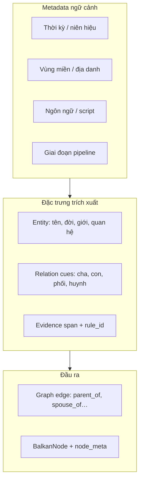

# Plan — Bộ đặc trưng dữ liệu cho trích xuất quan hệ gia phả Hán-Nôm

> **Ngày:** 2026-07-20  
> **Luận văn:** Mô hình tự động xây dựng gia phả từ ngôn ngữ Hán-Nôm  
> **Liên quan:** [rule_based_genealogy_extraction_steps.md](./rule_based_genealogy_extraction_steps.md), [output_formats_and_ui_plan.md](./output_formats_and_ui_plan.md), [RESEARCH_SOURCES.md](../RESEARCH_SOURCES.md)

---

## 1. Vì sao cần bộ đặc trưng (feature set)

Trích xuất quan hệ **không thể** chỉ dựa vào vài regex Quốc ngữ hiện đại (`"A là cha của B"`). Gia phả Hán-Nôm có:

- **Nhiều lớp ngôn ngữ** trên cùng một trang (Hán, Hán-Việt, Nôm, phiên âm, chú thích)
- **Niên hiệu** thay vì năm Dương lịch (Thiệu Trị 3, Đinh Sửu 1697, Bảo Đại 7 / 1932)
- **Danh xưng theo địa vực** (huynh đệ Bắc vs anh em Nam; từ điển quan hệ khác nhau)
- **Cấu trúc theo thời kỳ** (đời thứ N, chi/ngành, thủy tổ, phả ký vs bi ký)

**Mục tiêu plan này:** định nghĩa **bộ đặc trưng có cấu trúc** (entity features + relation cues + context metadata) để:

1. Rule-based extractor biết **bắt gì, ở đâu**
2. LLM/Gemini prompt có **schema rõ ràng**
3. Đánh giá được **theo từng thời kỳ / vùng / ngôn ngữ**
4. Xây **labeled dataset** cho fine-tune Phase 2



---

## 2. Khung phân loại đặc trưng (taxonomy)

| Lớp | Mã | Mô tả | Ví dụ |
|-----|-----|--------|-------|
| **F0 — Document context** | `doc.*` | Metadata toàn cuốn | Place, Date, Language, Creator |
| **F1 — Person entity** | `person.*` | Thuộc tính một người | tên, huý, tự, hiệu, đời |
| **F2 — Relation cue** | `rel.*` | Cụm từ / pattern gợi quan hệ | `con`, `phối`, `đệ`, `長子` |
| **F3 — Event / life** | `event.*` | Sinh, mất, thi cử, phong quan | `sinh năm`, `Hoàng giáp`, `tri huyện` |
| **F4 — Lineage structure** | `lineage.*` | Cấu trúc dòng họ | thủy tổ, chi, ngành, đời thứ N |
| **F5 — Spatial** | `geo.*` | Địa danh gắn người / họ | làng Trung Tự, Hà Nội, Gia Miêu |
| **F6 — Provenance** | `prov.*` | Nguồn, trang, OCR confidence | page_no, ocr_line_id |

**Quan hệ canonical (output):** `parent_of`, `mother_of`, `spouse_of`, `sibling_of`, `child_of`, `ancestor_of` — map từ F2.

> **Phân tích tính chất ngôn ngữ (ưu tiên đọc trước):**  
> → [genealogy_language_features_analysis.md](./genealogy_language_features_analysis.md)  
> **Đào sâu từng lớp (catalog field, merge rules, suy luận, gán nhãn):**  
> → [genealogy_feature_layers_deep_dive.md](./genealogy_feature_layers_deep_dive.md)  
> **Bảng metrics chỉnh sửa / phân tích:**  
> → [genealogy_feature_metrics_table.md](./genealogy_feature_metrics_table.md)

---

## 3. Đặc trưng theo giai đoạn pipeline (7 bước)

Mỗi giai đoạn **sinh ra** và **tiêu thụ** tập đặc trưng khác nhau.

| Step pipeline | Input features | Output features | Ghi chú code hiện tại |
|---------------|----------------|-----------------|------------------------|
| ① NAME | `doc.title_vn`, `doc.title_han` | `tree.name` | ✅ `PipelineStepId.NAME` |
| ② HANNOM_IMAGE | `doc.pages[]`, `file.position` | `image.file_key`, `page_no` | ✅ Nom crawl → `hinh_anh` |
| ③ OCR | ảnh pixel | `ocr_text`, `ocr_lines[]`, `transcription_text` | ✅ Kim Hán Nôm API |
| ④ HAN_CHARS | `ocr_text` (Hán/Nôm) | `han_span[]`, chữ normalized | ❌ chưa tách riêng |
| ⑤ QUOC_NGU | phiên âm / `combined_transcription.txt` | `text_normalized`, `sentences[]` | 🔄 một phần |
| ⑥ DISTILLED | câu + entity candidates | `ExtractedRelation[]` | 🔄 rule MVP Quốc ngữ |
| ⑦ OUTPUT | edges validated | `BalkanNode[]`, `node_meta` | 🔄 Gemini + store |

### 3.1. Feature bundle theo giai đoạn (đề xuất schema)

**Sau OCR (step ③):**

```json
{
  "page_no": 11,
  "ocr_text": "阮文政…",
  "transcription_text": "Nguyễn Văn Chính…",
  "script_detected": ["han", "nom"],
  "ocr_confidence": null
}
```

**Sau normalization (step ⑤):**

```json
{
  "sentence_id": "s-042",
  "text": "Đời thứ 7: Nguyễn Trù, hiệu Loại Am, tự Trung Lượng…",
  "features": {
    "generation_marker": "Đời thứ 7",
    "person_names": ["Nguyễn Trù"],
    "aliases": { "hiệu": "Loại Am", "tự": "Trung Lượng" },
    "exam_year": { "raw": "Đinh sửu", "gregorian": 1697 }
  }
}
```

**Sau extraction (step ⑥):**

```json
{
  "source_person": "Nguyễn Trù",
  "relation_type": "parent_of",
  "target_person": "Nguyễn Ngoạn",
  "evidence": "con Nguyễn Trù",
  "rule_name": "child_of_inline",
  "confidence": 0.88,
  "context": { "generation": 8, "region_hint": "north", "lang_layer": "quoc_ngu_transcription" }
}
```

---

## 4. Đặc trưng theo ngôn ngữ / script

> **Đào sâu đầy đủ (danh xưng, cue, đời thứ, niên hiệu, chiều quan hệ, gap code):**  
> → [genealogy_language_features_analysis.md](./genealogy_language_features_analysis.md)

Gia phả Hán-Nôm thường **chồng nhiều lớp** trên cùng corpus.

| Lớp ngôn ngữ | Mã | Đặc trưng cần bắt | Pattern / ví dụ | Rule priority |
|--------------|-----|-------------------|-----------------|---------------|
| **Chữ Hán** | `han` | Tên Hán, quan hệ Hán, đời Hán | 子, 女, 配, 殁, 生, 長子, 次子 | Cao (nguồn gốc) |
| **Hán-Việt đọc** | `han_viet` | Âm Hán-Việt trong phiên âm | Nguyễn, Trần, công, khoa | Trung bình |
| **Chữ Nôm** | `nom` | Tên/từ Nôm trong OCR | 𡄶, 𠊛 (cần font/dictionary) | Thấp (OCR khó) |
| **Phiên âm Quốc ngữ** | `quoc_ngu_trans` | Câu mô tả quan hệ | "con Nguyễn Trù", "Đời thứ 8" | **Cao** (extractor hiện tại) |
| **Quốc ngữ hiện đại** | `quoc_ngu_modern` | Mô tả metadata Nom | Description field volume 855 | Trung bình |
| **Niên hiệu / Can chi** | `era` | Thời gian không dương lịch | Thiệu Trị 3, Nhâm Thân, Đinh Sửu | Cao (→ `birthYear`) |

### 4.1. Ma trận quan hệ × ngôn ngữ (MVP → mở rộng)

| Quan hệ | Quốc ngữ (đã có) | Hán (cần bổ sung) | Ghi chú |
|---------|------------------|-------------------|---------|
| Cha | `cha`, `bố`, `là con của` (đảo) | 父, 考, 乃父 | Volume 855: "con Nguyễn Trù" |
| Mẹ | `mẹ`, `má` | 母, 妣 | |
| Vợ/chồng | `kết hôn`, `vợ của`, `phối` | 配, 室, 妻, 娶 | |
| Con | `có con`, `sinh được` | 子, 女, 生 | |
| Anh em | `anh em`, `huynh đệ` | 兄, 弟, 姊, 妹 | Bắc: huynh đệ; Nam: anh chị em |
| Ông/bà | (chưa) | 祖, 祖母, 孫 | Mở rộng Phase 2 |
| Thứ tự con | `con trưởng`, `thứ` | 長子, 次子, 三子 | Quan trọng cho sibling order |

**Code hiện tại** (`patterns.py`): chỉ `quoc_ngu_modern` + `quoc_ngu_trans` một phần — **chưa có rule Hán**.

---

## 5. Đặc trưng theo thời kỳ lịch sử

Niên đại gia phả ảnh hưởng **từ vựng quan hệ**, **danh hiệu**, **cấu trúc đời**.

| Thời kỳ | Khoảng niên | Đặc trưng điển hình | Quan hệ / danh xưng | Corpus mẫu dự án |
|---------|-------------|---------------------|---------------------|------------------|
| **Lê sơ – Lê trung hưng** | 1428–1789 | Quan hàm triều Lê, `công`, `hầu` | Thái thượng tự thừa, Cẩm y vệ | Vol. 855: Phúc Đoan công (Lê sơ) |
| **Nhà Nguyễn / Phong kiến muộn** | 1802–1945 | Khoa bảng: `Hoàng giáp`, `Tiến sĩ`, `Giám sinh` | Huân tước, phong `xứ tham chính` | Vol. 855: Hoàng giáp 1697, Tiến sĩ án sát |
| **Thời Pháp thuộc** | 1884–1945 | Niên hiệu Thành Thái, Duy Tân, Bảo Đại | Song ngữ Hán + Quốc ngữ trong mô tả | Vol. 429: Duy Tân nguyên niên 1912; 855: Bảo Đại 7 / 1932 |
| **Cận – hiện đại** | 1945–nay | Quốc ngữ thuần, năm dương lịch | Anh, chị, em; bỏ huý | VGP crawl, user upload |
| **Không xác định** | — | Chỉ có can chi / đời thứ | Cần bảng tra niên hiệu | Fallback parser |

### 5.1. Feature `era` (chuẩn hóa thời gian)

| Field | Kiểu | Nguồn | Ví dụ |
|-------|------|-------|-------|
| `era.raw` | string | OCR / metadata | `保大七年`, `Thiệu Trị thứ 3` |
| `era.can_chi` | string | regex | `Đinh Sửu`, `Nhâm Thân` |
| `era.gregorian_year` | int? | lookup table | 1932, 1843, 1697 |
| `generation_index` | int? | `Đời thứ N` | 7, 8 |
| `dynasty_tag` | enum? | NLP / keyword | `le`, `nguyen`, `unknown` |

**Pilot volume 855** chứa đủ feature: đời 2–8, Lê sơ, Hoàng giáp, Thiệu Trị, Bảo Đại, Nhâm Thân — **nên làm gold corpus đánh giá**.

---

## 6. Đặc trưng theo vùng miền / địa phương

| Vùng | Mã | Đặc trưng địa lý | Ảnh hưởng ngôn ngữ quan hệ | Ví dụ corpus |
|------|-----|------------------|----------------------------|--------------|
| **Bắc Bộ** | `north` | Làng, thôn, phường, nội thành Hà Nội | Huynh đệ, cụ, từ, hiệu, huý | Vol. 855: Trung Tự, Hà Nội; 1255/1256 Thắng Nghiêm |
| **Trung Bộ** | `central` | Phủ, huyện Huế, Quảng Nam | Danh xưng triều chính Huế | (bổ sung sau) |
| **Nam Bộ** | `south` | Thôn, ấp, tỉnh Nam Kỳ | Anh/chị/em; tên Hán khác | Vol. 208: Tả Thanh Oai / Hữu Châu (Đông Trù) — **cần verify địa danh** |
| **Không rõ** | `unknown` | Chỉ có `Place` metadata | Dùng rule Quốc ngữ chung | Default |

### 6.1. Feature `geo` (gắn person / document)

| Field | Mô tả | Nguồn |
|-------|--------|-------|
| `geo.place_raw` | Chuỗi gốc | Nom `fields.Place`: `河内 • Hà Nội` |
| `geo.locality` | Làng / phường | Description: `làng Trung Tự` |
| `geo.province` | Tỉnh / thành | Hà Nội, Hưng Yên… |
| `geo.region` | `north` / `central` / `south` | Rule lookup hoặc gazetteer |
| `geo.migration_note` | Di cư | "Gia Miêu Ngoại trang di cư ra" |

**Metadata Nom** (`fields.Place`, `Description`) là **F0 context** — phải parse trước khi extract (xem [nomfoundation_storage_ocr_metadata_gaps.md](./nomfoundation_storage_ocr_metadata_gaps.md)).

---

## 7. Bộ đặc trưng entity (F1) — đầy đủ cho quan hệ

Để suy ra quan hệ cần **entity đủ giàu**, không chỉ `name`.

| Feature | Field đề xuất | Map BalkanNode | Có trong code? |
|---------|---------------|----------------|----------------|
| Họ + tên | `person.full_name` | `name` | ✅ |
| Huý | `person.taboo_name` | `node_meta` | ❌ |
| Tự | `person.courtesy_name` | `node_meta.alias` | ❌ |
| Hiệu | `person.pseudonym` | `title` / meta | 🔄 `title` |
| Giới | `person.gender` | `gender` | ✅ (Gemini/rule) |
| Đời thứ | `person.generation` | meta | ❌ |
| Chi / ngành | `person.branch` | meta | ❌ |
| Năm sinh | `person.birth_year` | `birthYear` | 🔄 regex năm |
| Năm mất | `person.death_year` | `deathYear` | 🔄 |
| Quan hệ inline | `person.parent_ref`, `spouse_ref` | `fid`/`mid`/`pids` | 🔄 edges |
| Chức / khoa | `person.rank`, `person.exam` | `bio` / meta | ❌ |
| Địa | `person.burial`, `person.residence` | `node_meta.burialPlace` | 🔄 VGP only |

---

## 8. Ma trận: thời kỳ × vùng × ngôn ngữ → chiến lược extract

|  | Bắc (855, 1255) | Trung | Nam (208) |
|--|-----------------|-------|-----------|
| **Hán thuần (OCR)** | Rule Hán + phiên âm song song | + từ điển Huế | + từ Nôm Nam |
| **Phiên âm (1932)** | Rule QN + `Đời thứ` + can chi | Tương tự | Tên địa phương Nam |
| **Quốc ngữ hiện đại (VGP)** | Regex MVP ✅ | ✅ | ✅ |
| **Niên hiệu Pháp thuộc** | Bảng tra Bảo Đại / Thành Thái | | |

**Chiến lược hybrid đề xuất:**

```text
1. Detect doc context (F0): region, era, language từ metadata
2. Chọn rule pack: north_han_trans | modern_vn | ...
3. Rule chắc chắn → edge
4. LLM (Gemini) → edge + entity F1 còn thiếu
5. Validator: không self-edge, tuổi cha-con, gender parent
6. Graph builder → BalkanNode
```

---

## 9. Gap so với code hiện tại

| Hạng mục | Trạng thái | File |
|----------|------------|------|
| Rule Quốc ngữ cơ bản | ✅ | `domains/extraction/rules/patterns.py` |
| Entity: tên viết hoa | ✅ | `entity_extractor.py` |
| Quan hệ: cha/mẹ/con/vợ/anh em | ✅ | `extractor.py` |
| Feature F0 từ Nom metadata | ❌ | Cần `metadata_mapper` |
| Rule chữ Hán | ❌ | |
| Niên hiệu / can chi → năm | ❌ | |
| `generation_index`, `branch` | ❌ | |
| Region-aware synonym | ❌ | |
| Feature store / labeled JSONL | ❌ | |
| Đánh giá theo corpus slice | ❌ | |

---

## 10. Lộ trình xây bộ đặc trưng

| Phase | Việc | Deliverable | Effort |
|-------|------|-------------|--------|
| **P0** | Chốt schema F0–F6 (JSON Schema) | `schemas/genealogy_features.json` | 2 ngày |
| **P0** | Map Nom metadata → F0 (`place`, `era`, `region`) | `metadata_mapper.py` | 0.5 ngày |
| **P1** | Gold corpus 3 volume: 1255, 855 (mô tả), 208 | `data/labeled/` + README | 1 tuần |
| **P1** | Rule pack `quoc_ngu_trans`: `Đời thứ`, `con X`, can chi | +20 patterns | 3 ngày |
| **P2** | Rule pack Hán: 子/女/配/考/妣 | +30 patterns | 1 tuần |
| **P2** | Bảng tra niên hiệu (CSV) | `data/era_lookup.csv` | 2 ngày |
| **P3** | Region synonym table | `data/region_relations.yaml` | 2 ngày |
| **P3** | Feature export cho train | JSONL `{features, edges}` | 3 ngày |
| **P4** | Benchmark report theo slice | Báo cáo luận văn chương 4 | 1 tuần |

---

## 11. Corpus pilot & annotation guide

| Volume | Vùng | Thời kỳ | Ngôn ngữ | Mục đích feature |
|--------|------|---------|----------|----------------|
| **1255** Chu tộc (6 tr) | Bắc (TNVNPF) | Thắng Nghiêm | Hán + scan | OCR + layout đơn giản |
| **1256** Lê tộc (30 tr) | Bắc | — | Hán | Scale OCR |
| **208** Đông Trù (79 tr) | Bắc (NLV) | 1858 Tự Đức | Hán | Volume lớn, địa danh |
| **855** Nguyễn tộc (101 tr) | Hà Nội | 1932 / Thiệu Trị | Hán + mô tả QN dài | **Gold F0+F1+F4** (Description) |
| **vgp-122** | User-generated | Hiện đại | Quốc ngữ | Baseline rule MVP |

**Hướng dẫn gán nhãn (tối thiểu mỗi câu):**

- Đánh dấu `generation_marker`, `person_names[]`, `relation_cue`
- Ghi `evidence` span nguyên văn
- Gán `region_hint`, `lang_layer`, `era` nếu suy ra được

**Pilot VGP (Label Studio, Quốc ngữ):** schema cụ thể `PER_NAME` / `GENERATION` / `DATE` / `ORDER` / `LOC` + quan hệ `FATHER_OF` / `MOTHER_OF` / `SPOUSE` — xem [label_studio_pipeline/HUONG_DAN_GAN_NHAN.md](../label_studio_pipeline/HUONG_DAN_GAN_NHAN.md).

---

## 12. Acceptance criteria (luận văn)

- [ ] Có tài liệu schema F0–F6 và ví dụ JSON cho mỗi lớp
- [ ] Ít nhất **1 corpus gold** (vol. 855 Description hoặc 10 trang OCR ghép) với nhãn quan hệ
- [ ] Rule pack bổ sung: `Đời thứ N`, `con X`, can chi → `birthYear` (≥5 pattern mới)
- [ ] Metadata Nom map được `geo.region`, `era.gregorian_year` (≥3 field)
- [ ] Báo cáo precision/recall **tách theo**: Quốc ngữ vs phiên âm; có/không `generation_marker`
- [ ] Ma trận gap (mục 9) cập nhật ≥80% hạng mục sang ✅

---

## 13. Phụ lục — Ví dụ feature từ volume 855 (Description)

**Input (trích):**

> Gia phả cho biết Thuỷ tổ họ này là Thanh Quốc công… Đời thứ 7: Nguyễn Trù, hiệu Loại Am, tự Trung Lượng, Hoàng giáp khoa Đinh sửu (1697). Đời thứ 8: Nguyễn Ngoạn, tự Hữu Tự, **con Nguyễn Trù**.

**Feature parse đề xuất:**

```json
{
  "doc": {
    "place_raw": "河内 • Hà Nội",
    "region": "north",
    "era_document": { "raw": "保大七年", "gregorian_year": 1932 }
  },
  "entities": [
    {
      "name": "Nguyễn Trù",
      "generation": 7,
      "pseudonym": "Loại Am",
      "courtesy_name": "Trung Lượng",
      "exam": { "type": "hoang_giap", "can_chi": "Đinh sửu", "year": 1697 }
    },
    {
      "name": "Nguyễn Ngoạn",
      "generation": 8,
      "courtesy_name": "Hữu Tự",
      "parent_ref": "Nguyễn Trù"
    }
  ],
  "relations": [
    {
      "source": "Nguyễn Trù",
      "type": "parent_of",
      "target": "Nguyễn Ngoạn",
      "evidence": "con Nguyễn Trù",
      "rule_name": "child_of_inline_vn"
    }
  ],
  "lineage": {
    "thuy_to": "Thanh Quốc công",
    "branch": "Nguyễn Trù (Hoàng giáp)"
  }
}
```

---

## 14. File liên quan (triển khai sau)

| File (đề xuất) | Nội dung |
|----------------|----------|
| `nlp_family_extractor/app/extraction/feature_schema.py` | Pydantic models F0–F6 |
| `nlp_family_extractor/app/extraction/era_lookup.py` | Can chi / niên hiệu → năm |
| `nlp_family_extractor/app/extraction/region_packs/` | Rule theo vùng |
| `nlp_family_extractor/data/labeled/` | Gold annotation |
| `planning/genealogy_extraction_feature_set_plan.md` | **File này** |

---

*Tài liệu sống — cập nhật khi bổ sung rule pack, corpus gold, hoặc kết quả thực nghiệm luận văn.*
