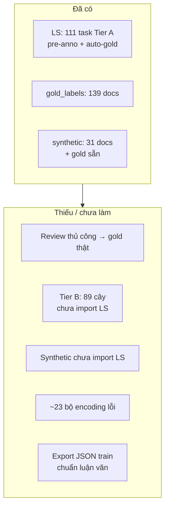
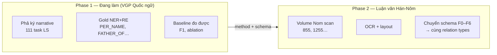
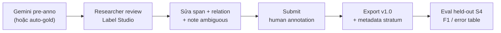

# Phân tích — Mở rộng dữ liệu Label Studio

> **Ngày:** 2026-08-06  
> **Trạng thái:** Phân tích & đề xuất lộ trình  
> **Bối cảnh:** Sau phiên [02_08_2026.md](../note_meeting_weekly/02_08_2026.md) — đã có gold + Tier A trên LS  
> **Liên quan:** [label_studio_pipeline_plan.md](./label_studio_pipeline_plan.md), [HUONG_DAN_GAN_NHAN.md](../label_studio_pipeline/HUONG_DAN_GAN_NHAN.md)

---

## 1. Mục tiêu

Xây thêm dữ liệu cho **Label Studio** phục vụ gold dataset NER + Relation Extraction, với ràng buộc:

- **Tiết kiệm Gemini** — chỉ gọi LLM khi Phả ký thật thật sự cần pre-annotation
- **Tách rõ nguồn** — Phả ký thật vs Phả ký synthetic (từ sơ đồ)
- **Ưu tiên chất lượng** hơn số lượng task

---

## 2. Trạng thái hiện tại (snapshot)

### 2.1. Trên disk

| Nguồn | Số `tree_id` | Ghi chú |
|-------|-------------|---------|
| `data/vgp_corpus/` | **2.152** | Raw crawl (gitignore) |
| `data/gia_pha/` export | **342** | Export chuẩn hóa (gitignore) |
| `data/gemini_labels/` | **145** | Pre-annotation Gemini (gitignore) |
| `data/gold_labels/` | **139** | Gold validated (đã commit) |
| `data/synthetic_pha_ky/` | **31** | Phả ký bổ sung từ sơ đồ (đã commit) |

### 2.2. Phân tier (corpus)

| Tier | Số lượng | Tiêu chí | Đã Gemini? |
|------|----------|----------|------------|
| **A** | **101** | Narrative + score ≥70 + relation cues ≥5 | ✅ 100% |
| **B** | **111** | Suitable, chưa đủ Tier A | ❌ **89** chưa |
| Skip | ~1.940 | Quá ngắn / meta / encoding | — |

### 2.3. Label Studio (project id **3**)

| Chỉ số | Giá trị |
|--------|---------|
| Task trên LS | **111** (Tier A only, sau dọn 44 task cũ) |
| Có gold annotation (auto) | **~110** |
| Review thủ công (Submit sửa tay) | **0** |
| Tier A có relation ≥5 (gold) | **9** bộ — **ưu tiên review** |

### 2.4. Synthetic (chưa trên LS)

| Chỉ số | Giá trị |
|--------|---------|
| Gia phả | 31 |
| Relation gold | ~12.038 |
| Gemini | **0** lần gọi |
| Xem: | `data/synthetic_pha_ky/index.html` |

---

## 3. Khoảng trống (gap analysis)



| Gap | Mức độ | Ghi chú |
|-----|--------|---------|
| Gold **thủ công** (human-reviewed) | 🔴 Cao | Auto-gold ≠ gold luận văn; chỉ **9** Tier A có relation đủ mạnh |
| Tier B chưa LS | 🟡 Trung bình | 89 cây — cần **~89 lần Gemini** nếu import full |
| Synthetic chưa LS | 🟡 Trung bình | 31 task — **0 Gemini**, gold có sẵn |
| LS vs Tier A lệch (111 vs 101) | 🟢 Thấp | Một số task có thể trùng / import ngoài tier file — cần audit |
| Encoding Phả ký | 🟡 Trung bình | Tree 1065: `pha_ky_fix.txt` chưa vào pipeline thật |
| Train split / versioning | 🟡 Trung bình | Chưa có `train/val/test` từ LS export |

---

## 4. Ba hướng mở rộng LS

### Hướng A — **Chất lượng trước** (khuyến nghị làm trước)

**Mục tiêu:** 10–20 task gold **đã review tay**, không tăng Gemini.

| Bước | Việc | Gemini |
|------|------|--------|
| A1 | Review 9 Tier A relation≥5 trên LS → Submit | ❌ |
| A2 | Bổ sung thêm ~5–10 Tier A score cao từ `tier_a_trees.json` | ❌ |
| A3 | Export LS → `data/gold_labels/reviewed/` | ❌ |

**Task ưu tiên review** (relation gold ≥5, narrative):

| tree_id | Ghi chú |
|---------|---------|
| 391 | Outlier lớn (~48k chars) — chia review theo đoạn |
| 231, 232, 422 | Narrative dài, nhiều relation |
| 383, 122 | Pilot chất lượng tốt |
| 1691, 277, 1508, 1622 | Batch mới |

**Acceptance:** ≥10 task có annotation `completed_by` human + sửa khác auto-gold.

---

### Hướng B — **Synthetic → Label Studio** (rẻ, nhanh)

**Mục tiêu:** Thêm ~31 task relation-dense **không gọi Gemini**.

| Quyết định | Đề xuất |
|------------|---------|
| Project LS | **Tách project mới** `Family Tree NER+RE (Synthetic)` — tránh lẫn prose thật |
| Nội dung task | `synthetic_pha_ky.txt` |
| Pre-annotation | **Không cần** — import thẳng gold từ `gold.ls_annotation.json` |
| Mở rộng thêm | Chạy `generate_synthetic --limit 50` trên sơ đồ lớn còn lại |

**Cần implement (chưa có):**

```text
label_studio_pipeline/import_synthetic.py
  → đọc data/synthetic_pha_ky/{id}/
  → import task + annotation ground_truth=True
  → metadata: source=synthetic_from_pha_he
```

**Acceptance:** 31+ task synthetic trên LS project riêng; tag rõ trong export JSON.

---

### Hướng C — **Tier B → LS** (tốn Gemini, làm có chọn lọc)

**Mục tiêu:** Mở rộng Phả ký thật trên LS từ 111 → ~150–180 task.

| Lọc đề xuất | Tiêu chí |
|-------------|----------|
| Chỉ top Tier B | `score ≥ 60`, relation cues ≥3 |
| Cap mỗi batch | **20–30 tree** / lần (kiểm soát chi phí Gemini) |
| Skip | encoding lỗi, pha_ky > 12k chars (trừ khi chunk plan) |

```bash
# Chưa chạy — mẫu lệnh
python -m label_studio_pipeline.label_and_import \
  --pilot-file data/vgp_corpus/tier_b_trees.json \
  --cross-check
# Cần: --limit 30 hoặc filter trong tier file trước
```

**Ước lượng Gemini:** ~20–30 lần gọi / batch (~1 lần / tree Tier B).

---

## 5. Ma trận quyết định nguồn task

| Nguồn Phả ký | Import LS? | Gemini? | Gold ban đầu | Dùng train |
|--------------|-----------|---------|--------------|------------|
| Tier A — đã LS | ✅ Có | Đã xong | auto-gold → **review tay** | ✅ Gold chính |
| Tier B — narrative | ⚠️ Batch nhỏ | ✅ Có | auto-gold | ✅ Bổ sung |
| Synthetic — sơ đồ | ✅ Project riêng | ❌ | gold sẵn 100% | ⚠️ Pre-train RE only |
| Meta / quá ngắn | ❌ | ❌ | — | ❌ |
| `pha_ky_fix` (1065…) | ⚠️ Sau sửa encoding | Tuỳ | rule-based | ✅ Nếu narrative |

**Nguyên tắc:** Không trộn synthetic vào export gold chính mà không tag `source`.

---

## 6. Lộ trình đề xuất (4 tuần)

| Tuần | Việc | Output LS | Gemini |
|------|------|-----------|--------|
| **1** | Review tay 10 Tier A ưu tiên | 10 gold human | 0 |
| **1** | Implement + import synthetic (31) | +31 task (project 2) | 0 |
| **2** | Audit 111 task vs `tier_a_trees.json` | Báo cáo lệch | 0 |
| **2** | Sửa encoding + import 1065 (pha_ky_fix) | +1 Tier A | 0–1 |
| **3** | Tier B batch 1 (20 cây top score) | +20 task | ~20 |
| **4** | Export train/val split + doc schema | `data/gold_labels/v1/` | 0 |

---

## 7. Công việc kỹ thuật backlog

| # | Task | File / module | Ưu tiên |
|---|------|---------------|---------|
| P1 | CLI import synthetic → LS | `import_synthetic.py` | Cao |
| P2 | Export LS reviewed → train JSON | `export_ls_gold.py` | Cao |
| P3 | `--limit` + filter cho `label_and_import` + tier B | `label_and_import.py` | Trung bình |
| P4 | Audit script LS ↔ tier files | `audit_ls_tasks.py` | Trung bình |
| P5 | `pha_ky_fix.txt` fallback trong corpus | `export_giapha.py` / assess | Trung bình |
| P6 | Chunk plan cho tree >12k (391…) | planning riêng | Thấp |

---

## 8. Chỉ số mục tiêu (target)

| Chỉ số | Hiện tại | Mục tiêu ngắn hạn | Mục tiêu luận văn |
|--------|----------|-------------------|-------------------|
| Task LS (Phả ký thật) | 111 | 120–130 | 150+ |
| Task LS (Synthetic) | 0 | 31+ | 50+ (project riêng) |
| Gold **human-reviewed** | 0 | **≥10** | **≥30** |
| Relation / doc (gold thật) | ~6 TB | ≥8 | ≥10 |
| Lần gọi Gemini mới | — | ≤30/tháng | Có log |

---

## 9. Rủi ro

| Rủi ro | Giảm thiểu |
|--------|------------|
| Auto-gold bị coi là gold thật | Bắt buộc review ≥10 task; tag `gold_source: auto_v1 \| human` |
| Synthetic làm model học template | Project LS tách; không mix export; ablation khi train |
| Gemini cost Tier B | Batch 20–30; skip Tier B thấp điểm |
| Task 391 quá dài | Review từng section; hoặc phase chunk |
| LS / tier file lệch | Chạy audit P4 trước import thêm |

---

## 10. Lệnh tham chiếu nhanh

```bash
# Xem tier
python -m label_studio_pipeline.select_pha_ky_tiers

# Gold (không Gemini)
python -m label_studio_pipeline.submit_gold \
  --pilot-file data/vgp_corpus/tier_a_trees.json --skip-existing

# Synthetic (không Gemini)
python -m label_studio_pipeline.generate_synthetic --limit 30

# Tier A import (CÓ Gemini — chỉ khi có tree mới)
python -m label_studio_pipeline.label_and_import \
  --pilot-file data/vgp_corpus/tier_a_trees.json --cross-check

# Xem synthetic
open data/synthetic_pha_ky/index.html
```

---

## 11. Câu hỏi cần chốt trước khi implement

1. **Synthetic:** project LS riêng hay gộp project 3 (có filter tag)?
2. **Tier B:** batch đầu **20** hay **30** tree? Cap Gemini/tháng?
3. **Tree 391** (~48k chars): review full hay bỏ khỏi gold pilot?
4. **Gold human:** ai review — 1 người hay 2 (inter-annotator agreement)?

---

## 12. Góc nhìn nghiên cứu khoa học (luận văn)

> **Độc giả:** NCS / hội đồng — cần **đóng góp khoa học có thể bảo vệ**, không chỉ volume task trên LS.  
> **Liên quan:** [genealogy_extraction_feature_set_plan.md](./genealogy_extraction_feature_set_plan.md) §12, [luan_van_phan_tich_va_ke_hoach.md](./luan_van_phan_tich_va_ke_hoach.md)

### 12.1. Vị trí dataset trong đề tài

Đề tài gốc: *Mô hình xây dựng tự động cây gia phả từ văn bản Hán-Nôm*. Dataset Label Studio hiện tại là **Phase 1 — Quốc ngữ (VGP)**:



**Đóng góp khoa học Phase 1 (có thể viết chương 3–4):**

1. **Corpus có chú thích** gia phả Quốc ngữ narrative — hiếm, ít public dataset
2. **Schema quan hệ** (`FATHER_OF`, `MOTHER_OF`, `SPOUSE`) map được sang F2 feature plan
3. **Pipeline tái lập** crawl → assess → annotate → export (reproducible)
4. **So sánh** rule-based / LLM pre-anno / (sau này) fine-tuned trên cùng gold

**Chưa đủ để claim (nếu chỉ giữ hiện trạng):**

- “Gold standard” — vì **0** task human-reviewed, auto-gold từ Gemini + rule
- “SOTA extraction” — chưa có baseline số liệu công bố
- “Đại diện gia phả Việt Nam” — corpus lệch VGP user-generated, thiên Bắc/ Nam không cân bằng

---

### 12.2. Câu hỏi nghiên cứu (Research Questions)

| ID | Câu hỏi | Dữ liệu cần | Metric |
|----|---------|-------------|--------|
| **RQ1** | Trích xuất NER trên Phả ký narrative Quốc ngữ đạt độ chính xác nào theo từng nhãn? | ≥15 doc **human gold** | Entity F1 (micro/macro) theo `PER_NAME`, `DATE`, `LOC`… |
| **RQ2** | Trích xuất quan hệ cha/mẹ/vợ chồng từ **evidence span** trong câu đạt F1 bao nhiêu? | ≥10 doc có ≥5 relation/doc | Relation F1; **strict** (head+tail+type) |
| **RQ3** | Pre-train trên synthetic (sơ đồ→prose) có **cải thiện** RE trên Phả ký thật không? | 31 synthetic + held-out 5 doc thật | Ablation: w/ vs w/o synthetic |
| **RQ4** | Pattern ngôn ngữ nào khó nhất (error analysis)? | Gold + confusion matrix | Taxonomy lỗi: danh xưng, tên viết tắt, coreference |

**Giả thuyết (có thể bác bỏ):**

- **H1:** Relation F1 trên prose thật **< 0.65** nếu chỉ dùng LLM zero-shot — cần fine-tune hoặc rule
- **H2:** Synthetic pre-train **+5–10pt** relation F1 trên held-out thật (nếu không → synthetic chỉ dùng phụ lục)
- **H3:** Doc có `generation_marker` + relation cue rõ (**Tier A**) F1 cao hơn Tier B **≥10pt**

---

### 12.3. Phân loại giá trị khoa học theo nguồn dữ liệu

Không phải mọi task trên LS đều có **cùng trọng số** trong luận văn:

| Nguồn | Giá trị khoa học | Dùng cho | Không nên dùng cho |
|-------|-------------------|----------|---------------------|
| **Human-reviewed gold** (15–30 doc) | ⭐⭐⭐⭐⭐ | RQ1, RQ2, báo cáo chính | — |
| **Tier A auto-gold + sửa tay một phần** | ⭐⭐⭐⭐ | Bootstrap, pre-train | Claim “gold standard” |
| **Tier B narrative** | ⭐⭐⭐ | Mở rộng train, robustness | Test chính (trừ stratified) |
| **Synthetic (sơ đồ→template)** | ⭐⭐ | RQ3 ablation, pre-train RE | Train/test chính, đo F1 công bố |
| **Gemini pre-anno chưa sửa** | ⭐ | Demo pipeline | Mọi metric khoa học |
| **Meta / lời nói đầu only** (1065…) | ⭐ | Case study LOC/DATE | Relation extraction |

**Kết luận cho NCS:** Mở rộng LS từ 111 → 200 task **không tăng** giá trị khoa học nếu không có **human gold** và **protocol đánh giá**. Ưu tiên **15 doc chất lượng cao** hơn **100 doc auto**.

---

### 12.4. Thiết kế corpus có kiểm soát (stratified design)

Để hội đồng chấp nhận kết quả, corpus gold nên **cố ý đa dạng** thay vì random Tier A:

| Stratum (lớp) | Số doc đề xuất | Tiêu chí chọn | Mục đích khoa học |
|---------------|----------------|---------------|-------------------|
| **S1 — Relation-rich** | 8 | relation≥5, narrative_rich | RQ2 chính |
| **S2 — Medium** | 7 | relation 2–4, score≥75 | Generalization |
| **S3 — Hard** | 5 | Tên khó, list+prose mix, encoding đã sửa | Error analysis |
| **S4 — Held-out test** | 5 | Chọn trước, **không train** | Số liệu báo cáo cuối |
| **Double annotation** | 5 (subset S1+S4) | 2 annotator độc lập | Cohen's κ ≥0.75 |

**Metadata bắt buộc mỗi doc** (cho chương 3):

```json
{
  "doc_id": "vgp_122",
  "stratum": "S1",
  "split": "train",
  "region_hint": "north",
  "char_count": 4044,
  "relation_count_gold": 32,
  "gold_source": "human_v1",
  "annotator_id": "researcher",
  "review_date": "2026-08-…"
}
```

---

### 12.5. Giao thức annotation có giá trị công bố

| Hạng mục | Yêu cầu tối thiểu (luận văn) | Yêu cầu nâng cao (bài báo) |
|----------|------------------------------|----------------------------|
| Annotation guide | [HUONG_DAN_GAN_NHAN.md](../label_studio_pipeline/HUONG_DAN_GAN_NHAN.md) + ví dụ edge case | + decision tree 10 trang |
| Human review | ≥15 doc, 1 annotator chính | 2 annotator, 5 doc overlap |
| Inter-annotator agreement | Cohen's κ entity ≥0.70 | κ relation ≥0.65 |
| Versioning | `gold_labels/v1.0/` + changelog | DOI / Zenodo deposit |
| Provenance | `source`, `tree_id`, URL VGP | + `pha_he` cross-check score |
| Ethics | Trích dẫn nguồn VGP, nghiên cứu | Giấy phép / fair use ghi rõ |

**Quy trình gold “đủ luận văn”:**



---

### 12.6. Kế hoạch thực nghiệm (Chương 4)

#### Baselines (bắt buộc có số)

| # | Phương pháp | Mô tả | Công bằng |
|---|-------------|-------|----------|
| B0 | **Rule-based** | Regex relation cues (`con`, `hạ sinh`, `vợ`) | Cùng schema |
| B1 | **Gemini zero-shot** | Prompt hiện tại, không fine-tune | Cùng test S4 |
| B2 | **Auto-gold upper bound** | Oracle: gold entity spans cho sẵn, chỉ đo RE | Ceiling RE |
| B3 | **Fine-tuned** (nếu đủ data) | mBERT / PhoBERT NER+RE | Train S1+S2+S3 |

#### Ablation (đóng góp rõ)

| Thí nghiệm | Train | Test | Claim nếu có ý nghĩa |
|------------|-------|------|---------------------|
| A1 | Real gold only | S4 | Baseline chính |
| A2 | Real + synthetic | S4 | Synthetic có ích? |
| A3 | w/o GENERATION/DATE | S4 | Nhãn phụ có giúp RE? |
| A4 | Tier A only vs A+B | S4 | Thêm Tier B có overfit? |

#### Bảng kết quả mục tiêu (minh họa format chương 4)

| Model | PER F1 | REL-F1 (strict) | FATHER F1 | SPOUSE F1 | κ (entity) |
|-------|--------|-----------------|-----------|-----------|------------|
| B0 Rule | — | — | — | — | — |
| B1 Gemini | — | — | — | — | — |
| B3 Fine-tuned | — | — | — | — | — |

*(Điền số sau khi có S4 + human gold)*

#### Error analysis (bắt buộc 1–2 trang)

Phân loại lỗi theo [genealogy_language_features_analysis.md](./genealogy_language_features_analysis.md):

- **E1:** Nhầm PER vs LOC (tên làng)
- **E2:** Danh xưng (`ông`, `cụ`) gắn sai span
- **E3:** Coreference / tên viết tắt
- **E4:** Quan hệ implicit (cha không nói rõ giới tính)
- **E5:** Mismatch format tên vs `pha_he`

---

### 12.7. Vai trò synthetic trong luận văn (không overclaim)

Synthetic **31 doc / 12k relation** có giá trị **phụ trợ**, không phải đóng góp chính:

| Có thể viết | Không nên viết |
|-------------|----------------|
| “Phương pháp chuyển sơ đồ → prose template để augment RE” | “Corpus 12k quan hệ đại diện gia phả Việt Nam” |
| “Ablation: pre-train synthetic +X pt F1 trên 5 doc held-out” | “Thay thế annotation thủ công” |
| “Thảo luận hạn chế: template ≠ văn bản lịch sử” | “Gold chuẩn cho Hán-Nôm” |

**Điều kiện để synthetic vào luận văn chính thức:** RQ3 cho thấy cải thiện **có ý nghĩa thống kê** trên held-out **prose thật** (p<0.05 hoặc +≥5pt F1).

---

### 12.8. Liên kết Phase 2 (Hán-Nôm)

Dataset VGP Quốc ngữ **chuẩn bị method**, không thay thế corpus Nom:

| Thành phần | VGP Phase 1 | Nom Phase 2 |
|------------|-------------|-------------|
| Ngôn ngữ | Quốc ngữ hiện đại | Hán / Nôm / phiên âm |
| Schema relation | `FATHER_OF`, `SPOUSE` | Map → `parent_of`, `spouse_of` (F2) |
| Gold | LS + human review | Vol. 855 Description + OCR page |
| Tool | Label Studio | LS hoặc custom + OCR bbox |

**Bridge experiment (đóng góc thêm):** Cùng schema, so sánh F1 Quốc ngữ (S4) vs 5 trang Nom gold — minh họa *domain shift* trong chương 5 / hướng phát triển.

---

### 12.9. Đánh giá lại chiến lược mở rộng LS (theo giá trị khoa học)

| Hướng (§4) | Giá trị vận hành | Giá trị khoa học | Khuyến nghị NCS |
|------------|------------------|------------------|-----------------|
| **A — Review 10 Tier A** | Trung bình | **Rất cao** | ✅ **Làm ngay** |
| **B — Synthetic → LS** | Cao | Trung bình (RQ3) | ✅ Project riêng, phục vụ ablation |
| **C — Tier B +89** | Cao | Thấp–trung (trừ khi stratified) | ⚠️ Chỉ +7–10 doc vào train, không test |
| Import thêm 100 task | Cao | **Thấp** | ❌ Trì hoãn đến sau khi có S4 + metrics |

**Lộ trình ưu tiên khoa học (điều chỉnh §6):**

| Tuần | Việc | Output khoa học |
|------|------|-----------------|
| 1–2 | Chọn 25 doc stratified (S1–S4) | Sampling protocol |
| 2–4 | Human review 15 train + 5 test S4 | Gold v1.0 |
| 4 | Double-annotate 5 doc | Cohen's κ |
| 5 | Baseline B0, B1 trên S4 | Bảng số đầu tiên |
| 6 | Ablation RQ3 synthetic | Ablation table |
| 7–8 | Error analysis + viết chương 3–4 | Draft luận văn |

---

### 12.10. Checklist đóng góp khoa học (acceptance — luận văn)

- [ ] **RQ1–RQ2** được trả lời bằng số trên **held-out** (S4), không phải train set
- [ ] ≥**15** document human gold + metadata stratum
- [ ] ≥**5** document double-annotated + báo cáo κ
- [ ] ≥**2** baseline reproducible (rule + LLM hoặc fine-tuned)
- [ ] Error analysis ≥**50** lỗi phân loại (E1–E5)
- [ ] Thảo luận **hạn chế**: auto-gold, VGP bias, synthetic, chưa Hán-Nôm
- [ ] Pipeline + dataset version **reproducible** (commit, lệnh, schema JSON)
- [ ] (Tuỳ chọn) So sánh sơ bộ 1–5 trang Nom gold — domain shift

---

### 12.11. Tài liệu tham chiếu nội bộ

| Tài liệu | Dùng cho |
|----------|----------|
| [genealogy_extraction_feature_set_plan.md](./genealogy_extraction_feature_set_plan.md) | Schema F0–F6, acceptance §12 |
| [genealogy_feature_metrics_table.md](./genealogy_feature_metrics_table.md) | Bảng metrics |
| [HUONG_DAN_GAN_NHAN.md](../label_studio_pipeline/HUONG_DAN_GAN_NHAN.md) | Annotation guide |
| [02_08_2026.md](../note_meeting_weekly/02_08_2026.md) | Trạng thái kỹ thuật hiện tại |
| `data/synthetic_pha_ky/THONG_KE.md` | Thống kê synthetic |

---

*Cập nhật file này sau mỗi batch import LS, khi có số liệu baseline, hoặc khi thay đổi tiêu chí tier.*
