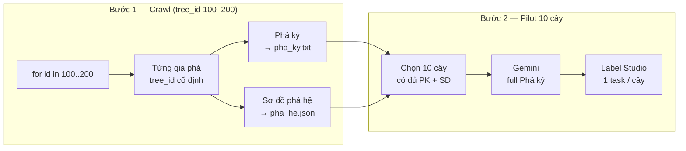
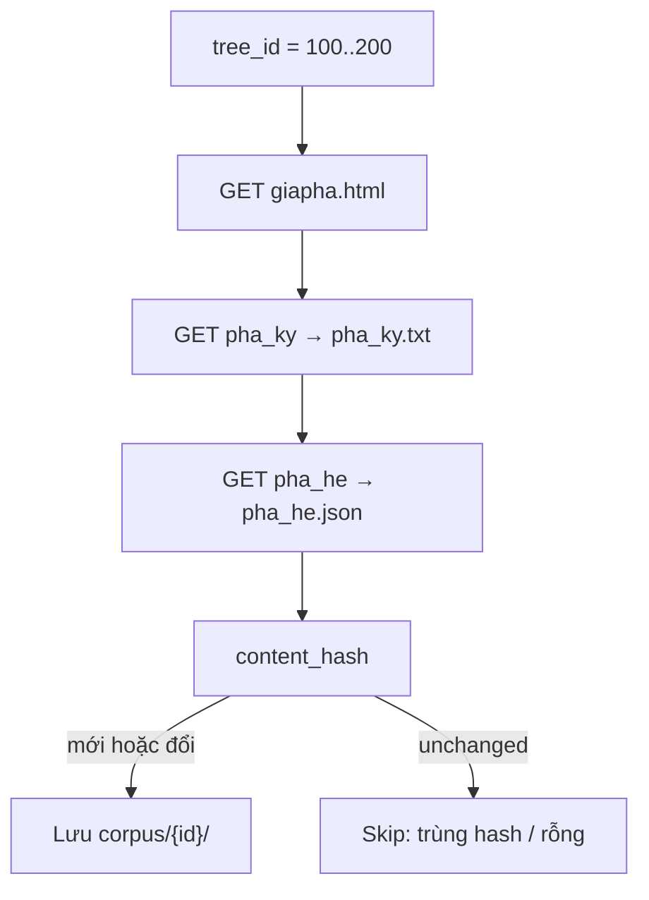

# Plan — Crawl web → Gemini gán nhãn → Label Studio

> **Ngày:** 2026-08-02 · **Cập nhật trạng thái:** 2026-08-02  
> **Trạng thái:** **Đã triển khai pilot** — crawl + Gemini + Label Studio import  
> **Hướng dẫn gán nhãn:** [HUONG_DAN_GAN_NHAN.md](../label_studio_pipeline/HUONG_DAN_GAN_NHAN.md)  
> **Thống kê:** [THONG_KE.md](../label_studio_pipeline/THONG_KE.md)  
> **Kế hoạch (2 bước):**  
> 1. Crawl theo dải `tree_id` **100–200**, vào từng gia phả lấy **Phả ký + Sơ đồ**  
> 2. Gemini gán nhãn **full Phả ký** → import Label Studio (pilot **10 gia phả**)  
> **Liên quan:** [vietnamgiapha_crawl_v2_plan.md](./vietnamgiapha_crawl_v2_plan.md), [genealogy_extraction_feature_set_plan.md](./genealogy_extraction_feature_set_plan.md)  
> **Code tham khảo (MVP cũ):** `label_studio_pipeline/`

---

## Quyết định đã chốt (2026-08-02)

| # | Hạng mục | Quyết định |
|---|----------|------------|
| **Q1** | Danh sách `tree_id` | Quét dải **`from–to`: 100–200** (mỗi ID cố định trên URL VGP) |
| **Q2** | Task Label Studio | **1 gia phả = 1 task = full Phả ký** (không chia chunk) |
| **Q3** | Nội dung crawl | **Phả ký** (văn xuôi) + **Sơ đồ** (`pha_he.html`) để phân tích |
| **Q4** | Pilot | **10 gia phả** (lấy từ dải 100–200, ưu tiên cây có đủ Phả ký + Sơ đồ) |

---

## Mục lục

1. [Tổng quan 2 bước](#1-tổng-quan-2-bước)
2. [Bước 1 — Crawl dữ liệu từ web](#2-bước-1--crawl-dữ-liệu-từ-web)
3. [Bước 2 — Gemini gán nhãn → Label Studio](#3-bước-2--gemini-gán-nhãn--label-studio)
4. [Luồng end-to-end (pilot)](#4-luồng-end-to-end-pilot)
5. [Cấu trúc dữ liệu lưu trữ](#5-cấu-trúc-dữ-liệu-lưu-trữ)
6. [Lộ trình triển khai](#6-lộ-trình-triển-khai)
7. [Acceptance criteria (pilot 38)](#7-acceptance-criteria-pilot-38)
8. [Rủi ro](#8-rủi-ro)

---

## 1. Tổng quan 2 bước



| Bước | Mục tiêu | Đầu ra |
|------|----------|--------|
| **1. Crawl** | Quét ID 100–200; mỗi ID lấy Phả ký + Sơ đồ | `data/vgp_corpus/{tree_id}/` |
| **2. Gemini + LS** | Pre-annotate **toàn bộ Phả ký**; Sơ đồ dùng đối chiếu | 10 task LS + file JSON sơ đồ |

**Phân vai nội dung:**

| Artifact | Nguồn URL | Dùng cho |
|----------|-----------|----------|
| `pha_ky.txt` | `/XemPhaKy/{id}/pha_ky_gia_su.html` | **Label Studio** (NER + Relation), input Gemini |
| `pha_he.json` | `/XemPhaHe/{id}/pha_he.html` | **Phân tích / đối chiếu** (cấu trúc cây, tên+đời) — không gộp vào 1 task text LS |
| `meta.json` | `/XemGiaPha/{id}/giapha.html` | Metadata: tên dòng họ, quê, thống kê |

---

## 2. Bước 1 — Crawl dữ liệu từ web

### 2.1. Discover: dải `tree_id` 100–200

```python
for tree_id in range(100, 201):  # inclusive: 100, 101, …, 200
    crawl_tree(tree_id)
```

- Mỗi `tree_id` là **ID cố định** trên VGP (không đổi theo session).  
- Tổng **101 ID** trong dải; nhiều ID có thể **rỗng** (không có gia phả).  
- Pilot chỉ cần **10 cây hợp lệ** — chọn trong dải sau khi crawl (xem §2.4).

Tham số CLI dự kiến:

```bash
--start 100 --end 200 --delay 0.5
```

### 2.2. Với mỗi `tree_id` — lấy gì?

| Thứ tự | Tab | URL | File output |
|--------|-----|-----|-------------|
| 1 | Gia phả (meta) | `XemGiaPha/{id}/giapha.html` | `meta.json` |
| 2 | **Phả ký** | `XemPhaKy/{id}/pha_ky_gia_su.html` | `pha_ky.txt` |
| 3 | **Sơ đồ phả hệ** | `XemPhaHe/{id}/pha_he.html` | `pha_he.json` (+ `pha_he.txt` tuỳ chọn) |

**Fallback sơ đồ:** nếu `pha_he.html` 404/rỗng → thử `cay_pha_he.html` (legacy, parser `javascript:o()`).

**Bỏ qua tree** nếu:

- Không có Phả ký (text rỗng hoặc < ngưỡng, vd. 200 ký tự), **và**
- Không parse được sơ đồ  

→ Ghi vào `crawl_state.json` với `reason: empty_or_invalid`.

### 2.3. Parse sơ đồ (`pha_he`)

Mục tiêu artifact `pha_he.json`:

```json
{
  "tree_id": 122,
  "source_url": "https://vietnamgiapha.com/XemPhaHe/122/pha_he.html",
  "lineage_name": "...",
  "node_count": 114,
  "nodes": [
    {
      "node_id": 12345,
      "label": "1.1 Nguyễn Văn A",
      "generation": 1,
      "order_in_generation": 1,
      "name": "Nguyễn Văn A",
      "gender": "male"
    }
  ],
  "relationships": [
    { "type": "parent_of", "from_id": 1, "to_id": 2, "side": "fid" }
  ]
}
```

Parser tham khảo: `nlp_family_extractor/tools/fetch_vietnamgiapha.py` (`parse_nodes`, `infer_parent_relationships`) + flat list trên `pha_he.html` (tree 11108).

**Vai trò trong pilot:** đối chiếu tên/đời/quan hệ từ Gemini (Phả ký) với cấu trúc sơ đồ — **không import sơ đồ vào Label Studio task text**.

### 2.4. Chọn 10 gia phả cho pilot

Sau khi crawl dải 100–200:

1. Lọc tree có **`pha_ky.txt` hợp lệ** (có văn bản) **và** **`pha_he.json` có `node_count > 0`**.  
2. Sắp xếp theo `tree_id` tăng dần.  
3. Lấy **10 cây đầu tiên** thỏa điều kiện.  
4. Ghi danh sách vào `data/vgp_corpus/pilot_trees.json`:

```json
{
  "range": { "start": 100, "end": 200 },
  "pilot_limit": 10,
  "selected_tree_ids": [122, 135, ...]
}
```

Nếu < 10 cây hợp lệ → báo cáo trong `summary.json`, vẫn chạy pilot với số cây có được.

### 2.5. Luồng crawl



- `content_hash` = SHA256(`pha_ky.txt` + `pha_he.json` normalized)  
- Crawl lại cùng ID → skip nếu hash không đổi  

### 2.6. Checklist Bước 1

| ID | Việc | Trạng thái |
|----|------|------------|
| 1.1 | CLI `--start 100 --end 200` | ✅ |
| 1.2 | Crawl `pha_ky.txt` + `meta.json` | ✅ |
| 1.3 | Parse `pha_he.json` | ✅ |
| 1.4 | `pilot_trees.json` / `batch_trees.json` | ✅ (38 task) |
| 1.5 | `crawl_state.json` + `summary.json` | ✅ |
| 1.6 | Mở rộng crawl 201–1500 | ✅ |

### 2.7. Hướng dẫn gán nhãn (human review)

Chi tiết đầy đủ: **[label_studio_pipeline/HUONG_DAN_GAN_NHAN.md](../label_studio_pipeline/HUONG_DAN_GAN_NHAN.md)**

Tóm tắt schema đang dùng:

| Loại | Nhãn |
|------|------|
| Entity | `PER_NAME`, `GENERATION`, `DATE`, `ORDER`, `LOC` |
| Relation | `FATHER_OF`, `MOTHER_OF`, `SPOUSE` |

1 task = 1 file **full Phả ký**; pre-annotation từ Gemini → annotator sửa trên Label Studio → Submit.

---

## 3. Bước 2 — Gemini gán nhãn → Label Studio

### 3.1. Phạm vi pilot

- **10 gia phả** từ `pilot_trees.json`.  
- **1 task Label Studio = 1 file `pha_ky.txt` nguyên văn** (full Phả ký, không chunk).  
- Metadata task: `tree_id`, `source_url`, `lineage_name`; đính kèm link/tham chiếu `pha_he.json` trong `meta` (không nhét sơ đồ vào field `text`).

### 3.2. Gemini — schema JSON

```json
{
  "entities": [
    { "text": "Huỳnh Tư", "label": "PER_NAME" },
    { "text": "1928", "label": "DATE" }
  ],
  "relations": [
    {
      "type": "FATHER_OF",
      "head": "Huỳnh Tư",
      "tail": "Huỳnh Phổ",
      "head_label": "PER_NAME",
      "tail_label": "PER_NAME"
    }
  ]
}
```

**Nhãn entity:** `PER_NAME`, `GENERATION`, `DATE`, `ORDER`, `LOC`  
**Nhãn relation:** `FATHER_OF`, `MOTHER_OF`, `SPOUSE`  

**Quy tắc:** `entities[].text` copy **nguyên văn** từ `pha_ky.txt` → map `start`/`end` cho Label Studio.

### 3.3. Đối chiếu với sơ đồ (phân tích, không LS)

Sau Gemini, script (hoặc báo cáo thủ công pilot):

| Kiểm tra | Nguồn A | Nguồn B |
|----------|---------|---------|
| Tên người có trong sơ đồ? | `entities` PER_NAME | `pha_he.nodes[].name` |
| Quan hệ cha/mẹ | `relations` FATHER/MOTHER_OF | `pha_he.relationships` |
| Đời / thứ tự | `GENERATION`, `ORDER` | `generation`, `order_in_generation` |

Output gợi ý: `data/gemini_labels/{tree_id}/cross_check.json`.

### 3.4. Label Studio

- Import **38 tasks** (8 pilot + 30 batch 2), mỗi task `data.text` = full `pha_ky.txt`.  
- Pre-annotations từ Gemini (`predictions[].result`).  
- XML config: NER + Relations (`ls_importer.py`).  
- **Human review:** [HUONG_DAN_GAN_NHAN.md](../label_studio_pipeline/HUONG_DAN_GAN_NHAN.md)

**Lưu ý doc dài:** tree như 11108 (~47k ký tự) vẫn **1 task** theo quyết định — chấp nhận UI có thể chậm; pilot có thể không nằm trong dải 100–200.

### 3.5. Checklist Bước 2

| ID | Việc | Trạng thái |
|----|------|------------|
| 2.1 | System prompt v1 (`prompts.py`) | ✅ |
| 2.2 | Gemini 38 × full Phả ký → cache JSON | ✅ |
| 2.3 | Convert → LS predictions | ✅ |
| 2.4 | Import 38 tasks vào LS project | ✅ |
| 2.5 | `cross_check.json` vs `pha_he.json` | ✅ |
| 2.6 | Gold annotate (human Submit) | 🔄 |

---

## 4. Luồng end-to-end (pilot)

```bash
# Bước 1 — Crawl dải 100–200
python -m label_studio_pipeline.crawl_corpus \
  --start 100 --end 200 \
  --output-dir data/vgp_corpus \
  --delay 0.5

# Chọn 10 cây pilot (tự động sau crawl)
# → data/vgp_corpus/pilot_trees.json

# Bước 2 — Gemini + Label Studio (chỉ 10 cây)
python -m label_studio_pipeline.label_and_import \
  --pilot-file data/vgp_corpus/pilot_trees.json \
  --corpus-dir data/vgp_corpus \
  --cross-check   # optional: so sánh với pha_he.json
```

Hai bước **tách file** — crawl xong review corpus trước khi gọi Gemini.

---

## 5. Cấu trúc dữ liệu lưu trữ

```
data/vgp_corpus/
├── crawl_state.json
├── summary.json
├── pilot_trees.json          # 10 tree_id đã chọn
└── {tree_id}/
    ├── meta.json             # từ giapha.html
    ├── pha_ky.txt            # → Label Studio task (full)
    ├── pha_he.json           # sơ đồ structured
    └── pha_he.txt            # (optional) export text phẳng

data/gemini_labels/
└── {tree_id}/
    ├── pha_ky.entities.json      # raw Gemini
    ├── pha_ky.ls_task.json         # task + predictions
    └── cross_check.json            # vs pha_he.json
```

---

## 6. Lộ trình triển khai

| Phase | Nội dung | Effort |
|-------|----------|--------|
| **P0** | Setup LS + Gemini key | 0.5 ngày |
| **P1** | Crawl 100–200 + pha_ky + pha_he + pilot_trees | 2 ngày |
| **P2** | Gemini + import 38 tasks LS | ✅ |
| **P3** | Human gold annotate + export | 🔄 |

**Thứ tự:** P0 → P1 → P2 → P3.

---

## 7. Acceptance criteria (pilot 38)

### Bước 1 — Crawl ✅

- [x] Quét dải **100–200** và **201–1500**
- [x] **38** gia phả import LS (8 pilot + 30 batch 2)
- [x] Mỗi tree có `pha_ky.txt` + `pha_he.json` + `meta.json`
- [x] Crawl lại → skip khi `content_hash` unchanged

### Bước 2 — Gemini + Label Studio ✅ (pre-anno)

- [x] **38 task** LS, mỗi task = **full Phả ký**
- [x] Pre-annotation hiển thị span + relation trên UI
- [x] Raw Gemini JSON trong `data/gemini_labels/`
- [x] `cross_check.json` (khi chạy `--cross-check`)

### Bước 3 — Gold annotation 🔄

- [ ] Review theo [HUONG_DAN_GAN_NHAN.md](../label_studio_pipeline/HUONG_DAN_GAN_NHAN.md)
- [ ] Submit ≥10 task gold
- [ ] Export JSON từ Label Studio  

---

## 8. Rủi ro

| Rủi ro | Giảm thiểu |
|--------|------------|
| Dải 100–200 có ít cây có Phả ký | Ghi `summary.json`; hạ pilot xuống N cây thực tế hoặc mở rộng dải sau |
| Full Phả ký rất dài → LS chậm | Chấp nhận pilot; zoom LS; mở rộng dải chọn cây ngắn hơn |
| Sơ đồ flat list vs JS tree | Parser dual: flat regex + legacy `javascript:o()` |
| Gemini text ≠ văn bản gốc | Prompt copy nguyên văn; log entity không map span |
| Rate limit VGP | `--delay 0.5`, User-Agent rõ ràng |

---

## Phụ lục — Log quyết định

| Câu hỏi | Quyết định | Ngày |
|---------|------------|------|
| Q1 Danh sách | Dải **100–200**, `tree_id` cố định trên URL | 2026-08-02 |
| Q2 Task LS | **1 task = full Phả ký** | 2026-08-02 |
| Q3 Tab crawl | **Phả ký + Sơ đồ** (pha_he); meta từ giapha | 2026-08-02 |
| Q4 Pilot | **10 gia phả** từ dải trên | 2026-08-02 |

---

*Bước tiếp theo: implement code theo P0 → P1 → P2 khi bạn yêu cầu.*
