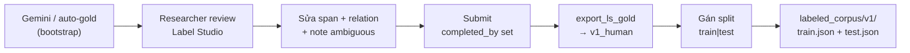

# Plan — Thu thập corpus gán nhãn (80% train / 20% test)

> **Vai trò:** Kế hoach nghiên cứu — thiết kế dataset có thể bảo vệ luận văn  
> **Độc giả:** NCS / GVHD / hội đồng · **Ngày:** 2026-08-10  
> **Báo cáo tổng hợp:** [consolidated_session_report_08_2026.md](./consolidated_session_report_08_2026.md)  
> **Schema nhãn:** `PER_NAME`, `GENERATION`, `DATE`, `ORDER`, `LOC` · `FATHER_OF`, `MOTHER_OF`, `SPOUSE`

---

## 1. Bối cảnh khoa học

### 1.1. Câu hỏi nghiên cứu (Phase 1 — Quốc ngữ)

| ID | Câu hỏi | Metric | Dataset cần |
|----|---------|--------|-------------|
| **RQ1** | NER trên Phả ký narrative đạt F1 bao nhiêu theo nhãn? | Entity F1 (micro/macro) | Human gold, test locked |
| **RQ2** | RE (cha/mẹ/vợ chồng) từ evidence span đạt F1 strict? | Relation F1 (head+tail+type) | Doc relation-rich |
| **RQ3** | Synthetic pre-train có cải thiện RE trên prose thật? | Ablation ΔF1 trên test | Train ± synthetic |
| **RQ4** | Pattern ngôn ngữ nào khó nhất? | Error taxonomy E1–E5 | Hard stratum S3 |

### 1.2. Giả thuyết có thể bác bỏ

- **H1:** LLM zero-shot relation F1 trên test **< 0.65** → cần fine-tune hoặc rule hybrid
- **H2:** Synthetic pre-train **+5–10 pt** relation F1 trên held-out (nếu không → synthetic chỉ phụ lục)
- **H3:** Tier A narrative F1 **≥10 pt** cao hơn Tier B

### 1.3. Nguyên tắc thiết kế dataset (bắt buộc)

1. **Split ở cấp document** — 1 Phả ký = 1 doc; không cắt câu random vào train/test
2. **Test set khóa trước** — chọn test **trước** annotation train; không điều chỉnh test sau khi thấy kết quả
3. **Stratified** — test phản ánh đa dạng (relation-rich, medium, hard)
4. **Provenance** — mỗi doc: `source`, `tree_id`, `stratum`, `annotator`, `gold_version`
5. **Tách synthetic** — synthetic **không** nằm trong train/test chính khi báo cáo metric chính
6. **Auto-gold ≠ gold** — chỉ metric chính trên **human-reviewed**

---

## 2. Thiết kế split 80% / 20%

### 2.1. Quy mô mục tiêu

| Giai đoạn | Tổng doc human gold | Train (80%) | Test (20%) | Thời gian |
|-----------|---------------------|-------------|------------|-----------|
| **MVP** (đã chọn) | **25** | 20 | 5 | Tuần 1–4 |
| **Luận văn tối thiểu** | **50** | 40 | 10 | Tuần 5–12 |
| **Mở rộng (tuỳ chọn)** | 80 | 64 | 16 | Sau bảo vệ draft |

> **25 doc MVP** đã có trong `data/gold_labels/stratified_sample.json` — **đúng tỷ lệ 80/20** (20 train + 5 test S4).

### 2.2. Phân tầng (strata) — giữ khi mở rộng lên 50

| Stratum | MVP (25) | Mở rộng →50 | Train | Test | Tiêu chí |
|---------|----------|-------------|-------|------|----------|
| **S1** Relation-rich | 8 | 16 | 13 | 3 | relation≥5, narrative_rich |
| **S2** Medium | 7 | 14 | 11 | 3 | relation 2–4, score≥75 |
| **S3** Hard | 5 | 10 | 8 | 2 | mixed, low overlap, encoding |
| **S4** Held-out | 5 | 10 | 0 | 10 | **Chỉ test** — chọn trước, khóa |
| **Tổng** | 25 | 50 | 40 | 10 | |

**Quy tắc mở rộng 25→50:** Thêm doc vào S1–S3 train; **không thêm vào S4 test** trừ khi mở rộng test lên 10 doc **một lần duy nhất** trước khi train bất kỳ model nào.

### 2.3. Test set v1 (locked — MVP)

```
1622, 1454, 544, 1813, 2346
```

File khóa: `data/labeled_corpus/v1/splits/test_ids.json` (tạo khi export v1)

### 2.4. Double annotation (Inter-annotator agreement)

| Subset | Số doc | Mục đích |
|--------|--------|----------|
| Overlap train+test | 5 | Cohen's κ entity ≥0.70, relation ≥0.65 |
| Doc overlap MVP | 544, 1454, 1622, 1813, 2346 | Trùng S4 test |

---

## 3. Nguồn dữ liệu và vai trò trong corpus

### 3.1. Ma trận nguồn → split

| Nguồn | Track | Train | Test | Ghi chú |
|-------|-------|-------|------|---------|
| VGP Tier A (human gold) | QN | ✅ | ✅ | Nguồn chính RQ1–RQ2 |
| VGP Tier B (selective) | QN | ✅ (mở rộng train) | ❌ | Chỉ train sau khi review |
| Synthetic (`synthetic_pha_ky`) | QN | ⚠️ Ablation only | ❌ | RQ3 — tag riêng |
| Nom Foundation scan | HN | Phase 2 | Phase 2 | Luận văn Hán-Nôm |
| giaphaonline.net | QN | Pilot train | ❌ | Parser mới — chưa vào test v1 |
| Auto-gold chưa review | QN | ❌ | ❌ | Bootstrap LS only |

### 3.2. Không được trộn khi export metric chính

```json
{
  "split": "train",
  "source": "vgp_human_v1",
  "synthetic_augmented": false
}
```

Synthetic chỉ vào experiment `train+synthetic` — so sánh với `train_only` trên **cùng test locked**.

---

## 4. Quy trình annotation (protocol)

### 4.1. Luồng gold hợp lệ khoa học



### 4.2. Tiêu chuẩn chấp nhận 1 document

- [ ] Annotator chính review 100% span/relation
- [ ] Submit trên LS (`completed_by` hoặc `lead_time > 0`)
- [ ] Metadata: `stratum`, `split`, `tree_id`, `source_url`
- [ ] Test doc: **không sửa sau khi khóa** (chỉ sửa lỗi rõ ràng + ghi changelog)
- [ ] Relation strict: head entity, tail entity, type, evidence trong cùng câu/đoạn

### 4.3. Annotation guide SSOT

`label_studio_pipeline/HUONG_DAN_GAN_NHAN.md` + edge cases từ error analysis (E1–E5).

---

## 5. Cấu trúc export (`data/labeled_corpus/v1/`)

```
data/labeled_corpus/v1/
├── README.md
├── splits/
│   ├── test_ids.json          ← locked, không đổi
│   ├── train_ids.json
│   └── stratified_sample.json ← copy từ gold_labels
├── train/
│   ├── dataset.json           ← 40 doc (mục tiêu 50)
│   └── {tree_id}/gold.training.json
├── test/
│   ├── dataset.json           ← 10 doc
│   └── {tree_id}/gold.training.json
├── metadata/
│   ├── corpus_manifest.json   ← provenance tất cả doc
│   └── annotation_log.json    ← version, annotator, date
└── iaa/
    └── double_annotation.json   ← 5 doc overlap + κ
```

**Schema document (training record):**

```json
{
  "doc_id": "vgp_122",
  "tree_id": 122,
  "split": "train",
  "stratum": "S1",
  "source": "vgp_human_v1",
  "text": "...",
  "entities": [{"text": "...", "label": "PER_NAME", "start": 0, "end": 5}],
  "relations": [{"type": "FATHER_OF", "head": "...", "tail": "..."}],
  "annotator_id": "researcher",
  "gold_version": "v1.0",
  "review_date": "2026-08-..."
}
```

---

## 6. Kế hoạch thu thập theo tuần (12 tuần)

### Phase A — Khóa protocol + MVP gold (Tuần 1–4)

| Tuần | Việc | Output | Split |
|------|------|--------|-------|
| 1 | Khóa test_ids (5 doc S4) | `splits/test_ids.json` | 5 test |
| 1–2 | Human review S1 (8 doc) | 8 train gold | +8 train |
| 2–3 | Human review S2+S3 (12 doc) | 12 train gold | +12 train |
| 3–4 | Double-annotate 5 doc overlap | κ report | IAA |
| 4 | Export MVP | `train/` 20 doc, `test/` 5 doc | **25 total** |

**Chỉ số MVP:** 25 human gold · κ trên 5 doc · baseline B0 rule trên test 5 doc

### Phase B — Mở rộng luận văn (Tuần 5–8)

| Tuần | Việc | Output |
|------|------|--------|
| 5 | Mở rộng test 5→10 (chọn thêm 5 S4 **một lần**) | test locked v1.1 |
| 5–7 | Review thêm 25 doc train (Tier A ưu tiên) | train 40 doc |
| 7 | Tier B selective +10 doc vào train | robustness |
| 8 | Export v1 full | **50 doc: 40 train / 10 test** |

### Phase C — Baseline & ablation (Tuần 9–12)

| Tuần | Thí nghiệm | Train | Test |
|------|------------|-------|------|
| 9 | B0 Rule-based | — | test locked |
| 9 | B1 Gemini zero-shot | — | test locked |
| 10 | A1 Train human only | 40 doc | test locked |
| 11 | A2 Train human + synthetic | 40 + 31 syn | test locked |
| 12 | Error analysis 50+ lỗi | — | draft chương 4 |

### Phase D — Mở rộng nguồn (song song, không ảnh hưởng test v1)

| Việc | Tool | Vào corpus? |
|------|------|-------------|
| Nom volume catalog | Firecrawl map + parser Nom | Phase 2 Hán-Nôm |
| giaphaonline parser | Crawl pilot 20 cây | Train only (tag source) |
| NLV OPAC | Manual + scrape | Phase 2 |

---

## 7. Tiêu chí đánh giá (evaluation protocol)

### 7.1. Metrics báo cáo chính (chỉ trên **test locked**)

| Task | Metric | Báo cáo |
|------|--------|---------|
| NER | Entity F1 micro/macro | Theo nhãn PER, DATE, LOC… |
| RE | Relation F1 **strict** | head + tail + type khớp |
| RE | Relation F1 **boundaries relaxed** | Phụ lục |
| IAA | Cohen's κ | Entity + relation trên 5 doc |

### 7.2. Baselines bắt buộc

| ID | Phương pháp | Mục đích |
|----|-------------|----------|
| B0 | Rule regex (relation cues) | Floor |
| B1 | Gemini zero-shot | LLM ceiling không fine-tune |
| B2 | Oracle entity + predict RE | RE upper bound |
| B3 | Fine-tuned (PhoBERT/mBERT) | Nếu đủ 40 train |

### 7.3. Bảng kết quả mẫu (chương 4)

| Model | PER F1 | REL-F1 | FATHER F1 | SPOUSE F1 | κ |
|-------|--------|--------|-----------|-----------|---|
| B0 | — | — | — | — | — |
| B1 | — | — | — | — | — |
| B3 | — | — | — | — | — |

*(Điền sau export test gold)*

---

## 8. Rủi ro và giảm thiểu

| Rủi ro | Giảm thiểu |
|--------|------------|
| Test contamination | Khóa `test_ids.json`; không train trên test |
| Auto-gold bias | Metric chính chỉ human gold |
| S4 doc relation=0 | Review test trước; thay doc nếu không đủ relation sau review |
| Corpus quá nhỏ (N=25) | MVP cho pilot; mục tiêu luận văn N=50 |
| Synthetic overclaim | Tách experiment; không báo cáo synthetic F1 như prose thật |
| VGP regional bias | Ghi hạn chế; stratify region_hint trong metadata |

---

## 9. Checklist acceptance (luận văn)

- [ ] ≥**50** document human gold với metadata đầy đủ
- [ ] Split **40 train / 10 test** (80/20) document-level, test locked trước train
- [ ] ≥**5** doc double-annotated + báo cáo Cohen's κ
- [ ] ≥**2** baseline reproducible trên test locked
- [ ] Error analysis ≥**50** lỗi phân loại E1–E5
- [ ] Export reproducible: `data/labeled_corpus/v1/` + lệnh CLI
- [ ] Thảo luận hạn chế: auto-gold, VGP bias, synthetic, chưa Hán-Nôm main

---

## 10. Công việc kỹ thuật backlog (implement)

| # | Module | Mục đích | Ưu tiên |
|---|--------|----------|---------|
| P1 | `export_ls_gold.py` + split assigner | Export human → v1 train/test | **Cao** |
| P2 | `data/labeled_corpus/v1/splits/test_ids.json` | Khóa test | **Cao** |
| P3 | `build_labeled_corpus.py` | Merge export + manifest | Cao |
| P4 | `eval_baseline.py` | B0/B1 trên test | Trung bình |
| P5 | `compute_iaa.py` | Cohen's κ từ 2 annotator | Trung bình |
| P6 | giaphaonline crawler pilot | Mở rộng train | Thấp |

---

## 11. Liên quan

| Tài liệu | Vai trò |
|----------|---------|
| [consolidated_session_report_08_2026.md](./consolidated_session_report_08_2026.md) | Thống kê hiện trạng |
| [label_studio_data_expansion_analysis.md](./label_studio_data_expansion_analysis.md) §12 | RQ, strata |
| [firecrawl_genealogy_source_discovery_plan.md](./firecrawl_genealogy_source_discovery_plan.md) | Mở rộng nguồn |
| [genealogy_extraction_feature_set_plan.md](./genealogy_extraction_feature_set_plan.md) | Schema F0–F6 |
| [REVIEW_QUEUE.md](../data/gold_labels/REVIEW_QUEUE.md) | Thứ tự review |

---

*Plan này là SSOT cho thu thập corpus gán nhãn. Cập nhật khi: khóa test v1.1, đạt N=50 human gold, hoặc thay đổi schema.*
