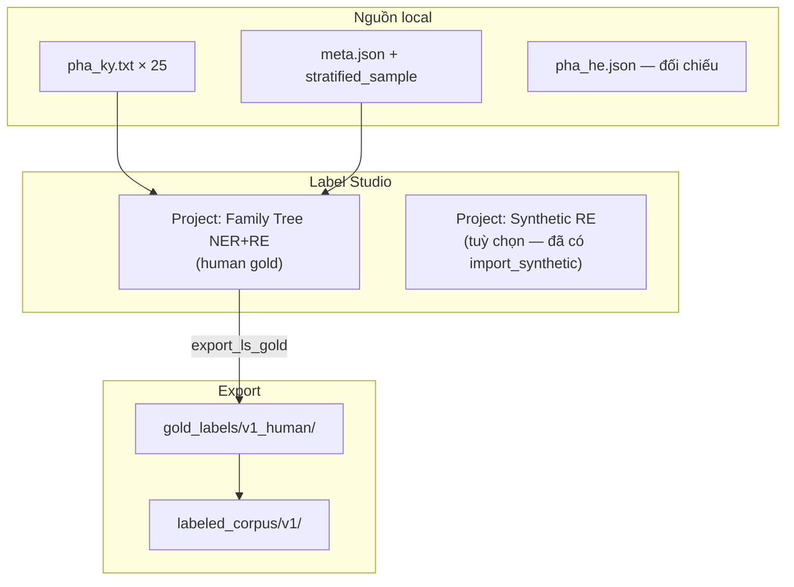
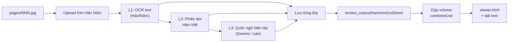

# Plan — Label Studio (human gold) & Pipeline OCR Hán-Nôm → Việt hiện đại

> **Ngày:** 2026-08-10  
> **Trạng thái:** 📋 **Draft — chờ bạn review**  
> **Bối cảnh:** Review corpus 25 cây Quốc ngữ + 15 volume Hán-Nôm đã sẵn local; synthetic v2 hybrid đã tạm ổn; **human gold = 0** (blocker luận văn).  
> **Liên quan:** [labeled_corpus_collection_plan.md](./labeled_corpus_collection_plan.md) · [HUONG_DAN_GAN_NHAN.md](../label_studio_pipeline/HUONG_DAN_GAN_NHAN.md) · [nomfoundation_storage_ocr_metadata_gaps.md](./nomfoundation_storage_ocr_metadata_gaps.md) · [consolidated_session_report_08_2026.md](./consolidated_session_report_08_2026.md)

---

## 1. Tóm tắt điều hành

| Track | Mục tiêu | Hiện trạng | Việc tiếp theo |
|-------|----------|------------|----------------|
| **A — Label Studio** | 25 doc human gold NER+RE trên **prose thật** | Auto-gold/Gemini pre-label; LS import CLI có sẵn; **0 task human-reviewed** | Import stratified → review theo queue → export `v1_human` |
| **B — Hán-Nôm OCR** | Ảnh scan → OCR chữ Hán/Nôm → phiên âm → **Quốc ngữ hiện đại** | API Kim Hán Nôm: OCR + phiên âm ✅; **dịch hiện đại ❌** | Pilot 1–2 volume → batch OCR → bước dịch mới (Gemini/rule) |

Hai track **độc lập** về annotation (Track A = Quốc ngữ VGP; Track B = corpus Hán-Nôm cho RQ sau / phụ lục), nhưng cùng schema quan hệ `FATHER_OF` / `MOTHER_OF` / `SPOUSE` về lâu dài.

---

## 2. Track A — Label Studio: import, edit, review (chuyên gia)

### 2.1. Vai trò & phạm vi

Bạn đóng vai **lead annotator / reviewer** (hoặc phân công 1 người thứ hai cho double κ trên S4):

| Làm | Không làm |
|-----|-----------|
| Gán nhãn NER + RE trên **`pha_ky.txt` thật** (25 cây stratified) | Gán nhãn trên `pha_ky_hybrid` / supplement / synthetic |
| Sửa pre-annotation Gemini; Submit task hoàn chỉnh | Chỉ Save draft (export gold sẽ bỏ qua) |
| Đối chiếu `pha_he` + `compare.html` khi nghi ngờ tên | Bịa relation không có trong câu văn |

**Gold chính luận văn** = export từ Label Studio sau human review (`data/gold_labels/v1_human/`).

### 2.2. Kiến trúc project Label Studio (đề xuất)



| Project | Task text | Predictions | Mục đích |
|---------|-----------|-------------|----------|
| **P1 — Human gold** | `pha_ky.txt` từ `data/review_corpus/quoc_ngu/{id}/` hoặc `data/vgp_corpus/` | Gemini / auto-gold (sửa tay) | Metric RQ1–RQ2 |
| **P2 — Synthetic** (optional) | `synthetic_pha_ky.txt` | auto | Ablation RQ3 — **tách project** |

**Khuyến nghị:** Chỉ review **P1** trong giai đoạn MVP; mở `compare.html` trên browser song song, **không** import hybrid vào LS.

### 2.3. Chuẩn bị môi trường

| Hạng mục | Yêu cầu |
|----------|---------|
| Label Studio | Chạy local (vd. `http://localhost:8080`) — Docker hoặc `label-studio start` |
| Env | `label_studio_pipeline/.env`: `LABEL_STUDIO_API_KEY`, `LABEL_STUDIO_URL`, `GEMINI_API_KEY` (nếu re-label) |
| Schema LS | Entity: `PER_NAME`, `GENERATION`, `DATE`, `ORDER`, `LOC` · Relation: `FATHER_OF`, `MOTHER_OF`, `SPOUSE` — xem [HUONG_DAN_GAN_NHAN.md §2–3](../label_studio_pipeline/HUONG_DAN_GAN_NHAN.md) |
| SSOT queue | [data/gold_labels/REVIEW_QUEUE.md](../data/gold_labels/REVIEW_QUEUE.md) — thứ tự 1→25 |
| Split khóa | Test S4: `1622, 1454, 544, 1813, 2346` — **không sửa sau khi chốt gold** |

### 2.4. Quy trình import → edit → review (từng bước)

#### Bước 0 — Kiểm tra LS & task hiện có

```bash
# LS phải đang chạy
python -m label_studio_pipeline.audit_ls_tasks \
  --pilot-file data/gold_labels/stratified_sample.json
```

Mục đích: biết task nào đã import, task nào thiếu, lệch `tree_id`.

#### Bước 1 — Import 25 cây stratified (pre-annotation)

**Phương án A — Import từ corpus + Gemini mới** (nếu chưa có predictions):

```bash
python -m label_studio_pipeline.label_and_import \
  --pilot-file data/gold_labels/stratified_sample.json \
  --corpus-dir data/vgp_corpus \
  --cross-check
```

**Phương án B — Chỉ import lại task đã có Gemini JSON** (tiết kiệm API):

```bash
python -m label_studio_pipeline.submit_gold \
  --pilot-file data/gold_labels/stratified_sample.json \
  --labels-dir data/gemini_labels \
  --skip-existing
```

**Phương án C — Re-import 1 cây lỗi:**

```bash
python -m label_studio_pipeline.label_and_import \
  --tree-id 122 --cross-check
```

Sau import: mỗi task có metadata `tree_id`, `source_url`, `title`; predictions màu nhạt.

#### Bước 2 — Review trên UI (workflow chuyên gia)

Thứ tự theo [REVIEW_QUEUE.md](../data/gold_labels/REVIEW_QUEUE.md):

| Phase | Stratum | Số doc | Thời gian ước lượng* | Ghi chú |
|-------|---------|--------|----------------------|---------|
| 1 | **S1** | 8 | 2–3 ngày | Relation-rich — làm trước, làm mẫu κ |
| 2 | **S2** | 7 | 2 ngày | Medium |
| 3 | **S3** | 5 | 2 ngày | Hard — doc auto-gold 0 relation, cần đọc kỹ |
| 4 | **S4** | 5 | 2 ngày + double κ | **Test locked** — annotate 2 vòng nếu có annotator 2 |

\* Ước lượng 1 annotator có kinh nghiệm: ~45–90 phút/doc (doc dài như 122 lâu hơn).

**Quy trình 1 task (checklist):**

1. Mở task → đọc lướt toàn văn `pha_ky.txt`.
2. Mở tab/`compare.html` hoặc `pha_he.json` nếu cần đối chiếu tên (không gán relation chỉ vì sơ đồ có).
3. **NER:** Accept/sửa/xóa span Gemini; thêm thiếu (`PER_NAME`, `LOC`, `DATE`, `GENERATION`, `ORDER`).
4. **RE:** Chỉ nối relation khi **câu văn nêu rõ** cha/mẹ/vợ chồng; head/tail = span `PER_NAME`.
5. Xóa predictions sai còn sót.
6. **Submit** (không chỉ Save) — đảm bảo `completed_by` hoặc `lead_time > 0`.

**Quy tắc vàng (nhắc lại):**

- Span = đúng chuỗi trong text; không overlap 2 entity cùng vị trí.
- Không gán anh/em/chú/bác — schema chưa có.
- S4: annotate xong → **đóng băng** — mọi thay đổi model/eval sau này không được sửa test gold.

#### Bước 3 — Double annotation (5 doc S4)

| tree_id | Annotator 1 | Annotator 2 | Resolve conflict |
|---------|-------------|-------------|------------------|
| 1622, 1454, 544, 1813, 2346 | Bạn | GVHD / NCS 2 / collaborator | Adjudication: 1 gold cuối, log `adjudicated_by` |

Metric: Cohen's κ entity ≥ 0.70, relation ≥ 0.65 (mục tiêu [labeled_corpus_collection_plan §2.4](./labeled_corpus_collection_plan.md)).

#### Bước 4 — Export human gold

```bash
python -m label_studio_pipeline.export_ls_gold \
  --stratified-file data/gold_labels/stratified_sample.json
# Output: data/gold_labels/v1_human/{doc_id}.json
```

Chỉ lấy annotation **human-reviewed** (mặc định bỏ auto-gold trừ khi `--include-auto`).

#### Bước 5 — Đóng gói corpus v1

Sau export (script hoặc thủ công):

- `data/labeled_corpus/v1/documents/*.json` — training records
- `data/labeled_corpus/v1/splits/train_ids.json` (20) + `test_ids.json` (5)
- Cập nhật `consolidated_session_report` — human gold count > 0

### 2.5. Mẹo vận hành Label Studio (chuyên gia)

| Tình huống | Cách xử lý |
|------------|------------|
| Task quá dài (vd. 122 ~5k ký tự) | Zoom LS; chia mental theo đoạn «Đời thứ …» |
| Gemini span lệch 1–2 ký tự | Xóa → tạo span tay (khớp text 100%) |
| Tên có trong sơ đồ, không trong prose | **Không** thêm entity — ghi note task |
| Prose có relation, auto-gold = 0 relation (S3/S4) | Đây là lý do cần human — ưu tiên RE |
| Nghi ngờ encoding | Flag trong note; stratum S3 |

### 2.6. Rủi ro & giảm thiểu (Track A)

| Rủi ro | Giảm thiểu |
|--------|------------|
| LS down / API key hết hạn | Checklist pre-flight; backup export JSON định kỳ |
| Nhầm hybrid vs thật | **Không** import hybrid; chỉ `pha_ky.txt` |
| Test contamination | Khóa S4 ids; không train trên test |
| Mệt mỏi annotator | S1 làm mẫu 2 doc trước khi scale; nghỉ giữa S3/S4 |
| Thiếu κ thứ hai | Ít nhất 5 doc double — có thể hoãn κ doc train |

### 2.7. Tiêu chí hoàn thành Track A (MVP)

- [ ] 25/25 task **Submitted** trên P1
- [ ] Export `v1_human` ≥ 25 files (hoặc ≥ 20 train + 5 test)
- [ ] S4 gold **frozen** — checksum/version ghi trong manifest
- [ ] (Khuyến nghị) Double κ trên 5 doc S4
- [ ] Báo cáo ngắn: thời gian/doc, lỗi Gemini thường gặp (E1–E5)

---

## 3. Track B — OCR Hán-Nôm: ảnh → phiên âm → Việt hiện đại

### 3.1. Ba lớp văn bản (taxonomy)

Gia phả Hán-Nôm trên một trang scan thường có **3 lớp** — pipeline cần tách rõ:

| Lớp | Ký hiệu plan | Ví dụ | Công cụ hiện có |
|-----|--------------|-------|-----------------|
| **L0 — Ảnh gốc** | `hinh_anh` | JPG scan Nom | ✅ Local + MinIO |
| **L1 — OCR Hán/Nôm** | `ocr_text` | `阮文政`, chữ Nôm | ✅ Kim Hán Nôm API |
| **L2 — Phiên âm / Hán-Việt** | `transcription_text` | *Nguyễn Văn Chính* (đọc Hán) | ✅ Kim Hán Nôm API (`run_transliteration`) |
| **L3 — Quốc ngữ hiện đại** | `modern_vn_text` | *Nguyễn Văn Chính là đời thứ…* | ❌ **Chưa có** — cần bước mới |

> **Lưu ý:** Tên hàm backend `process_hannom_image_to_vietnamese` **gây hiểu nhầm** — hiện chỉ trả về **phiên âm (L2)**, không phải paraphrase hiện đại (L3).

### 3.2. Hiện trạng code & dữ liệu

| Thành phần | Trạng thái | Path / API |
|------------|------------|------------|
| Ảnh volume review | ✅ 15 vol, ~495+ trang | `data/review_corpus/hannom/{vol}/pages/` |
| Crawl Nom | ✅ | `nlp_family_extractor/tools/fetch_nomfoundation.py` |
| OCR + phiên âm (1 ảnh) | ✅ | `POST /api/documents/{id}/ocr-transliterate` |
| OCR batch (MinIO) | ✅ | `DocumentService.ocr_transliterate_batch` |
| Token Kim Hán Nôm | ✅ | Admin → Developer → Hannom config / DB credential |
| Import ảnh → cây gia phả | ✅ (attach) | `sync_nomfoundation_documents.py` |
| Pipeline job nền | 🔄 một phần | `nomfoundation/jobs/*.json` — step ②③ đôi khi PENDING |
| **Dịch hiện đại L3** | ❌ | — |

Gap chi tiết: [nomfoundation_storage_ocr_metadata_gaps.md](./nomfoundation_storage_ocr_metadata_gaps.md).

### 3.3. Pipeline đích (end-to-end)



**Output đề xuất mỗi volume:**

```
data/review_corpus/hannom/{volume_id}/
  pages/001.jpg
  text/
    001.ocr.txt          # L1
    001.transcription.txt # L2
    001.modern_vn.txt     # L3
  combined/
    ocr_full.txt
    transcription_full.txt
    modern_vn_full.txt
  metadata.json
  manifest.json          # + ocr_status per page
  viewer.html
```

### 3.4. Pilot volume (đề xuất — chờ bạn chọn)

| Ưu tiên | volume_id | Title | Trang | Lý do pilot |
|---------|-----------|-------|-------|-------------|
| **P0** | **1255** | Chu tộc gia phả | 6 | Ngắn, đã quen trong thesis |
| **P0** | **1256** | Lê tộc đại tông | 30 | TNVNPF series, vừa phải |
| P1 | 855 | Nguyễn tộc gia phả | 100 | Lớn — batch stress test |
| P1 | 208 | Đông Trù Đoàn | 50 | NLVNPF, chữ dày |
| P2 | 84, 557 | Gia phả collection 1 | 47–55 | Bổ sung đa nguồn |

**Khuyến nghị bắt đầu:** **1255 (6 trang)** — OCR + dịch thử toàn volume trong 1 buổi.

### 3.5. Cách chạy OCR L1+L2 (đã có)

#### Cách 1 — UI Admin (1 trang / thử)

1. Import volume → tạo cây gia phả + document `hinh_anh` (Developer hoặc attach CLI).
2. Tab **Kho tư liệu** → chọn ảnh → **OCR + phiên âm**.
3. Kết quả lưu document `ket_qua_van_ban` (`{page}_transcription.txt`).

#### Cách 2 — API batch (volume)

```bash
# Sau khi ảnh đã attach MinIO + có document_id
curl -X POST "$API/api/documents/{document_id}/ocr-transliterate-batch" \
  -H "Authorization: Bearer $TOKEN" \
  -d '{"skip_existing": true}'
```

#### Cách 3 — CLI offline cho review_corpus (cần viết — Phase B1)

Script đề xuất: `nlp_family_extractor/tools/ocr_nom_volume.py`

```bash
# Draft — chưa implement
python -m tools.ocr_nom_volume \
  --volume-dir data/review_corpus/hannom/1255 \
  --output-dir data/review_corpus/hannom/1255/text \
  --skip-existing
```

Đọc JPG local → gọi `process_hannom_image_to_vietnamese` → ghi `NNN.ocr.txt` + `NNN.transcription.txt` **không cần MinIO** (phù hợp review corpus offline).

**Rate limit:** Kim Hán Nôm ~40 req/phút — volume 30 trang ≈ 30–45 phút (có delay).

### 3.6. Bước L3 — Quốc ngữ hiện đại (cần thiết kế mới)

Phiên âm (L2) ≠ văn xuôi hiện đại. Ví dụ:

| L1 OCR | L2 Phiên âm | L3 Hiện đại (mục tiêu) |
|--------|-------------|------------------------|
| 阮文政 | Nguyễn Văn Chính | Nguyễn Văn Chính |
| 生男三 | Sinh nam tam | Sinh được ba người con trai |
| 配氏阮 | Phối thị Nguyễn | Lấy vợ họ Nguyễn |

#### Phương án L3 (so sánh)

| Phương án | Mô tả | Ưu | Nhược | Effort |
|----------|-------|-----|-------|--------|
| **B3a — Gemini dịch có ràng buộc** | Prompt: L2 + metadata Nom → câu QN hiện đại; giữ tên riêng | Tự nhiên; tận dụng `Description` catalog | Cần review; chi phí API; có thể hallucinate | 2–3 ngày |
| **B3b — Rule Hán-Việt → QN** | Từ điển cue (`生`=sinh, `配`=lấy vợ, `男`=con trai) | Deterministic; không phụ thuộc API | Không cover Nôm thuần; văn phong cứng | 1 tuần |
| **B3c — Human post-edit** | Hiển thị L2 song song; sửa tay → L3 | Gold chất lượng cao | Chậm; không scale 495 trang | Song song pilot |
| **B3d — Chỉ L2 cho MVP** | Báo cáo thesis Track Hán-Nôm ở mức phiên âm | Nhanh | RQ “hiện đại” chưa đạt | 0 |

**Khuyến nghị:** **B3a (Gemini)** cho pilot 1255 + 1256, kèm **B3c** review 2 volume; rule pack (B3b) là backlog.

#### Prompt khung L3 (draft)

```
Input:
- metadata: title, place, date (từ metadata.json Nom)
- ocr_text (L1, optional)
- transcription_text (L2)

Task:
Chuyển sang Quốc ngữ hiện đại (giữ nguyên tên riêng, địa danh).
Không bịa thêm quan hệ không có trong bản phiên âm.
Output: đoạn văn ngắn theo từng trang.
```

Module đề xuất: `nlp_family_extractor/app/hannom/modernize.py` + CLI `tools/modernize_nom_volume.py`.

### 3.7. Viewer Hán-Nôm (cập nhật)

Mở rộng `viewer.html` / tab trong `data/review_corpus/index.html`:

| Tab | Nội dung |
|-----|----------|
| Ảnh | Lật trang JPG |
| OCR | L1 per page |
| Phiên âm | L2 |
| Hiện đại | L3 |
| Metadata | title, catalog, place |

### 3.8. Lộ trình Track B (phased)

| Phase | Việc | Thời gian | Deliverable |
|-------|------|-----------|-------------|
| **B0** | Chốt pilot volume (1255, 1256?) | 0.5 ngày | Bạn approve |
| **B1** | CLI `ocr_nom_volume.py` — L1+L2 offline | 1 ngày | `text/*.ocr.txt`, `*.transcription.txt` |
| **B2** | Chạy pilot 1255 + 1256 | 0.5 ngày | 36 trang có L2 |
| **B3** | Module L3 Gemini + review 2 vol | 2 ngày | `*.modern_vn.txt` |
| **B4** | Batch 5 vol genealogy (208, 855, …) | 2–3 ngày | partial corpus |
| **B5** | (Tuỳ chọn) Import L3 → LS project riêng Track Hán-Nôm | backlog | RQ Phase 2 |

### 3.9. Rủi ro Track B

| Rủi ro | Giảm thiểu |
|--------|------------|
| Token Kim Hán Nôm hết hạn | Lưu DB credential; refresh qua Admin |
| OCR lỗi Nôm | Ghi `ocr_confidence` nếu API trả; flag trang lỗi |
| Nhầm L2 vs L3 trong báo cáo | Đặt tên file rõ `transcription` vs `modern_vn` |
| Volume 855 (100 trang) | Chạy batch đêm; `skip_existing` |
| License / gửi ảnh ra API | Kim Hán Nôm HCMUS — ghi trong luận văn mục ethics |

---

## 4. Liên kết hai track

| Điểm | Track A (LS Quốc ngữ) | Track B (Hán-Nôm) |
|------|----------------------|-------------------|
| Văn bản annotate | `pha_ky.txt` VGP | L3 (sau pilot) — **project LS riêng** |
| Schema nhãn | Giữ nguyên 5 entity + 3 relation | Cùng schema quan hệ; thêm `HAN_CHAR` backlog |
| Review local | `compare.html` | `hannom/.../viewer.html` |
| Gold version | `v1_human` | `hannom_v1` (đặt tên sau pilot) |
| Thesis RQ | RQ1–RQ4 (Quốc ngữ) | RQ Phase 2 / phụ lục đa ngôn ngữ |

**Không trộn** train/test Quốc ngữ với synthetic hay L3 chưa review.

---

## 5. Checklist duyệt plan (bạn tick)

### Track A — Label Studio

- [ ] Phạm vi **25 doc prose thật** — OK / cần giảm
- [ ] Thứ tự review theo REVIEW_QUEUE — OK
- [ ] Project P1 tách synthetic — OK
- [ ] Double κ 5 doc S4 — có annotator thứ 2 / hoãn
- [ ] Mục tiêu MVP: **25 human gold** trong … tuần (điền)

### Track B — OCR Hán-Nôm

- [ ] Pilot volume: **1255 + 1256** / khác: ___
- [ ] Chấp nhận **B3a Gemini** cho L3 hiện đại / chỉ L2 MVP
- [ ] CLI offline `ocr_nom_volume.py` — ưu tiên trước MinIO batch
- [ ] Phạm vi batch sau pilot: ___ volume, ___ trang

### Ghi chú khi duyệt

```text
Track A — tuần bắt đầu LS:
Track A — annotator 2 (nếu có):
Track B — volume pilot:
Track B — L3: Gemini / rule / hoãn:
Ưu tiên tuần này: A / B / song song:
```

---

## 6. Lệnh tham chiếu nhanh

```bash
# --- Track A ---
python -m label_studio_pipeline.audit_ls_tasks \
  --pilot-file data/gold_labels/stratified_sample.json

python -m label_studio_pipeline.label_and_import \
  --pilot-file data/gold_labels/stratified_sample.json --cross-check

python -m label_studio_pipeline.export_ls_gold \
  --stratified-file data/gold_labels/stratified_sample.json

# --- Track B (hiện có — qua backend khi có document_id) ---
# POST /api/documents/{id}/ocr-transliterate
# POST /api/documents/{id}/ocr-transliterate-batch

# --- Track B (draft — sau khi duyệt plan) ---
# python -m tools.ocr_nom_volume --volume-dir data/review_corpus/hannom/1255
# python -m tools.modernize_nom_volume --volume-dir data/review_corpus/hannom/1255
```

---

## 7. Tài liệu liên quan

| File | Nội dung |
|------|----------|
| [HUONG_DAN_GAN_NHAN.md](../label_studio_pipeline/HUONG_DAN_GAN_NHAN.md) | Schema nhãn chi tiết |
| [REVIEW_QUEUE.md](../data/gold_labels/REVIEW_QUEUE.md) | Thứ tự 25 cây |
| [synthetic_pha_ky_v2_hybrid_plan.md](./synthetic_pha_ky_v2_hybrid_plan.md) | Hybrid — **không** dùng cho LS gold |
| [genealogy_language_features_analysis.md](./genealogy_language_features_analysis.md) | Lớp ngôn ngữ L0–L3 |
| [hannom_credentials_db_plan.md](./hannom_credentials_db_plan.md) | Token API |
