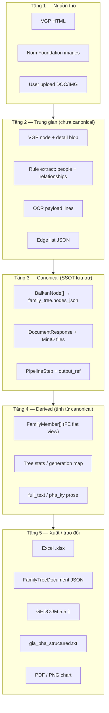
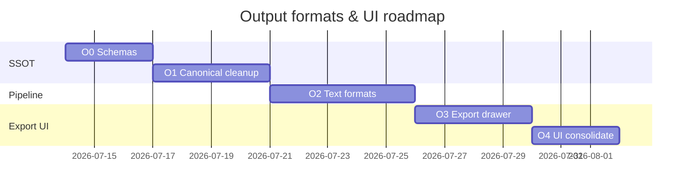
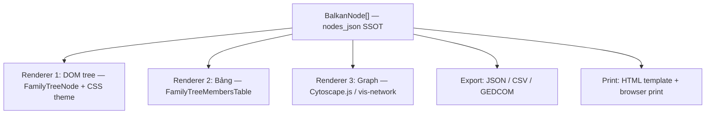
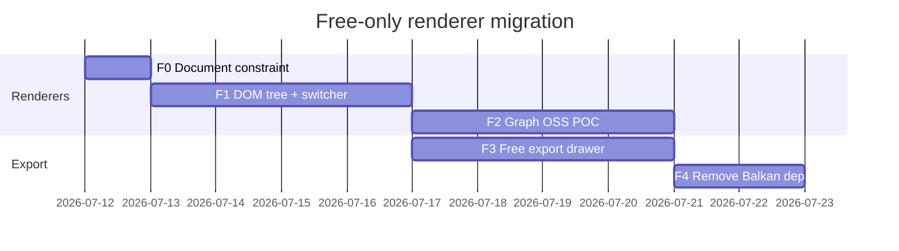

# Plan — Chuẩn format đầu ra & UI đầu ra gia phả

> **Ngày:** 2026-07-12  
> **Phạm vi:** Toàn bộ luồng dữ liệu từ crawl → pipeline → lưu trữ → hiển thị → xuất file  
> **SSOT tham chiếu:** [CRAWL_PLAN.md § Phần F](../CRAWL_PLAN.md#phần-f--pipeline-7-bước--hiển-thị-step-ssot), [vietnamgiapha_crawl_v2_plan.md](./vietnamgiapha_crawl_v2_plan.md), [rule_based_genealogy_extraction_steps.md](./rule_based_genealogy_extraction_steps.md)

---

## Mục lục

1. [Mục tiêu](#1-mục-tiêu)
2. [Phân tầng format (taxonomy)](#2-phân-tầng-format-taxonomy)
3. [Hiện trạng — format đầu ra backend](#3-hiện-trạng--format-đầu-ra-backend)
4. [Hiện trạng — UI đầu ra frontend](#4-hiện-trạng--ui-đầu-ra-frontend)
5. [Gap & mâu thuẫn giữa các format](#5-gap--mâu-thuẫn-giữa-các-format)
6. [Chuẩn format bổ sung đề xuất](#6-chuẩn-format-bổ-sung-đề-xuất)
7. [UI đầu ra bổ sung đề xuất](#7-ui-đầu-ra-bổ-sung-đề-xuất)
8. [Ma trận format ↔ pipeline step ↔ UI](#8-ma-trận-format--pipeline-step--ui)
9. [Lộ trình chuẩn hóa (phases)](#9-lộ-trình-chuẩn-hóa-phases)
10. [Checklist triển khai](#10-checklist-triển-khai)
11. [Phụ lục C — Free-only constraints](#phụ-lục-c--free-only-constraints)

---

## 1. Mục tiêu

1. **Một SSOT schema** cho cây gia phả lưu trữ (`BalkanNode`) — dùng chung BE validation, FE types, Gemini prompt, export/import.
2. **Định nghĩa rõ** mỗi artifact pipeline (step ①–⑦) là format gì, lưu ở đâu (MySQL / MinIO / field JSON), và UI nào hiển thị.
3. **Bổ sung format xuất** phục vụ nghiên cứu, lưu trữ, trao đổi (GEDCOM, CSV, structured text, PDF…).
4. **Thống nhất UI** — admin, public, user dùng cùng component xem cây / tài liệu / pipeline; tránh hai hệ visualization song song.
5. **Tách rõ** format trung gian (extract thô, VGP raw) vs format canonical (Balkan) vs format trình bày (Excel, HTML in ấn).
6. **Free-only** — UI visualization và export chỉ dùng OSS / tự code; không license Balkan Graph (chi tiết [Phụ lục C](#phụ-lục-c--free-only-constraints)).

---

## 2. Phân tầng format (taxonomy)



| Tầng | Ai ghi | Ai đọc | Có persist? |
|------|--------|--------|-------------|
| Nguồn thô | Crawler, user upload | Parser, OCR | MinIO (file gốc) |
| Trung gian | Extractor, parser VGP | Analyze, normalize | Tạm / debug only |
| Canonical | `family_tree_store`, crawl sync | API, pipeline | MySQL + file mirror |
| Derived | FE utils, report builder | UI tables, stats | Không (runtime) |
| Xuất | Export service / FE | User download | File tải về |

---

## 3. Hiện trạng — format đầu ra backend

### 3.1. Canonical — Balkan family tree

**SSOT hiện tại (mềm):** prompt Gemini + validation store, chưa có JSON Schema file riêng.

| Trường | Bắt buộc | Ghi chú |
|--------|----------|---------|
| `id` | ✓ | int > 0, unique |
| `name` | ✓ | string |
| `gender` | ✓ | `"male"` \| `"female"` |
| `birthYear`, `deathYear` | | int |
| `fid`, `mid` | | int, phải tồn tại trong mảng |
| `pids` | | int[], đối xứng vợ-chồng |
| `title`, `avatar`, `bio` | | display |
| `detail`, `burialPlace`, `childrenNodeIds` | | **Chỉ từ VGP** — không trong prompt Gemini, không validate đầy đủ |

**File liên quan:**

| Vai trò | Path |
|---------|------|
| Prompt SSOT | `nlp_family_extractor/app/balkan_prompt.py` |
| Parse Gemini output | `nlp_family_extractor/app/balkan_json.py` |
| Validate + normalize | `nlp_family_extractor/app/family_tree_store.py` |
| VGP → Balkan | `nlp_family_extractor/tools/sync_vietnamgiapha_to_db.py` `_normalize_nodes()` |
| Sample | `nlp_family_extractor/data/family_trees/tree-sample.json` |
| API envelope | `FamilyTreeDocument` — `nlp_family_extractor/api.py` |
| FE type (lỏng) | `BalkanNode = Record<string, unknown>` — `family-saga-io/src/lib/familyTreeApi.ts` |

### 3.2. Rule-based extraction (ẩn khỏi API)

| Format | Schema | Producer |
|--------|--------|----------|
| People + relationships | `{ people[], relationships[] }` — id `P001`, gender `M`/`F` | `app/domains/extraction/extractor.py` |
| Edge (planned) | `{ source_person, relation, target_person, confidence, evidence }` | `planning/rule_based_genealogy_extraction_steps.md` |
| Nested tree (unused) | `{ roots, children_map, nodes }` | `app/tree_builder.py` |

**API analyze chỉ trả:** `{ balkan_nodes[], gemini_error? }` — warnings và extract thô không expose.

### 3.3. Documents (MinIO + MySQL)

**Enum `DocumentType`:** `han_nom`, `van_ban`, `hinh_anh`, `ket_qua_van_ban`, `ket_qua_hinh_anh`

| Type | Nội dung điển hình | Pipeline step |
|------|-------------------|---------------|
| `hinh_anh` / `han_nom` | JPG/PNG scan | ② |
| `ket_qua_hinh_anh` | OCR raw (tạm) | ③ |
| `ket_qua_van_ban` | `.txt` phiên âm / OCR text | ④⑤ |
| `van_ban` | Phả ký, full_text, Word | ⑤⑥⑦ (planned subtype) |

**Chưa có enum:** `gia_pha_distilled`, `gia_pha_structured` (chỉ mô tả trong CRAWL_PLAN qua naming convention).

### 3.4. Pipeline artifacts

| Field | Kiểu | Ví dụ |
|-------|------|-------|
| `output_ref` | string convention | `documents:12`, `nodes:195`, plain text tên dòng họ |
| `artifact.kind` | `none` \| `text` \| `document` \| `family_tree` | `PipelineArtifactResponse` |
| `artifact.preview_text` | string ≤ N ký tự | Drawer preview |
| `artifact.node_count` | int | Step ⑦ |
| `skipped_reason` | enum 5 giá trị | `vgp_entry`, `already_exists`, … |

### 3.5. VGP crawl V2

| Artifact | Lưu trữ | Format |
|----------|---------|--------|
| Metadata | `vgp_crawl.metadata_json` | `{ tree_id, lineage_name, location, generation_count, … }` |
| Manifest | `vgp_crawl.manifest_json` | `{ crawl_version, fetched_at, urls, parser_modes, stats }` |
| Phả ký | Document `van_ban` | UTF-8 plain text |
| Phả hệ | `family_tree.nodes_json` | BalkanNode[] |
| Ảnh | Document `hinh_anh` | URL list → download MinIO |
| Hash | `content_hash`, `nodes_hash`, `pha_ky_hash` | skip logic |

### 3.6. Nom Foundation crawl

| Artifact | Path / DB |
|----------|-----------|
| Catalog | `data/nomfoundation/catalog.json` |
| Volume manifest | `volumes/{id}/manifest.json` |
| Page images | MinIO / local volume dir |
| Link | `research_source_links.metadata_json` |

### 3.7. OCR / Hán-Nôm

| Output | Shape |
|--------|-------|
| Pipeline internal | `{ ocr_lines[], ocr_text, transcription_lines[], transcription_text }` |
| API `OcrTransliterateResponse` | + `result_document`, `saved_file` |
| Persisted | `.txt` trong MinIO, type `ket_qua_van_ban` |

### 3.8. Text export (V1 legacy)

| File | Path | Ghi chú |
|------|------|---------|
| `full_text.txt` | `data/vietnamgiapha/text/{id}/` | Ghép detail node — **khác** phả ký V2 |
| `meta.json` | cùng thư mục | `tree_id`, `char_count`, `exported_at` |

Tool: `nlp_family_extractor/tools/vietnamgiapha_text_export.py`

### 3.9. Legacy / old_code

| Format | Mô tả |
|--------|-------|
| `sample_person.json` | Flat: `father`/`mother`/`spouse[]`/`children[]` string |
| Interactive HTML | `old_code/view-family-tree` → `output/family_tree.html` (NetworkX) |

---

## 4. Hiện trạng — UI đầu ra frontend

### 4.1. Bản đồ surface theo route

| Zone | Route | Component chính | Format hiển thị |
|------|-------|-----------------|-----------------|
| Public | `/gia-pha/:treeId` | `PublicFamilyTreePage` | Balkan graph, members table, documents + download |
| Admin | `/admin/gia-pha/:treeId` | `FamilyTreeDetailPage` | 5 tabs (visual, members, pipeline, documents, links) + JSON modals |
| User | `/user/family-tree` | `FamilyTreePage` | **Custom recursive tree** + Excel export |
| User | `/user/document-reader` | `DocumentReaderPage` | Preview file, analyze → Balkan, history |
| Developer | `/admin/developer/*` | Crawl pages, Docs, Logs | Stats JSON, CodeBlock cURL |
| API docs | `/admin/developer/docs` | `DocsPage` | Static schema examples |

### 4.2. Component tái sử dụng

| Component | Input format | Output UI |
|-----------|--------------|-----------|
| `BalkanFamilyTreeView` | `BalkanNode[]` | Graph `@balkangraph/familytree.js` (template `hugo`) |
| `FamilyTreeNode` | `FamilyMember[]` | DOM recursive tree (**legacy**) |
| `FamilyTreeMembersTable` | `FamilyMember[]` | Ant Design table |
| `GenealogyPipelineSteps` | `PipelineStep[]` | Vertical Steps + actions |
| `PipelineStepDrawer` | `PipelineStepDetail` | Artifact preview, files, edit form |
| `DocumentOcrPanel` | OCR response | Text blocks, copy, download |
| `FamilyTreeDocumentsPanel` | `DocumentResponse[]` | List + link edit |
| JSON modals (admin) | `FamilyTreeDocument` | Pretty JSON view/edit |

### 4.3. Export UI hiện có (client-only)

| Export | Where | Format |
|--------|-------|--------|
| Excel | `FamilyTreePage.tsx` only | `.xlsx` — cột tiếng Việt |
| JSON view/edit | Admin detail modals | Full document JSON |
| Copy text | `DocumentOcrPanel` | Clipboard |
| File download | Presigned `download_url` | Raw MinIO files |
| OpenAPI | Backend `/docs` | Swagger / ReDoc |

**Chưa có trên admin/public:** Excel, GEDCOM, PDF chart, CSV, structured text viewer.

### 4.4. Derived UI format — `FamilyMember`

Chuyển đổi tại `family-saga-io/src/lib/familyTreeUtils.ts`:

```
BalkanNode[] → toFamilyMembers() → { id, name, birthYear, generation, spouseName, parentId, children[], … }
BalkanNode[] → toTreeStats() → { totalMembers, totalGenerations, established }
```

Dùng cho: bảng thành viên, Excel, custom tree view — **không persist**.

---

## 5. Gap & mâu thuẫn giữa các format

### 5.1. Schema / ID

| # | Vấn đề | Hậu quả |
|---|--------|---------|
| G1 | Ba hệ ID: `P001` (rule), numeric Balkan, VGP `node_id` | Khó trace provenance |
| G2 | Gender: `M`/`F`, `male`/`female`, `Nam`/`Nữ` | Convert thiếu chỗ → validation 400 |
| G3 | FE `BalkanNode` loose vs BE strict | Runtime crash / silent ignore field |
| G4 | VGP `detail` blob lọt vào `nodes_json` | FE/Balkan có thể không hiểu; store không strip |
| G5 | Prompt Gemini thiếu `deathYear`, `title`, `bio` | Model có thể bỏ field UI cần |
| G6 | `source_document_title` có trên FE workspace, thiếu admin `FamilyTreeSummary` | List admin thiếu cột |

### 5.2. Pipeline & documents

| # | Vấn đề | Hậu quả |
|---|--------|---------|
| G7 | Step ⑥ `distilled` chưa implement | UI luôn pending/skip |
| G8 | `gia_pha_structured` / `gia_pha_distilled` chưa có schema file | Không validate output step ⑥⑦ |
| G9 | `output_ref` là string convention, không typed union | Parser FE/BE dễ lệch |
| G10 | V1 `full_text` ≠ V2 phả ký | So sánh corpus sai |

### 5.3. UI

| # | Vấn đề | Hậu quả |
|---|--------|---------|
| G11 | Hai visualization: Balkan vs `FamilyTreeNode` | UX / maintenance kép |
| G12 | Excel chỉ ở `/user/family-tree`, không ở admin/public | Admin export thiếu |
| G13 | Admin history không replay `balkan_nodes` | Mất kết quả analyze |
| G14 | VGP `detail` không có UI riêng | Dữ liệu crawl bị ẩn |
| G15 | Không có print / PDF view | Khó in phả đồ |

### 5.4. Export & interoperability

| # | Vấn đề | Hậu quả |
|---|--------|---------|
| G16 | Không GEDCOM | Không import MyHeritage, Ancestry, Gramps |
| G17 | Không server-side export API | Excel/JSON phụ thuộc browser |
| G18 | Analyze warnings không trả API | User không thấy cảnh báo chất lượng |
| G19 | Rule extract output không expose | Debug / audit khó |

---

## 6. Chuẩn format bổ sung đề xuất

### 6.1. `BalkanNode` JSON Schema (SSOT cứng) — **P0**

Tạo file `schemas/balkan-node.schema.json` + `schemas/family-tree-document.schema.json`.

```json
{
  "$schema": "https://json-schema.org/draft/2020-12/schema",
  "title": "BalkanNode",
  "type": "object",
  "required": ["id", "name", "gender"],
  "properties": {
    "id": { "type": "integer", "minimum": 1 },
    "name": { "type": "string", "minLength": 1 },
    "gender": { "enum": ["male", "female"] },
    "birthYear": { "type": "integer" },
    "deathYear": { "type": "integer" },
    "fid": { "type": "integer", "minimum": 1 },
    "mid": { "type": "integer", "minimum": 1 },
    "pids": { "type": "array", "items": { "type": "integer", "minimum": 1 } },
    "title": { "type": "string" },
    "bio": { "type": "string" },
    "avatar": { "type": "string", "format": "uri" },
    "provenance": {
      "type": "object",
      "properties": {
        "source": { "enum": ["vgp", "analyze", "manual", "import"] },
        "source_node_id": { "type": "integer" },
        "confidence": { "type": "number", "minimum": 0, "maximum": 1 }
      }
    }
  },
  "additionalProperties": false
}
```

**Quyết định VGP extensions:** chuyển `detail`, `burialPlace`, `childrenNodeIds` vào `provenance.extra` hoặc bảng phụ `family_tree_node_meta` — **không** để lẫn trong node gửi Balkan graph.

**Cập nhật:** `balkan_prompt.py`, `family_tree_store.py`, generate TS type từ schema (`json-schema-to-typescript`).

### 6.2. `gia_pha_distilled.txt` (step ⑥) — **P1**

Văn bản quốc ngữ **đã lọc** — chỉ câu chứa tên + quan hệ + năm sinh/mất.

**Schema logic (không phải JSON):**

```
# Gia phả distilled — {tree_id}
# generated_at: ISO8601
# source_document_id: 123

[Mỗi dòng một sự kiện hoặc một người]
Nguyễn Văn A (1880–1960) — cha của Nguyễn Văn B
...
```

**Producer:** rule-based extractor + filter; **Consumer:** step ⑦ analyze input, UI text panel tab pipeline.

### 6.3. `gia_pha_structured.json` (step ⑦ alt) — **P1**

Khi chưa đủ tin cậy để dựng cây Balkan — lưu bản có cấu trúc để hiệu đính.

```json
{
  "schema_version": "1.0",
  "tree_id": "vgp-11108",
  "lineage_name": "Họ Nguyễn …",
  "persons": [
    {
      "local_id": "p1",
      "full_name": "Nguyễn Văn A",
      "gender": "male",
      "birth_year": 1880,
      "death_year": 1960,
      "generation": 1,
      "notes": "…"
    }
  ],
  "relationships": [
    {
      "type": "parent_of",
      "from_local_id": "p1",
      "to_local_id": "p2",
      "side": "fid",
      "confidence": 0.9,
      "evidence": "…"
    }
  ],
  "unresolved": [
    { "text": "…", "reason": "ambiguous_parent" }
  ]
}
```

Align với edge schema trong `rule_based_genealogy_extraction_steps.md` — **một schema duy nhất** cho rule engine + step ⑦ fallback.

### 6.4. GEDCOM 5.5.1 export — **P2**

Chuẩn trao đổi phổ biến nhất cho phần mềm gia phả.

| Balkan field | GEDCOM tag |
|--------------|------------|
| `name` | `NAME` / `GIVN` / `SURN` (split heuristic) |
| `gender` | `SEX M` / `SEX F` |
| `birthYear` | `BIRT DATE` |
| `deathYear` | `DEAT DATE` |
| `fid`/`mid` | `FAMC` + `FAM` records |
| `pids` | `FAMS` |

**Endpoint đề xuất:** `GET /api/family-trees/{id}/export?format=gedcom`

**UI:** nút Export trong admin detail + public (nếu `is_public`).

### 6.5. CSV / TSV member list — **P2**

Tương đương Excel hiện tại nhưng server-side + UTF-8 BOM cho Excel VN.

Cột chuẩn: `id,name,gender,birth_year,death_year,generation,father_id,mother_id,spouse_ids,title,bio`

**Endpoint:** `GET /api/family-trees/{id}/export?format=csv`

### 6.6. Chart export PNG / SVG — **P3** *(điều chỉnh: không dùng Balkan export — xem [Phụ lục C §C.5](#c5-điều-chỉnh-plan-theo-free-only))*

Snapshot sơ đồ: `html2canvas` / SVG serialize từ renderer DOM hoặc Cytoscape export. In ấn: HTML `@media print` → browser Print to PDF.

**UI:** nút「In sơ đồ」/「Tải ảnh PNG」(optional) trên tab visual — không gọi `balkan.app/export`.

### 6.7. Print HTML / PDF report — **P3**

Template A4: bìa dòng họ, thống kê, sơ đồ (image embed), danh sách đời.

**Format:** HTML `@media print` → browser Print to PDF; hoặc WeasyPrint server-side.

### 6.8. VGP manifest schema (formalize) — **P1**

Document `schemas/vgp-manifest.schema.json` từ structure hiện có trong `vgp/crawl_service.py`:

```json
{
  "crawl_version": "v2",
  "tree_id": 11108,
  "fetched_at": "2026-07-11T…",
  "urls": { "giapha": "…", "pha_ky": "…", "pha_he": "…", "hinh_anh": "…" },
  "parser_modes": { "pha_he": "modern_gt" },
  "stats": { "node_count": 195, "relationship_count": 194, "image_count": 0 }
}
```

### 6.9. Pipeline `output_ref` typed — **P1**

```typescript
type OutputRef =
  | { kind: "document"; document_id: number }
  | { kind: "nodes"; count: number }
  | { kind: "text"; value: string }
  | { kind: "hash"; algorithm: "sha256"; value: string };
```

Lưu DB vẫn có thể là string (`documents:12`) — parse/validate tại service layer; API trả thêm field `output_ref_parsed`.

### 6.10. Analyze response mở rộng — **P2**

```json
{
  "balkan_nodes": [],
  "warnings": [{ "code": "missing_parent", "message": "…", "person": "…" }],
  "rough_extraction": { "people": [], "relationships": [] },
  "gemini_error": null
}
```

Flag `include_debug=true` (admin only) để không làm nặng response public.

### 6.11. JSON-LD (tùy chọn nghiên cứu) — **P4**

Semantic web cho person/event — chỉ khi cần liên kết open data / NLV.

---

## 7. UI đầu ra bổ sung đề xuất

### 7.1. Unified Export Drawer (admin + public) — **P1**

**Vị trí:** `FamilyTreeDetailPage`, `PublicFamilyTreePage`

| Format | Mô tả UI |
|--------|----------|
| JSON | Pretty print + download (đã có modal → thêm download button) |
| Excel / CSV | Chọn encoding, cột |
| GEDCOM | Download `.ged` |
| PNG | Snapshot sơ đồ |
| Print | Mở tab in |

Component mới: `FamilyTreeExportDrawer.tsx`

### 7.2. VGP Node Detail Panel — **P1**

Tab hoặc drawer trên members table: hiển thị `detail` blob (display_name, burial_place, children, note…) tách khỏi Balkan graph.

Component: `VgpNodeDetailDrawer.tsx` — đọc field `detail` nếu có.

### 7.3. Structured / Distilled text viewer — **P1**

Trên pipeline drawer step ⑤⑥⑦: full-screen monospace viewer + line numbers + search.

Tái sử dụng pattern `DocumentOcrPanel` → `PipelineTextArtifactViewer.tsx`

### 7.4. Gộp visualization — **P2** *(điều chỉnh theo [Phụ lục C](#phụ-lục-c--free-only-constraints))*

Deprecate `FamilyTreeNode` recursive view **và** `BalkanFamilyTreeView` (trial/license). `/user/family-tree`, admin, public dùng **view switcher** với renderer free: DOM tree + graph OSS (Cytoscape/vis) + `FamilyTreeMembersTable`.

Giảm code path trùng lặp; giữ một format input (`BalkanNode[]` SSOT), nhiều skin renderer.

### 7.5. Admin history replay — **P2**

`AdminHistoryPage`: link 「Xem cây」→ modal `BalkanFamilyTreeView` từ `GET /api/family-tree/history/{id}`.

### 7.6. Compare / diff view (VGP vs local) — **P3**

Developer tool: so sánh `nodes_hash` VGP với DB; highlight node thêm/bớt/sửa tên.

### 7.7. Embed public widget — **P4**

`iframe` / oEmbed cho `/gia-pha/:id?embed=1` — chỉ sơ đồ + tên dòng họ.

### 7.8. Pipeline run log timeline — **P2**

UI timeline `started_at` → `finished_at` per step; màu theo status — bổ sung trong `GenealogyPipelineSteps`.

### 7.9. Quality badges on tree list — **P2**

Cột admin list: `node_count`, pipeline % done, `has_pha_ky`, warnings count.

---

## 8. Ma trận format ↔ pipeline step ↔ UI

| Step | Format đầu ra chuẩn | Lưu trữ | UI surface chính | Export |
|------|---------------------|---------|------------------|--------|
| ① `name` | string metadata | `family_tree.name`, step `output_ref` | Header trang detail, sidebar | — |
| ② `hannom_image` | image files | MinIO + `documents` | Documents panel, pipeline drawer gallery | ZIP download |
| ③ `ocr` | OCR JSON / temp doc | `ket_qua_hinh_anh` | DocumentOcrPanel (partial) | `.txt` |
| ④ `han_chars` | Hán-Nôm text | field / `.hannom.txt` | OcrPanel tab Hán | `.txt` |
| ⑤ `quoc_ngu` | UTF-8 prose | `van_ban`, `ket_qua_van_ban` | Pipeline text viewer, doc edit | `.txt` |
| ⑥ `distilled` | `gia_pha_distilled.txt` | `van_ban` (subtype) | Pipeline viewer | `.txt` |
| ⑦ `output` | `BalkanNode[]` **hoặc** `gia_pha_structured.json` | `family_tree.nodes_json` / document | Balkan graph, members table, JSON modal | JSON, GEDCOM, CSV, PNG |

---

## 9. Lộ trình chuẩn hóa (phases)

### Phase O0 — Document & SSOT (2–3 ngày)

- [ ] Tạo `schemas/balkan-node.schema.json`, `family-tree-document.schema.json`
- [ ] Tạo `schemas/vgp-manifest.schema.json`, `gia_pha_structured.schema.json`
- [ ] Cập nhật `balkan_prompt.py` align đủ field (`deathYear`, `title`, `bio`)
- [ ] Doc này link từ `PROJECT.md` / `FEATURES.md`

### Phase O1 — Canonical cleanup (3–4 ngày)

- [ ] Strip / relocate VGP `detail` khỏi node gửi Balkan (`family_tree_store` + sync)
- [ ] Strict TS type `BalkanNode` (generated hoặc hand-written union)
- [ ] Typed `OutputRef` parser trong `pipeline/service.py`
- [ ] Thêm `source_document_title` vào admin API summary

### Phase O2 — Pipeline text formats (4–5 ngày)

- [ ] Implement step ⑥ `distilled` producer (rule filter)
- [ ] Define `gia_pha_structured.json` writer từ analyze fallback
- [ ] `PipelineTextArtifactViewer` + wire drawer step ⑤⑥⑦
- [ ] `VgpNodeDetailDrawer` trên members tab

### Phase O3 — Export UX (3–4 ngày)

- [ ] `FamilyTreeExportDrawer` — admin + public
- [ ] Server `GET .../export?format=csv|gedcom|json`
- [ ] Port Excel export từ user page sang shared util
- [ ] Print template + optional PNG (html2canvas) — không Balkan export

### Phase O4 — UI consolidation (3 ngày)

- [ ] View switcher renderer free (DOM + graph OSS + bảng) — thay Balkan-only
- [ ] Admin history replay modal
- [ ] Pipeline timeline + quality badges on list

### Phase O5 — Interop nâng cao (backlog)

- [ ] GEDCOM import (read-only preview)
- [ ] Print/PDF template
- [ ] JSON-LD / embed widget
- [ ] VGP diff developer tool



---

## 10. Checklist triển khai

### File mới đề xuất

```
schemas/
  balkan-node.schema.json
  family-tree-document.schema.json
  gia_pha_structured.schema.json
  vgp-manifest.schema.json
planning/
  output_formats_and_ui_plan.md          ← tài liệu này
nlp_family_extractor/app/export/
  __init__.py
  service.py                             # csv, gedcom, json export
  gedcom_writer.py
family-saga-io/src/components/family-tree/
  FamilyTreeExportDrawer.tsx
  VgpNodeDetailDrawer.tsx
family-saga-io/src/components/pipeline/
  PipelineTextArtifactViewer.tsx
family-saga-io/src/types/
  balkanNode.ts                          # generated or strict
```

### Quy tắc vận hành (bắt buộc sau O1)

1. **Mọi node lưu DB** phải pass `balkan-node.schema.json` validation.
2. **Mọi artifact pipeline** phải có `output_ref` parse được hoặc `artifact.kind` khớp nội dung.
3. **FE không render** field lạ lên Balkan — chỉ `id,name,gender,birthYear,deathYear,fid,mid,pids,title,bio,avatar`.
4. **Export** luôn từ canonical `nodes_json`, không từ VGP raw.
5. **Thêm format mới** → cập nhật ma trận §8 và enum `DocumentType` (nếu persist).

### Liên kết tài liệu liên quan

| Tài liệu | Nội dung |
|----------|----------|
| [CRAWL_PLAN.md](../CRAWL_PLAN.md) | Pipeline 7 bước, skip rules, document types |
| [vietnamgiapha_crawl_v2_plan.md](./vietnamgiapha_crawl_v2_plan.md) | VGP 3 module, MySQL+MinIO |
| [vietnamgiapha_122_data_flow.md](./vietnamgiapha_122_data_flow.md) | Luồng dữ liệu ví dụ 122 |
| [rule_based_genealogy_extraction_steps.md](./rule_based_genealogy_extraction_steps.md) | Edge schema, phase 1 extractor |
| [pipeline_step_detail_task.md](./pipeline_step_detail_task.md) | Drawer/detail (đã implement phần lớn) |
| [FEATURES.md](../FEATURES.md) | Feature map UI hiện tại |

---

## Phụ lục A — So sánh format xuất cây

| Format | Có quan hệ | Có văn bản dài | Interop | Phù hợp |
|--------|------------|----------------|---------|---------|
| Balkan JSON | ✓ | bio ngắn | Nội bộ | SSOT app |
| GEDCOM | ✓ | NOTE tag | Cao | Trao đổi phần mềm khác |
| gia_pha_structured | ✓ | notes | Nội bộ | Hiệu đính trước khi dựng cây |
| Excel/CSV | phẳng | bio cột | Trung bình | Báo cáo, in danh sách |
| PNG/PDF | visual | — | Thấp | In ấn, trình chiếu |
| full_text / phả ký | — | ✓ | Thấp | NLP, pipeline ⑤ |
| JSON-LD | ✓ | ✓ | Open data | Nghiên cứu linked data |

## Phụ lục B — Quyết định cần chốt trước O1 ✅ Đã triển khai (2026-07-12)

| # | Câu hỏi | Quyết định | Triển khai |
|---|---------|------------|------------|
| D1 | VGP `detail` blob giữ ở đâu? | Bảng `family_tree_node_meta` JSON column | `app/node_meta/repository.py`, `MySqlFamilyTreeStore`, migration `tools/migrate_strip_node_extensions.py` |
| D2 | `document_subtype` hay enum mới? | Optional `subtype` trên document | `documents.subtype`, API schemas + FE types |
| D3 | GEDCOM export có rename tên Việt không? | Giữ nguyên UTF-8, không latinize | `app/export/service.py` — `1 CHAR UTF-8` |
| D4 | Public tree có export GEDCOM? | Có nếu `is_public=true` | `GET /api/public/family-trees/{id}/export?format=gedcom\|csv\|json` |
| D5 | Strict schema có reject tree cũ? | Migration strip unknown fields | `app/balkan_node.py`, `schemas/balkan-node.schema.json`, migration tool |

## Phụ lục C — Free-only constraints

> **Ràng buộc:** Toàn bộ output UI, export và thư viện visualization **chỉ dùng miễn phí** (open-source / tự implement). Không mua license thương mại, không phụ thuộc dịch vụ export cloud trả phí.
>
> **Ngày chốt:** 2026-07-12

### C.1. Nguyên tắc

1. **SSOT dữ liệu** (`BalkanNode[]` trong `family_tree.nodes_json`) — tên schema nội bộ, **không** ràng buộc phải render bằng thư viện Balkan Graph.
2. **Nhiều Output UI / nhiều style** vẫn được phép — mỗi style là một **renderer free** đọc cùng `nodes_json`.
3. **Export** ưu tiên tự viết (Python/TS) hoặc thư viện OSS; không gửi dữ liệu cây lên server bên thứ ba để xuất file.
4. **Gemini** có free tier nhưng không unlimited — pipeline LLM là tùy chọn; luồng crawl VGP + rule extractor + nhập tay vẫn hoạt động không cần trả phí API.

### C.2. Thành phần **không** đạt free-only (cần thay / loại)

| Thành phần | Vấn đề | Hành động |
|------------|--------|-----------|
| `@balkangraph/familytree.js` | Bản npm chỉ là **trial 30 ngày**, ≤ 200 node; production cần license trả phí ([Evaluation docs](https://balkan.app/FamilyTreeJS/Docs/Evaluation)) | **Deprecate** — thay bằng renderer OSS (§C.4) |
| Balkan export PNG/PDF/SVG | Gọi mặc định `https://balkan.app/export`; dữ liệu đi qua server Balkan | **Không dùng** — thay Print HTML + `html2canvas`/`dom-to-image` (MIT) nếu cần ảnh |
| Balkan on-premise export server | Vẫn thuộc license FamilyTree JS | **Không triển khai** |
| WeasyPrint / headless Chrome server PDF | Không trả phí license nhưng tốn infra; có thể dùng sau | **P3 tùy chọn** — ưu tiên `window.print()` trước |

### C.3. Stack free được phép (đã có hoặc đề xuất)

| Output UI / export | Công nghệ | License |
|--------------------|-----------|---------|
| Cây DOM recursive | `FamilyTreeNode` + CSS themes | Tự code |
| Bảng thành viên | `FamilyTreeMembersTable` + Ant Design | MIT |
| Pipeline / OCR / documents | Component nội bộ + Ant Design | MIT |
| Excel | `xlsx` (SheetJS community) | Apache-2.0 |
| JSON / CSV / GEDCOM export | `export/service.py` + FE util | Tự code |
| In PDF | HTML `@media print` → browser Print to PDF | Tự code |
| Snapshot PNG (nếu cần) | `html2canvas` hoặc SVG serialize | MIT |
| Graph tương tác | Cytoscape.js / vis-network / react-d3-tree | MIT / Apache-2.0 |
| Legacy tham khảo | `old_code/view-family-tree` (NetworkX + pyvis) | BSD |

### C.4. Kiến trúc nhiều style — chỉ renderer free



**View switcher** trên tab「Sơ đồ」(admin / public / user): chọn renderer, không đổi dữ liệu DB.

| Renderer | Style có thể có | Ghi chú |
|----------|-----------------|---------|
| DOM tree | Card cổ điển, tối giản, in ấn | Nhiều theme = đổi CSS class, không fork component |
| Bảng | Sort, filter, cột tùy chọn | Đã có |
| Cytoscape / vis | Dagre layout, zoom/pan | Thay thế Balkan graph |
| Print template | A4 dọc/ngang, bìa dòng họ | Không cần thư viện graph |

### C.5. Điều chỉnh plan theo free-only

| Mục plan gốc | Trạng thái free-only |
|--------------|----------------------|
| §6.4 GEDCOM export | ✅ Giữ — tự viết |
| §6.5 CSV export | ✅ Giữ — tự viết |
| §6.6 Chart export PNG qua Balkan | ❌ Bỏ — thay §C.3 snapshot/print |
| §6.7 Print HTML / PDF | ✅ Giữ — ưu tiên browser print |
| §7.1 Export Drawer | ✅ Giữ — bỏ nút PNG Balkan, thêm Print + CSV/GEDCOM |
| §7.4 Gộp visualization về Balkan | 🔄 **Đổi** → gộp về **một SSOT + nhiều renderer free**; deprecate cả Balkan lẫn duplicate path |
| Phase O3 PNG export từ Balkan | 🔄 Đổi → Print template + optional html2canvas |
| Phase O4 `/user/family-tree` Balkan-only | 🔄 Đổi → view switcher (DOM + graph OSS + bảng) |

### C.6. Lộ trình free-only (bổ sung / chồng lên O0–O5)

| Phase | Việc | Ưu tiên |
|-------|------|---------|
| **F0** | Ghi nhận constraint này; đánh dấu `BalkanFamilyTreeView` là **legacy/trial** | Ngay |
| **F1** | Nâng `FamilyTreeNode` + theme CSS; wire view switcher admin/public | P1 |
| **F2** | POC graph OSS (Cytoscape hoặc vis-network) đọc `BalkanNode[]` | P1 |
| **F3** | `FamilyTreeExportDrawer` free: JSON, CSV, GEDCOM, Print | P1 |
| **F4** | Gỡ dependency `@balkangraph/familytree.js` khỏi `package.json` | P2 (sau F2 ổn định) |
| **F5** | Snapshot PNG qua html2canvas (optional) | P3 |



### C.7. Quy tắc vận hành (bổ sung §10)

6. **Không thêm** dependency visualization/export có license thương mại hoặc trial-only.
7. **Không gửi** `nodes_json` lên server bên thứ ba chỉ để render/export (trừ Gemini analyze — đã có policy API key riêng).
8. **Thêm renderer mới** → phải MIT/Apache/BSD (hoặc tự code); cập nhật bảng §C.3 và ma trận §8.
9. **`BalkanNode` schema** giữ nguyên tên — đổi tên type (`FamilyTreeNodeRecord`) chỉ khi O1 schema cứng, không bắt buộc cho F-phase.

### C.8. Quyết định free-only (chốt)

| # | Câu hỏi | Quyết định |
|---|---------|------------|
| F-D1 | Có mua license Balkan không? | **Không** — migrate sang OSS |
| F-D2 | Graph mặc định sau migrate? | **DOM tree** (`FamilyTreeNode`) ngắn hạn; **Cytoscape** dài hạn |
| F-D3 | PNG export bắt buộc không? | **Không** — Print PDF đủ; PNG là optional F5 |
| F-D4 | Giữ tên `BalkanNode`? | **Có** — chỉ là tên schema JSON nội bộ |
| F-D5 | Gemini trong pipeline? | **Tùy chọn** — không tính vào constraint UI/export; có free tier |
