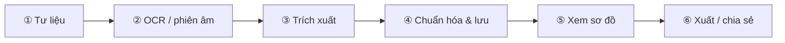

# Kế hoạch UI — Theme xanh lá sáng, hình ảnh đồng bộ & flow đầy đủ

> **Ngày:** 2026-07-25  
> **Mục đích:** Đổi visual sang **xanh lá sáng (light-first)**, đồng bộ hình ảnh, cải thiện UX rõ ràng, hỗ trợ **một happy path end-to-end** cho demo luận văn  
> **Liên quan:** [luan_van_phan_tich_va_ke_hoach.md](./luan_van_phan_tich_va_ke_hoach.md) §4, [visual_tree_ui_info_task.md](./visual_tree_ui_info_task.md)  
> **Phạm vi:** Chỉ plan — **chưa** implement code trong file này

---

## Mục lục

1. [Mục tiêu & nguyên tắc](#1-mục-tiêu--nguyên-tắc)
2. [Hiện trạng theme & UX](#2-hiện-trạng-theme--ux)
3. [Hệ màu xanh lá sáng (design tokens)](#3-hệ-màu-xanh-lá-sáng-design-tokens)
4. [Hình ảnh & illustration — đồng bộ theme](#4-hình-ảnh--illustration--đồng-bộ-theme)
5. [Cải thiện UX — rõ ràng hơn](#5-cải-thiện-ux--rõ-ràng-hơn)
6. [Flow hỗ trợ đầy đủ (happy path)](#6-flow-hỗ-trợ-đầy-đủ-happy-path)
7. [IA & navigation đề xuất](#7-ia--navigation-đề-xuất)
8. [Component / màn hình cần chỉnh](#8-component--màn-hình-cần-chỉnh)
9. [Lộ trình triển khai](#9-lộ-trình-triển-khai)
10. [Acceptance criteria](#10-acceptance-criteria)
11. [File code liên quan](#11-file-code-liên-quan)

---

## 1. Mục tiêu & nguyên tắc

### 1.1. Mục tiêu

| # | Mục tiêu | Đo được |
|---|----------|---------|
| G1 | **Theme xanh lá, sáng** — cảm giác “gia phả / thiên nhiên / tươi mới” | Primary ≠ vàng hiện tại; nền sáng ≥ 98% luminance |
| G2 | **Hình ảnh đồng bộ** — hero, icon, empty state, sơ đồ cùng palette | Không còn overlay xám đen lạc tông xanh |
| G3 | **UX rõ ràng** — user biết “đang ở bước nào, bước tiếp là gì” | Mỗi bước pipeline có label + trạng thái + CTA |
| G4 | **Flow đầy đủ** — upload → OCR → extract → cây → xem → export | Demo 5–7 click không nhảy admin/dev |

### 1.2. Nguyên tắc thiết kế

| Nguyên tắc | Ý nghĩa |
|------------|---------|
| **Light-first** | Mặc định sáng; dark mode giữ nhưng secondary |
| **SSOT màu** | Chỉ sửa `seedTokens.ts` + fallback `index.css`; Ant Design sync qua `syncTokensToCss.ts` |
| **Free-only visual** | Không thêm thư viện viz trả phí (giữ policy repo) |
| **Một câu chuyện** | UI phục vụ pipeline nghiệp vụ, không trang trí rời |
| **i18n** | Label mới → `vi.json` + `en.json` (`familyTree.*`, `pages.*`, `flow.*`) |

### 1.3. Metaphor thị giác

```text
Gia phả = cây (tree) = lá xanh + nền sáng + đường nối xanh đậm
Pipeline = hành trình từ hạt giống (tư liệu) → cây trưởng thành (graph)
Trạng thái = chip màu (chưa làm / đang / xong / lỗi) — nhất quán mọi màn
```

---

## 2. Hiện trạng theme & UX

### 2.1. Theme hiện tại

| Thành phần | Giá trị hiện tại | Vấn đề |
|------------|------------------|--------|
| Primary brand | `#b8860b` (vàng đồng) — `seedTokens.ts` | Không gợi “cây / gia phả xanh”; lệch yêu cầu mới |
| Fallback CSS | `--primary: 43 74% 38%` (vàng) — `index.css` | Trùng vàng; hero overlay **xám đen** |
| Layout nền | `#f5f5f5` / `#fafafa` | Ổn nhưng trung tính, chưa “sáng xanh” |
| Tree DOM | `border-color: hsl(var(--primary))` | Đổi primary → tự theo nếu sync đúng |
| Dark mode | `#d4a017` primary | Giữ dark nhưng tone xanh lá đậm hơn vàng |

### 2.2. UX / flow hiện tại (tóm tắt từ phân tích)

| Vấn đề | Biểu hiện |
|--------|-----------|
| Menu rời rạc | User: Dashboard · Document reader · Documents · Family trees — **không thấy thứ tự** |
| Hai zone lưu trữ | User local/tạm vs Admin MySQL — journey không khép |
| Pipeline ẩn | 7 bước chủ yếu trong tab admin chi tiết cây |
| Hero CTA mơ hồ | “Xem mẫu” vs “Mở tài liệu” — chưa map bước 1→2 |
| Hình hero | `hero-bg.jpg` + overlay tối — không đồng bộ xanh sáng |

---

## 3. Hệ màu xanh lá sáng (design tokens)

### 3.1. Palette đề xuất — **Light (mặc định)**

| Token | HSL (channels) | Hex gợi ý | Dùng |
|-------|----------------|-------------|------|
| `--primary` | `152 48% 36%` | `#30855a` | Nút chính, link, connector cây |
| `--primary-foreground` | `0 0% 100%` | `#ffffff` | Chữ trên nút primary |
| `--background` | `140 25% 98%` | `#f7fbf8` | Nền app — **sáng, hơi xanh** |
| `--foreground` | `160 10% 12%` | `#1c2420` | Chữ chính — không đen tuyệt đối |
| `--card` | `0 0% 100%` | `#ffffff` | Card, panel |
| `--muted` | `140 20% 94%` | `#eef5f0` | Nền phụ, sidebar accent |
| `--muted-foreground` | `160 8% 42%` | `#62726a` | Chữ phụ |
| `--accent` | `148 45% 92%` | `#e3f5ea` | Highlight nhẹ, hover menu |
| `--accent-foreground` | `152 48% 28%` | `#256b47` | Chữ trên accent |
| `--border` | `140 15% 88%` | `#dce8e0` | Viền |
| `--ring` | `152 48% 36%` | = primary | Focus ring |
| `--brand` | = primary | | Alias |
| `--brand-light` | `148 45% 92%` | | Gradient nhẹ |
| `--brand-foreground` | `152 55% 28%` | `#1f5c3f` | Gradient đậm |

**Semantic (Ant Design — giữ ý nghĩa):**

| Token | Hex gợi ý | Ghi chú |
|-------|-----------|---------|
| `colorSuccess` | `#389e0d` | Gần primary nhưng dùng cho “Hoàn thành” |
| `colorWarning` | `#d48806` | Cảnh báo pipeline pending |
| `colorError` | `#cf1322` | Lỗi OCR/extract |
| `colorInfo` | `#1677ff` | Link phụ, không thay primary |

### 3.2. Palette — **Dark (secondary)**

| Token | HSL gợi ý | Ghi chú |
|-------|-----------|---------|
| `--primary` | `152 45% 48%` | Sáng hơn để contrast trên nền tối |
| `--background` | `160 12% 8%` | Xanh đen, không xám thuần |
| `--card` | `160 10% 12%` | |
| Hero overlay dark | gradient xanh đen 70% | Thay overlay đen thuần |

### 3.3. `seedTokens.ts` đề xuất (SSOT)

```typescript
export const brandSeed = {
  colorPrimary: "#30855a",      // was #b8860b
  colorSuccess: "#389e0d",
  colorWarning: "#d48806",
  colorError: "#cf1322",
  colorInfo: "#1677ff",
  borderRadius: 12,
  fontSize: 14,
  fontFamily: "Roboto, -apple-system, BlinkMacSystemFont, sans-serif",
  controlHeight: 36,
} as const;

export const darkSeedOverrides = {
  colorPrimary: "#3dab6a",    // was #d4a017
} as const;
```

### 3.4. Layout Ant Design (`antdTheme.ts`)

| Component | Light đề xuất | Lý do |
|-----------|---------------|-------|
| `Layout.bodyBg` | `#f7fbf8` | Khớp `--background` |
| `Layout.siderBg` | `#ffffff` hoặc `#f0f7f2` | Sidebar sáng, viền xanh nhạt |
| `Layout.headerBg` | `#ffffff` | Header trắng, shadow nhẹ |
| `Table.headerBg` | `#eef5f0` | Header bảng tông xanh nhạt |
| `Menu` item selected | `colorPrimaryBg` | Active rõ trên nền sáng |

### 3.5. Gradient & utility classes (`index.css`)

| Class | Đổi thành |
|-------|-----------|
| `.hero-overlay` | Gradient **xanh đậm → trong suốt** (không xám `#000`) |
| `.brand-gradient` | `primary → brand-foreground` (xanh) |
| `.section-divider` | Giữ — đã dùng `--primary` |
| `.site-footer` | Nền `152 48% 22%` (xanh đậm) + chữ trắng — nhất quán brand |

---

## 4. Hình ảnh & illustration — đồng bộ theme

### 4.1. Nguyên tắc hình ảnh

| Quy tắc | Chi tiết |
|---------|----------|
| **Tông màu** | Ảnh thật / minh họa ưu tiên xanh lá, kem, gỗ sáng — tránh vàng đồng / sepia nặng |
| **Độ sáng** | Hero & banner: exposure cao; overlay nhẹ để chữ trắng vẫn đọc được |
| **Filter CSS (tạm)** | `hero-bg.jpg` cũ: `brightness(1.05) saturate(0.9) hue-rotate(80deg)` — chỉ bridge đến khi thay file |
| **Icon** | Ant Design icons giữ; accent xanh qua `colorPrimary` |
| **Empty state** | SVG inline hoặc PNG nhẹ: cây/lá xanh, nền `#eef5f0` |
| **Favicon / logo** | Nếu có: lá hoặc cây đơn giản, 1–2 màu |

### 4.2. Danh mục asset cần rà / thay

| Asset | Vị trí | Hành động |
|-------|--------|-----------|
| `hero-bg.jpg` | `src/assets/` | **Thay** ảnh sáng (vườn, giấy cổ sáng, cây tre/lá) hoặc illustration |
| Hero overlay | `index.css` `.hero-overlay` | Gradient xanh `152 48% 20% / 0.55` |
| Tree node card | `.tree-node-card` | Viền xanh primary; hover shadow xanh 25% |
| Pipeline step icons | `GenealogyPipelineSteps` | Icon + màu theo trạng thái (xanh done, vàng pending) |
| Login / Register | (nếu có bg) | Nền `#f7fbf8` + pattern lá mờ 5% opacity |
| OG / social preview | (optional) | Template xanh + title app |

### 4.3. Spec ảnh hero mới (gợi ý brief designer / AI)

```text
Chủ đề: Gia phả Việt — giấy cổ / bản đồ họ sáng, xen lá cây mờ
Tông: xanh lá + kem + trắng, KHÔNG vàng đồng
Kích thước: 1920×1080 (16:9), WebP + JPG fallback
Vùng an toàn chữ: giữa 60% chiều ngang, overlay gradient dưới
Alt: "Gia phả truyền thống Việt Nam"
```

### 4.4. Sơ đồ gia phả (renderer)

| Renderer | Điều chỉnh visual |
|----------|-------------------|
| `dom-classic` | Connector + card border = primary xanh; nền canvas `#f7fbf8` |
| `minimal` theme | Viền xám-xanh nhạt thay xám trung tính |
| `print-a4` | In: đen trắng OK; preview màn hình vẫn hint xanh nhạt |
| `cytoscape-dagre` | Edge color `#30855a`; node fill trắng, border primary |

---

## 5. Cải thiện UX — rõ ràng hơn

### 5.1. Hierarchy thông tin

| Cấp | Quy tắc | Ví dụ |
|-----|---------|-------|
| **H1 trang** | 1 tiêu đề + 1 dòng mô tả bước | “Tài liệu của bạn — Bước 1: Tải lên” |
| **Primary action** | 1 nút xanh / trang | “Tiếp tục OCR” |
| **Secondary** | Outline / text | “Quay lại”, “Xem sau” |
| **Trạng thái** | Tag Ant Design: `default` / `processing` / `success` / `error` | Pipeline step |

### 5.2. Pattern UX bắt buộc

| Pattern | Mô tả | Áp dụng |
|---------|-------|---------|
| **Stepper / progress** | 6 bước happy path luôn hiển thị (compact trên mobile) | Dashboard, Document detail, Tree detail |
| **Next-step CTA** | Sau mỗi hành động thành công → banner xanh + nút bước kế | OCR xong → “Ghép trang & trích xuất” |
| **Breadcrumb nghiệp vụ** | Tư liệu › Vol.855 › OCR › Cây Nguyễn tộc | Admin + User detail |
| **Empty state có hướng dẫn** | Illustration + 1 câu + 1 nút | “Chưa có tài liệu” → “Tải lên đầu tiên” |
| **Toast nhất quán** | success = xanh; lỗi = đỏ; không stack quá 2 | Toàn app |

### 5.3. Giảm rối menu

| Trước | Sau (đề xuất) |
|-------|----------------|
| Document reader + Documents tách ý nghĩa mơ hồ | **“Quy trình xử lý”** (wizard) + **“Thư viện tài liệu”** |
| Family tree + Family trees | **“Gia phả của tôi”** (list + detail một mạch) |
| Dashboard chung chung | **“Tổng quan”** = tiến độ pipeline + quick actions |

### 5.4. Trang Hướng dẫn (`/huong-dan`)

Cập nhật nội dung khớp **6 bước** (§6), mỗi bước: screenshot + link deep-link vào app.

---

## 6. Flow hỗ trợ đầy đủ (happy path)

### 6.1. Pipeline nghiệp vụ (một câu chuyện)



### 6.2. Map bước → route → UI (User + Admin thống nhất)

| Bước | Tên hiển thị (i18n key gợi ý) | Route User | Route Admin | Component chính | Output |
|------|-------------------------------|------------|-------------|-----------------|--------|
| ① | `flow.step.material` | `/user/documents` upload | `/admin/documents/:id/edit` | Upload / Nom import | Document record |
| ② | `flow.step.ocr` | detail doc → tab OCR | cùng | `DocumentOcrPanel` | `combined_transcription.txt` |
| ③ | `flow.step.extract` | detail → Analyze | tab pipeline ⑥ | Extract / Gemini | `ExtractedRelation[]` |
| ④ | `flow.step.canonical` | lưu cây | tab hồ sơ / save | Normalize → store | `BalkanNode[]` |
| ⑤ | `flow.step.visual` | `/user/family-trees/:id` | `/admin/gia-pha/:id?tab=visual` | `FamilyTreeVisualPanel` | Xem cây |
| ⑥ | `flow.step.export` | export JSON/CSV | tab export | Export service | File |

### 6.3. Luồng demo luận văn (5–7 click)

```text
1. /huong-dan — đọc 30s (optional)
2. /user/documents — chọn tài liệu mẫu 855 hoặc upload
3. Document detail — OCR trang → Ghép trang (banner xanh “Bước ② xong”)
4. Nút “Trích xuất quan hệ” → xem preview people/edges
5. “Lưu thành gia phả” → redirect `/user/family-trees/:id`
6. Tab Sơ đồ — chọn dom-classic / bảng
7. (Tuỳ chọn) Export JSON
```

**Không** đi qua `/admin/developer/*` trong demo mặc định.

### 6.4. Component flow mới (đề xuất)

| Component | Vai trò | Props gợi ý |
|-----------|---------|-------------|
| `GenealogyFlowStepper` | Thanh 6 bước sticky | `currentStep`, `completedSteps[]`, `compact?` |
| `FlowNextBanner` | Sau action thành công | `message`, `nextLabel`, `nextHref` |
| `PipelineStatusChip` | Tag trạng thái từng bước | `stepId`, `status: pending\|running\|done\|error` |
| `QuickStartCard` | Dashboard — 3 thẻ: Tải lên / Tiếp tục OCR / Xem cây | link deep |

**Tái sử dụng:** mở rộng `GenealogyPipelineSteps` hiện có — thêm prop `variant="user"` và màu xanh.

### 6.5. Trạng thái pipeline ↔ màu (UX rõ)

| Trạng thái | Màu | Icon |
|------------|-----|------|
| `pending` | `--muted` / vàng nhạt | Clock |
| `running` | `--primary` + animation | Loading |
| `done` | `colorSuccess` | Check |
| `error` | `colorError` | Close / Warning |
| `skipped` | `--muted-foreground` | Minus |

---

## 7. IA & navigation đề xuất

### 7.1. Công khai

```text
Trang chủ (/)          — hero xanh sáng, CTA “Bắt đầu quy trình”
Hướng dẫn (/huong-dan)— 6 bước + screenshot
Gia phả mẫu (/gia-pha)— demo read-only
```

### 7.2. User workspace

```text
Tổng quan              — stepper + việc cần làm
Quy trình xử lý        — wizard hoặc redirect doc đang dở
Thư viện tài liệu      — list + upload
Gia phả của tôi        — list cây
Tài khoản
```

### 7.3. Admin (giữ quyền, đồng bộ flow)

```text
Tổng quan
Gia phả & tài liệu     — cùng flow 6 bước trong detail
Người dùng / Lịch sử
▸ Công cụ nghiên cứu    — collapse: crawl, OCR config, storage
```

---

## 8. Component / màn hình cần chỉnh

| Ưu tiên | Màn hình / file | Việc |
|---------|-----------------|------|
| P0 | `seedTokens.ts`, `index.css`, `antdTheme.ts` | Đổi palette xanh sáng |
| P0 | `HomePage.tsx`, `index.css` hero | Overlay + CTA “Bắt đầu quy trình” |
| P0 | `GenealogyPipelineSteps` (+ user pages) | Stepper 6 bước + màu trạng thái |
| P1 | `UserLayout.tsx`, `AdminLayout.tsx` | Menu mới §7; sidebar sáng |
| P1 | `DashboardPage` (user) | QuickStartCard + tiến độ |
| P1 | `DocumentOcrPanel` | FlowNextBanner sau merge OCR |
| P1 | `GuidePage` | Nội dung 6 bước + ảnh |
| P2 | `family-tree-themes.css` | DOM/graph màu xanh |
| P2 | `LoginPage`, `RegisterPage` | Nền sáng đồng bộ |
| P2 | Empty states (documents, trees) | Illustration xanh |
| P3 | `vi.json`, `en.json` | Keys `flow.*`, menu mới |

---

## 9. Lộ trình triển khai

| Phase | Thời gian ước | Deliverable |
|-------|---------------|-------------|
| **P0 — Theme** | 0.5–1 ngày | Token xanh + hero overlay + footer; build pass |
| **P1 — Flow shell** | 1–2 ngày | Stepper + banner next-step trên doc/tree detail |
| **P2 — IA & dashboard** | 1–2 ngày | Menu gọn + QuickStart + Guide cập nhật |
| **P3 — Assets** | 1 ngày | hero WebP mới + empty SVG |
| **P4 — Polish** | 0.5 ngày | Dark mode xanh, contrast audit WCAG AA |

**Thứ tự:** P0 → P1 (demo được) → P2 → P3 → P4.

---

## 10. Acceptance criteria

### Theme & hình ảnh

- [ ] Primary brand là **xanh lá** (không còn `#b8860b` trong SSOT)
- [ ] Light mode: nền app sáng, cảm giác “xanh nhạt” (`#f7fbf8` hoặc tương đương)
- [ ] Hero: overlay **không** dùng gradient xám đen thuần; chữ hero đọc được WCAG AA
- [ ] Tree DOM connector + card border theo primary mới
- [ ] Ảnh hero thay hoặc filter tạm — không lệch tông vàng sepia

### UX & flow

- [ ] User thấy **6 bước** pipeline trên Dashboard hoặc document detail
- [ ] Sau OCR merge thành công → có **CTA rõ** sang bước trích xuất
- [ ] Demo happy path §6.3 hoàn thành **≤ 7 click** không vào developer
- [ ] `/huong-dan` mô tả đúng 6 bước + link vào app
- [ ] Menu User ≤ 5 mục chính; tên phản ánh nhiệm vụ (không chỉ tên kỹ thuật)
- [ ] i18n đủ `vi` + `en` cho label flow mới

### Không phá vỡ

- [ ] Dark mode vẫn hoạt động; toggle không flash trắng
- [ ] Free-only renderer policy giữ nguyên
- [ ] Không đổi SSOT `BalkanNode[]`

---

## 11. File code liên quan

| File | Vai trò |
|------|---------|
| `family-saga-io/src/theme/seedTokens.ts` | **SSOT màu brand** |
| `family-saga-io/src/theme/antdTheme.ts` | Layout / component Ant Design |
| `family-saga-io/src/theme/syncTokensToCss.ts` | Sync Ant → CSS variables |
| `family-saga-io/src/index.css` | Fallback + hero + utilities |
| `family-saga-io/tailwind.config.ts` | Map CSS variables |
| `family-saga-io/src/pages/HomePage.tsx` | Hero + CTA |
| `family-saga-io/src/layouts/UserLayout.tsx` | Menu user |
| `family-saga-io/src/layouts/AdminLayout.tsx` | Menu admin |
| `family-saga-io/src/components/pipeline/GenealogyPipelineSteps.tsx` | Pipeline UI |
| `family-saga-io/src/components/documents/DocumentOcrPanel.tsx` | OCR flow |
| `family-saga-io/src/components/family-tree/family-tree-themes.css` | Renderer visual |
| `family-saga-io/src/assets/hero-bg.jpg` | Hero image |
| `family-saga-io/src/locales/vi.json`, `en.json` | i18n |

---

## Liên kết chéo

| Tài liệu | Nội dung |
|----------|----------|
| [luan_van_phan_tich_va_ke_hoach.md](./luan_van_phan_tich_va_ke_hoach.md) | Gốc rễ UX rối + happy path §4 |
| [visual_tree_ui_info_task.md](./visual_tree_ui_info_task.md) | Renderer sơ đồ free-only |
| [output_formats_and_ui_plan.md](./output_formats_and_ui_plan.md) | SSOT & export |

---

*Cập nhật khi implement P0–P4; ghi chú thực tế hex/token cuối cùng vào §3 sau khi merge code.*
