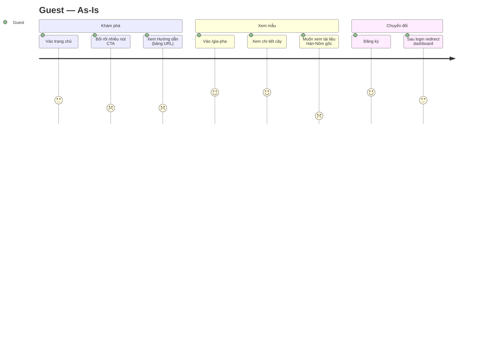
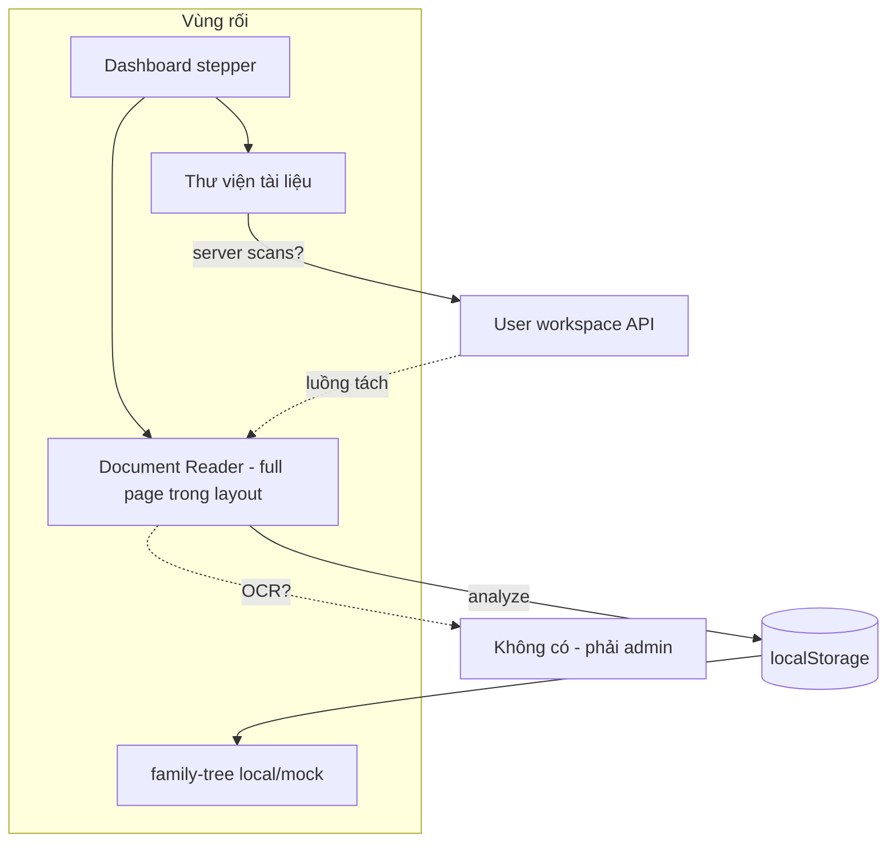
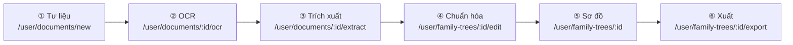

# Plan UX — Đánh giá khó khăn, nhược điểm & User Journey Map

> **Ngày:** 2026-07-26  
> **Mục đích:** Ghi nhận phân tích UX (góc nhìn người dùng khó tính), ma trận pain points, **User Journey Map chi tiết** (Guest / User / Admin) kèm **wireframe đề xuất**, lộ trình khắc phục  
> **Liên quan:** [FEATURES.md](../FEATURES.md), [ui_green_theme_flow_ux_plan.md](./ui_green_theme_flow_ux_plan.md), [luan_van_phan_tich_va_ke_hoach.md](./luan_van_phan_tich_va_ke_hoach.md) §4, [visual_tree_ui_info_task.md](./visual_tree_ui_info_task.md)  
> **Phạm vi:** Plan only — chưa implement

---

## Mục lục

1. [Tóm tắt điều hành](#1-tóm-tắt-điều-hành)
2. [Hiện trạng & pain points](#2-hiện-trạng--pain-points)
3. [Nguyên tắc thiết kế mục tiêu](#3-nguyên-tắc-thiết-kế-mục-tiêu)
4. [User Journey Map — Guest](#4-user-journey-map--guest)
5. [User Journey Map — User](#5-user-journey-map--user)
6. [User Journey Map — Admin](#6-user-journey-map--admin)
7. [Wireframe đề xuất](#7-wireframe-đề-xuất)
8. [IA & navigation đề xuất](#8-ia--navigation-đề-xuất)
9. [Lộ trình triển khai](#9-lộ-trình-triển-khai)
10. [Acceptance criteria](#10-acceptance-criteria)
11. [Checklist file](#11-checklist-file)

---

## 1. Tóm tắt điều hành

### 1.1. Kết luận một câu

App **mạnh về backend/admin và demo kỹ thuật**, nhưng **trải nghiệm end-to-end vẫn giống bản beta**: nhiều màn hình, hai vùng quyền lẫn lộn, dữ liệu không chắc chắn, pipeline hiển thị đẹp hơn là chạy trọn vẹn.

### 1.2. Mức độ đáp ứng kỳ vọng (ước lượng)

| Nhóm người dùng | Kỳ vọng chính | Đáp ứng hiện tại |
|-----------------|---------------|------------------|
| **Guest** | Xem mẫu, hiểu app, đăng ký dễ | ~60% (list public có; tài liệu public hạn chế) |
| **User** | Upload → OCR → cây → lưu → in | ~40–50% (localStorage/mock, OCR admin-only) |
| **Admin** | Quản lý full pipeline | ~75% (đầy đủ nhưng UI dev-heavy) |

### 1.3. Top 5 việc ưu tiên

| # | Việc | Lý do |
|---|------|-------|
| P0-1 | **Một luồng user duy nhất** — bỏ localStorage/mock làm đường chính | Niềm tin dữ liệu |
| P0-2 | **OCR Hán-Nôm cho user** hoặc ẩn hẳn trên marketing nếu chưa có | Khớp lời hứa sản phẩm |
| P0-3 | **Gỡ double layout** (DocumentReader / FamilyTree trong UserLayout) | Cảm giác sản phẩm thống nhất |
| P0-4 | **Stepper gắn route + trạng thái thật** | User biết bước tiếp theo |
| P0-5 | **Zoom + in fit** sơ đồ DOM (P7/P8 visual task) | Dùng được gia phả lớn |

---

## 2. Hiện trạng & pain points

### 2.1. Ma trận pain points

| ID | Pain point | Biểu hiện | File / route liên quan | Mức |
|----|------------|-----------|------------------------|-----|
| PP-01 | Hai thế giới User vs Admin | OCR, pipeline đầy đủ chỉ admin | `DocumentOcrPanel.tsx`, admin tabs | 🔴 Critical |
| PP-02 | Dữ liệu không persist | `localStorage` analysis, mock fallback | `DocumentReaderPage.tsx`, `FamilyTreePage.tsx` | 🔴 Critical |
| PP-03 | Double chrome UI | Sidebar + header layout + header trang con | `UserLayout.tsx` + `DocumentReaderPage.tsx` | 🔴 Critical |
| PP-04 | Stepper giả | Nhiều bước map cùng route; logic completed đơn giản | `genealogyFlow.ts`, `DashboardPage.tsx` | 🟠 High |
| PP-05 | Menu rối | “Quy trình” vs “Thư viện”; `/user/family-tree` ẩn menu | `UserLayout.tsx` | 🟠 High |
| PP-06 | Guide cho dev | Bảng URL/zone thay vì hướng dẫn từng bước | `GuidePage.tsx` | 🟠 High |
| PP-07 | Trạng thái raw EN | `pending`, `completed` không i18n | `UserDocumentsPage.tsx` | 🟡 Medium |
| PP-08 | Sơ đồ lớn khó xem | DOM không zoom; in chưa fit/chia trang | `visual_tree_ui_info_task.md` P7/P8 | 🟡 Medium |
| PP-09 | Hero quá nhiều CTA | 4–5 nút cùng lúc | `HomePage.tsx` | 🟡 Medium |
| PP-10 | Admin menu dev-heavy | Crawl, logs, storage lẫn quản lý nội dung | `AdminLayout.tsx` | 🟡 Medium |
| PP-11 | Thiếu “đã lưu server” | User không phân biệt local vs DB | Toàn user flow | 🟡 Medium |
| PP-12 | Lỗi kỹ thuật | `gemini_error`, 401 giữa chừng — không hướng dẫn | API error handling FE | 🟡 Medium |

### 2.2. Luồng lý tưởng vs thực tế

```text
LÝ TƯỞNG (marketing / Guide)
  Upload Hán-Nôm → OCR → Phiên âm → Sửa → AI trích xuất → Lưu cây → Xem/In/Export

THỰC TẾ (user thường, 2026-07)
  Upload (Document Reader)
    → Gemini analyze
    → localStorage
    → /user/family-tree (mock nếu lỗi)
    → OCR? (phải sang admin)
    → Persist? (không rõ ràng)
```

### 2.3. Điểm mạnh cần giữ

| Thành phần | Ghi chú |
|------------|---------|
| `FamilyTreeVisualPanel` + registry renderer | SSOT tách renderer — đúng hướng |
| Theme xanh lá + flow components | `GenealogyFlowStepper`, `QuickStartCards`, `FlowNextBanner` |
| Admin chi tiết cây | Tab visual, tài liệu, pipeline, CRUD |
| i18n vi/en, dark mode | Cần hoàn thiện microcopy |
| Public list `/gia-pha` | Đã có `PublicFamilyTreeListPage` |

---

## 3. Nguyên tắc thiết kế mục tiêu

| # | Nguyên tắc | Ý nghĩa |
|---|------------|---------|
| D1 | **One pipeline story** | Mọi màn map vào 6 bước nghiệp vụ, không tên kỹ thuật |
| D2 | **Role = quyền, không = sản phẩm khác** | User/Admin cùng UI; admin thêm thao tác |
| D3 | **Persist trước, polish sau** | Không demo bằng localStorage |
| D4 | **Một primary action / màn** | Giảm CTA hero & form |
| D5 | **Research tools tách lớp** | Crawl/config/logs không chen journey chính |
| D6 | **Trạng thái = tiếng Việt + hành động tiếp** | Tag i18n + `FlowNextBanner` |

---

## 4. User Journey Map — Guest

### 4.1. Persona

**Nguyễn Văn K.** — 45 tuổi, nghe giới thiệu app gia phả Hán-Nôm, chưa đăng ký, muốn xem mẫu trước khi tin tưởng upload sổ gia phả gia đình.

### 4.2. Journey hiện tại (As-Is)



| Bước | Hành động | Cảm xúc | Pain | Cơ hội |
|------|-----------|---------|------|--------|
| G1 | Landing `/` | Tò mò | Quá nhiều CTA | 1 hero CTA chính + 1 phụ |
| G2 | `/huong-dan` | Rối | Dev-oriented | 6 bước có ảnh, không URL |
| G3 | `/gia-pha` | Hài lòng vừa | List thiếu thumbnail | Card có ảnh bìa / số thế hệ |
| G4 | `/gia-pha/:id` | Xem sơ đồ OK | Không xem được kho tư liệu public | Tab tài liệu public (read-only) |
| G5 | Đăng ký `/register` | OK | — | Giữ form đơn giản |
| G6 | Login → dashboard | Hơi lạc | Menu user ngay | Onboarding 3 bullet pipeline |

### 4.3. Journey mục tiêu (To-Be)

```text
[G1] Trang chủ — 1 CTA "Xem gia phả mẫu" + 1 "Bắt đầu"
[G2] Gallery /gia-pha — card trực quan (tên họ, số thành viên, ảnh)
[G3] Chi tiết — Sơ đồ + Hồ sơ + (mới) Tài liệu mẫu read-only
[G4] CTA sticky "Tạo gia phả của bạn" → Register
[G5] Sau register — wizard 30 giây: "Bạn có file scan không?"
```

### 4.4. Touchpoints & metrics

| Metric | Mục tiêu To-Be |
|--------|----------------|
| Time to first sample tree | ≤ 2 click từ home |
| Bounce từ Guide | Giảm — nội dung dân dụng |
| Register conversion từ public | Đo CTA trên `/gia-pha/:id` |

---

## 5. User Journey Map — User

### 5.1. Persona

**Trần Thị M.** — 52 tuổi, đã đăng ký, có ảnh scan 6 trang sổ gia phả Hán-Nôm, ít rành công nghệ, sợ mất dữ liệu.

### 5.2. Journey hiện tại (As-Is)



| Bước pipeline | As-Is route | Vấn đề |
|---------------|-------------|--------|
| ① Tư liệu | `/user/documents` + `/user/document-reader` | Hai entry upload |
| ② OCR | Admin only | **Đứt journey** |
| ③ Trích xuất | `/user/document-reader` | OK nhưng không gắn doc server |
| ④ Chuẩn hóa | `/user/family-trees` | Chưa rõ link từ extract |
| ⑤ Visual | `/user/family-trees/:id` | OK, thiếu zoom |
| ⑥ Export | Chủ yếu admin panel | User detail mỏng |

### 5.3. Journey mục tiêu (To-Be) — Happy path 6 bước



**Quy tắc To-Be:**

- Mỗi bước = **một URL riêng** (hoặc tab có deep-link `?step=ocr`)
- Sau mỗi bước thành công → `FlowNextBanner` + cập nhật stepper
- Mọi dữ liệu ghi **server** (MinIO + MySQL); localStorage chỉ cache UI tạm (optional)
- OCR user = reuse `DocumentOcrPanel` (cùng component admin, quyền user)

### 5.4. Emotional journey (To-Be)

| Bước | Cảm xúc mong muốn | UI hỗ trợ |
|------|-------------------|-----------|
| Upload | An tâm | Progress bar + "Đã lưu lên server lúc …" |
| OCR | Kiên nhẫn có lý do | Tiến độ từng trang 2/6 |
| Extract | Tò mò | Preview people/edges trước khi lưu cây |
| Chuẩn hóa | Kiểm soát | Sửa tên/năm inline |
| Visual | Tự hào | Zoom, đổi kiểu sơ đồ |
| Export | Hoàn thành | PDF/JSON + "Chia sẻ link" (nếu public) |

### 5.5. Edge cases user khó tính

| Tình huống | Phản hồi UX cần có |
|------------|-------------------|
| File > 50MB | Trước upload: giới hạn rõ + nén ảnh gợi ý |
| OCR 1 trang lỗi | Retry trang; không fail cả batch im lặng |
| Gemini timeout | "Thử lại" + "Lưu text thủ công" |
| Đổi máy login | Cây vẫn trên server — list `/user/family-trees` |
| Session hết hạn | Modal lưu draft + login lại |

---

## 6. User Journey Map — Admin

### 6.1. Persona

**Admin L.** — GVHD / nghiên cứu viên: quản lý corpus VGP, cấu hình OCR, hỗ trợ user, demo luận văn.

### 6.2. Journey hiện tại (As-Is)

```text
Login admin
  → Admin dashboard
  → Menu: Tổng quan | Gia phả & tài liệu | Lịch sử | Thành viên | Developer ▼
       └── Hannom | Storage | Crawl VGP | Crawl Nom | Logs | Docs API
  → Chi tiết cây /admin/gia-pha/:id
       └── Tabs: Thông tin | Sơ đồ | Thành viên | Pipeline | Kho tư liệu | ...
```

| Pain | Chi tiết |
|------|----------|
| IA trộn vận hành & nội dung | Crawl cùng hàng với "Gia phả" |
| Demo luận văn dễ lạc | 7+ click, hay rơi vào Developer |
| Trùng chức năng user | Admin làm OCR ở admin; user không — inconsistent |

### 6.3. Journey mục tiêu (To-Be)

**Tách 2 lớp menu:**

```text
QUẢN LÝ NỘI DUNG (demo chính)
  · Tổng quan
  · Gia phả & tài liệu
  · Thành viên hệ thống
  · Lịch sử truy vấn

CÔNG CỤ NGHIÊN CỨU (collapsed / footer)
  · Cấu hình OCR
  · Lưu trữ MinIO
  · Crawl VGP / Nom
  · Logs & API docs
```

**Admin = User + quyền mở rộng** trên cùng màn chi tiết tài liệu/cây — không bắt admin dùng UI khác hẳn cho OCR.

### 6.4. Demo path luận văn (≤ 7 click)

| # | Click | Màn hình |
|---|-------|----------|
| 1 | Login admin | Dashboard |
| 2 | Gia phả mẫu | List |
| 3 | Chọn cây | Detail |
| 4 | Tab Kho tư liệu | Documents |
| 5 | OCR / phiên âm | OCR panel |
| 6 | Tab Sơ đồ | Visual |
| 7 | Export / In | Export modal |

→ Không mở Developer menu trong demo script.

---

## 7. Wireframe đề xuất

> Wireframe ASCII — mức **low-fi** để align IA trước khi vẽ Figma. Không thay thế mockup pixel-perfect.

### 7.1. Trang chủ (Guest) — To-Be

```text
┌─────────────────────────────────────────────────────────────────┐
│  [Logo]              Hướng dẫn   Gia phả mẫu     [Đăng nhập]  │
├─────────────────────────────────────────────────────────────────┤
│                                                                 │
│              Số hóa gia phả Hán-Nôm — từ ảnh scan đến cây       │
│              ─────────────────────────────────────              │
│                                                                 │
│         [  Bắt đầu miễn phí  ]    [  Xem gia phả mẫu  ]         │
│                                                                 │
│   (chỉ 2 CTA; link "Tìm hiểu quy trình" text nhỏ bên dưới)      │
├─────────────────────────────────────────────────────────────────┤
│  ① Tư liệu → ② OCR → ③ Trích xuất → ④ Cây → ⑤ Xem → ⑥ Xuất     │
│  (stepper minh hoạ — click → /huong-dan#step-N)                 │
└─────────────────────────────────────────────────────────────────┘
```

### 7.2. User — Dashboard (To-Be)

```text
┌──────────┬──────────────────────────────────────────────────────┐
│ Tổng quan│  Xin chào, Trần Thị M.                               │
│──────────│  ┌─ Quy trình ─────────────────────────────────────┐ │
│ Thư viện │  │ ●━━━●━━━○━━━○━━━○━━━○  Bước 2/6: OCR            │ │
│ tư liệu  │  └─────────────────────────────────────────────────┘ │
│          │  ┌─ Việc tiếp theo ────────────────────────────────┐ │
│ Gia phả  │  │ Ảnh "Sổ gia phả Nguyễn tộc" chờ OCR (4/6 trang) │ │
│ của tôi  │  │                    [ Tiếp tục OCR → ]           │ │
│          │  └─────────────────────────────────────────────────┘ │
│ Tài khoản│  ┌─────────┐ ┌─────────┐ ┌─────────┐                  │
│          │  │ 3 tài   │ │ 1 cây   │ │ 12 lịch │                  │
│          │  │ liệu    │ │ gia phả │ │ sử      │                  │
└──────────┴──────────────────────────────────────────────────────┘
```

### 7.3. User — Chi tiết tài liệu wizard (To-Be)

**Một màn hub — không double header**

```text
┌──────────┬──────────────────────────────────────────────────────┐
│ (sidebar)│  Tư liệu › Sổ Nguyễn tộc — ảnh scan                   │
│          │  ● Tải lên ✓  ● OCR (đang)  ○ Trích xuất  ○ Cây     │
│          │  ─────────────────────────────────────────────────── │
│          │  ┌─ Tab: Ảnh gốc │ OCR │ Phiên âm │ Trích xuất ─────┐ │
│          │  │ [thumb p1][p2][p3]...                           │ │
│          │  │ Trang 2/6  [ Chạy OCR trang này ]                 │ │
│          │  │ ████████░░░░ 67%                                │ │
│          │  └─────────────────────────────────────────────────┘ │
│          │  ┌─ Sau khi xong ──────────────────────────────────┐ │
│          │  │ ✓ OCR hoàn tất          [ Trích xuất AI → ]     │ │
│          │  └─────────────────────────────────────────────────┘ │
└──────────┴──────────────────────────────────────────────────────┘
```

**Thay đổi kỹ thuật:** Gỡ `min-h-screen` + header riêng trong `DocumentReaderPage`; chỉ render nội dung trong `UserLayout` `<Outlet />`.

### 7.4. User — Gia phả detail (To-Be)

```text
┌──────────┬──────────────────────────────────────────────────────┐
│          │  Gia phả Nguyễn tộc · 47 thành viên · 5 thế hệ         │
│          │  [ Kiểu sơ đồ ▼ ] [ − 100% + ] [ In / Xuất ]          │
│          │  ┌─────────────────────────────────────────────────┐ │
│          │  │              (sơ đồ + zoom toolbar)             │ │
│          │  │                                                 │ │
│          │  └─────────────────────────────────────────────────┘ │
│          │  Tabs: Sơ đồ | Bảng thành viên | Tài liệu nguồn      │
└──────────┴──────────────────────────────────────────────────────┘
```

### 7.5. Guest — Gallery gia phả mẫu (To-Be)

```text
┌─────────────────────────────────────────────────────────────────┐
│  Gia phả mẫu công khai                                          │
│  Khám phá cây đã số hóa — xem sơ đồ và tư liệu Hán-Nôm          │
├─────────────────────────────────────────────────────────────────┤
│  ┌──────────────┐  ┌──────────────┐  ┌──────────────┐           │
│  │ [thumbnail]  │  │ [thumbnail]  │  │ [thumbnail]  │           │
│  │ Huỳnh tộc    │  │ Nguyễn tộc   │  │ VGP-122      │           │
│  │ 72 TV · 6 đời│  │ 45 TV · 4 đời│  │ 120 TV       │           │
│  │ [ Xem → ]    │  │ [ Xem → ]    │  │ [ Xem → ]    │           │
│  └──────────────┘  └──────────────┘  └──────────────┘           │
└─────────────────────────────────────────────────────────────────┘
```

### 7.6. Admin — Menu tách lớp (To-Be)

```text
┌──────────┬──────────────────────────────────────────────────────┐
│ Tổng quan│                                                      │
│ Gia phả  │   (nội dung quản lý — giống wireframe user detail    │
│ & TL     │    + bulk actions + user management)                   │
│ Thành    │                                                      │
│ viên     │                                                      │
│ Lịch sử  │                                                      │
│──────────│                                                      │
│ ⚙ Công   │  ← submenu collapsed mặc định                      │
│   cụ NC  │                                                      │
└──────────┴──────────────────────────────────────────────────────┘
```

### 7.7. Component pattern — FlowNextBanner (đã có, cần wire đúng)

```text
┌─────────────────────────────────────────────────────────────────┐
│ ✓  Phiên âm trang 6/6 đã xong.                                  │
│                              [ Bước tiếp: Trích xuất quan hệ → ]│
└─────────────────────────────────────────────────────────────────┘
```

---

## 8. IA & navigation đề xuất

### 8.1. Cấu trúc site To-Be

```text
Công khai
  /                    Giới thiệu
  /huong-dan           Hướng dẫn 6 bước (dân dụng)
  /gia-pha             Gallery mẫu
  /gia-pha/:id         Chi tiết + tài liệu public

User (ProtectedRoute)
  /user/dashboard      Tổng quan + stepper + next action
  /user/documents      Thư viện (list)
  /user/documents/:id  Wizard hub (upload/OCR/extract) — GỘP document-reader
  /user/family-trees   Danh sách cây
  /user/family-trees/:id  Visual + export
  /user/profile        Tài khoản

Admin (AdminRoute)
  /admin/dashboard
  /admin/gia-pha[...]  = user routes + quyền all trees
  /admin/users
  /admin/history
  /admin/research/*    Developer tools (redirect từ /admin/developer/*)
```

### 8.2. Route deprecate

| Route cũ | Hướng xử lý |
|----------|-------------|
| `/user/document-reader` | Redirect → `/user/documents/new` hoặc merge wizard |
| `/user/family-tree` | Redirect → `/user/family-trees` hoặc last tree |

### 8.3. Map `genealogyFlow.ts` To-Be

| Step ID | Route đề xuất |
|---------|---------------|
| `material` | `/user/documents` hoặc `/user/documents/new` |
| `ocr` | `/user/documents/:id?tab=ocr` |
| `extract` | `/user/documents/:id?tab=extract` |
| `canonical` | `/user/family-trees/:id?tab=edit` |
| `visual` | `/user/family-trees/:id?tab=visual` |
| `export` | `/user/family-trees/:id?tab=export` |

---

## 9. Lộ trình triển khai

### Phase UX-0 — Quick wins (1 tuần)

- [x] Gỡ double header: `DocumentReaderPage`, `FamilyTreePage` → content-only trong layout
- [x] i18n tag trạng thái `UserDocumentsPage` (`pending` → "Chờ xử lý")
- [x] Hero `HomePage`: giảm còn 2 CTA chính
- [x] `GuidePage`: thêm section 6 bước dân dụng (giữ bảng dev làm appendix)
- [x] Fix `GENEALOGY_FLOW_ROUTES` — mỗi bước URL khác nhau (query tab tạm thời)

### Phase UX-1 — Persist & một luồng (2–3 tuần)

- [x] Deprecate `localStorage` làm SSOT analysis → lưu qua user workspace API (redirect `/user/family-tree`; lưu cây qua API)
- [x] Gộp upload vào `/user/documents/:id` wizard (`/user/documents/new` + tabs)
- [ ] OCR panel cho user (reuse `DocumentOcrPanel`, phân quyền backend) — tab OCR placeholder
- [x] Dashboard `completedSteps` đọc từ API trạng thái doc/tree thật
- [x] Indicator "Đã lưu server" / "Chỉ trên máy này"

### Phase UX-2 — Public & admin IA (1–2 tuần)

- [x] Public documents read-only trên `/gia-pha/:id` (đã có từ trước)
- [x] Gallery thumbnail + ẩn ID kỹ thuật trên card
- [x] Admin menu: tách Research tools collapsed
- [x] Demo script 7 click (doc trong Guide)

### Phase UX-3 — Visual polish (song song visual task)

- [ ] P7 zoom DOM + toolbar chung ([visual_tree_ui_info_task.md](./visual_tree_ui_info_task.md))
- [ ] P8 print fit / chia trang
- [ ] Empty states có illustration xanh lá ([ui_green_theme_flow_ux_plan.md](./ui_green_theme_flow_ux_plan.md) §4)

---

## 10. Acceptance criteria

### 10.1. Guest

- [ ] Từ `/`, ≤ 2 click tới xem được sơ đồ mẫu
- [ ] Guide giải thích 6 bước **không có** path URL trong phần chính
- [ ] (UX-2) Xem tài liệu public trên cây `is_public`

### 10.2. User happy path

- [ ] Upload ảnh → thấy "Đã lưu server" trong 5 giây
- [ ] OCR chạy được **không cần** vào admin
- [ ] Trích xuất → tạo cây → reload trang vẫn còn dữ liệu
- [ ] Stepper dashboard phản ánh đúng bước hiện tại (không 3 bước cùng URL)
- [ ] Không còn double header trên wizard
- [ ] Demo 6 bước ≤ 7 click (admin hoặc user)

### 10.3. Admin

- [ ] Developer menu collapsed mặc định
- [ ] Cùng UI chi tiết doc/cây với user (+ nút admin)

### 10.4. Khó chịu đã xử lý

- [ ] Không fallback mock data khi user đã có cây thật
- [ ] Trạng thái OCR/tree hiển thị tiếng Việt
- [ ] Lỗi Gemini/OCR có CTA "Thử lại" + giải thích ngắn

---

## 11. Checklist file

| File | Thay đổi dự kiến |
|------|------------------|
| `family-saga-io/src/pages/HomePage.tsx` | Giảm CTA |
| `family-saga-io/src/pages/GuidePage.tsx` | Nội dung 6 bước dân dụng |
| `family-saga-io/src/pages/DocumentReaderPage.tsx` | Gỡ full layout; merge wizard |
| `family-saga-io/src/pages/FamilyTreePage.tsx` | Deprecate / redirect |
| `family-saga-io/src/pages/DashboardPage.tsx` | Stepper từ API |
| `family-saga-io/src/pages/user/UserDocumentsPage.tsx` | i18n status |
| `family-saga-io/src/pages/user/UserDocumentDetailPage.tsx` | Wizard tabs OCR/extract |
| `family-saga-io/src/lib/genealogyFlow.ts` | Route map To-Be |
| `family-saga-io/src/layouts/UserLayout.tsx` | Menu IA mới |
| `family-saga-io/src/layouts/AdminLayout.tsx` | Research submenu collapsed |
| `family-saga-io/src/i18n/vi.json`, `en.json` | `flow.*`, status labels |
| `FEATURES.md` | Cập nhật trạng thái sau từng phase |

---

## Phụ lục A — So sánh với plan hiện có

| Plan | Quan hệ |
|------|---------|
| [ui_green_theme_flow_ux_plan.md](./ui_green_theme_flow_ux_plan.md) | Visual + stepper + happy path — **đã implement P0–P2**; plan này bổ sung **audit + journey + wireframe** |
| [luan_van_phan_tich_va_ke_hoach.md](./luan_van_phan_tich_va_ke_hoach.md) §4 | Journey 6 bước trùng — dùng làm SSOT nghiệp vụ |
| [visual_tree_ui_info_task.md](./visual_tree_ui_info_task.md) | P7/P8 zoom/in — phase UX-3 |

---

## Phụ lục B — Script phỏng vấn user khó tính (5 câu)

Dùng khi test usability sau Phase UX-1:

1. *“Bạn vừa upload xong — làm sao biết file đã an toàn trên server?”*
2. *“Bước tiếp theo sau OCR là gì — chỉ vào màn hình đó.”*
3. *“Tìm lại cây gia phả bạn tạo tuần trước.”*
4. *“In sơ đồ cho họ hàng xem — bạn làm thế nào?”*
5. *“Khách chưa đăng nhập xem được tài liệu Hán-Nôm mẫu không?”*

Pass: ≥ 4/5 hoàn thành trong 3 phút không hỏi admin.
