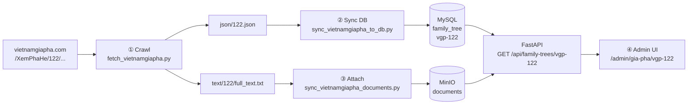
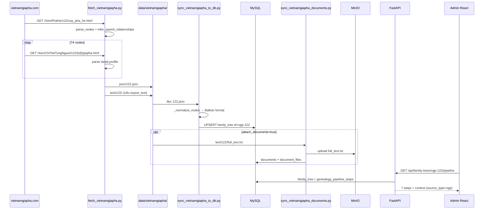

# Quy trình lấy dữ liệu VietnamGiaPha — ví dụ tree 122

> **Nguồn:** [https://vietnamgiapha.com/XemPhaHe/122/cay_pha_he.html](https://vietnamgiapha.com/XemPhaHe/122/cay_pha_he.html)  
> **ID hệ thống:** `vgp-122`  
> **Admin UI:** `http://localhost:5174/admin/gia-pha/vgp-122?tab=pipeline`  
> **Ngày phân tích:** 2026-07-10

Tài liệu này mô tả **toàn bộ luồng** từ trang web VietnamGiaPha (VGP) → file JSON cục bộ → MySQL → (tuỳ chọn) MinIO → giao diện admin, dựa trên code hiện có trong repo.

**Tài liệu liên quan:** [CRAWL_PLAN.md § Phần A](../CRAWL_PLAN.md), [RESEARCH_SOURCES.md §3](../RESEARCH_SOURCES.md), [pipeline_step_detail_task.md](./pipeline_step_detail_task.md)

---

## 1. Tổng quan

Hệ thống **không** đọc trực tiếp URL khi user mở admin. Luồng chuẩn gồm **4 giai đoạn**:

| # | Giai đoạn | Công cụ | Đầu ra |
|---|-----------|---------|--------|
| ① | **Crawl HTML** | `fetch_vietnamgiapha.py` | `json/122.json`, (tuỳ chọn) `text/122/`, `raw_html/` |
| ② | **Sync DB** | `sync_vietnamgiapha_to_db.py` | MySQL `family_tree` id=`vgp-122` |
| ③ | **Attach tài liệu** (tuỳ chọn) | `sync_vietnamgiapha_documents.py` | MinIO `full_text.txt` + bảng `documents` |
| ④ | **Hiển thị admin** | FastAPI + React | `/admin/gia-pha/vgp-122`, tab Pipeline |

Giai đoạn ①②③ có thể chạy **một lần** qua API `POST /api/vietnamgiapha/crawl-sync` (trang `/admin/developer/vietnamgiapha-crawl`).



---

## 2. Mapping URL ↔ ID nội bộ

| Khái niệm | Giá trị (tree 122) |
|-----------|-------------------|
| VGP `tree_id` (số trên URL) | `122` |
| URL cây phả hệ | `https://vietnamgiapha.com/XemPhaHe/122/cay_pha_he.html` |
| URL chi tiết từng người | `https://vietnamgiapha.com/XemChiTietTungNguoi/122/{node_id}/giapha.html` (fallback: `.../chitiet.html`) |
| **Store ID** / `family_tree_id` | **`vgp-122`** (`f"vgp-{tree_id}"`) |
| Tên dòng họ (đã crawl) | `Họ Võ tại Tây Hồ - Diễn Phong - Diễ` |
| Số thành viên | **74 node**, **73** quan hệ `parent_of` suy luận |

---

## 3. Giai đoạn ① — Crawl HTML → JSON

### 3.1. Script

**File:** `nlp_family_extractor/tools/fetch_vietnamgiapha.py`

**URL template:**

```python
BASE_URL_TEMPLATE = "https://vietnamgiapha.com/XemPhaHe/{tree_id}/cay_pha_he.html"
```

### 3.2. Quy trình crawl (một tree)

1. **GET** trang cây phả hệ (`cay_pha_he.html`).
2. **`parse_nodes(html)`** — regex tìm link `javascript:o(tree_id, node_id)` và icon giới tính `treeimg/m.jpg|f.jpg`.
3. **`infer_parent_relationships(nodes)`** — heuristic **generation stack** (`confidence: 0.65`, `rule: generation_stack`): gán cha theo thế hệ xếp chồng.
4. **Với mỗi node** (mặc định bật): **`fetch_detail_profile()`** — GET trang chi tiết, parse bảng profile (`Tên`, `Ngày sinh`, `note`, `parent_text`, `siblings_text`, …).
5. Ghi **`data/vietnamgiapha/json/{tree_id}.json`**.
6. (Tuỳ chọn) Ghi **`raw_html/{tree_id}.html`** nếu `--save-html`.
7. (Mặc định bật) **`export_tree_text_files()`** → thư mục **`text/{tree_id}/`**.
8. Cập nhật **`summary.json`** (thống kê batch).

### 3.3. Skip khi không đổi

Với `--skip-unchanged` (mặc định trên API): so sánh `content_hash` của JSON cũ với dữ liệu mới → bỏ qua HTTP nếu hash trùng; vẫn có thể build `text/` nếu thiếu.

### 3.4. Lệnh CLI (tree 122)

```bash
cd nlp_family_extractor

python -m tools.fetch_vietnamgiapha \
  --start 122 --end 122 \
  --output-dir data/vietnamgiapha \
  --save-html
```

### 3.5. Cấu trúc `json/122.json` (đầu file thực tế)

```json
{
  "tree_id": 122,
  "url": "https://vietnamgiapha.com/XemPhaHe/122/cay_pha_he.html",
  "http_status": 200,
  "lineage_name": "Họ Võ tại Tây Hồ - Diễn Phong - Diễ",
  "node_count": 74,
  "detail_fetched_count": 74,
  "relationship_count": 73,
  "relationships": [
    { "type": "parent_of", "from_id": 1, "to_id": 3, "side": "fid", "confidence": 0.65, "rule": "generation_stack" }
  ],
  "nodes": [
    {
      "tree_id": 122,
      "node_id": 1,
      "label": "1.1 Ông cố Võ Đào + Bà cố Quế Thị Thưởng...",
      "name": "...",
      "generation": 1,
      "gender": "male",
      "detail": { "note": "...", "parent_text": "...", "birth_text": "...", "detail_url": "..." }
    }
  ]
}
```

**Lưu ý:** File `122.json` hiện tại **không có** field `content_hash` (crawl trước khi thêm tính năng hash).

### 3.6. File lưu trữ cục bộ (tree 122)

| Đường dẫn | Trạng thái trong repo |
|-----------|----------------------|
| `data/vietnamgiapha/json/122.json` | ✅ Có (74 node, đủ detail) |
| `data/vietnamgiapha/raw_html/122.html` | ✅ Có |
| `data/vietnamgiapha/text/122/` | ❌ **Chưa có** (chưa export text cho 122) |
| `data/vietnamgiapha/summary.json` | ⚠️ Có thể lệch (batch gần nhất không nhất thiết gồm 122) |

---

## 4. Giai đoạn ①b — Export văn bản quốc ngữ (tuỳ chọn trong crawl)

### 4.1. Script

**File:** `nlp_family_extractor/tools/vietnamgiapha_text_export.py`

Hàm **`build_tree_text()`** ghép:

- `lineage_name` + metadata cây
- Với mỗi node: các field trong `detail` (`note`, `parent_text`, `siblings_text`, năm sinh/mất, an táng, …)

### 4.2. Cấu trúc thư mục `text/122/`

```
data/vietnamgiapha/text/122/
├── full_text.txt       # Văn bản UTF-8 đầy đủ — input cho MinIO & pipeline step ⑤
├── members_index.txt   # Một dòng / thành viên: đời, tên, sinh, mất, ghi chú
└── meta.json           # tree_id, lineage_name, url, content_hash, char_count, exported_at
```

**Ví dụ đã có trong repo:** `text/100/` (tree 100), **chưa có** `text/122/`.

---

## 5. Giai đoạn ② — Sync JSON → MySQL

### 5.1. Script

**File:** `nlp_family_extractor/tools/sync_vietnamgiapha_to_db.py`

### 5.2. Chuẩn hóa node (`_normalize_nodes`)

| Trường crawl | Trường Balkan / DB |
|--------------|-------------------|
| `node_id` | `id` |
| `name` / `detail.display_name` | `name` |
| `label` / `detail.common_name` | `title` |
| `gender` | `gender` (nếu `male`/`female`) |
| Quan hệ generation-stack | `fid` (và hiếm khi `mid`) |
| `detail.note` | `bio` |
| `detail.birth_year` / `death_year` | `birthYear` / `deathYear` |
| `detail` (nguyên khối) | Giữ nested trong `nodes_json` |

**Hạn chế chất lượng:**

- Quan hệ vợ/chồng **không** tách thành `pids` — cặp vợ chồng thường gộp trong `name` (`"Ông X + Bà Y"`).
- Cha/mẹ suy luận bằng heuristic, `confidence: 0.65` — không phải quan hệ chính thức từ VGP.

### 5.3. Ghi MySQL

**Bảng:** `family_tree`

| Cột | Giá trị `vgp-122` |
|-----|-------------------|
| `id` | `vgp-122` |
| `name` | `Họ Võ tại Tây Hồ - Diễn Phong - Diễ` |
| `description` | `Synced from https://vietnamgiapha.com/XemPhaHe/122/cay_pha_he.html \| source=122.json` |
| `nodes_json` | Mảng 74 node (định dạng Balkan) |
| `node_count` | `74` |
| `external_url` | `https://vietnamgiapha.com/XemPhaHe/122/cay_pha_he.html` |
| `has_source_document` | `0` (cho đến khi attach MinIO) |

**Skip sync:** So sánh `compute_nodes_hash(nodes)` với hash node hiện có trong DB → `skipped`, `reason: nodes_unchanged`.

**Quan trọng:** Script sync ghi **trực tiếp MySQL**, **không** qua `family_tree_store`. File mirror JSON `data/family_trees/vgp-122.json` có thể **lệch** (ví dụ `external_url: null` dù DB đã có URL).

### 5.4. Lệnh CLI

```bash
cd nlp_family_extractor

python -m tools.sync_vietnamgiapha_to_db \
  --input-dir data/vietnamgiapha/json \
  --report data/vietnamgiapha/sync-report.json
```

**Báo cáo** (`sync-report.json`):

```json
{
  "store_id": "vgp-122",
  "tree_id": 122,
  "node_count": 74,
  "source": "122.json",
  "mode": "upsert"
}
```

---

## 6. Giai đoạn ③ — Attach `full_text.txt` lên MinIO (tuỳ chọn)

### 6.1. Script

**File:** `nlp_family_extractor/tools/sync_vietnamgiapha_documents.py`

**Marker nhận diện:** `description = "vgp_text_export=1"` (`VGP_TEXT_MARKER`)

### 6.2. Quy trình `attach_vgp_text_document`

1. Đọc `text/{tree_id}/full_text.txt` — nếu thiếu → `reason: missing_full_text`.
2. Tìm hoặc tạo `documents` row: `family_tree_id=vgp-122`, `type=van_ban`.
3. Upload qua `DocumentService.upload_files()`:
   - MinIO key: `family-trees/vgp-122/documents/{document_id}/{uuid}_full_text.txt`
4. Ghi `document_files` (`file_name=full_text.txt`, `text/plain; charset=utf-8`).

### 6.3. Kích hoạt

- **Không có CLI độc lập** — chỉ qua API `crawl-sync` với `attach_documents: true`.
- **Mặc định API/UI:** `attach_documents: false` → bước này **thường bị bỏ qua**.

Sau attach thành công, API gọi `_family_tree_store.update_tree(..., has_source_document=True)`.

### 6.4. Điều kiện MinIO

Cần biến môi trường `MINIO_*` và `MYSQL_*`. Nếu thiếu → API trả `503`.

---

## 7. API điều phối — một request cho cả pipeline

### 7.1. Endpoint

```
POST /api/vietnamgiapha/crawl-sync
```

**Auth:** Admin JWT  
**File:** `nlp_family_extractor/api.py`

### 7.2. Request (mặc định vs tree 122 đầy đủ)

```json
{
  "start_id": 100,
  "end_id": 200,
  "delay_seconds": 0.2,
  "sync_db": true,
  "skip_unchanged": true,
  "export_text": true,
  "attach_documents": false
}
```

**Để kích hoạt đủ pipeline step ⑤ cho tree 122:**

```json
{
  "start_id": 122,
  "end_id": 122,
  "attach_documents": true
}
```

### 7.3. Thứ tự xử lý trong handler

1. `crawl_vietnamgiapha_run(...)` → JSON + text
2. `sync_vietnamgiapha_to_db(...)` → MySQL
3. Nếu `attach_documents`: `attach_documents_batch(...)` → MinIO + `documents`
4. Cập nhật `has_source_document` qua store

### 7.4. API đọc sau sync

| Method | Path | Mục đích |
|--------|------|----------|
| `GET` | `/api/family-trees/vgp-122` | Cây đầy đủ (`nodes`, metadata) |
| `GET` | `/api/family-trees/vgp-122/pipeline` | 7 bước pipeline + `context` nguồn |
| `GET` | `/api/family-trees/vgp-122/pipeline/{step_id}` | Chi tiết step + preview artifact |
| `GET` | `/api/family-trees/vgp-122/documents` | Danh sách tài liệu (admin) |

### 7.5. UI crawl

**Trang:** `/admin/developer/vietnamgiapha-crawl`  
**File:** `family-saga-io/src/pages/developer/VietnamGiaPhaCrawlPage.tsx`  
**Client:** `crawlAndSyncVietnamGiaPha()` trong `familyTreeApi.ts`

Form map 1:1 với request API; hiển thị thống kê crawl / sync / attach.

---

## 8. Giai đoạn ④ — Admin xem cây & Pipeline

### 8.1. Đường dẫn UI

| Màn hình | URL |
|----------|-----|
| Danh sách gia phả | `/admin/gia-pha` |
| Chi tiết cây | `/admin/gia-pha/vgp-122` |
| Tab Pipeline | `/admin/gia-pha/vgp-122?tab=pipeline` |
| Sơ đồ Visual | `/admin/gia-pha/vgp-122?tab=visual` |
| Kho tư liệu | `/admin/gia-pha/vgp-122?tab=documents` |

### 8.2. `family_tree_store` khi đọc

**File:** `nlp_family_extractor/app/family_tree_store.py`

- Có `MYSQL_*` → `MirroredFamilyTreeStore` (primary: MySQL, mirror: `data/family_trees/*.json`).
- API `GET /api/family-trees/vgp-122` đọc từ **MySQL**.
- Fallback URL: `_default_external_url()` kiểm tra prefix **`vpg-`** (typo) — ID thực tế là **`vgp-`**, nên mirror JSON có thể không tự sinh URL.

### 8.3. Pipeline tự động cho nguồn VGP

**File:** `nlp_family_extractor/app/pipeline/service.py` — `sync_from_tree_state()`

Nhận diện VGP khi: `family_tree_id.startswith("vgp-")` **hoặc** `external_url` chứa `vietnamgiapha.com`.

| Step | ID | Hành vi VGP |
|------|-----|-------------|
| ① | `name` | `done` nếu cây có tên |
| ② | `hannom_image` | **`skipped`** — `vgp_entry` |
| ③ | `ocr` | **`skipped`** — `vgp_entry` |
| ④ | `han_chars` | **`skipped`** — `vgp_entry` |
| ⑤ | `quoc_ngu` | `done` nếu có document `van_ban` + `description=vgp_text_export=1`; ngược lại **`pending`** |
| ⑥ | `distilled` | **`skipped`** — `vgp_entry` |
| ⑦ | `output` | `done` nếu có nodes → `output_ref: nodes:74` |

**UI:** `GenealogyPipelineSteps.tsx` — VGP được phép chạy step ⑦ mà không cần step ⑥.

---

## 9. Trạng thái hiện tại `vgp-122` (theo dữ liệu repo)

| Thành phần | Trạng thái |
|------------|------------|
| `json/122.json` | ✅ 74 node, đủ detail |
| `text/122/full_text.txt` | ❌ Chưa export |
| MySQL `family_tree` | ✅ Đã sync (`sync-report.json`) |
| MinIO document | ❌ Chưa attach (`attach_documents` mặc định false) |
| Mirror `family_trees/vgp-122.json` | ✅ 74 node; `external_url: null` |
| Pipeline ① name | ✅ `done` |
| Pipeline ②③④⑥ | ✅ `skipped` (`vgp_entry`) |
| Pipeline ⑤ quoc_ngu | ⚠️ **`pending`** (thiếu text/doc) |
| Pipeline ⑦ output | ✅ `done` (`nodes:74`) |

---

## 10. Sơ đồ chi tiết trang VGP → node DB



---

## 11. Hạn chế & gap đã biết

### 11.1. Vận hành / đồng bộ

| # | Vấn đề | Ảnh hưởng |
|---|--------|-----------|
| 1 | `sync_vietnamgiapha_to_db` bypass `family_tree_store` | Mirror JSON có thể stale (`external_url: null`) |
| 2 | `attach_documents` mặc định `false` | Step ⑤ `pending` dù đã có cây |
| 3 | Không CLI riêng cho attach documents | Phải dùng API hoặc bật flag crawl-sync |
| 4 | `text/122/` chưa tồn tại | Không attach được cho 122 cho đến khi re-crawl/export |
| 5 | `122.json` thiếu `content_hash` | `--skip-unchanged` kém hiệu quả cho 122 |

### 11.2. ID / URL

| # | Vấn đề |
|---|--------|
| 6 | Typo `vpg-` vs `vgp-` trong `_default_external_url()` — fallback URL sai prefix |
| 7 | Mirror JSON không đồng bộ `external_url` từ DB |

### 11.3. Chất lượng dữ liệu

| # | Vấn đề |
|---|--------|
| 8 | Quan hệ cha chỉ heuristic; không có `pids` (vợ/chồng) chuẩn |
| 9 | VGP không có ảnh Hán-Nôm → skip đúng step ②③④ |
| 10 | Step ⑥ distilled chưa triển khai NLP |
| 11 | Object `detail` nhúng trong `nodes_json` — phình DB, không chuẩn Balkan thuần |
| 12 | Crawl detail chậm: 74 request × `detail_delay_seconds` |

---

## 12. Kích hoạt đủ pipeline cho `vgp-122`

### Cách 1 — API (khuyến nghị)

```bash
curl -X POST http://localhost:8000/api/vietnamgiapha/crawl-sync \
  -H "Authorization: Bearer <ADMIN_JWT>" \
  -H "Content-Type: application/json" \
  -d '{
    "start_id": 122,
    "end_id": 122,
    "export_text": true,
    "attach_documents": true
  }'
```

### Cách 2 — CLI từng bước

```bash
cd nlp_family_extractor

# Crawl + export text
python -m tools.fetch_vietnamgiapha --start 122 --end 122

# Sync DB
python -m tools.sync_vietnamgiapha_to_db \
  --input-dir data/vietnamgiapha/json

# Attach: chỉ qua API (hoặc gọi attach_documents_batch trong shell/Python)
```

### Sau khi attach

1. Mở `/admin/gia-pha/vgp-122?tab=pipeline`
2. Bấm **Đồng bộ lại từ cây** (nút resync) — step ⑤ → `done`, `output_ref: documents:{id}`
3. Bấm **Chi tiết** step ⑤ → preview `full_text.txt`, link tài liệu

---

## 13. Chỉ mục file quan trọng

| Vai trò | Đường dẫn |
|---------|-----------|
| Crawler | `nlp_family_extractor/tools/fetch_vietnamgiapha.py` |
| Export text | `nlp_family_extractor/tools/vietnamgiapha_text_export.py` |
| Sync MySQL | `nlp_family_extractor/tools/sync_vietnamgiapha_to_db.py` |
| Attach MinIO | `nlp_family_extractor/tools/sync_vietnamgiapha_documents.py` |
| API crawl-sync | `nlp_family_extractor/api.py` (khoảng dòng 902+) |
| Tree store | `nlp_family_extractor/app/family_tree_store.py` |
| Pipeline logic | `nlp_family_extractor/app/pipeline/service.py` |
| UI crawl | `family-saga-io/src/pages/developer/VietnamGiaPhaCrawlPage.tsx` |
| UI pipeline | `family-saga-io/src/components/pipeline/GenealogyPipelineSteps.tsx` |
| Dữ liệu crawl 122 | `nlp_family_extractor/data/vietnamgiapha/json/122.json` |
| Mirror JSON | `nlp_family_extractor/data/family_trees/vgp-122.json` |
| Báo cáo sync | `nlp_family_extractor/data/vietnamgiapha/sync-report.json` |

---

## 14. Tóm tắt một dòng

**VGP tree 122** được crawl từ `cay_pha_he.html` + 74 trang chi tiết → lưu `json/122.json` → chuẩn hóa thành **`vgp-122`** trong MySQL (74 node) → (tuỳ chọn) đẩy `full_text.txt` lên MinIO làm tài liệu `van_ban` → admin xem cây và pipeline tại `/admin/gia-pha/vgp-122`; hiện tại **step ⑤ còn pending** vì chưa export/attach text cho tree 122.
