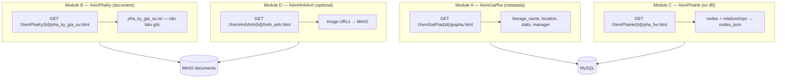
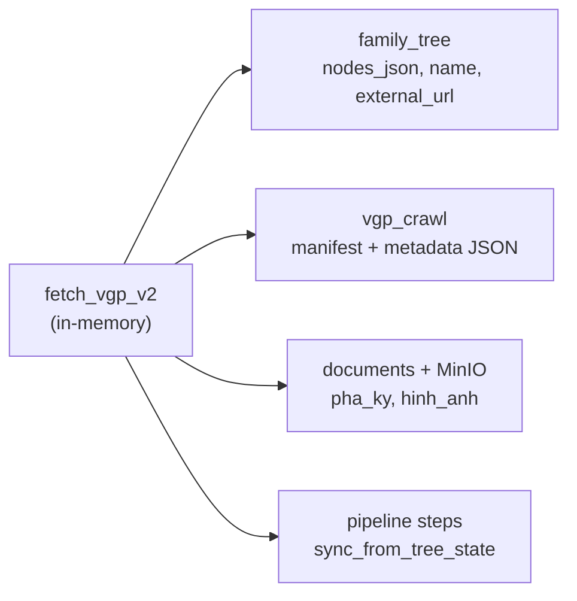
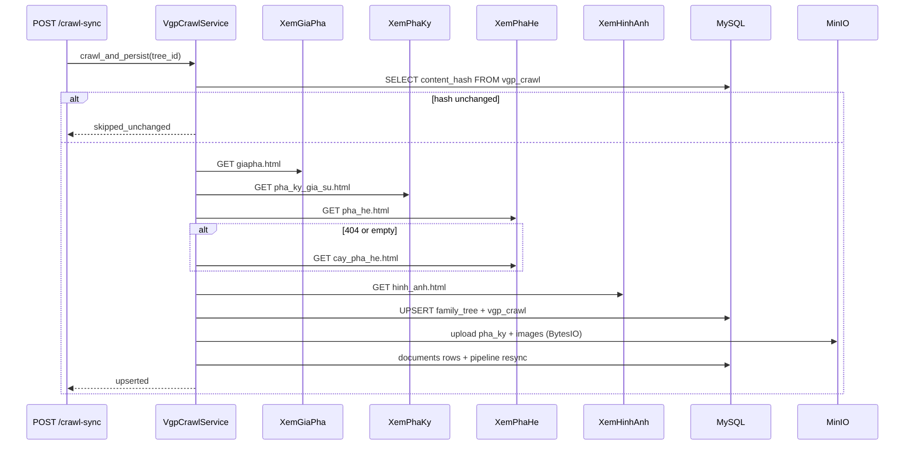

# Plan crawl VietnamGiaPha V2 — 3 module URL

> **Ngày:** 2026-07-11  
> **Ví dụ phân tích:** tree **11108** — [Phả ký](https://vietnamgiapha.com/XemPhaKy/11108/pha_ky_gia_su.html)  
> **So sánh:** tree **122** (tool cũ `fetch_vietnamgiapha.py`)  
> **Thay thế:** `fetch_vietnamgiapha.py` + `sync_vietnamgiapha_to_db.py` (local `json/` → sync file)  
> **Lưu trữ V2:** MySQL + MinIO trực tiếp — **không** ghi local

---

## 1. Vì sao tool cũ lỗi thời

### 1.1. Tool hiện tại làm gì

**File:** `nlp_family_extractor/tools/fetch_vietnamgiapha.py`

```python
BASE_URL_TEMPLATE = "https://vietnamgiapha.com/XemPhaHe/{tree_id}/cay_pha_he.html"
```

Luồng cũ:

1. GET **một URL** `cay_pha_he.html`
2. Parse `javascript:o(tree_id, node_id)` + icon `treeimg/m.jpg|f.jpg`
3. Suy luận quan hệ cha-con bằng **generation stack** (`confidence: 0.65`)
4. GET **từng** `/XemChiTietTungNguoi/{tree_id}/{node_id}/giapha.html` (N request)
5. Export `full_text.txt` từ **tổng hợp node detail** → sync file local → DB (luồng 2 bước, lỗi thời)

### 1.2. Gap so với site VGP hiện tại

| Vấn đề | Hậu quả |
|--------|---------|
| Chỉ crawl `cay_pha_he.html` | Bỏ qua URL chuẩn `pha_he.html`; site có thể cập nhật số liệu mới trên `giapha.html` mà JSON cũ không biết |
| Không crawl **XemGiaPha** | Mất metadata: quê quán, số đời, số người, người quản lý |
| Không crawl **XemPhaKy** | Mất **tài liệu gốc** dài (phả ký gia sử) — nguồn tốt nhất cho pipeline step ⑤ |
| Không crawl **XemHinhAnh** | Mất ảnh scan / tư liệu (nếu có) |
| Parser cứng `javascript:o()` | Tree mới (11108) render **danh sách phẳng** trên `pha_he.html`, không có link JS |
| N detail request / node | Chậm (11108 × ~195 node); Phả ký 11108 đã chứa narrative đủ dùng |
| `full_text` = ghép detail | Khác nội dung **Phả ký** thật trên web |

### 1.3. Bằng chứng tree 122 (site vs crawl cũ)

| Nguồn | Số người | Ghi chú |
|-------|----------|---------|
| `json/122.json` (crawl cũ) | **74** node | `cay_pha_he.html` |
| [XemGiaPha/122/giapha.html](https://vietnamgiapha.com/XemGiaPha/122/giapha.html) (live) | **114** người, 75 gia đình, 5 đời | Site đã cập nhật |
| [XemPhaKy/122/pha_ky_gia_su.html](https://vietnamgiapha.com/XemPhaKy/122/pha_ky_gia_su.html) | Có narrative đầy đủ | Tool cũ **không lấy** |

Nav bar trong `raw_html/122.html` (đã có sẵn trên site, tool cũ bỏ qua):

```
/XemGiaPha/{id}/giapha.html          → Gia phả
/XemPhaKy/{id}/pha_ky_gia_su.html    → Phả ký
/XemThuyTo/{id}/thuy_to.html         → Thủy tổ
/XemPhaHe/{id}/pha_he.html           → Phả hệ phả đồ
/XemTocUoc/{id}/toc_uoc.html         → Tộc ước
/XemGhiChu/{id}/ghi_ghu.html         → Hương hỏa
/XemHinhAnh/{id}/hinh_anh.html       → Hình ảnh
```

---

## 2. Mô hình 3 module (rule crawl mới)

Theo yêu cầu, **3 URL bắt buộc** + ảnh tuỳ chọn:



### 2.1. URL template (V2)

| Module | URL | Vai trò trong hệ thống |
|--------|-----|------------------------|
| **A — Gia phả** | `https://vietnamgiapha.com/XemGiaPha/{tree_id}/giapha.html` | Metadata cây: tên, quê, thống kê, người quản lý |
| **B — Phả ký** | `https://vietnamgiapha.com/XemPhaKy/{tree_id}/pha_ky_gia_su.html` | **Document** gia phả (văn bản dài) → pipeline ⑤ |
| **C — Phả hệ** | `https://vietnamgiapha.com/XemPhaHe/{tree_id}/pha_he.html` | **Sơ đồ** → nodes + quan hệ → pipeline ⑦ |
| **D — Hình ảnh** | `https://vietnamgiapha.com/XemHinhAnh/{tree_id}/hinh_anh.html` | Ảnh tư liệu (nếu có) → pipeline ② |

**Fallback phả hệ (legacy):** `XemPhaHe/{id}/cay_pha_he.html` — cùng parser `javascript:o()` nếu `pha_he.html` 404 hoặc empty.

### 2.2. Mapping pipeline 7 bước

| Step | Nguồn V2 | Artifact |
|------|----------|----------|
| ① `name` | Module A `lineage_name` | string |
| ② `hannom_image` | Module D (nếu có ảnh) | `documents` type `hinh_anh` |
| ③④ OCR/Hán | Skip VGP (quốc ngữ) hoặc OCR ảnh Module D | — |
| ⑤ `quoc_ngu` | **Module B phả ký** (ưu tiên) | `documents` + MinIO, marker `vgp_pha_ky=1` |
| ⑥ `distilled` | NLP từ Phả ký (tương lai) | — |
| ⑦ `output` | **Module C `nodes_json`** | Balkan nodes |

---

## 3. Phân tích thử — tree 11108

### 3.1. Module A — XemGiaPha

**URL:** https://vietnamgiapha.com/XemGiaPha/11108/giapha.html

| Field | Giá trị (live fetch) |
|-------|----------------------|
| Tên | HUỲNH Ở Tiên Phước - Có Đường Hiệu - Quận Hiệu là: GIANG - Quảng Nam |
| Ở tại | Thạnh Yên thôn 3 Tiên Lộc - Bình Yên thôn 3 Tiên Cảnh - Trung Yên thôn 7 Tiên Cảnh - Lộc Yên thôn 4; Tiên Cảnh; huyện Tiên Phước |
| Số đời | **9** |
| Gia đình | **136** |
| Số người | **195** |
| Người quản lý | Huỳnh Ngọc Trình |

**Parser đề xuất:** HTML hoặc markdown section `## Ở tại`, `## Tổng quan gia phả`, regex số `\d+ Số đời`, `\d+ Số người`.

### 3.2. Module B — XemPhaKy (document)

**URL:** https://vietnamgiapha.com/XemPhaKy/11108/pha_ky_gia_su.html

Đặc điểm (từ file upload `pha_ky_gia_su-0.html`):

- Tiêu đề: **Phả ký gia sử**
- Nội dung: **~200+ đoạn** narrative tiếng Việt — lịch sử dòng họ, từng nhánh, tiểu sử (Huỳnh Tấu, Huỳnh Ngọc Trình, …)
- Có metadata cuối: biên soạn, đời thứ 7, email, SĐT (2018)
- Kết thúc: link **「Xem phả đồ tương tác」**

**Độ dài ước tính:** > 50.000 ký tự — **nguồn chính** cho `van_ban`, thay `full_text.txt` ghép từ node detail.

**Lưu ý:** Nội dung mang tính **prose**, không phải bảng node — phù hợp step ⑤, cần step ⑥/⑦ riêng từ Module C.

### 3.3. Module C — XemPhaHe (sơ đồ)

**URL:** https://vietnamgiapha.com/XemPhaHe/11108/pha_he.html

Live fetch cho thấy **danh sách phẳng** (không `javascript:o`):

```
1.1 Huỳnh Kim Quy + Vợ Chưa sưu tầm được
2.2 Huỳnh Kim Quyền + Vợ: Chưa Sưu Tầm Được
3.3 Huỳnh Ngọc + Vợ Phạm Thị Thuyết
...
7.153 Huỳnh Ngọc Trình + vợ: Lê Thị Danh
8.154 Huỳnh Lê Cửu Trung + vợ: Đào Thị Diệu Anh
```

**Parser V2 cần 2 mode:**

| Mode | Pattern | Tree ví dụ |
|------|---------|------------|
| **Legacy JS** | `javascript:o(fid,id)` + `treeimg/m.jpg` | 122, 136 (raw_html) |
| **Flat list** | `(\d+)\.(\d+)\s+(.+?)(?:\s+\+\s+(.+))?` | **11108** |

Quan hệ:

- Đời = số trước dấu chấm (`generation.order` → `1.1` = đời 1, thứ tự 1)
- `+ Vợ` / `+ Chồng` / `+ vợ` → gợi ý spouse trong label (vẫn cần normalize `pids` sau)
- Indent / thứ tự list → stack cha-con (thay generation_stack heuristic cũ)

**So sánh 11108 vs crawl cũ cho 122:** Site báo 195 người; crawl cũ 122 chỉ 74 node — cho thấy **bắt buộc** sync từ `pha_he` + metadata `giapha`.

### 3.4. Module D — Hình ảnh

**URL pattern:** `XemHinhAnh/{id}/hinh_anh.html`

| Tree | Kết quả thử |
|------|-------------|
| 122 | Trang SPA rỗng — 「Chưa có gia phả để hiển thị」 (có thể cần cookie/login hoặc thật sự không có ảnh) |
| 11108 | Chưa thử — cần spike |

**Rule:** GET → nếu có `` (loại trừ icon/logo) → download; nếu empty → skip step ②, không fail crawl.

---

## 4. Lưu trữ V2 — database-first (không local)

**Nguyên tắc:** Crawl → parse trong memory → **ghi thẳng MySQL + MinIO**. Không còn luồng `json/` → `sync_vietnamgiapha_to_db.py` đọc file.



### 4.1. Bảng `family_tree` (đã có — mở rộng nhẹ)

| Cột | Nguồn module | Ghi chú |
|-----|--------------|---------|
| `id` | — | `vgp-{tree_id}` |
| `name` | A `lineage_name` | Step ① |
| `description` | A `location` + stats tóm tắt | Tuỳ chọn |
| `nodes_json` | C phả hệ | Step ⑦ — **JSON chính cho sơ đồ** |
| `node_count` | C | |
| `external_url` | A | `https://vietnamgiapha.com/XemGiaPha/{id}/giapha.html` |
| `has_source_document` | B/D | `1` khi đã attach phả ký hoặc ảnh |

**Bỏ phụ thuộc:** `data/vietnamgiapha/json/{id}.json` — V2 không ghi file này trong luồng chính.

### 4.2. Bảng mới `vgp_crawl` (1:1 với `family_tree`)

Lưu **metadata crawl + manifest** — không cần file local.

```sql
CREATE TABLE vgp_crawl (
    family_tree_id   VARCHAR(64)  NOT NULL PRIMARY KEY,
    vgp_tree_id      INT          NOT NULL,
    crawl_version    VARCHAR(8)   NOT NULL DEFAULT 'v2',
    manifest_json    JSON         NOT NULL,   -- URLs, parser_modes, stats, fetched_at
    metadata_json    JSON         NOT NULL,   -- Module A structured
    content_hash     VARCHAR(64)  NOT NULL,   -- skip-unchanged toàn bundle
    nodes_hash       VARCHAR(64)  NOT NULL,   -- hash nodes_json (giữ logic V1)
    pha_ky_hash      VARCHAR(64)  NULL,       -- hash văn bản phả ký
    fetched_at       VARCHAR(64)  NOT NULL,
    updated_at       VARCHAR(64)  NOT NULL,
    CONSTRAINT fk_vgp_crawl_tree
        FOREIGN KEY (family_tree_id) REFERENCES family_tree(id) ON DELETE CASCADE
) ENGINE=InnoDB DEFAULT CHARSET=utf8mb4;
```

**`manifest_json` (draft):**

```json
{
  "crawl_version": "v2",
  "urls": {
    "giapha": "https://vietnamgiapha.com/XemGiaPha/11108/giapha.html",
    "pha_ky": "https://vietnamgiapha.com/XemPhaKy/11108/pha_ky_gia_su.html",
    "pha_he": "https://vietnamgiapha.com/XemPhaHe/11108/pha_he.html",
    "hinh_anh": "https://vietnamgiapha.com/XemHinhAnh/11108/hinh_anh.html"
  },
  "parser_modes": {
    "pha_he": "flat_list",
    "pha_ky": "html_prose",
    "images": "none"
  },
  "stats": {
    "generations": 9,
    "families": 136,
    "people": 195,
    "node_count": 195,
    "image_count": 0
  }
}
```

**`metadata_json` (Module A):**

```json
{
  "lineage_name": "HUỲNH Ở Tiên Phước ...",
  "location": "Thạnh Yên thôn 3 ...",
  "generation_count": 9,
  "family_count": 136,
  "people_count": 195,
  "manager_name": "Huỳnh Ngọc Trình",
  "manager_contact": null
}
```

### 4.3. Văn bản & ảnh — MinIO (không file local)

| Loại | Lưu ở đâu | Marker | Pipeline |
|------|-----------|--------|----------|
| Phả ký (Module B) | `documents` + MinIO `pha_ky_gia_su.txt` | `vgp_pha_ky=1` | ⑤ quoc_ngu |
| Ảnh (Module D) | `documents` + MinIO | `vgp_hinh_anh=1` | ② hannom_image |
| Legacy full_text | Chỉ V1; V2 **không tạo** | `vgp_text_export=1` | — |

Upload **stream từ memory** (`BytesIO`) sau parse — không qua `text/{id}/full_text.txt`.

### 4.4. Skip / hash (DB-level)

| Hash | Input | So sánh với |
|------|-------|-------------|
| `nodes_hash` | `nodes_json` normalized | `vgp_crawl.nodes_hash` hoặc hash cũ trong `family_tree` |
| `pha_ky_hash` | plain text phả ký | `vgp_crawl.pha_ky_hash` |
| `content_hash` | metadata + nodes + pha_ky | `vgp_crawl.content_hash` — `--skip-unchanged` |

Nếu `content_hash` trùng → **skip toàn bộ** (không HTTP, không UPDATE).

### 4.5. Debug only (tuỳ chọn)

`--dump-local /tmp/vgp-debug/{id}/` — chỉ dev/test, **không** dùng trong API production hay batch crawl.

---

## 5. Luồng crawl V2 (algorithm)



### 5.1. Skip / hash

Xem mục **4.4** — hash lưu trong `vgp_crawl`, không đọc file local.

### 5.2. Detail pages — optional (Phase 2)

Chỉ GET `/XemChiTietTungNguoi/{id}/{node_id}/giapha.html` khi:

- Node thiếu `gender`
- Cần bổ sung `birth_year`, `note` cho member detail
- **Không** bắt buộc cho mọi node nếu đã có Phả ký + pha_he

---

## 6. Thay đổi backend — crawl + persist một bước

### 6.1. Service mới (thay 2 script rời)

**Đề xuất:** `app/vgp/crawl_service.py` — gom logic crawl + DB + MinIO.

**Deprecate luồng file:**
- `fetch_vietnamgiapha.py` → `write json/` (V1, giữ tạm)
- `sync_vietnamgiapha_to_db.py` → đọc `json/` (V1, giữ tạm)
- V2 **không** gọi hai bước trên

CLI dev (persist DB trực tiếp):

```bash
python -m app.vgp.crawl_cli \
  --tree-id 11108 \
  --modules giapha,pha_ky,pha_he,images \
  --skip-unchanged
```

### 6.2. API `POST /api/vietnamgiapha/crawl-sync`

Một request = crawl + persist (không `output_dir`):

```json
{
  "start_id": 11108,
  "end_id": 11108,
  "crawl_version": "v2",
  "modules": ["giapha", "pha_ky", "pha_he", "images"],
  "skip_unchanged": true,
  "sync_pipeline": true
}
```

Response bổ sung: `upserted`, `skipped_unchanged`, `documents_attached` — **không** trả `output` path local.

### 6.3. Documents attach (in-memory)

Refactor `sync_vietnamgiapha_documents.py`:

- `attach_vgp_pha_ky_document(text: str, ...)` — nhận **string/bytes**, không `Path`
- `attach_vgp_images(files: List[Tuple[name, bytes, mime]], ...)`
- Marker `vgp_pha_ky=1` ưu tiên legacy `vgp_text_export=1`

### 6.4. Pipeline `sync_from_tree_state`

- Step ①: `family_tree.name` hoặc `vgp_crawl.metadata_json.lineage_name`
- Step ⑤ `done`: document `vgp_pha_ky=1` hoặc legacy `vgp_text_export=1`
- Step ⑦ `done`: `family_tree.nodes_json` non-empty
- Admin preview step ⑤: đọc MinIO qua API documents (đã có)

### 6.5. Migration V1 → V2

Batch one-time (tuỳ chọn): import `data/vietnamgiapha/json/*.json` vào `vgp_crawl` + `family_tree` rồi **ngừng** dùng thư mục local cho crawl mới.

---

## 7. Kế hoạch triển khai

| Phase | Việc | Effort | Output |
|-------|------|--------|--------|
| **V2.0** | Spike parser 11108 + schema `vgp_crawl` | 1 ngày | Migration DDL |
| **V2.1** | `VgpCrawlService` — crawl 3 module → UPSERT DB | 2 ngày | `vgp-11108` in MySQL |
| **V2.2** | Parser dual-mode pha_he + tests fixture HTML | 1.5 ngày | Unit tests |
| **V2.3** | MinIO attach pha_ky + images (in-memory) | 1 ngày | documents rows |
| **V2.4** | API crawl-sync V2 + pipeline resync | 1 ngày | End-to-end |
| **V2.5** | Admin UI: crawl V2, preview từ DB/MinIO | 0.5 ngày | Crawl page |
| **V2.6** | Re-crawl batch 100–200, so sánh node count | 1 ngày | Report |

**Tổng:** ~8 ngày.

---

## 8. Acceptance criteria (tree 11108)

- [ ] GET 3 URL bắt buộc thành công (200, UTF-8)
- [ ] `vgp_crawl.metadata_json`: `people_count: 195`, `generation_count: 9`
- [ ] Document `vgp_pha_ky=1` trên MinIO ≥ 10.000 ký tự, chứa 「TỘC HUỲNH TIÊN PHƯỚC」
- [ ] `family_tree.nodes_json`: ~195 node, có `generation` + `order`
- [ ] **Không** tạo file dưới `data/vietnamgiapha/` (trừ `--dump-local` debug)
- [ ] Pipeline ①⑤⑦ `done` sau crawl-sync
- [ ] Tree 122 re-crawl V2: node count ≥ 74 (khớp hoặc vượt site giapha 114)

---

## 9. Rủi ro & mitigations

| Rủi ro | Mitigation |
|--------|------------|
| Hai template HTML (oldbook vs SPA mới) | Detect template; 2 parser; unit test per fixture |
| `pha_he` flat không có `node_id` | Sinh synthetic id từ `(generation, order)` hoặc hash label |
| Phả ký quá dài (> MinIO limit) | Chunk không cần; file txt thường < 1MB |
| Hình ảnh cần login | Skip module D; log `images: auth_required` |
| Couple trong label (`A + B`) | Phase 2: NLP / regex tách spouse; giữ nguyên label V1 |
| Rate limit VGP | `delay_seconds`, retry 429, User-Agent cố định |

---

## 10. So sánh nhanh V1 vs V2

| | V1 (hiện tại) | V2 (plan) |
|---|--------------|-----------|
| Entry URL | `cay_pha_he.html` only | `giapha` + `pha_ky` + `pha_he` |
| Document | Ghép node detail | **Phả ký gốc** → MinIO |
| Metadata | Suy từ HTML cây | **`vgp_crawl.metadata_json`** |
| Parser pha_he | Chỉ `javascript:o` | JS + **flat list** |
| HTTP requests | 1 + N nodes | **3–4** (+ optional detail) |
| Ảnh | Không | **XemHinhAnh** → MinIO |
| **Lưu trữ** | **Local `json/` + sync file** | **MySQL + MinIO trực tiếp** |
| Tree 11108 | ❌ Không hỗ trợ | ✅ Target |
| Tree 122 updated | 74 nodes (stale) | ~114 theo giapha live |

---

## 11. Liên kết

| Tài liệu | Path |
|----------|------|
| Luồng V1 tree 122 | [vietnamgiapha_122_data_flow.md](./vietnamgiapha_122_data_flow.md) |
| CRAWL_PLAN Phần A | [CRAWL_PLAN.md](../CRAWL_PLAN.md) |
| Tool cũ | `nlp_family_extractor/tools/fetch_vietnamgiapha.py` |
| Sample Phả ký 11108 | User upload `pha_ky_gia_su-0.html` |
| Nav HTML mẫu | `nlp_family_extractor/data/vietnamgiapha/raw_html/122.html` |

---

## 12. Bước tiếp theo đề xuất

1. **DDL** bảng `vgp_crawl` + bootstrap migration.
2. **Spike** `VgpCrawlService.crawl_one(11108)` — persist DB, `--dry-run` chỉ in stats không ghi.
3. Refactor `attach_vgp_pha_ky_document` nhận bytes in-memory.
4. Cập nhật `POST /api/vietnamgiapha/crawl-sync` dùng V2 mặc định, bỏ `output_dir`.
