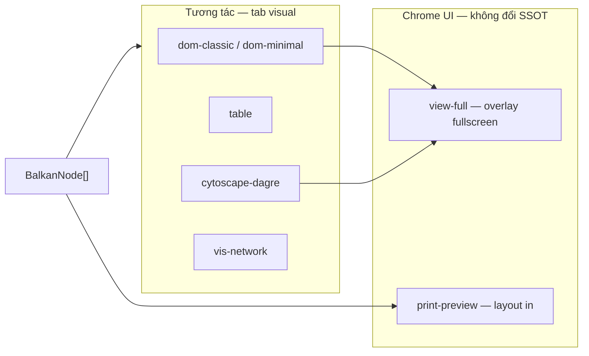
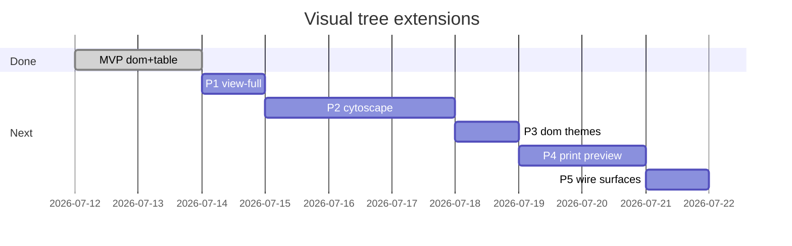

# Task — Thử nhiều kiểu sơ đồ (free-only, đơn giản)

> **URL mẫu:** `http://localhost:5174/admin/gia-pha/vgp-122?tab=visual`  
> **Ngày:** 2026-07-12 (cập nhật: view-full, style/lib khác, print)  
> **Ràng buộc:** Chỉ renderer **miễn phí / tự code** — **không** Balkan, không license.

---

## Mục lục

1. [Trả lời nhanh](#1-trả-lời-nhanh)
2. [Catalog renderer](#2-catalog-renderer)
3. [View-full](#3-view-full)
4. [Style & thư viện render khác](#4-style--thư-viện-render-khác)
5. [Print-preview & Print PDF](#5-print-preview--print-pdf)
6. [Luồng dữ liệu](#6-luồng-dữ-liệu)
7. [UI toolbar](#7-ui-toolbar)
8. [Lộ trình triển khai](#8-lộ-trình-triển-khai)
9. [Acceptance criteria](#9-acceptance-criteria)
10. [File liên quan](#10-file-liên-quan)

---

## 1. Trả lời nhanh

**Có — chọn kiểu sơ đồ từ dropdown, cùng `nodes_json` (SSOT), chỉ đổi cách vẽ.**

| Bạn chọn | Thấy gì |
|----------|---------|
| Cây thẻ | Thẻ từng người, nối theo đời (DOM) |
| Bảng | Danh sách sort/filter |
| Graph | Zoom/pan — Cytoscape hoặc vis-network |
| Xem toàn màn | Canvas full viewport / modal rộng |
| In ấn | Layout A4, xem trước, Print → PDF |

**SSOT** = `BalkanNode[]` trong DB — **không** là lựa chọn dropdown. Tên schema cũ, không cần thư viện Balkan Graph.

**Balkan Graph** = renderer trial/license → **không** đưa vào catalog.

---

## 2. Catalog renderer

### 2.1. Đã có (MVP ✅)

| `rendererId` | Nhãn UI | Component | License | Status |
|--------------|---------|-----------|---------|--------|
| `dom-classic` | Cây thẻ | `FamilyTreeDomView` | Free | ✅ admin |
| `table` | Bảng thành viên | `FamilyTreeMembersTable` | MIT | ✅ admin |

**Mặc định:** `dom-classic` · **Lưu:** `localStorage` `ft.visual.v1`

### 2.2. Mở rộng — phase tiếp theo

| `rendererId` | Nhãn UI | Component / lib | License | Phase |
|--------------|---------|-----------------|---------|-------|
| `view-full` | Xem toàn màn | `FamilyTreeFullScreenView` | Free | **P1** |
| `cytoscape-dagre` | Graph Cytoscape | `FamilyTreeCytoscapeView` + `cytoscape` + `dagre` | MIT | **P2** |
| `vis-network` | Graph vis | `FamilyTreeVisView` + `vis-network` | Apache-2.0 | **P2** (alt) |
| `dom-minimal` | Cây thẻ tối giản | `FamilyTreeDomView` + `themeId: minimal` | Free | **P3** |
| `print-preview` | Xem trước in | `FamilyTreePrintPreview` | Free | **P4** |

### 2.3. Không có trong catalog

| Id | Lý do |
|----|-------|
| `balkan-hugo`, `balkan-ana` | Trial / license trả phí |
| Balkan export PNG/PDF | Server bên thứ ba |

### 2.4. Phân loại catalog



- **Renderer** (`rendererId`) = cách vẽ chính trong panel.
- **view-full** = chế độ hiển thị *trên* renderer đang chọn (DOM/graph), không thay dữ liệu.
- **print-preview** = renderer riêng — layout tối ưu `@media print`.

---

## 3. View-full

### 3.1. Mục tiêu

Xem sơ đồ **phóng to toàn màn hình** — bỏ sidebar, tab chrome; tiện cây lớn / trình chiếu.

### 3.2. UX đề xuất

```
Tab visual (bình thường)
  [ Kiểu sơ đồ ▼ ]  [ ⛶ Xem toàn màn ]  [ 🖨 In ]
        ↓ click「Xem toàn màn」
┌──────────────────────────────────────────────┐
│ ✕ Thoát          Cây thẻ · 74 thành viên      │
├──────────────────────────────────────────────┤
│                                              │
│     [ renderer hiện tại — full viewport ]     │
│     scroll ngang / zoom nếu graph             │
│                                              │
└──────────────────────────────────────────────┘
```

### 3.3. Kỹ thuật (free)

| Cách | Mô tả | Ưu tiên |
|------|-------|---------|
| **Ant Design `Modal` fullscreen** | `width="100vw"`, `styles.body` full height | ✅ P1 |
| Browser Fullscreen API | `element.requestFullscreen()` | optional |
| Route riêng `/gia-pha/:id/full` | Share link | P5 backlog |

**Component:** `FamilyTreeFullScreenView.tsx`

```typescript
type Props = {
  open: boolean;
  onClose: () => void;
  rendererId: RendererId;
  nodes: BalkanNode[];
  members: FamilyMember[];
};
// Re-use FamilyTreeDomView / Cytoscape bên trong — không duplicate layout logic
```

### 3.4. Hỗ trợ theo renderer

| Renderer trong full | Hành vi |
|---------------------|---------|
| `dom-classic`, `dom-minimal` | `overflow-x-auto`, padding rộng |
| `cytoscape-dagre`, `vis-network` | fit graph + zoom |
| `table` | Table full width, sticky header |
| `print-preview` | Không cần full — đã là layout in |

---

## 4. Style & thư viện render khác

### 4.1. Hai lớp: renderer vs theme

| Lớp | Field | Ví dụ | Đổi gì |
|-----|-------|-------|--------|
| **Renderer** | `rendererId` | `dom-classic`, `cytoscape-dagre` | Component / thư viện |
| **Theme** | `themeId` | `default`, `minimal`, `print-a4` | CSS class, không fork component |

```typescript
export type FamilyTreeVisualSettings = {
  rendererId: RendererId;
  themeId?: "default" | "minimal" | "print-a4";
};
```

### 4.2. DOM — nhiều style (cùng component)

| `themeId` | Mô tả | File |
|-----------|-------|------|
| `default` | Vàng/đỏ, card cổ điển | `index.css` `.tree-node-card` |
| `minimal` | Viền mỏng, nền trắng, ít màu | `family-tree-themes.css` |
| `print-a4` | Font serif, đen trắng, không shadow | dùng trong print-preview |

Dropdown thứ hai **「Kiểu giao diện」** — chỉ hiện khi `rendererId` là `dom-classic` hoặc `dom-minimal`.

### 4.3. Graph OSS — thư viện render khác

| Lib | `rendererId` | Layout | Ghi chú |
|-----|--------------|--------|---------|
| **Cytoscape.js** | `cytoscape-dagre` | `dagre` hierarchical | Ưu tiên P2 |
| **vis-network** | `vis-network` | physics / hierarchical | Alternative nếu Cytoscape không ổn |
| react-d3-tree | backlog | tree vertical | Chỉ khi cần SVG đơn giản |

**Input chung:** `BalkanNode[]` → helper `toGraphElements(nodes)` trả `{ nodes, edges }`.

```typescript
// familyTreeGraphAdapter.ts — shared cho cytoscape & vis
export function balkanNodesToGraph(nodes: BalkanNode[]): {
  nodes: GraphNode[];
  edges: GraphEdge[];
} { /* fid/mid/pids → edges */ }
```

### 4.4. So sánh nhanh (để thử)

| Tiêu chí | DOM | Cytoscape | vis-network |
|----------|-----|-----------|-------------|
| Cây lớn ~100 node | Scroll ngang | Zoom/pan tốt | Zoom/pan tốt |
| In ấn | Tốt | Trung bình | Trung bình |
| Bundle size | Nhỏ | ~300KB | ~200KB |
| License | Free | MIT | Apache-2.0 |

---

## 5. Print-preview & Print PDF

### 5.1. Mục tiêu

Xem trước sơ đồ **định dạng in A4** → **Print → Save as PDF** qua browser (free, không server PDF).

### 5.2. UX

```
[ Kiểu sơ đồ: Xem trước in ▼ ]     [ In PDF ]
        ↓
┌─────────────────────────────────────┐
│  HỌ NGUYỄN — Gia phả (74 thành viên) │  ← header in
│  ───────────────────────────────────  │
│  [ cây DOM compact hoặc bảng đời ]   │
│  ───────────────────────────────────  │
│  In ngày: ... · Nguồn: SSOT          │  ← footer
└─────────────────────────────────────┘
```

Nút **「In PDF」** gọi `window.print()` — user chọn "Save as PDF" trong dialog in.

### 5.3. Kỹ thuật (free-only)

| Thành phần | Cách làm |
|------------|----------|
| Layout in | `FamilyTreePrintPreview.tsx` + `@media print` CSS |
| Ẩn chrome | `.no-print { display: none }` trên toolbar, sidebar |
| Font / margin A4 | `@page { size: A4; margin: 12mm }` |
| Nội dung | Ưu tiên `dom-classic` + `themeId: print-a4` hoặc bảng theo đời |
| Server PDF | **Không** — không WeasyPrint/headless Chrome ở P4 |

```css
/* family-tree-print.css */
@media print {
  .family-tree-print-root {
    width: 100%;
    color: #000;
    background: #fff;
  }
  .no-print { display: none !important; }
}
```

### 5.4. Component

```
FamilyTreePrintPreview.tsx
  ├── header: tên cây, số thành viên, ngày in
  ├── body: FamilyTreeDomView (compact) hoặc table grouped by generation
  └── footer: disclaimer / nguồn SSOT

usePrintFamilyTree.ts
  └── window.print() + optional beforeprint class on <body>
```

### 5.5. Không dùng

- Balkan `exportPDF` / `balkan.app/export`
- Cloud PDF API trả phí

---

## 6. Luồng dữ liệu

```
API nodes (BalkanNode[])
        ↓
toFamilyMembers() / balkanNodesToGraph()
        ↓
FamilyTreeVisualPanel
  ├─ rendererId → Dom | Table | Cytoscape | PrintPreview
  ├─ themeId    → CSS (dom only)
  ├─ view-full  → Modal overlay (cùng renderer)
  └─ print      → window.print() khi print-preview hoặc nút In
```

- **Không** gọi API khi đổi kiểu / theme / full.
- **Không** lưu preference vào `nodes_json`.

---

## 7. UI toolbar

```
┌──────────────────────────────────────────────────────────────────┐
│ Kiểu sơ đồ: [ Cây thẻ ▼ ]   Giao diện: [ Mặc định ▼ ]  (dom only) │
│ [ ⛶ Xem toàn màn ]  [ 🖨 In ]                                     │
│ 74 thành viên · SSOT BalkanNode[] · dom-classic                   │
├──────────────────────────────────────────────────────────────────┤
│                    [ FamilyTreeRendererHost ]                     │
└──────────────────────────────────────────────────────────────────┘
```

| Control | Hiện khi | Hành động |
|---------|----------|-----------|
| Kiểu sơ đồ | `nodes.length > 0` | Đổi `rendererId` |
| Giao diện | `dom-classic` | Đổi `themeId` |
| Xem toàn màn | renderer ≠ `print-preview` | Mở `FamilyTreeFullScreenView` |
| In | mọi renderer | `print-preview` → preview; khác → in renderer hiện tại hoặc chuyển preview |

---

## 8. Lộ trình triển khai

| Phase | Việc | Ước lượng | Status |
|-------|------|-----------|--------|
| **MVP** | Registry + `FamilyTreeVisualPanel` + dom + table + admin | 1–2 ngày | ✅ |
| **P1** | `view-full` — Modal fullscreen + nút toolbar | 0.5 ngày | ⬜ |
| **P2a** | `balkanNodesToGraph` + `FamilyTreeCytoscapeView` POC | 1–2 ngày | ⬜ |
| **P2b** | (optional) `vis-network` nếu so sánh | 1 ngày | ⬜ |
| **P3** | `themeId` dropdown + `dom-minimal` CSS | 0.5 ngày | ⬜ |
| **P4** | `print-preview` + `@media print` + nút In PDF | 1 ngày | ⬜ |
| **P5** | Wire public + user page; `?renderer=` URL | 0.5 ngày | ⬜ |
| **P6** | Gỡ `@balkangraph/familytree.js` | 0.5 ngày | ⬜ |



---

## 9. Acceptance criteria

### MVP ✅

- [x] Dropdown admin — `dom-classic`, `table`
- [x] Đổi kiểu không reload API
- [x] Không có Balkan trong catalog
- [x] `localStorage` `ft.visual.v1`

### P1 — view-full

- [ ] Nút「Xem toàn màn」trên toolbar tab visual
- [ ] Modal fullscreen hiển thị **cùng renderer** đang chọn
- [ ] Nút thoát / Esc đóng full
- [ ] DOM: scroll ngang hoạt động trong full

### P2 — graph lib khác

- [ ] `cytoscape-dagre` đọc `BalkanNode[]`, zoom/pan
- [ ] Số node khớp SSOT
- [ ] License MIT — không Balkan

### P3 — style khác

- [ ] Dropdown「Giao diện」cho dom: `default`, `minimal`
- [ ] Đổi theme không đổi data

### P4 — print-preview & PDF

- [ ] Renderer `print-preview` trong dropdown
- [ ] Layout A4, header/footer in
- [ ] Nút「In PDF」→ `window.print()` → Save as PDF
- [ ] `@media print` ẩn sidebar, toolbar (`.no-print`)
- [ ] Không gọi server PDF / Balkan export

### P5 — surfaces

- [ ] Public + user page dùng `FamilyTreeVisualPanel`
- [ ] URL `?renderer=print-preview` (optional)

---

## 10. File liên quan

### Đã có

| File | Vai trò |
|------|---------|
| `familyTreeRenderers.ts` | Registry + localStorage |
| `FamilyTreeVisualPanel.tsx` | Toolbar + switch |
| `FamilyTreeDomView.tsx` | Cây thẻ |
| `FamilyTreeMembersTable.tsx` | Bảng |
| `familyTreeUtils.ts` | `toFamilyMembers()` |

### Tạo mới (P1–P4)

```
family-saga-io/src/components/family-tree/
  FamilyTreeFullScreenView.tsx      # P1 view-full
  FamilyTreeCytoscapeView.tsx       # P2
  FamilyTreeVisView.tsx             # P2 alt
  FamilyTreePrintPreview.tsx        # P4
  familyTreeGraphAdapter.ts         # BalkanNode → graph elements
  family-tree-themes.css            # P3 minimal
  family-tree-print.css             # P4 @media print
  usePrintFamilyTree.ts             # P4 window.print()
```

### Không dùng

| File | Ghi chú |
|------|---------|
| `BalkanFamilyTreeView.tsx` | Legacy — deprecate P6 |

---

## 11. Liên kết

- [output_formats_and_ui_plan.md](./output_formats_and_ui_plan.md) — §6.7 Print HTML, Phụ lục C
- [.cursor/rules/family-tree-visual-ui.mdc](../.cursor/rules/family-tree-visual-ui.mdc) — rule Cursor renderer
